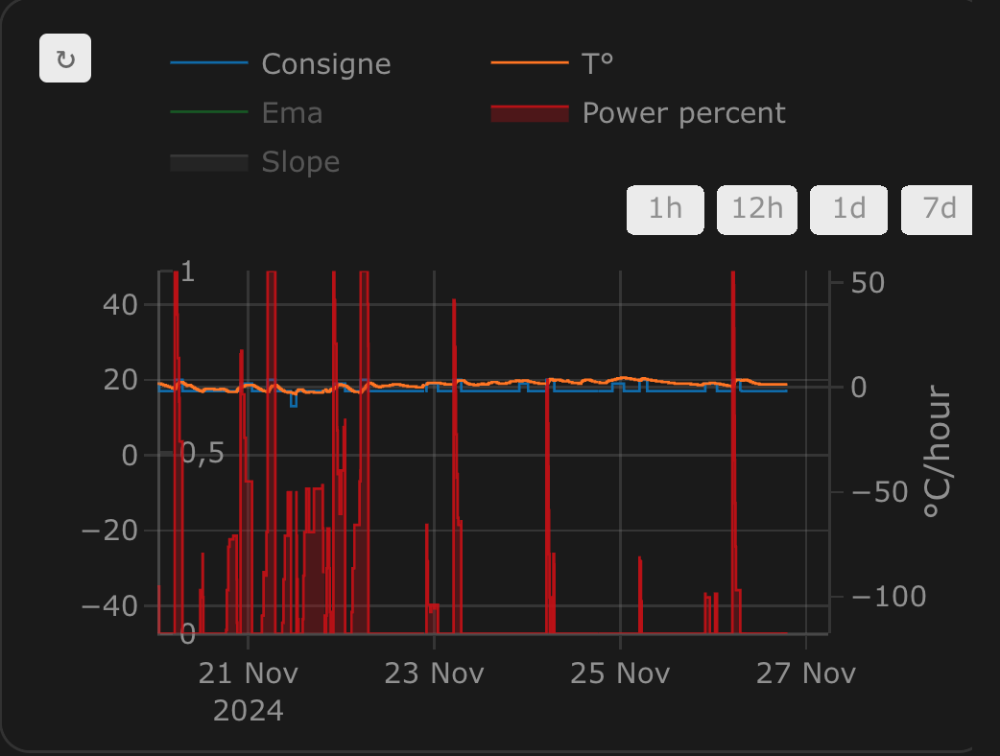
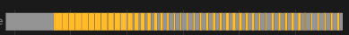
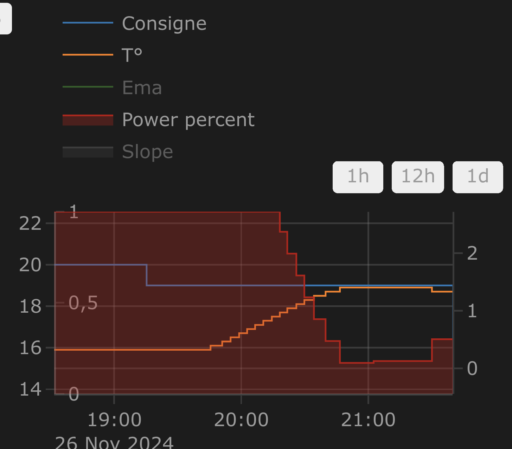
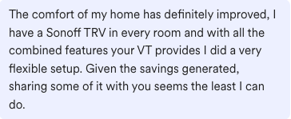
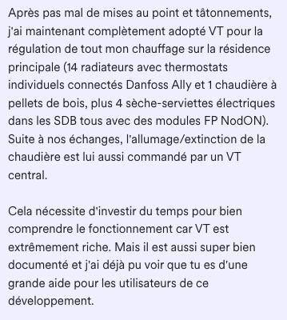
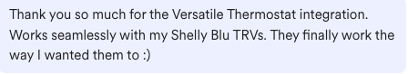
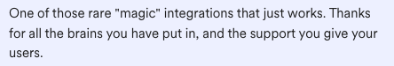

[![GitHub Release][releases-shield]][releases]
[![GitHub Activity][commits-shield]][commits]
[![License][license-shield]](LICENSE)
[![hacs][hacs_badge]][hacs]
[![BuyMeCoffee][buymecoffeebadge]][buymecoffee]

# Versatile Thermostat

Tento README soubor je k dispozici v následujících
jazycích: [Angličtina](README.md) | [Francouzština](README-fr.md) | [Němčina](README-de.md) | [Čeština](README-cs.md)

>  **Versatile Thermostat** je vysoce konfigurovatelný virtuální termostat, který transformuje jakékoli vytápěcí zařízení (radiátory, klimatizace, tepelná čerpadla atd.) v inteligentní a adaptivní systém. Umožňuje vám konsolidovat a centrálně řídit více různých topných systémů, přičemž automaticky optimalizuje spotřebu energie. Díky pokročilým algoritmům (TPI, auto-TPI) a možnostem učení se termostat přizpůsobuje vašemu domu 🏠 a vašim zvykům, poskytuje optimální pohodlí a významné snížení vašich topných účtů 💰.
> Tato termostatická integrace má za cíl výrazně zjednodušit vaše automatizace kolem správy vytápění. Protože všechny typické události kolem vytápění (nikdo doma?, detekována aktivita v místnosti?, otevřené okno?, omezení spotřeby energie?) jsou nativně spravovány termostatem, nemusíte se zabývat komplikovanými skripty a automatizacemi pro správu vašich termostatů. 😉

Tato vlastní komponenta pro Home Assistant je vylepšením a kompletním přepsáním komponenty "Awesome thermostat" (viz [Github](https://github.com/dadge/awesome_thermostat)) s přidanými funkcemi.

# Snímky obrazovky

Versatile Thermostat UI Card (K dispozici na [Github](https://github.com/jmcollin78/versatile-thermostat-ui-card)) :

 

# Co je nového?

## Verze 10.1
Výběr režimu zastavení pro automatické spuštění/zastavení. Nová entita `select` umožňuje zvolit režim použitý, když funkce automatického spuštění/zastavení zjistí podmínku zastavení: `Vypnuto` (výchozí), `Pouze ventilátor` nebo `Vysoušení`. Režimy `Pouze ventilátor` a `Vysoušení` jsou nabízeny pouze tehdy, pokud je podřízené zařízení podporuje. Více informací [zde](documentation/cs/feature-auto-start-stop.md).

## Verze 10.0
Zavedení mechanismu pluginů. Umožňuje používat externí integrace jako pluginy pro _VTherm_. Seznam dostupných pluginů je na [webu Versatile Thermostat](https://www.versatile-thermostat.org/cs/plugins).

## Verze 9.3 (stabilní)
> 1. **Detekce zaseknutého ventilu**: významné vylepšení detekce poruch vytápění. Při anomálii u _VTherm_ typu `over_climate_valve` termostat diagnostikuje, zda je příčinou zaseknutý TRV ventil (zaseknutý otevřený/zavřený), a pošle `root_cause` v události. Více informací [zde](documentation/cs/feature-heating-failure-detection.md),
> 2. **Automatické opětovné zamčení po odemčení**: přidán parametr `auto_relock_sec` ve funkci zámku. Při nastavení se termostat po odemčení automaticky znovu zamkne po zadaném počtu sekund. Více informací [zde](documentation/cs/feature-lock.md),
> 3. **Opětovné odeslání příkazu**: nová funkce, která detekuje a opravuje nesoulad mezi požadovaným stavem termostatu a skutečným stavem podřízených zařízení. Pokud se příkaz neprovede správně, odešle se znovu. Více informací [zde](documentation/cs/feature-advanced.md),
> 4. **Obnovení časovaného presetu po restartu**: časovaný preset se po restartu termostatu nebo Home Assistant obnoví a pokračuje normálně. Více informací [zde](documentation/cs/feature-timed-preset.md),
> 5. **Přesnější řízení výkonu**: práh aktivace kotle (`power_activation_threshold`) nově přijímá desetinné hodnoty (0.1, 0.5, ...), což umožňuje jemnější řízení spotřeby. Více informací [zde](documentation/cs/feature-power.md),
> 6. **Zlepšení dostupnosti senzorů**: lepší určování dostupnosti teplotních senzorů přes metadata `last_updated` v Home Assistant.

## Verze 9.2
> 1. Nový způsob řízení cyklů topení/zastavení pro VTherm `over_switch`. Současný algoritmus má časový drift a první cykly nejsou optimální. To narušuje TPI a zejména auto-TPI. Nový `Cycle Scheduler` řeší tyto potíže. Tato změna je pro vás zcela transparentní,
> 2. Kolektor záznamů. Vaše žádosti o podporu často selhávají kvůli vaší schopnosti poskytnout záznamy v správném období, zaměřené na termostat s chybou a na správné úrovni záznamů. Jedná se zejména o obtížně reprodukovatelné chyby. Kolektor záznamů má za cíl vyřešit tuto potíž. Sbírá pro vás záznamy na pozadí na nejjemnější úrovni a akce (dříve služba) umožňuje jejich extrakci do souboru. Poté je můžete stáhnout a připojit k vaší žádosti o podporu. Analyzátor záznamů spojený s webovými stránkami – spuštěný ve verzi 9.1 (viz níže) – se přizpůsobuje, aby mohl tyto záznamy zpracovat. Více informací o kolektoru záznamů [zde](documentation/cs/feature-logs-collector.md),
> 3. Stabilizace verze 9.x. Hlavní verze 9 přinesla mnoho změn, které způsobily některé anomálie. Tato verze přináší poslední opravy týkající se verze 9.

## Verze 9.1
> 1. Nové logo. Inspirováno prací @Krzysztonek (viz [zde](https://github.com/jmcollin78/versatile_thermostat/pull/1598)), VTherm využívá novou funkci představenou v [HA 206.03](https://developers.home-assistant.io/blog/2026/02/24/brands-proxy-api/) pro změnu svého loga. Celý tým doufá, že se vám bude líbit. Užijte si to!
> 2. Webová stránka vytvořená @bontiv řeší jeden z hlavních problémů VTherm: dokumentaci. Tato stránka navíc umožňuje analyzovat vaše logy! Poskytněte své logy (v debug režimu) a budete je moci analyzovat, přiblížit konkrétní termostat, zaměřit se na určité období, filtrovat to, co vás zajímá, atd. Objevte tuto první verzi zde: [Versatile Thermostat Web site](https://www.versatile-thermostat.org/). Velké poděkování patří @bontiv za tuto skvělou práci.
> 3. Oficiální vydání funkce auto-TPI. Tato funkce vypočítává optimální hodnoty koeficientů pro algoritmus [TPI](documentation/cs/algorithms.md#algoritmus-tpi). Je třeba ocenit neuvěřitelnou práci @KipK a @gael1980 na tomto tématu. Pokud ji chcete používat, určitě si přečtěte dokumentaci.
> 4. VTherm se nyní opírá o stav hlášený podřízenými zařízeními v HA. Dokud všechna podřízená zařízení nemají v HA známý stav, VTherm zůstává deaktivovaný.

# 🍻 Děkuji za piva 🍻

Velké díky všem mým donátorům za jejich příspěvky a povzbuzování. Je to pro mě velmi potěšující a motivuje mě to pokračovat! Pokud vám tato integrace pomohla ušetřit, kupte mi malé pivo na oplátku, budu vám velmi vděčný!

# Slovník

  `VTherm` : Versatile Thermostat v následujícím textu tohoto dokumentu

  `TRV` : termostatická hlavice vybavená ventilem. Ventil se otevírá nebo zavírá, čímž umožňuje průchod teplé vody

  `AC` : klimatizace. Zařízení je AC, pokud chladí. Teploty jsou pak obrácené: Eco je teplejší než Komfort, který je teplejší než Boost. Algoritmy tuto informaci berou v úvahu.

  `EMA` : Exponential Moving Average. Používá se k vyhlazení měření teplot senzorů. Odpovídá klouzavému průměru teploty místnosti. Používá se k výpočtu sklonu křivky teploty (slope), který by byl na surové křivce příliš nestabilní.

  `slope` : sklon křivky teploty. Měří se v °(C nebo K)/h. Je pozitivní, pokud teplota stoupá, a negativní, pokud klesá. Tento sklon se počítá na `EMA`

  `PAC` : tepelné čerpadlo

  `HA` : Home Assistant

  `underlying`: zařízení ovládané `VTherm`

# Dokumentace

Dokumentace je nyní rozdělena do několika stránek pro snadnější čtení a vyhledávání:
1. [Úvod](documentation/cs/presentation.md)
2. [Instalace](documentation/cs/installation.md)
3. [Rychlý start](documentation/cs/quick-start.md)
4. [Výběr typu VTherm](documentation/cs/creation.md)
5. [Základní atributy](documentation/cs/base-attributes.md)
6. [Konfigurace VTherm na `spínači`](documentation/cs/over-switch.md)
7. [Konfigurace VTherm na `klimatizaci`](documentation/cs/over-climate.md)
8. [Konfigurace VTherm na ventilu](documentation/cs/over-valve.md)
9. [Předvolby](documentation/cs/feature-presets.md)
10. [Správa oken](documentation/cs/feature-window.md)
11. [Správa přítomnosti](documentation/cs/feature-presence.md)
12. [Správa pohybu](documentation/cs/feature-motion.md)
13. [Správa energie](documentation/cs/feature-power.md)
14. [Auto start a stop](documentation/cs/feature-auto-start-stop.md)
15. [Centralizované řízení všech VTherm](documentation/cs/feature-central-mode.md)
16. [Řízení ústředního vytápění](documentation/cs/feature-central-boiler.md)
17. [Pokročilé aspekty, bezpečnostní režim](documentation/cs/feature-advanced.md)
18. [Detekce poruchy vytápění](documentation/cs/feature-heating-failure-detection.md)
19. [Samoregulace](documentation/cs/self-regulation.md)
20. [Auto TPI učení](documentation/cs/feature-autotpi.md)
21. [Algoritmy](documentation/cs/algorithms.md)
22. [Zamknutí / odemknutí](documentation/cs/feature-lock.md)
23. [Synchronizace teploty](documentation/cs/feature-sync_device_temp.md)
24. [Časovaný preset](documentation/cs/feature-timed-preset.md)
25. [Referenční dokumentace](documentation/cs/reference.md)
26. [Příklady ladění](documentation/cs/tuning-examples.md)
27. [Řešení problémů](documentation/cs/troubleshooting.md)
28. [Poznámky k verzím](documentation/cs/releases.md)

# Některé výsledky

**Stabilita teploty kolem cíle nakonfigurovaného předvolbou**:

**Cykly zapnutí/vypnutí vypočítané integrací `over_climate`**:

**Regulace s `over_switch`**:

**Silná regulace v `over_climate`**:

**Regulace s přímým řízením ventilu v `over_climate`**:

# Některé komentáře k integraci
|                                             |                                             |                                             |
| ------------------------------------------- | ------------------------------------------- | ------------------------------------------- |
|  |  |  |
|  |  |  |

Užijte si to!

# ⭐ Historie hvězdiček

# Příspěvky jsou vítány!

Pokud si přejete přispět, přečtěte si prosím [pokyny pro přispívání](CONTRIBUTING-cs.md).

***

[versatile_thermostat]: https://github.com/jmcollin78/versatile_thermostat
[buymecoffee]: https://www.buymeacoffee.com/jmcollin78
[buymecoffeebadge]: https://img.shields.io/badge/Buy%20me%20a%20beer-%245-orange?style=for-the-badge&logo=buy-me-a-beer
[commits-shield]: https://img.shields.io/github/commit-activity/y/jmcollin78/versatile_thermostat.svg?style=for-the-badge
[commits]: https://github.com/jmcollin78/versatile_thermostat/commits/master
[hacs]: https://github.com/custom-components/hacs
[hacs_badge]: https://img.shields.io/badge/HACS-Custom-41BDF5.svg?style=for-the-badge
[forum-shield]: https://img.shields.io/badge/community-forum-brightgreen.svg?style=for-the-badge
[forum]: https://community.home-assistant.io/
[license-shield]: https://img.shields.io/github/license/jmcollin78/versatile_thermostat.svg?style=for-the-badge
[maintenance-shield]: https://img.shields.io/badge/maintainer-Joakim%20Sørensen%20%40ludeeus-blue.svg?style=for-the-badge
[releases-shield]: https://img.shields.io/github/release/jmcollin78/versatile_thermostat.svg?style=for-the-badge
[releases]: https://github.com/jmcollin78/versatile_thermostat/releases
