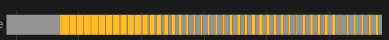

[![GitHub Release][releases-shield]][releases]
[![GitHub Activity][commits-shield]][commits]
[![License][license-shield]](LICENSE)
[![hacs][hacs_badge]][hacs]
[![BuyMeCoffee][buymecoffeebadge]][buymecoffee]

# Versatile Thermostat

Tento README soubor je k dispozici v následujících
jazycích: [Angličtina](README.md) | [Francouzština](README-fr.md) | [Němčina](README-de.md) | [Čeština](README-cs.md)

>  Tato termostatická integrace má za cíl výrazně zjednodušit vaše automatizace kolem správy vytápění. Protože všechny typické události kolem vytápění (nikdo doma?, detekována aktivita v místnosti?, otevřené okno?, omezení spotřeby energie?) jsou nativně spravovány termostatem, nemusíte se zabývat komplikovanými skripty a automatizacemi pro správu vašich termostatů. ;-).

Tato vlastní komponenta pro Home Assistant je vylepšením a kompletním přepsáním komponenty "Awesome thermostat" (viz [Github](https://github.com/dadge/awesome_thermostat)) s přidanými funkcemi.

# Snímky obrazovky

Versatile Thermostat UI Card (K dispozici na [Github](https://github.com/jmcollin78/versatile-thermostat-ui-card)) :

 

# Co je nového?

## Release 8.0
> This is a major release. It rewrites a significant part of the internal mechanisms of Versatile Thermostat by introducing several new features:
>    1. _requested state / current state_: VTherm now has 2 states. The requested state is the state requested by the user (or Scheduler). The current state is the state currently applied to the VTherm. The latter depends on the different VTherm functions. For example, the user can request (requested state) to have heating on with Comfort preset but since the window has been detected open, the VTherm is actually off. This dual management always preserves the user's request and applies the result of the different functions on this user request to get the current state. This better handles cases where multiple functions want to act on the VTherm state (window opening and power shedding for example). It also ensures a return to the user's initial request when no detection is in progress anymore,
>    2. _time filtering_: the time filtering operation has been revised. Time filtering prevents sending too many commands to a controlled equipment to avoid consuming too much battery (battery-powered TRV for example), changing setpoints too frequently (heat pump, pellet stove, underfloor heating, ...). The new operation is now as follows: explicit user (or Scheduler) requests are always immediately taken into account. They are not filtered. Only changes related to external conditions (room temperature for example) are potentially filtered. Filtering consists of resending the desired command later and not ignoring the command as was previously the case. The `auto_regulation_dtemp` parameter allows adjusting the delay,
>    3. _hvac_action improvement_: the `hvac_action` reflects the current activation state of the controlled equipment. For an `over_switch` type it reflects the switch activation state, for an `over_valve` or valve regulation, it is active when the valve opening is greater than the minimum valve opening (or 0 if not configured), for an `over_climate` it reflects the underlying `climate`'s `hvac_action` if available or a simulation otherwise.
>    4. _custom attributes_: the organization of custom attributes accessible in Developer Tools / States has been reorganized into sections depending on the VTherm type and each activated function. More information [here](documentation/en/reference.md#custom-attributes).
>    5. _power shedding_: the power shedding algorithm now takes into account equipment shutdown between two measurements of home power consumption. Suppose you have power consumption feedback every 5 minutes. If a radiator is turned off between 2 measurements then turning on a new one may be authorized. Before, only turn-ons were taken into account between 2 measurements. As before, the next power consumption feedback will possibly shed more or less.
>    6. _auto-start/stop_: auto-start/stop is only useful for `over_climate` type VTherm without direct valve control. The option has been removed for other VTherm types.
>    7. _VTherm UI Card_: all these modifications allowed a major evolution of the [VTherm UI Card](documentation/en/additions.md#versatile-thermostat-ui-card) to integrate messages explaining the current state (why does my VTherm have this target temperature?) and if time filtering is in progress - so the underlying state update has been delayed.
>    8. _log improvements_: logs have been improved to simplify debugging. Logs in the form `--------------------> NEW EVENT: VersatileThermostat-Inversed ...` inform of an event impacting the VTherm state.
>
> ⚠️ **Warning**
>
> This major release includes breaking changes from the previous version:
> - `versatile_thermostat_security_event` has been renamed to `versatile_thermostat_safety_event`. If your automations use this event, you must update them,
> - custom attributes have been reorganized. You must update your automations or Jinja templates that use them,
> - the [VTherm UI Card](documentation/en/additions.md#versatile-thermostat-ui-card) must be updated to at least V2.0 to be compatible,
>
> **Despite the 342 automated tests of this integration and the care taken with this major release, I cannot guarantee that its installation will not disrupt your VTherms' states. For each VTherm you must check the preset, hvac_mode and possibly the VTherm setpoint temperature after installation.**
>

# 🍻 Děkuji za piva 🍻

Velké díky všem mým donátorům za jejich příspěvky a povzbuzování. Je to pro mě velmi potěšující a motivuje mě to pokračovat! Pokud vám tato integrace pomohla ušetřit, kupte mi malé pivo na oplátku, budu vám velmi vděčný!

# Slovník

  `VTherm` : Versatile Thermostat v následujícím textu tohoto dokumentu

  `TRV` : termostatická hlavice vybavená ventilem. Ventil se otevírá nebo zavírá, čímž umožňuje průchod teplé vody

  `AC` : klimatizace. Zařízení je AC, pokud chladí. Teploty jsou pak obrácené: Eco je teplejší než Komfort, který je teplejší než Boost. Algoritmy tuto informaci berou v úvahu.

  `EMA` : Exponential Moving Average. Používá se k vyhlazení měření teplot senzorů. Odpovídá klouzavému průměru teploty místnosti. Používá se k výpočtu sklonu křivky teploty (slope), který by byl na surové křivce příliš nestabilní.

  `slope` : sklon křivky teploty. Měří se v °(C nebo K)/h. Je pozitivní, pokud teplota stoupá, a negativní, pokud klesá. Tento sklon se počítá na `EMA`

  `PAC` : tepelné čerpadlo

  `HA` : Home Assistant

  `underlying`: zařízení ovládané `VTherm`

# Dokumentace

Dokumentace je nyní rozdělena do několika stránek pro snadnější čtení a vyhledávání:
1. [Úvod](documentation/cs/presentation.md)
2. [Instalace](documentation/cs/installation.md)
3. [Rychlý start](documentation/cs/quick-start.md)
4. [Výběr typu VTherm](documentation/cs/creation.md)
5. [Základní atributy](documentation/cs/base-attributes.md)
6. [Konfigurace VTherm na `spínači`](documentation/cs/over-switch.md)
7. [Konfigurace VTherm na `klimatizaci`](documentation/cs/over-climate.md)
8. [Konfigurace VTherm na ventilu](documentation/cs/over-valve.md)
9. [Předvolby](documentation/cs/feature-presets.md)
10. [Správa oken](documentation/cs/feature-window.md)
11. [Správa přítomnosti](documentation/cs/feature-presence.md)
12. [Správa pohybu](documentation/cs/feature-motion.md)
13. [Správa energie](documentation/cs/feature-power.md)
14. [Auto start a stop](documentation/cs/feature-auto-start-stop.md)
15. [Centralizované řízení všech VTherm](documentation/cs/feature-central-mode.md)
16. [Řízení ústředního vytápění](documentation/cs/feature-central-boiler.md)
17. [Pokročilé aspekty, bezpečnostní režim](documentation/cs/feature-advanced.md)
18. [Samoregulace](documentation/cs/self-regulation.md)
19. [Příklady ladění](documentation/cs/tuning-examples.md)
20. [Algoritmy](documentation/cs/algorithms.md)
21. [Referenční dokumentace](documentation/cs/reference.md)
22. [Řešení problémů](documentation/cs/troubleshooting.md)
23. [Poznámky k verzím](documentation/cs/releases.md)

# Některé výsledky

**Stabilita teploty kolem cíle nakonfigurovaného předvolbou**:

**Cykly zapnutí/vypnutí vypočítané integrací `over_climate`**:

**Regulace s `over_switch`**:

**Silná regulace v `over_climate`**:

**Regulace s přímým řízením ventilu v `over_climate`**:

Užijte si to!

# Some comments on the integration
|                                             |                                             |                                             |
| ------------------------------------------- | ------------------------------------------- | ------------------------------------------- |
|  |  |  |
|  |  |  |

# Příspěvky jsou vítány!

Pokud si přejete přispět, přečtěte si prosím [pokyny pro přispívání](CONTRIBUTING-cs.md).

***

[versatile_thermostat]: https://github.com/jmcollin78/versatile_thermostat
[buymecoffee]: https://www.buymeacoffee.com/jmcollin78
[buymecoffeebadge]: https://img.shields.io/badge/Buy%20me%20a%20beer-%245-orange?style=for-the-badge&logo=buy-me-a-beer
[commits-shield]: https://img.shields.io/github/commit-activity/y/jmcollin78/versatile_thermostat.svg?style=for-the-badge
[commits]: https://github.com/jmcollin78/versatile_thermostat/commits/master
[hacs]: https://github.com/custom-components/hacs
[hacs_badge]: https://img.shields.io/badge/HACS-Custom-41BDF5.svg?style=for-the-badge
[forum-shield]: https://img.shields.io/badge/community-forum-brightgreen.svg?style=for-the-badge
[forum]: https://community.home-assistant.io/
[license-shield]: https://img.shields.io/github/license/jmcollin78/versatile_thermostat.svg?style=for-the-badge
[maintenance-shield]: https://img.shields.io/badge/maintainer-Joakim%20Sørensen%20%40ludeeus-blue.svg?style=for-the-badge
[releases-shield]: https://img.shields.io/github/release/jmcollin78/versatile_thermostat.svg?style=for-the-badge
[releases]: https://github.com/jmcollin78/versatile_thermostat/releases
