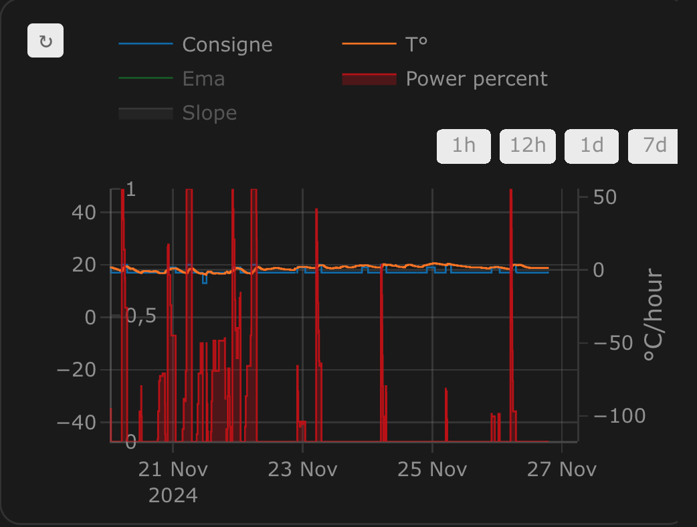
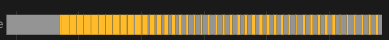
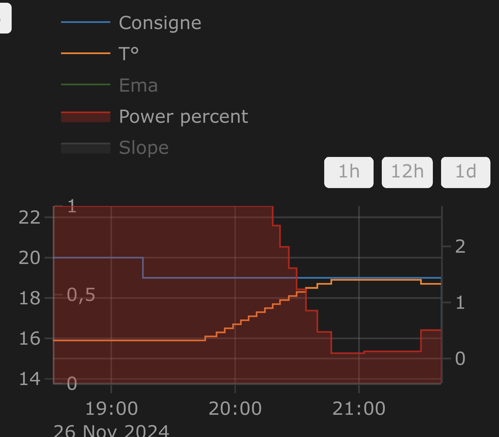
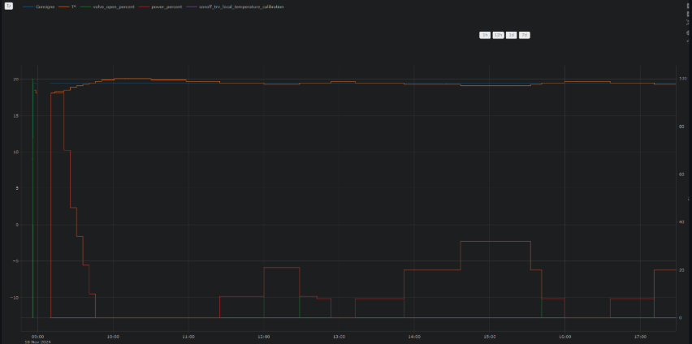
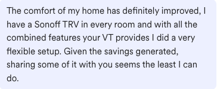
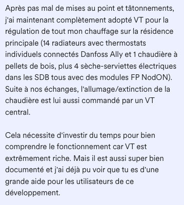

[![GitHub Release][releases-shield]][releases]
[![GitHub Activity][commits-shield]][commits]
[![License][license-shield]](LICENSE)
[![hacs][hacs_badge]][hacs]
[![BuyMeCoffee][buymecoffeebadge]][buymecoffee]

# Versatile Thermostat

Diese README-Datei ist verfügbar in folgenden
Sprachen: [English](README.md) | [Français](README-fr.md) | [Deutsch](README-de.md) | [Czech](README-cs.md) | [Polski](README-pl.md)

>  **Versatile Thermostat** ist ein hochgradig konfigurierbarer virtueller Thermostat, der jedes Heizgerät (Heizkörper, Klimaanlagen, Wärmepumpen usw.) in ein intelligentes und adaptives System umwandelt. Er ermöglicht es, mehrere verschiedene Heizsysteme zu stabilisieren und zentral zu steuern, während gleichzeitig automatisch der Energieverbrauch optimiert wird. Dank fortschrittlicher Algorithmen (TPI, Auto-TPI) und Lernfähigkeiten passt sich der Thermostat an Ihr Haus 🏠 und Ihre Gewohnheiten an und bietet optimalen Komfort sowie eine signifikante Senkung Ihrer Heizrechnungen 💰.
> Diese Thermostat-Integration zielt darauf ab, Ihre Heizungsmanagement-Automatisierungen erheblich zu vereinfachen. Da alle typischen Heizungsereignisse (niemand zu Hause?, Aktivität in einem Raum erkannt?, Fenster offen?, Stromlastabwurf?) nativ vom Thermostat verwaltet werden, müssen Sie sich nicht mit komplizierten Skripten und Automatisierungen beschäftigen, um Ihre Thermostate zu verwalten. 😉

Diese benutzerdefinierte Komponente für Home Assistant ist ein Upgrade und eine komplette Neufassung der Komponente "Awesome thermostat" (siehe [Github](https://github.com/dadge/awesome_thermostat)) mit zusätzlichen Funktionen.

# Dokumentation

Die gesamte Dokumentation ist auf der [Versatile Thermostat Web site](https://www.versatile-thermostat.org/) verfügbar.

# Screenshots

Versatile Thermostat UI Card (Verfügbar auf [Github](https://github.com/jmcollin78/versatile-thermostat-ui-card)) :

 

# Was ist neu?

## Release 9.3
> 1. **Erkennung feststeckender Ventile**: Wesentliche Verbesserung der Heizungsfehlererkennung. Wenn eine Anomalie bei VTherms vom Typ `over_climate_valve` erkannt wird, diagnostiziert der Thermostat nun, ob das Problem durch ein feststeckendes TRV-Ventil (offen oder geschlossen feststeckend) verursacht wird, indem der Sollzustand mit dem Istzustand verglichen wird. Diese Information - `root_cause` - wird im Anomalieereignis gesendet und ermöglicht es Ihnen, angemessene Maßnahmen zu ergreifen (Benachrichtigung, Ventilwiederherstellung usw.). Weitere Informationen [hier](documentation/de/feature-heating-failure-detection.md),
> 2. **Automatisches Erneut-Verriegeln nach Entsperrung**: Der Parameter `auto_relock_sec` wurde zur Verriegelungsfunktion hinzugefügt. Wenn konfiguriert, verriegelt sich der Thermostat nach der angegebenen Anzahl von Sekunden nach einer Entsperrung automatisch wieder. Diese Funktion kann vollständig deaktiviert werden, indem sie auf 0 gesetzt wird. Standardmäßig ist die automatische Wiederverriegelung auf 30 Sekunden eingestellt, um die Sicherheit zu verbessern. Weitere Informationen [hier](documentation/de/feature-lock.md),
> 3. **Befehlswiederholung**: Neue Funktionalität zur automatischen Erkennung und Behebung von Unstimmigkeiten zwischen dem Sollzustand des Thermostats und dem Istzustand der verknüpften Geräte. Wenn ein Befehl nicht ordnungsgemäß auf das Gerät angewendet wird, wird er erneut gesendet. Dies verbessert die Systemzuverlässigkeit in instabilen Umgebungen oder mit unzuverlässigen Geräten. Weitere Informationen [hier](documentation/de/feature-advanced.md),
> 4. **Wiederherstellung des zeitgesteuerten Voreinstellung nach Neustart**: Die konfigurierte zeitgesteuerte Voreinstellung wird nun nach einem Thermostat- oder Home Assistant-Neustart korrekt wiederhergestellt. Diese Voreinstellung funktioniert nach dem Neustart weiterhin normal. Weitere Informationen [hier](documentation/de/feature-timed-preset.md),
> 5. **Erhöhte Genauigkeit der Leistungssteuerung**: Die Aktivierungsschwelle des Kessels (`power_activation_threshold`) akzeptiert nun Dezimalwerte (0,1, 0,5 usw.) für eine feinere Kontrolle der Aktivierungsleistung. Dies bietet mehr Flexibilität zur Optimierung des Energieverbrauchs. Weitere Informationen [hier](documentation/de/feature-power.md),
> 6. **Verbesserungen der Sensorzuverlässigkeit**: Bessere Unterstützung zur Bestimmung der Verfügbarkeit von Temperatursensoren mithilfe der `last_updated`-Metadaten von Home Assistant, verbesserte Erkennung von Sensorsignalverlust,

## Release 9.2 - stabile Version
> 1. Neue Art der Verwaltung von Heiz-/Stoppzyklen für VTherm `over_switch`. Der aktuelle Algorithmus hat einen Zeitdrift, und die ersten Zyklen sind nicht optimal. Dies beeinträchtigt das TPI und insbesondere das Auto-TPI. Der neue `Cycle Scheduler` löst diese Schwierigkeiten. Diese Änderung ist völlig transparent,
> 2. Ein Protokollkollektor. Support-Anfragen scheitern oft an der Möglichkweit, Protokolle im richtigen Zeitraum bereitzustellen, konzentriert auf den fehlerhaften Thermostat und auf der richtigen Protokollebene. Dies ist besonders bei schwer reproduzierbaren Fehlern der Fall. Der Protokollkollektor soll diese Schwierigkeit lösen. Er sammelt Protokolle im Hintergrund auf der niedrigsten Ebene, und eine Aktion (ehemals Dienst) ermöglicht deren Export in eine Datei. Diese kann dann heruntergeladen und der Support-Anfrage beigefügt werden. Der mit der Website verbundene Protokollanalysator – der in Version 9.1 (siehe unten) gestartet wurde – passt sich an, um diese Protokolle verarbeiten zu können. Weitere Informationen zum Protokollkollektor [hier](documentation/de/feature-logs-collector.md),
> 3. Stabilisierung der Version 9.x. Die Hauptversion 9 brachte viele Änderungen mit sich, die einige Anomalien verursachten. Diese Version bringt die neuesten Korrektionen zur Version 9.

## Release 9.1
> 1. Neues Logo. Inspiriert von der Arbeit von @Krzysztonek (siehe [hier](https://github.com/jmcollin78/versatile_thermostat/pull/1598)) nutzt VTherm eine neue Funktion aus [HA 206.03](https://developers.home-assistant.io/blog/2026/02/24/brands-proxy-api/), um sein Logo zu ändern. Das gesamte Team hofft, dass es Ihnen gefällt. Viel Spaß!
> 2. Eine von @bontiv erstellte Website löst eine der größten Herausforderungen von VTherm: die Dokumentation. Diese Website ermöglicht es außerdem, Ihre Logs zu analysieren! Geben Sie Ihre Logs (im Debug-Modus) ein, und Sie können sie analysieren, auf einen Thermostat zoomen, einen Zeitraum auswählen, interessante Elemente filtern usw. Entdecken Sie diese erste Version hier: [Versatile Thermostat Web site](https://www.versatile-thermostat.org/). Ein großes Dankeschön an @bontiv für diese großartige Umsetzung.
> 3. Offizielle Veröffentlichung der Auto-TPI-Funktion. Diese Funktion berechnet die optimalen Werte der Koeffizienten für den [TPI](documentation/fr/algorithms.md#lalgorithme-tpi). Hervorzuheben ist die unglaubliche Arbeit von @KipK und @gael1980 zu diesem Thema. Lesen Sie unbedingt die Dokumentation, wenn Sie diese Funktion verwenden möchten.
> 4. VTherm basiert nun auf dem von den verbundenen Geräten in HA gemeldeten Status. Solange nicht alle zugeordnete Geräte einen bekannten Status in HA haben, bleibt VTherm deaktiviert.

Weitere Informationen [hier](documentation/de/feature-central-boiler.md).

# 🍻 Danke für die Biere 🍻

Ein großes Dankeschön an alle meine Biersponsoren für ihre Spenden und Ermutigungen. Das bedeutet mir sehr viel und motiviert mich, weiterzumachen! Wenn Sie durch diese Integration Geld gespart haben, geben Sie mir im Gegenzug ein Bier aus; ich würde mich sehr darüber freuen!

# Glossar

  `VTherm`: Versatile Thermostat, wie in diesem Dokument beschrieben

  `TRV`: Thermisches RadiatorVentil (Heizkörperventil), ausgestattet mit einem Ventil. Das Ventil öffnet oder schließt sich, um heißes Wasser durchzulassen.

  `AC`: Klimatisierung (Air Conditioning). Ein AC-Gerät kühlt, statt zu heizen. Die Temperaturen sind umgekehrt: Eco ist wärmer als Comfort, was wiederum wärmer ist als Boost. Die Algorithmen berücksichtigen diese Information.

  `EMA`: Exponentieller gleitender Durchschnitt (Exponential Moving Average). Dient zur Glättung der Temperaturmessungen des Sensors. Er stellt einen gleitenden Durchschnitt der Raumtemperatur dar und wird zur Berechnung der Temperaturkurvensteigung verwendet, die sonst bei den Rohdaten zu instabil wäre.

  `slope`: Die Steigung der Temperaturkurve, gemessen in ° (C oder K)/h. Sie ist positiv, wenn die Temperatur steigt, und negativ, wenn sie sinkt. Diese Steigung wird auf Grundlage der `EMA` brechnet.

  `WP`: Wärmepumpe

  `HA`: Home Assistant

  `underlying`: Das von `VTherm` gesteuerte Gerät

# Dokumentation

Die Dokumentation ist jetzt auf mehrere Seiten aufgeteilt, um das Lesen und Suchen zu erleichtern:
1. [Einleitung](documentation/de/presentation.md)
2. [Installation](documentation/de/installation.md)
3. [Schnellstart](documentation/de/quick-start.md)
4. [Wahl eines VTherm-Typs](documentation/de/creation.md)
5. [Grundlegende Merkmale](documentation/de/base-attributes.md)
6. [Konfiguriere ein VTherm als `switch`](documentation/de/over-switch.md)
7. [Konfiguriere ein VTherm als `climate`](documentation/de/over-climate.md)
8. [Konfiguriere ein VTherm als `valve`](documentation/de/over-valve.md)
9. [Voreinstellungen](documentation/de/feature-presets.md)
10. [Fensterverwaltung](documentation/de/feature-window.md)
11. [Anwesenheitsverwaltung](documentation/de/feature-presence.md)
12. [Bewegungsverwaltung](documentation/de/feature-motion.md)
13. [Energieverwaltung](documentation/de/feature-power.md)
14. [Auto Start und Stop](documentation/de/feature-auto-start-stop.md)
15. [Zentrale Kontrolle aller VTherms](documentation/de/feature-central-mode.md)
16. [Steuerung der Zentralheizung](documentation/de/feature-central-boiler.md)
17. [Weiterführende Aspekte, Sicherheitsmodus](documentation/de/feature-advanced.md)
18. [Erkennung von Heizungsstörungen](documentation/de/feature-heating-failure-detection.md)
19. [Selbstregulierung](documentation/de/self-regulation.md)
20. [Auto-TPI-Lernen](documentation/de/feature-autotpi.md)
21. [Lock / Unlock](documentation/de/feature-lock.md)
22. [Temperatur synchronisieren](documentation/de/feature-sync_device_temp.md)
23. [Zeitsteuerung](documentation/de/feature-timed-preset.md)
24. [Algorithmen](documentation/de/algorithms.md)
25. [Referenzdokumentation](documentation/de/reference.md)
26. [Tuning-Beispiele](documentation/de/tuning-examples.md)
27. [Störungsbeseitigung](documentation/de/troubleshooting.md)
28. [Veröffentlichungshinweise](documentation/de/releases.md)

# Einige Ergebnisse

**Temperaturstabilität um den durch die Voreinstellung konfigurierten Zielwert**:

**Durch die Integration `over_climate` berechnete Ein/Aus-Zyklen**:

**Regelung mit einem `over_switch`**:

**Strenge Regulierung in `over_climate`**:

**Regelung mit direkter Ventilsteuerung in `over_climate`**:

# Einige Anmerkungen zur Integration
|                                             |                                             |                                             |
| ------------------------------------------- | ------------------------------------------- | ------------------------------------------- |
|  |  |  |
|  |  |  |

Viel Spaß!

# ⭐ Star history

# Beiträge sind willkommen!

Wenn Sie einen Beitrag leisten möchten, lesen Sie bitte die [contribution guidelines](CONTRIBUTING-de.md).

***

[versatile_thermostat]: https://github.com/jmcollin78/versatile_thermostat
[buymecoffee]: https://www.buymeacoffee.com/jmcollin78
[buymecoffeebadge]: https://img.shields.io/badge/Buy%20me%20a%20beer-%245-orange?style=for-the-badge&logo=buy-me-a-beer
[commits-shield]: https://img.shields.io/github/commit-activity/y/jmcollin78/versatile_thermostat.svg?style=for-the-badge
[commits]: https://github.com/jmcollin78/versatile_thermostat/commits/master
[hacs]: https://github.com/custom-components/hacs
[hacs_badge]: https://img.shields.io/badge/HACS-Custom-41BDF5.svg?style=for-the-badge
[forum-shield]: https://img.shields.io/badge/community-forum-brightgreen.svg?style=for-the-badge
[forum]: https://community.home-assistant.io/
[license-shield]: https://img.shields.io/github/license/jmcollin78/versatile_thermostat.svg?style=for-the-badge
[maintenance-shield]: https://img.shields.io/badge/maintainer-Joakim%20Sørensen%20%40ludeeus-blue.svg?style=for-the-badge
[releases-shield]: https://img.shields.io/github/release/jmcollin78/versatile_thermostat.svg?style=for-the-badge
[releases]: https://github.com/jmcollin78/versatile_thermostat/releases
