[![GitHub Release][releases-shield]][releases]
[![GitHub Activity][commits-shield]][commits]
[![License][license-shield]](LICENSE)
[![hacs][hacs_badge]][hacs]
[![BuyMeCoffee][buymecoffeebadge]][buymecoffee]


>  Cette intégration de thermostat vise à simplifier considérablement vos automatisations autour de la gestion du chauffage. Parce que tous les événements autour du chauffage classiques sont gérés nativement par le thermostat (personne à la maison ?, activité détectée dans une pièce ?, fenêtre ouverte ?, délestage de courant ?), vous n'avez pas à vous encombrer de scripts et d'automatismes compliqués pour gérer vos climats. ;-).

- [Changements dans la version 6.0](#changements-dans-la-version-60)
  - [Entités de température pour les pre-réglages](#entités-de-température-pour-les-pre-réglages)
    - [Dans le cas d'une configuration centrale](#dans-le-cas-dune-configuration-centrale)
  - [Refonte du menu de configuration](#refonte-du-menu-de-configuration)
    - [Les options de menu 'Configuration incomplète' et 'Finaliser'](#les-options-de-menu-configuration-incomplète-et-finaliser)
- [Merci pour la bière buymecoffee](#merci-pour-la-bière-buymecoffee)
- [Quand l'utiliser et ne pas l'utiliser](#quand-lutiliser-et-ne-pas-lutiliser)
  - [Incompatibilités](#incompatibilités)
- [Pourquoi une nouvelle implémentation du thermostat ?](#pourquoi-une-nouvelle-implémentation-du-thermostat-)
- [Comment installer cet incroyable Thermostat Versatile ?](#comment-installer-cet-incroyable-thermostat-versatile-)
  - [HACS installation (recommendé)](#hacs-installation-recommendé)
  - [Installation manuelle](#installation-manuelle)
- [Configuration](#configuration)
  - [Création d'un nouveau Versatile Thermostat](#création-dun-nouveau-versatile-thermostat)
  - [Choix des attributs de base](#choix-des-attributs-de-base)
  - [Sélectionnez des entités pilotées (sous-jacents)](#sélectionnez-des-entités-pilotées-sous-jacents)
    - [Pour un thermostat de type ```thermostat_over_switch```](#pour-un-thermostat-de-type-thermostat_over_switch)
    - [Pour un thermostat de type ```thermostat_over_climate```:](#pour-un-thermostat-de-type-thermostat_over_climate)
      - [L'auto-régulation](#lauto-régulation)
      - [L'auto-régulation en mode Expert](#lauto-régulation-en-mode-expert)
      - [Compensation de la température interne](#compensation-de-la-température-interne)
      - [Synthèse de l'algorithme d'auto-régulation](#synthèse-de-lalgorithme-dauto-régulation)
      - [Le mode auto-fan](#le-mode-auto-fan)
    - [Pour un thermostat de type ```thermostat_over_valve```:](#pour-un-thermostat-de-type-thermostat_over_valve)
  - [Configurez les coefficients de l'algorithme TPI](#configurez-les-coefficients-de-lalgorithme-tpi)
  - [Configurer les températures préréglées](#configurer-les-températures-préréglées)
  - [Configurer les portes/fenêtres en allumant/éteignant les thermostats](#configurer-les-portesfenêtres-en-allumantéteignant-les-thermostats)
    - [Le mode capteur](#le-mode-capteur)
    - [Le mode auto](#le-mode-auto)
  - [Configurer le mode d'activité ou la détection de mouvement](#configurer-le-mode-dactivité-ou-la-détection-de-mouvement)
  - [Configurer la gestion de la puissance](#configurer-la-gestion-de-la-puissance)
  - [Configurer la présence (ou l'absence)](#configurer-la-présence-ou-labsence)
  - [Configuration avancée](#configuration-avancée)
  - [Le contrôle centralisé](#le-contrôle-centralisé)
  - [Le contrôle d'une chaudière centrale](#le-contrôle-dune-chaudière-centrale)
    - [Configuration](#configuration-1)
    - [Comment trouver le bon service ?](#comment-trouver-le-bon-service-)
    - [Les évènements](#les-évènements)
    - [Avertissement](#avertissement)
  - [Synthèse des paramètres](#synthèse-des-paramètres)
- [Exemples de réglage](#exemples-de-réglage)
  - [Chauffage électrique](#chauffage-électrique)
  - [Chauffage central (chauffage gaz ou fuel)](#chauffage-central-chauffage-gaz-ou-fuel)
  - [Le capteur de température alimenté par batterie](#le-capteur-de-température-alimenté-par-batterie)
  - [Capteur de température réactif (sur secteur)](#capteur-de-température-réactif-sur-secteur)
  - [Mes presets](#mes-presets)
- [Algorithme](#algorithme)
  - [Algorithme TPI](#algorithme-tpi)
- [Capteurs](#capteurs)
- [Services](#services)
  - [Forcer la présence/occupation](#forcer-la-présenceoccupation)
  - [Modifier la température des préréglages](#modifier-la-température-des-préréglages)
  - [Modifier les paramètres de sécurité](#modifier-les-paramètres-de-sécurité)
  - [ByPass Window Check](#bypass-window-check)
- [Evènements](#evènements)
- [Attributs personnalisés](#attributs-personnalisés)
- [Quelques résultats](#quelques-résultats)
- [Encore mieux](#encore-mieux)
  - [Bien mieux avec le Versatile Thermostat UI Card](#bien-mieux-avec-le-versatile-thermostat-ui-card)
  - [Encore mieux avec le composant Scheduler !](#encore-mieux-avec-le-composant-scheduler-)
  - [Encore bien mieux avec la custom:simple-thermostat front integration](#encore-bien-mieux-avec-la-customsimple-thermostat-front-integration)
  - [Toujours mieux avec Plotly pour régler votre thermostat](#toujours-mieux-avec-plotly-pour-régler-votre-thermostat)
  - [Et toujours de mieux en mieux avec l'AappDaemon NOTIFIER pour notifier les évènements](#et-toujours-de-mieux-en-mieux-avec-laappdaemon-notifier-pour-notifier-les-évènements)
- [Les contributions sont les bienvenues !](#les-contributions-sont-les-bienvenues)
- [Dépannages](#dépannages)
  - [Utilisation d'un Heatzy](#utilisation-dun-heatzy)
  - [Utilisation d'un radiateur avec un fil pilote](#utilisation-dun-radiateur-avec-un-fil-pilote)
  - [Utilisation d'un radiateur avec un fil pilote](#utilisation-dun-radiateur-avec-un-fil-pilote-1)
  - [Seul le premier radiateur chauffe](#seul-le-premier-radiateur-chauffe)
  - [Le radiateur chauffe alors que la température de consigne est dépassée ou ne chauffe pas alors que la température de la pièce est bien en-dessous de la consigne](#le-radiateur-chauffe-alors-que-la-température-de-consigne-est-dépassée-ou-ne-chauffe-pas-alors-que-la-température-de-la-pièce-est-bien-en-dessous-de-la-consigne)
    - [Type `over_switch` ou `over_valve`](#type-over_switch-ou-over_valve)
    - [Type `over_climate`](#type-over_climate)
  - [Régler les paramètres de détection d'ouverture de fenêtre en mode auto](#régler-les-paramètres-de-détection-douverture-de-fenêtre-en-mode-auto)
  - [Pourquoi mon Versatile Thermostat se met en Securite ?](#pourquoi-mon-versatile-thermostat-se-met-en-securite-)
    - [Comment détecter le mode sécurité ?](#comment-détecter-le-mode-sécurité-)
    - [Comment être averti lorsque cela se produit ?](#comment-être-averti-lorsque-cela-se-produit-)
    - [Comment réparer ?](#comment-réparer-)
  - [Utilisation d'un groupe de personnes comme capteur de présence](#utilisation-dun-groupe-de-personnes-comme-capteur-de-présence)
  - [Activer les logs du Versatile Thermostat](#activer-les-logs-du-versatile-thermostat)

Ce composant personnalisé pour Home Assistant est une mise à niveau et est une réécriture complète du composant "Awesome thermostat" (voir [Github](https://github.com/dadge/awesome_thermostat)) avec l'ajout de fonctionnalités.


>  _*Historique des dernières versions*_
> * **Release 6.0** :
>   - Ajout d'entités du domaine Number permettant de configurer les températures des presets [354](https://github.com/jmcollin78/versatile_thermostat/issues/354)
>   - Refonte complète du menu de configuration pour supprimer les températures et utililsation d'un menu au lieu d'un tunnel de configuration [354](https://github.com/jmcollin78/versatile_thermostat/issues/354)
> * **Release 5.4** :
>   - Ajout du pas de température [#311](https://github.com/jmcollin78/versatile_thermostat/issues/311),
>   - ajout de seuils de régulation pour les `over_valve` pour éviter de trop vider la batterie des TRV [#338](https://github.com/jmcollin78/versatile_thermostat/issues/338),
>   - ajout d'une option permettant d'utiliser la température interne d'un TRV pour forcer l' auto-régulation [#348](https://github.com/jmcollin78/versatile_thermostat/issues/348),
>   - ajout d'une fonction de keep-alive pour les VTherm `over_switch` [#345](https://github.com/jmcollin78/versatile_thermostat/issues/345)
> * **Release 5.3** : Ajout d'une fonction de pilotage d'une chaudière centrale [#234](https://github.com/jmcollin78/versatile_thermostat/issues/234) - plus d'infos ici: [Le contrôle d'une chaudière centrale](#le-contrôle-dune-chaudière-centrale). Ajout de la possibilité de désactiver le mode sécurité pour le thermomètre extérieur [#343](https://github.com/jmcollin78/versatile_thermostat/issues/343)
> * **Release 5.2** : Ajout d'un `central_mode` permettant de piloter tous les VTherms de façon centralisée [#158](https://github.com/jmcollin78/versatile_thermostat/issues/158).
> * **Release 5.1** : Limitation des valeurs envoyées aux valves et au température envoyées au climate sous-jacent.
> * **Release 5.0** : Ajout d'une configuration centrale permettant de mettre en commun les attributs qui peuvent l'être [#239](https://github.com/jmcollin78/versatile_thermostat/issues/239).

<details>
<summary>Autres versions</summary>

> * **Release 4.3** : Ajout d'un mode auto-fan pour le type `over_climate` permettant d'activer la ventilation si l'écart de température est important [#223](https://github.com/jmcollin78/versatile_thermostat/issues/223).
> * **Release 4.2** : Le calcul de la pente de la courbe de température se fait maintenant en °/heure et non plus en °/min [#242](https://github.com/jmcollin78/versatile_thermostat/issues/242). Correction de la détection automatique des ouvertures par l'ajout d'un lissage de la courbe de température .
> * **Release 4.1** : Ajout d'un mode de régulation **Expert** dans lequel l'utilisateur peut spécifier ses propres paramètres d'auto-régulation au lieu d'utiliser les pre-programmés [#194](https://github.com/jmcollin78/versatile_thermostat/issues/194).
> * **Release 4.0** : Ajout de la prise en charge de la **Versatile Thermostat UI Card**. Voir [Versatile Thermostat UI Card](https://github.com/jmcollin78/versatile-thermostat-ui-card). Ajout d'un mode de régulation **Slow** pour les appareils de chauffage à latence lente [#168](https://github.com/jmcollin78/versatile_thermostat/issues/168). Changement de la façon dont **la puissance est calculée** dans le cas de VTherm avec des équipements multi-sous-jacents [#146](https://github.com/jmcollin78/versatile_thermostat/issues/146). Ajout de la prise en charge de AC et Heat pour VTherm via un interrupteur également [#144](https://github.com/jmcollin78/versatile_thermostat/pull/144)
> * **Release 3.8**: Ajout d'une **fonction d'auto-régulation** pour les thermostats `over climate` dont la régulation est faite par le climate sous-jacent. Cf. [L'auto-régulation](#lauto-régulation) et [#129](https://github.com/jmcollin78/versatile_thermostat/issues/129). Ajout de la **possibilité d'inverser la commande** pour un thermostat `over switch` pour adresser les installations avec fil pilote et diode [#124](https://github.com/jmcollin78/versatile_thermostat/issues/124).
> * **Release 3.7**: Ajout du type de **Versatile Thermostat `over valve`** pour piloter une vanne TRV directement ou tout autre équipement type gradateur pour le chauffage. La régulation se fait alors directement en agissant sur le pourcentage d'ouverture de l'entité sous-jacente : 0 la vanne est coupée, 100 : la vanne est ouverte à fond. Cf. [#131](https://github.com/jmcollin78/versatile_thermostat/issues/131). Ajout d'une fonction permettant le bypass de la détection d'ouverture [#138](https://github.com/jmcollin78/versatile_thermostat/issues/138). Ajout de la langue Slovaque
> * **Release 3.6**: Ajout du paramètre `motion_off_delay` pour améliorer la gestion de des mouvements [#116](https://github.com/jmcollin78/versatile_thermostat/issues/116), [#128](https://github.com/jmcollin78/versatile_thermostat/issues/128). Ajout du mode AC (air conditionné) pour un VTherm over switch. Préparation du projet Github pour faciliter les contributions [#127](https://github.com/jmcollin78/versatile_thermostat/issues/127)
> * **Release 3.5**: Plusieurs thermostats sont possibles en "thermostat over climate" mode [#113](https://github.com/jmcollin78/versatile_thermostat/issues/113)
> * **Release 3.4**: bug fix et exposition des preset temperatures pour le mode AC [#103](https://github.com/jmcollin78/versatile_thermostat/issues/103)
> * **Release 3.3**: ajout du mode Air Conditionné (AC). Cette fonction vous permet d'utiliser le mode AC de votre thermostat sous-jacent. Pour l'utiliser, vous devez cocher l'option "Uitliser le mode AC" et définir les valeurs de température pour les presets et pour les presets en cas d'absence
> * **Release 3.2** : ajout de la possibilité de commander plusieurs switch à partir du même thermostat. Dans ce mode, les switchs sont déclenchés avec un délai pour minimiser la puissance nécessaire à un instant (on minimise les périodes de recouvrement). Voir [Configuration](#sélectionnez-des-entités-pilotées)
> * **Release 3.1** : ajout d'une détection de fenêtres/portes ouvertes par chute de température. Cette nouvelle fonction permet de stopper automatiquement un radiateur lorsque la température chute brutalement. Voir [Le mode auto](#le-mode-auto)
> * **Release majeure 3.0** : ajout d'un équipement thermostat et de capteurs (binaires et non binaires) associés. Beaucoup plus proche de la philosphie Home Assistant, vous avez maintenant un accès direct à l'énergie consommée par le radiateur piloté par le thermostat et à plein d'autres capteurs qui seront utiles dans vos automatisations et dashboard.
> * **release 2.3** : ajout de la mesure de puissance et d'énergie du radiateur piloté par le thermostat.
> * **release 2.2** : ajout de fonction de sécurité permettant de ne pas laisser éternellement en chauffe un radiateur en cas de panne du thermomètre
> * **release majeure 2.0** : ajout du thermostat "over climate" permettant de transformer n'importe quel thermostat en Versatile Thermostat et lui ajouter toutes les fonctions de ce dernier.
</details>

# Changements dans la version 6.0

## Entités de température pour les pre-réglages
Les températures des presets sont maintenant directement acessibles sous la forme d'entités reliés au VTherm.
Exemple :

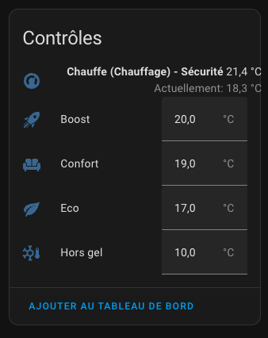

Les entités Boost, Confort, Eco et Hors-gel permettent de régler directement les températures de ces présets sans avoir à reconfigurer le VTHerm dans les écrans de configuration.
Ces modifications sont persistentent à un redémarrage et sont prises en compte immédiatement par le VTherm.

En fonction des fonctions activées, la liste des températures peut être plus ou moins complète :
1. Si la gestion de présence est activée, les presets en cas d'absence sont créés. Ils sont suffixés par 'abs' pour absence,
2. Si la gestion de la climatisation (Mode AC) est activé, les presets en mode clim sont créés. Ils sont suffixés par 'clim' pour climatisation. Seul le preset Hors gel n'a pas d'équivalent en mode clim,
3. Les différentes combinaison absent et clim peuvent être créés en fonction de la configuration du VTherm

Si un VTherm utilise les preset de la configuration centrale, ces entités ne sont pas créées, car les températures des presets sont gérés par la configuration centrale.

### Dans le cas d'une configuration centrale
Si vous avez configuré une configuration centrale, celle-ci possède aussi ses propres presets qui répondent au même règles qu'énoncées ci-dessus.
Exemple d'une configuration centrale avec gestion de présence et mode AC (climatisation) :

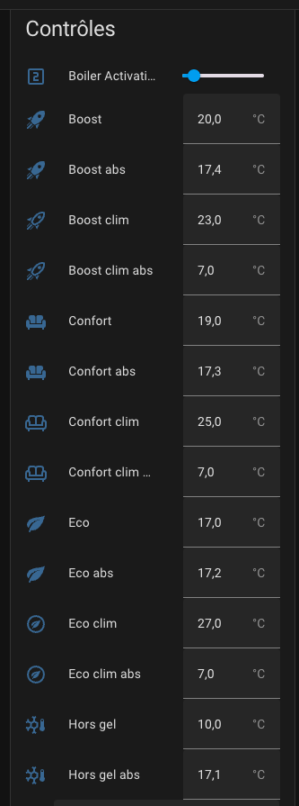

Dans le cas d'un changement d'une température de la configuration centrale, tous les VTherm qui utilisent ce preset sont immédiatement mis à jour.

## Refonte du menu de configuration
Le menu de configuration a été totalement revu. Il s'adapte dynamiquement aux choix de l'utilisateur et permet d'accéder directement aux réglages de la fonction voulue sans avoir à dérouler tous le tunnel de configuration.

Pour créer un nouveau VTherm, il faudra d'abord choisir le type de VTherm :

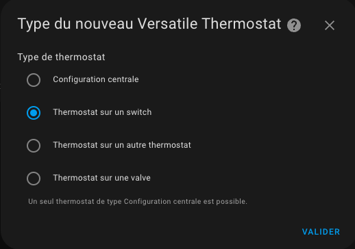

Puis, vous accédez maintenant au menu de configuration suivant :

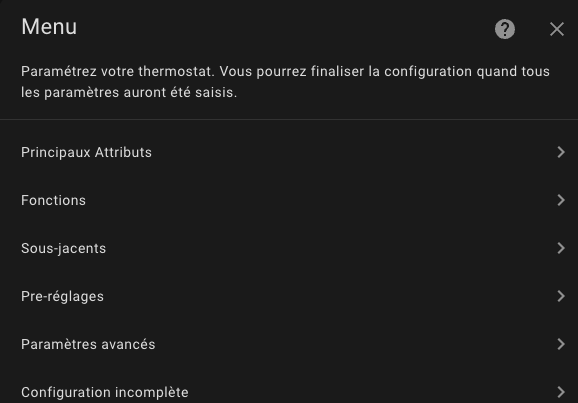

Chaque partie à configurer est accessible directement, sans avoir à dérouler tout le tunnel de configuration comme précédemment.

Vous noterez l'option de menu nommée `Fonctions` qui permet de choisir quelles fonctions vont être implémentées pour ce VTherm :

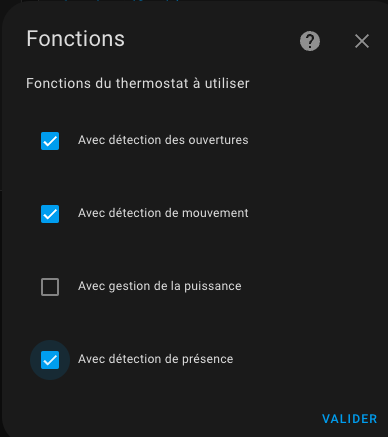

En fonction de vos choix, le menu principal s'adaptera pour ajouter les options nécessaires.

Exemple de menu avec toutes les fonctions cochées :

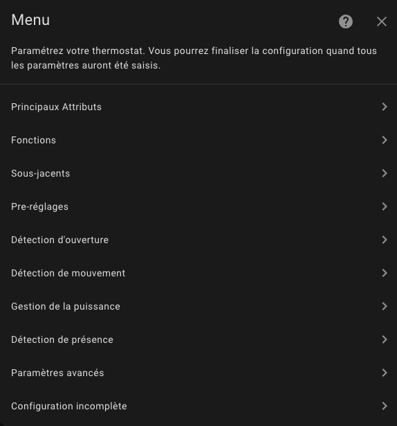
Vous pouvez constater que les options 'Détection des ouvertures', 'Détection de mouvement', 'Gestion de la puissance' et 'Gestion de présence' ont été ajoutées. Vous pouvez alors les configurer.

### Les options de menu 'Configuration incomplète' et 'Finaliser'

La dernière option du menu est spéciale. Elle permet de valider la création du VTherm lorsque toutes les fonctions ont été correctement configurées.
Si l'une options n'est pas correctement configurée, la dernière option est la suivante :

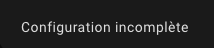

Sa sélection ne fait rien mais vous empêche de finaliser la création (resp. la modification) du VTherm.
**Vous devez alors chercher dans les options laquelle manque**.

Une fois que toute la configuration est valide, la dernière option se transforme en :


Cliquez sur cette option pour créér (resp. modifier) le VTherm :

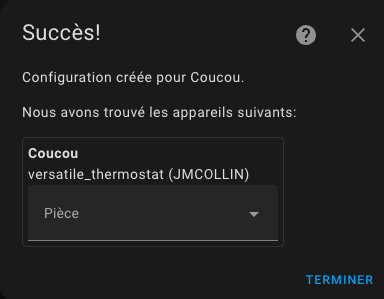

<details>
<summary>Changements dans la version 5.0</summary>

Vous pouvez maintenant définir une configuration centrale qui va vous permettre de mettre en commun sur tous vos VTherms (ou seulement une partie), certains attributs. Pour utiliser cette possibilité, vous devez :
1. Créer un VTherm de type "Configuration Centrale",
2. Saisir les attributs de cette configuration centrale

Pour l'utiliser ensuite dans les autres VTherms, vous devez les reconfigurer et à chaque fois que c'est possible cocher la case "Utiliser la configuration centrale". Cette case à cocher apparait dans tous les groupes d'attributs qui peuvent avoir recours à la configuration centrale : attributs principaux, TPI, ouvertures, mouvement, puissance, présence et paramètres avancés.

Les attributs configurable dans la configuration centrale est listée ici : [Synthèse des paramètres](#synthèse-des-paramètres).

Lors d'un changement sur la configuration centrale, tous les VTherms seront rechargés pour tenir compte de ces changements.

En conséquence toute la phase de paramètrage d'un VTherm a été profondemment modifiée pour pouvoir utiliser la configuration centrale ou surcharger les valeurs de la configuration centrale par des valeurs propre au VTherm en cours de configuration.

</details>

# Merci pour la bière [buymecoffee](https://www.buymeacoffee.com/jmcollin78)
Un grand merci à @salabur, @pvince83, @bergoglio, @EPicLURcher, @ecolorado66, @Kriss1670, @maia, @f.maymil, @moutte69, @Jerome, @Gunnar M, @Greg.o, @John Burgess, @abyssmal, @capinfo26, @Helge, @MattG @Mexx62, @Someone, @Lajull, @giopeco, @fredericselier, @philpagan, @studiogriffanti, @Edwin, @Sebbou, @Gerard R. pour les bières. Ca fait très plaisir et ça m'encourage à continuer !


# Quand l'utiliser et ne pas l'utiliser
Ce thermostat peut piloter 3 types d'équipements :
1. un radiateur qui ne fonctionne qu'en mode marche/arrêt (nommé ```thermostat_over_switch```). La configuration minimale nécessaire pour utiliser ce type thermostat est :
   1. un équipement comme un radiateur (un ```switch``` ou équivalent),
   2. une sonde de température pour la pièce (ou un input_number),
   3. un capteur de température externe (pensez à l'intégration météo si vous n'en avez pas)
2. un autre thermostat qui a ses propres modes de fonctionnement (nommé ```thermostat_over_climate```). Pour ce type de thermostat la configuration minimale nécessite :
   1. un équipement - comme une climatisation, une valve thermostatique - qui est pilotée par sa propre entity de type ```climate```,
3. un équipement qui peut prendre une valeur de 0 à 100% (nommée ```thermostat_over_valve```). A 0 le chauffage est coupé, 100% il est ouvert à fond. Ce type permet de piloter une valve thermostatique (cf. valve Shelly) qui expose une entité de type `number.` permetttant de piloter directement l'ouverture de la vanne. Versatile Thermostat régule la température de la pièce en jouant sur le pourcentage d'ouverture, à l'aide des capteurs de température intérieur et extérieur en utilisant l'algorithme TPI décrit ci-dessous.

Le type `over_climate` vous permet d'ajouter à votre équipement existant toutes les fonctionnalités apportées par VersatileThermostat. L'entité climate VersatileThermostat contrôlera votre entité climate sous-jacente, l'éteindra si les fenêtres sont ouvertes, la fera passer en mode Eco si personne n'est présent, etc. Voir [ici] (#pourquoi-un-nouveau-thermostat-implémentation). Pour ce type de thermostat, tous les cycles de chauffage sont contrôlés par l'entité climate sous-jacente et non par le thermostat polyvalent lui-même. Une fonction facultative d'auto-régulation permet au Versatile Thermostat d'ajuster la température donnée en consigne au sous-jacent afin d'atteindre la consigne.

Les installations avec fil pilote et diode d'activation bénéficie d'une option qui permet d'inverser la commande on/off du radiateur sous-jacent. Pour cela, utilisez le type `over switch` et cochez l'option d'inversion de la commande.

## Incompatibilités
Certains thermostat de type TRV sont réputés incompatibles avec le Versatile Thermostat. C'est le cas des vannes suivantes :
1. les vannes POPP de Danfoss avec retour de température. Il est impossible d'éteindre cette vanne et elle s'auto-régule d'elle-même causant des conflits avec le VTherm,
2. Les thermostats « Homematic » (et éventuellement Homematic IP) sont connus pour rencontrer des problèmes avec le Versatile Thermostat en raison des limitations du protocole RF sous-jacent. Ce problème se produit particulièrement lorsque vous essayez de contrôler plusieurs thermostats Homematic à la fois dans une seule instance de VTherm. Afin de réduire la charge du cycle de service, vous pouvez par ex. regroupez les thermostats avec des procédures spécifiques à Homematic (par exemple en utilisant un thermostat mural) et laissez Versatile Thermostat contrôler uniquement le thermostat mural directement. Une autre option consiste à contrôler un seul thermostat et à propager les changements de mode CVC et de température par un automatisme,
3. les thermostats de type Heatzy qui ne supportent pas les commandes de type set_temperature
4. les thermostats de type Rointe ont tendance a se réveiller tout seul. Le reste fonctionne normalement.
5. les TRV de type Aqara SRTS-A01 et MOES TV01-ZB qui n'ont pas le retour d'état `hvac_action` permettant de savoir si elle chauffe ou pas. Donc les retours d'état sont faussés, le reste à l'air fonctionnel.
6. La clim Airwell avec l'intégration "Midea AC LAN". Si 2 commandes de VTherm sont trop rapprochées, la clim s'arrête d'elle même.

# Pourquoi une nouvelle implémentation du thermostat ?

Ce composant nommé __Versatile thermostat__ gère les cas d'utilisation suivants :
- Configuration via l'interface graphique d'intégration standard (à l'aide du flux Config Entry),
- Utilisations complètes du **mode préréglages**,
- Désactiver le mode préréglé lorsque la température est **définie manuellement** sur un thermostat,
- Éteindre/allumer un thermostat lorsqu'une **porte ou des fenêtres sont ouvertes/fermées** après un certain délai,
- Changer de preset lorsqu'une **activité est détectée** ou non dans une pièce pendant un temps défini,
- Utiliser un algorithme **TPI (Time Proportional Interval)** grâce à l'algorithme [[Argonaute](https://forum.hacf.fr/u/argonaute/summary)] ,
- Ajouter une **gestion de délestage** ou une régulation pour ne pas dépasser une puissance totale définie. Lorsque la puissance maximale est dépassée, un préréglage caché de « puissance » est défini sur l'entité climatique. Lorsque la puissance passe en dessous du maximum, le préréglage précédent est restauré.
- La **gestion de la présence à domicile**. Cette fonctionnalité vous permet de modifier dynamiquement la température du préréglage en tenant compte d'un capteur de présence de votre maison.
- Des **services pour interagir avec le thermostat** à partir d'autres intégrations : vous pouvez forcer la présence / la non-présence à l'aide d'un service, et vous pouvez modifier dynamiquement la température des préréglages et changer les paramètres de sécurité.
- Ajouter des capteurs pour voir les états internes du thermostat,
- Contrôle centralisé de tous les Versatile Thermostat pour les stopper tous, les passer tous en hors-gel, les forcer en mode Chauffage (l'hiver), les forcer en mode Climatisation (l'été).
- Contrôle d'une chaudière centrale et des VTherm qui doivent contrôler cette chaudière.

# Comment installer cet incroyable Thermostat Versatile ?

## HACS installation (recommendé)

1. Installez [HACS](https://hacs.xyz/). De cette façon, vous obtenez automatiquement les mises à jour.
2. L'intégration Versatile Thermostat est maintenant proposée directement depuis l'interface HACF (onglet intégrations),
3. recherchez et installez "Versatile Thermostat" dans HACS et cliquez sur "installer".
4. Redémarrez Home Assistant.
5. Ensuite, vous pouvez ajouter une intégration de Versatile Thermostat dans la page Paramètres / Intégrations. Vous ajoutez autant de thermostats dont vous avez besoin (généralement un par radiateur ou par groupe de radiateurs qui doivent être gérés ou par pompe dans le cas d'un chauffage centralisé)


## Installation manuelle

1. À l'aide de l'outil de votre choix, ouvrez le répertoire (dossier) de votre configuration HA (où vous trouverez `configuration.yaml`).
2. Si vous n'avez pas de répertoire (dossier) `custom_components`, vous devez le créer.
3. Dans le répertoire (dossier) `custom_components`, créez un nouveau dossier appelé `versatile_thermostat`.
4. Téléchargez _tous_ les fichiers du répertoire `custom_components/versatile_thermostat/` (dossier) dans ce référentiel.
5. Placez les fichiers que vous avez téléchargés dans le nouveau répertoire (dossier) que vous avez créé.
6. Redémarrez l'assistant domestique
7. Configurer la nouvelle intégration du Versatile Thermostat

# Configuration

-- VTherm = Versatile Thermostat dans la suite de ce document --

>  _*Notes*_
>
> Trois façons de configurer les VTherms sont disponibles :
> 1. Chaque Versatile Thermostat est entièrement configurée de manière indépendante. Choisissez cette option si vous ne souhaitez avoir aucune configuration ou gestion centrale.
> 2. Certains aspects sont configurés de manière centralisée. Cela permet par ex. définir la température min/max, la détection de fenêtre ouverte,… au niveau d'une instance centrale et unique. Pour chaque VTherm que vous configurez, vous pouvez alors choisir d'utiliser la configuration centrale ou de la remplacer par des paramètres personnalisés.
> 3. En plus de cette configuration centralisée, tous les VTherm peuvent être contrôlées par une seule entité de type `select`. Cette fonction est nommé `central_mode`. Cela permet de stopper / démarrer / mettre en hors gel / etc tous les VTherms en une seule fois. Pour chaque VTherm, l'utilisateur indique si il est concerné par ce `central_mode`.


<details>
<summary>Création d'un nouveau Versatile Thermostat</summary>

## Création d'un nouveau Versatile Thermostat

Cliquez sur le bouton Ajouter une intégration dans la page d'intégration


puis


La configuration peut être modifiée via la même interface. Sélectionnez simplement le thermostat à modifier, appuyez sur "Configurer" et vous pourrez modifier certains paramètres ou la configuration.

Suivez ensuite les étapes de configuration en sélectionnant dans le menu l'option à configurer.
</details>

<details>
<summary>Choix des attributs de base</summary>

## Choix des attributs de base

Choisisez le menu "Principaux attributs".

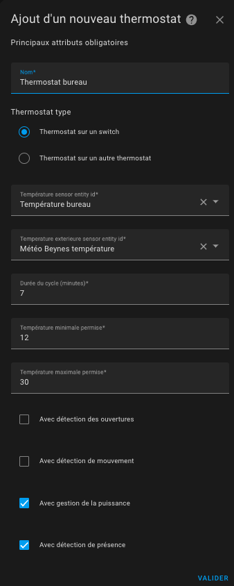

Donnez les principaux attributs obligatoires :
1. un nom (sera le nom de l'intégration et aussi le nom de l'entité climate)
2. le type de thermostat ```thermostat_over_switch``` pour piloter un radiateur commandé par un switch ou ```thermostat_over_climate``` pour piloter un autre thermostat, ou ```thermostat_over_valve``` Cf. [ci-dessus](#pourquoi-une-nouvelle-implémentation-du-thermostat)
4. un identifiant d'entité de capteur de température qui donne la température de la pièce dans laquelle le radiateur est installé,
5. une entité capteur de température donnant la température extérieure. Si vous n'avez pas de capteur externe, vous pouvez utiliser l'intégration météo locale
6. une durée de cycle en minutes. A chaque cycle, le radiateur s'allumera puis s'éteindra pendant une durée calculée afin d'atteindre la température ciblée (voir [preset](#configure-the-preset-temperature) ci-dessous). En mode ```over_climate```, le cycle ne sert qu'à faire des controles de base mais ne régule pas directement la température. C'est le ```climate``` sous-jacent qui le fait,
7. les températures minimales et maximales du thermostat,
8. une puissance de l'équipement ce qui va activer les capteurs de puissance et énergie consommée par l'appareil,
9. la possibilité de controler le thermostat de façon centralisée. Cf [controle centralisé](#le-contrôle-centralisé),
10. la liste des fonctionnalités qui seront utilisées pour ce thermostat. En fonction de vos choix, les écrans de configuration suivants s'afficheront ou pas.

>  _*Notes*_
>  1. avec les types ```over_switch``` et ```over_valve```, les calculs sont effectués à chaque cycle. Donc en cas de changement de conditions, il faudra attendre le prochain cycle pour voir un changement. Pour cette raison, le cycle ne doit pas être trop long. **5 min est une bonne valeur**,
>  2. si le cycle est trop court, le radiateur ne pourra jamais atteindre la température cible. Pour le radiateur à accumulation par exemple il sera sollicité inutilement.
</details>

<details>
<summary>Sélectionnez des entités pilotées (sous-jacents)</summary>

## Sélectionnez des entités pilotées (sous-jacents)

En fonction de votre choix sur le type de thermostat, vous devrez choisir une ou plusieurs entités de type `switch`, `climate` ou `number`. Seules les entités compatibles avec le type sont présentées.

>  _*Comment choisir le type*_
> Le choix du type est important. Même si il toujours possible de le modifier ensuite via l'IHM de configuration, il est préférable de se poser les quelques questions suivantes :
> 1. **quel type d'équipement je vais piloter ?** Dans l'ordre voici ce qu'il faut faire :
>    1. si vous avez une vanne thermostatique (TRV) commandable dans Home Assistant via une entité de type ```number``` (par exemple une _Shelly TRV_), choisissez le type `over_valve`. C'est le type le plus direct et qui assure la meilleure régulation,
>    2. si vous avez un radiateur électrique (avec ou sans fil pilote) et qu'une entité de type ```switch``` permet de l'allumer ou de l'éteindre, alors le type ```over_switch``` est préférable. La régulation sera faite par le Versatile Thermostat en fonction de la température mesuré par votre thermomètre, à l'endroit ou vous l'avez placé,
>    3. dans tous les autres cas, utilisez le mode ```over_climate```. Vous gardez votre entité ```climate``` d'origine et le Versatile Thermostat "ne fait que" piloter le on/off et la température cible de votre thermostat d'origine. La régulation est faite par votre thermostat d'origine dans ce cas. Ce mode est particulièrement adapté aux climatisations réversible tout-en-un dont l'exposition dans Home Assistant se limite à une entité de type ```climate```
> 2. **quelle type de régulation je veux ?** Si l'équipement piloté possède son propre mécanisme de régulation (clim, certaine vanne TRV) et que cette régulation fonctionne bien, optez pour un ```over_climate```

### Pour un thermostat de type ```thermostat_over_switch```
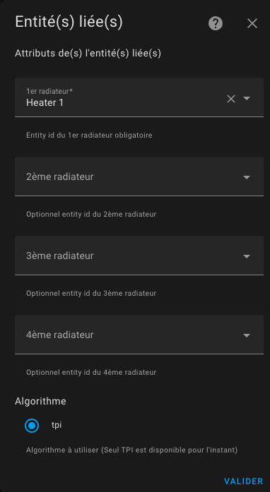

Certains équipements nécessitent d'être périodiquement sollicités pour empêcher un arrêt de sécurité. Connu sous le nom de "keep-alive" cette fonction est activable en entrant un nombre de secondes non nul dans le champ d'intervalle keep-alive du thermostat. Pour désactiver la fonction ou en cas de doute, laissez-le vide ou entrez zéro (valeur par défaut).

L'algorithme à utiliser est aujourd'hui limité à TPI est disponible. Voir [algorithme](#algorithme).
Si plusieurs entités de type sont configurées, la thermostat décale les activations afin de minimiser le nombre de switch actif à un instant t. Ca permet une meilleure répartition de la puissance puisque chaque radiateur va s'allumer à son tour.
Exemple de déclenchement synchronisé :


Il est possible de choisir un thermostat over switch qui commande une climatisation en cochant la case "AC Mode". Dans ce cas, seul le mode refroidissement sera visible.

Si votre équipement est commandé par un fil pilote avec un diode, vous aurez certainement besoin de cocher la case "Inverser la case". Elle permet de mettre le switch à On lorsqu'on doit étiendre l'équipement et à Off lorsqu'on doit l'allumer.

### Pour un thermostat de type ```thermostat_over_climate```:
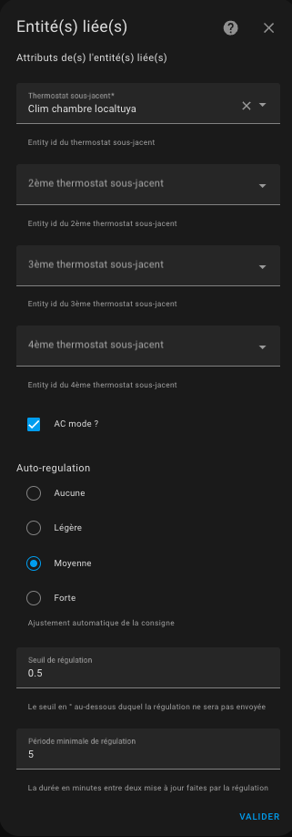

Il est possible de choisir un thermostat over climate qui commande une climatisation réversible en cochant la case "AC Mode". Dans ce cas, selon l'équipement commandé vous aurez accès au chauffage et/ou au réfroidissement.

#### L'auto-régulation
Depuis la release 3.8, vous avez la possibilité d'activer la fonction d'auto-régulation. Cette fonction autorise VersatileThermostat à adapter la consigne de température donnée au climate sous-jacent afin que la température de la pièce atteigne réellement la consigne.
Pour faire ça, le VersatileThermostat calcule un décalage basé sur les informations suivantes :
1. la différence actuelle entre la température réelle et la température de consigne, appelé erreur brute,
2. l'accumulation des erreurs passées,
3. la différence entre la température extérieure et la consigne

Ces trois informations sont combinées pour calculer le décalage qui sera ajouté à la consigne courante et envoyé au climate sous-jacent.

La fonction d'auto-régulation se paramètre avec :
1. une dégré de régulation :
   1. Légère - pour des faibles besoin en auto-régulation. Dans ce mode, le décalage maximal sera de 1,5°,
   2. Medium - pour une auto-régulation moyenne. Un décalage maximal de 2° est possible dans ce mode,
   3. Forte - pour un fort besoin d'auto-régulation. Le décalage maximal est de 3° dans ce mode et l'auto-régulation réagira fortement aux changements de température.
2. Un seuil d'auto-régulation : valeur en dessous de laquelle une nouvelle régulation ne sera pas appliquée. Imaginons qu'à un instant t, le décalage soit de 2°. Si au prochain calcul, le décalage est de 2.4°, il sera pas appliqué. Il ne sera appliqué que la différence entre 2 décalages sera au moins égal à ce seuil,
3. Période minimal entre 2 auto-régulation : ce nombre, exprimé en minute, indique la durée entre 2 changements de régulation.

Ces trois paramètres permettent de moduler la régulation et éviter de multiplier les envois de régulation. Certains équipements comme les TRV, les chaudières n'aiment pas qu'on change la consigne de température trop souvent.

>  _*Conseil de mise en place*_
> 1. Ne démarrez pas tout de suite l'auto-régulation. Regardez comment se passe la régulation naturelle de votre équipement. Si vous constatez que la température de consigne n'est pas atteinte ou qu'elle met trop de temps à être atteinte, démarrez la régulation,
> 2. D'abord commencez par une légère auto-régulation et gardez les deux paramètres avec leur valeurs par défaut. Attendez quelques jours et vérifiez si la situation s'est améliorée,
> 3. Si ce n'est pas suffisant, passez en auto-régulation Medium, attendez une stabilisation,
> 4. Si ce n'est toujours pas suffisant, passez en auto-régulation Forte,
> 5. Si ce n'est toujours pas bon, il faudra passer en mode expert pour pouvoir régler les paramètres de régulation de façon fine. Voir en-dessous

L'auto-régulation consiste à forcer l'équipement a aller plus loin en lui forçant sa température de consigne régulièrement. Sa consommation peut donc être augmentée, ainsi que son usure.

#### L'auto-régulation en mode Expert

En mode **Expert** pouvez régler finement les paramètres de l'auto-régulation pour atteindre vos objeetifs et optimiser au mieux. L'algorithme calcule l'écart entre la consigne et la température réelle de la pièce. Cet écard est appelé erreur.
Les paramètres réglables sont les suivants :
1. `kp` : le facteur appliqué à l'erreur brute,
2. `ki` : le facteur appliqué à l'accumulation des erreurs,
3. `k_ext` : le facteur appliqué à la différence entre la température intérieure et la température externe,
4. `offset_max` : le maximum de correction (offset) que la régulation peut appliquer,
5. `stabilization_threshold` : un seuil de stabilisation qui lorsqu'il est atteint par l'erreur remet à 0, l'accumulation des erreurs,
6. `accumulated_error_threshold` : le maximum pour l'accumulation d'erreur.

Pour le tuning il faut tenir compte de ces observations :
1. `kp * erreur` va donner l'offset lié à l'erreur brute. Cet offset est directement proportionnel à l'erreur et sera à 0 lorsque la target sera atteinte,
2. l'accumulation de l'erreur permet de corriger le stabilisation de la courbe alors qu'il reste une erreur. L'erreur s'accumule et l'offset augmente donc progressivement ce qui devrait finir par stabiliser sur la température cible. Pour que ce paramètre fondamental est un effet il faut qu'il soit pas trop petit. Une valeur moyenne est 30
3. `ki * accumulated_error_threshold` va donner l'offset maximal lié à l'accumulation de l'erreur,
4. `k_ext` permet d'appliquer tout de suite (sans attendre une accumulation des erreurs) une correction lorsque la température extérieure est très différente de la température cible. Si la stabilisation se fait trop haut lorsqu'il les écarts de température sont importants, c'est que ce paramètre est trop fort. Il devrait pouvoir être annulé totalement pour laisser faire les 2 premiers offset

Les valeurs préprogrammées sont les suivantes :

Slow régulation :

    kp: 0.2  # 20% of the current internal regulation offset are caused by the current difference of target temperature and room temperature
    ki: 0.8 / 288.0  # 80% of the current internal regulation offset are caused by the average offset of the past 24 hours
    k_ext: 1.0 / 25.0  # this will add 1°C to the offset when it's 25°C colder outdoor than indoor
    offset_max: 2.0  # limit to a final offset of -2°C to +2°C
    stabilization_threshold: 0.0  # this needs to be disabled as otherwise the long term accumulated error will always be reset when the temp briefly crosses from/to below/above the target
    accumulated_error_threshold: 2.0 * 288  # this allows up to 2°C long term offset in both directions

Light régulation :

    kp: 0.2
    ki: 0.05
    k_ext: 0.05
    offset_max: 1.5
    stabilization_threshold: 0.1
    accumulated_error_threshold: 10


Medium régulation :

    kp: 0.3
    ki: 0.05
    k_ext: 0.1
    offset_max: 2
    stabilization_threshold: 0.1
    accumulated_error_threshold: 20


Strong régulation :

    """Strong parameters for regulation
    A set of parameters which doesn't take into account the external temp
    and concentrate to internal temp error + accumulated error.
    This should work for cold external conditions which else generates
    high external_offset"""

    kp: 0.4
    ki: 0.08
    k_ext: 0.0
    offset_max: 5
    stabilization_threshold: 0.1
    accumulated_error_threshold: 50

Pour utiliser le mode Expert il vous faut déclarer les valeurs que vous souhaitez utiliser pour chacun de ces paramètres dans votre `configuration.yaml` sous la forme suivante :
```
versatile_thermostat:
    auto_regulation_expert:
        kp: 0.4
        ki: 0.08
        k_ext: 0.0
        offset_max: 5
        stabilization_threshold: 0.1
        accumulated_error_threshold: 50
```
et bien sur, configurer le mode auto-régulation du VTherm en mode Expert. Tous les VTherm en mode **Expert** utiliseront ces mêmes paramètres.

Pour que les modifications soient prises en compte, il faut soit **relancer totalement Home Assistant** soit juste l'intégration Versatile Thermostat (Outils de dev / Yaml / rechargement de la configuration / Versatile Thermostat).

#### Compensation de la température interne
Quelque fois, il arrive que le thermomètre interne du sous-jacent (TRV, climatisation, ...) soit tellement faux que l' auto-régulation ne suffise pas à réguler.
Cela arrive lorsque le thermomètre interne est trop près de la source de chaleur. La température interne monte alors beaucoup plus vite que la température de la pièce, ce qui génère des défauts dans la régulation.
Exemple :
1. la température de la pièce est 18°, la consigne est à 20°,
2. la température interne de l'équipement est de 22°,
3. si VTherm envoie 21° comme consigne (= 20° + 1° d'auto-regulation), alors l'équipement ne chauffera pas car sa température interne (22°) est au-dessus de la consigne (21°)

Pour palier à ça, une nouvelle option facultative a été ajoutée en version 5.4 : 

Lorsqu'elle est activée, cette fonction ajoutera l'écart entre la température interne et la température de la pièce à la consigne pour forcer le chauffage.
Dans l'exemple ci-dessus, l'écart est de +4° (22° - 18°), donc VTherm enverra 25° (21°+4°) à l'équipement le forçant ainsi à chauffer.

Cet écart est calculé pour chaque sous-jacent car chacun à sa propre température interne. Pensez à un VTherm qui serait relié à 3 TRV chacun avec sa température interne par exemple.

On obtient alors une auto-régulation bien plus efficace qui évite l'eccueil des gros écarts de température interne défaillante.

#### Synthèse de l'algorithme d'auto-régulation
L'algorithme d'auto-régulation peut être synthétisé comme suit:

1. initialiser la température cible comme la consigne du VTherm,
1. Si l'auto-régulation est activée,
   1. calcule de la température régulée (valable pour un VTherm),
   2. prendre cette température comme cible,
2. Pour chaque sous-jacent du VTherm,
     1. Si "utiliser la température interne" est cochée,
          1. calcule de l'écart (trv internal temp - room temp),
     2. ajout de l'écart à la température cible,
     3. envoie de la température cible ( = temp regulee + (temp interne - temp pièce)) au sous-jacent


#### Le mode auto-fan
Ce mode introduit en 4.3 permet de forcer l'usage de la ventilation si l'écart de température est important. En effet, en activant la ventilation, la répartition se fait plus rapidement ce qui permet de gagner du temps dans l'atteinte de la température cible.
Vous pouvez choisir quelle ventilation vous voulez activer entre les paramètres suivants : Faible, Moyenne, Forte, Turbo.

Il faut évidemment que votre équipement sous-jacent soit équipée d'une ventilation et quelle soit pilotable pour que cela fonctionne.
Si votre équipement ne comprend pas le mode Turbo, le mode Forte` sera utilisé en remplacement.
Une fois l'écart de température redevenu faible, la ventilation se mettra dans un mode "normal" qui dépend de votre équipement à savoir (dans l'ordre) : `Silence (mute)`, `Auto (auto)`, `Faible (low)`. La première valeur qui est possible pour votre équipement sera choisie.

### Pour un thermostat de type ```thermostat_over_valve```:
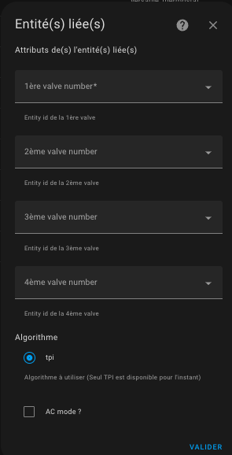
Vous pouvez choisir jusqu'à entité du domaine ```number``` ou ```ìnput_number``` qui vont commander les vannes.
L'algorithme à utiliser est aujourd'hui limité à TPI est disponible. Voir [algorithme](#algorithme).

Il est possible de choisir un thermostat over valve qui commande une climatisation en cochant la case "AC Mode". Dans ce cas, seul le mode refroidissement sera visible.
</details>

<details>
<summary>Configurez les coefficients de l'algorithme TPI</summary>

## Configurez les coefficients de l'algorithme TPI

Si vous avez choisi un thermostat de type ```over_switch``` ou  ```over_valve``` et que vous sélectionnez l'option "TPI" vous menu, vous arriverez sur cette page :

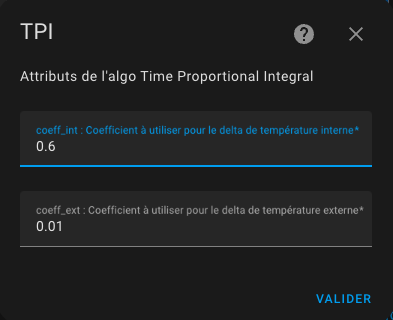

Vous devez donner :
1. le coefficient coef_int de l'algorithme TPI,
2. le coefficient coef_ext de l'algorithme TPI


Pour plus d'informations sur l'algorithme TPI et son réglage, veuillez vous référer à [algorithm](#algorithm).
</details>

<details>
<summary>Configurer les températures préréglées</summary>

## Configurer les températures préréglées

Le mode préréglé (preset) vous permet de préconfigurer la température ciblée. Utilisé en conjonction avec Scheduler (voir [scheduler](#even-better-with-scheduler-component) vous aurez un moyen puissant et simple d'optimiser la température par rapport à la consommation électrique de votre maison. Les préréglages gérés sont les suivants :
 - **Eco** : l'appareil est en mode d'économie d'énergie
 - **Confort** : l'appareil est en mode confort
 - **Boost** : l'appareil tourne toutes les vannes à fond

 Si le mode AC est utilisé, vous pourrez aussi configurer les températures lorsque l'équipement en mode climatisation.

**Aucun** est toujours ajouté dans la liste des modes, car c'est un moyen de ne pas utiliser les preset mais une **température manuelle** à la place.

Les pré-réglages se font (depuis v6.0) directement depuis les entités du VTherm ou de la configuration centrale si vous utilisez la configuration centrale.

>  _*Notes*_
>  1. En modifiant manuellement la température cible, réglez le préréglage sur Aucun (pas de préréglage). De cette façon, vous pouvez toujours définir une température cible même si aucun préréglage n'est disponible.
>  2. Le préréglage standard ``Away`` est un préréglage caché qui n'est pas directement sélectionnable. Versatile Thermostat utilise la gestion de présence ou la gestion de mouvement pour régler automatiquement et dynamiquement la température cible en fonction d'une présence dans le logement ou d'une activité dans la pièce. Voir [gestion de la présence](#configure-the-presence-management).
>  3. Si vous utilisez la gestion du délestage, vous verrez un préréglage caché nommé ``power``. Le préréglage de l'élément chauffant est réglé sur « puissance » lorsque des conditions de surpuissance sont rencontrées et que le délestage est actif pour cet élément chauffant. Voir [gestion de l'alimentation](#configure-the-power-management).
>  4. si vous utilisez la configuration avancée, vous verrez le préréglage défini sur ``sécurité`` si la température n'a pas pu être récupérée après un certain délai
>  5. Si vous ne souhaitez pas utiliser le préréglage, indiquez 0 comme température. Le préréglage sera alors ignoré et ne s'affichera pas dans le composant front
</details>

<details>
<summary>Configurer les portes/fenêtres en allumant/éteignant les thermostats</summary>

## Configurer les portes/fenêtres en allumant/éteignant les thermostats

Vous devez avoir choisi la fonctionnalité ```Avec détection des ouvertures``` dans la première page pour arriver sur cette page.
La détecttion des ouvertures peut se faire de 2 manières:
1. soit avec un capteur placé sur l'ouverture (mode capteur),
2. soit en détectant une chute brutale de température (mode auto)

### Le mode capteur
En mode capteur, vous devez renseigner les informations suivantes:
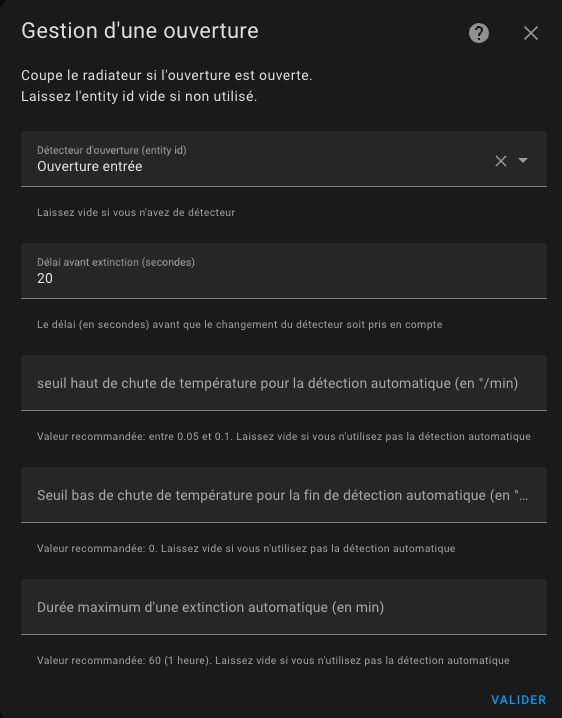

1. un identifiant d'entité d'un **capteur de fenêtre/porte**. Cela devrait être un binary_sensor ou un input_boolean. L'état de l'entité doit être 'on' lorsque la fenêtre est ouverte ou 'off' lorsqu'elle est fermée
2. un **délai en secondes** avant tout changement. Cela permet d'ouvrir rapidement une fenêtre sans arrêter le chauffage.


### Le mode auto
En mode auto, la configuration est la suivante:
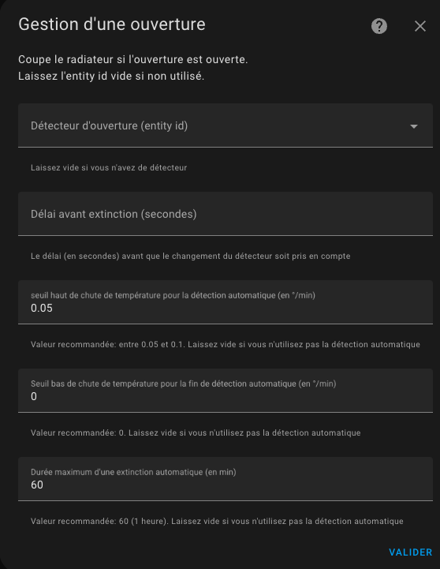

1. un seuil de détection en degré par minute. Lorsque la température chute au delà de ce seuil, le thermostat s'éteindra. Plus cette valeur est faible et plus la détection sera rapide (en contre-partie d'un risque de faux positif),
2. un seuil de fin de détection en degré par minute. Lorsque la chute de température repassera au-dessus cette valeur, le thermostat se remettra dans le mode précédent (mode et preset),
3. une durée maximale de détection. Au delà de cette durée, le thermostat se remettra dans son mode et preset précédent même si la température continue de chuter.

Pour régler les seuils il est conseillé de commencer avec les valeurs de référence et d'ajuster les seuils de détection. Quelques essais m'ont donné les valeurs suivantes (pour un bureau):
- seuil de détection : 0,05 °C/min
- seuil de non détection: 0 °C/min
- durée max : 60 min.

Un nouveau capteur "slope" a été ajouté pour tous les thermostats. Il donne la pente de la courbe de température en °C/min (ou °K/min). Cette pente est lissée et filtrée pour éviter les valeurs abérrantes des thermomètres qui viendraient pertuber la mesure.


Pour bien régler il est conseillé d'affocher sur un même graphique historique la courbe de température et la pente de la courbe (le "slope") :


Et c'est tout ! votre thermostat s'éteindra lorsque les fenêtres seront ouvertes et se rallumera lorsqu'il sera fermé.

>  _*Notes*_
>  1. Si vous souhaitez utiliser **plusieurs capteurs de porte/fenêtre** pour automatiser votre thermostat, créez simplement un groupe avec le comportement habituel (https://www.home-assistant.io/integrations/binary_sensor.group/)
>  2. Si vous n'avez pas de capteur de fenêtre/porte dans votre chambre, laissez simplement l'identifiant de l'entité du capteur vide,
>  3. **Un seul mode est permis**. On ne peut pas configurer un thermostat avec un capteur et une détection automatique. Les 2 modes risquant de se contredire, il n'est pas possible d'avoir les 2 modes en même temps,
>  4. Il est déconseillé d'utiliser le mode automatique pour un équipement soumis à des variations de température fréquentes et normales (couloirs, zones ouvertes, ...)
</details>

<details>
<summary>Configurer le mode d'activité ou la détection de mouvement</summary>

## Configurer le mode d'activité ou la détection de mouvement

Si vous avez choisi la fonctionnalité ```Avec détection de mouvement```, cliquez sur 'Valider' sur la page précédente et vous y arriverez :

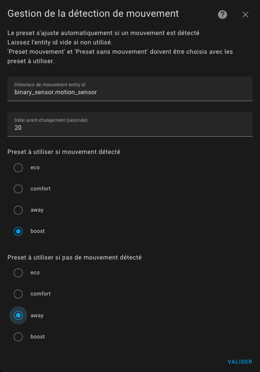

Nous allons maintenant voir comment configurer le nouveau mode Activité.
Ce dont nous avons besoin:
- un **capteur de mouvement**. ID d'entité d'un capteur de mouvement. Les états du capteur de mouvement doivent être « on » (mouvement détecté) ou « off » (aucun mouvement détecté)
- une durée de **délai de mouvement** (en secondes) définissant combien de temps nous attendons la confirmation du mouvement avant de considérer le mouvement. Ce paramètre peut être supérieur à la temporision de votre détecteur de mouvement, sinon la détection se fera à chaque mouvement signalé par le détecteur,
- une durée de fin **délai de mouvement** (en secondes) définissant combien de temps nous attendons la confirmation d'une fin de mouvement avant de ne plus considérer le mouvement.
- un **préréglage de "mouvement" **. Nous utiliserons la température de ce préréglage lorsqu'une activité sera détectée.
- un **préréglage "pas de mouvement"**. Nous utiliserons la température de ce deuxième préréglage lorsqu'aucune activité n'est détectée.

Alors imaginons que nous voulions avoir le comportement suivant :
- nous avons une pièce avec un thermostat réglé en mode activité, le mode "mouvement" choisi est confort (21,5°C), le mode "pas de mouvement" choisi est Eco (18.5°C) et la temporisation du mouvement est de 30 sec lors de la détection et de 5 minutes sur fin de détection.
- la pièce est vide depuis un moment (aucune activité détectée), la température de cette pièce est de 18,5°
- quelqu'un entre dans la pièce, une activité est détectée si le mouvement est présent pendant au moins 30 sec. La température passe alors à 21,5°
- si le mouvement est présent pendant moins de 30 sec (passage rapide), la température reste sur 18,5°,
- imaginons que la température soit passée sur 21,5°, lorsque la personne quitte la pièce, au bout de 5 min la température est ramenée à 18,5°.
- si la personne revient avant les 5 minutes, la température reste sur 21,5°

Pour que cela fonctionne, le thermostat doit être en mode préréglé « Activité ».

>  _*Notes*_
    1. Sachez que comme pour les autres modes prédéfinis, ``Activity`` ne sera proposé que s'il est correctement configuré. En d'autres termes, les 4 clés de configuration doivent être définies si vous souhaitez voir l'activité dans l'interface de l'assistant domestique
</details>

<details>
<summary>Configurer la gestion de la puissance</summary>

## Configurer la gestion de la puissance

Si vous avez choisi la fonctionnalité ```Avec détection de la puissance```, cliquez sur 'Valider' sur la page précédente et vous arriverez ici :

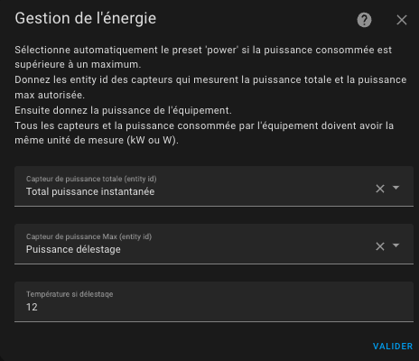

Cette fonction vous permet de réguler la consommation électrique de vos radiateurs. Connue sous le nom de délestage, cette fonction vous permet de limiter la consommation électrique de votre appareil de chauffage si des conditions de surpuissance sont détectées. Donnez un **capteur à la consommation électrique actuelle de votre maison**, un **capteur à la puissance max** qu'il ne faut pas dépasser, la **consommation électrique totale des équipements du VTherm** (en étape 1 de la configuration) et l'algorithme ne démarrera pas un radiateur si la puissance maximale sera dépassée après le démarrage du radiateur.

Notez que toutes les valeurs de puissance doivent avoir les mêmes unités (kW ou W par exemple).
Cela vous permet de modifier la puissance maximale au fil du temps à l'aide d'un planificateur ou de ce que vous voulez.

>  _*Notes*_
> 1. En cas de délestage, le radiateur est réglé sur le préréglage nommé ```power```. Il s'agit d'un préréglage caché, vous ne pouvez pas le sélectionner manuellement.
> 2. Je l'utilise pour éviter de dépasser la limite de mon contrat d'électricité lorsqu'un véhicule électrique est en charge. Cela crée une sorte d'autorégulation.
> 3. Gardez toujours une marge, car la puissance max peut être brièvement dépassée en attendant le calcul du prochain cycle typiquement ou par des équipements non régulés.
> 4. Si vous ne souhaitez pas utiliser cette fonctionnalité, laissez simplement l'identifiant des entités vide
> 5. Si vous controlez plusieurs radiateurs, la **consommation électrique de votre chauffage** renseigné doit correspondre à la somme des puissances.
</details>

<details>
<summary>Configurer la présence (ou l'absence)</summary>

## Configurer la présence (ou l'absence)

Si sélectionnée en première page, cette fonction vous permet de modifier dynamiquement la température de tous les préréglages du thermostat configurés lorsque personne n'est à la maison ou lorsque quelqu'un rentre à la maison. Pour cela, vous devez configurer la température qui sera utilisée pour chaque préréglage lorsque la présence est désactivée. Lorsque le capteur de présence s'éteint, ces températures seront utilisées. Lorsqu'il se rallume, la température "normale" configurée pour le préréglage est utilisée. Voir [gestion des préréglages](#configure-the-preset-temperature).
Pour configurer la présence remplissez ce formulaire :


Pour cela, vous devez configurer :
1. Un **capteur d'occupation** dont l'état doit être 'on' ou 'home' si quelqu'un est présent ou 'off' ou 'not_home' sinon,
2. La **température utilisée en Eco** prédéfinie en cas d'absence,
3. La **température utilisée en Confort** préréglée en cas d'absence,
4. La **température utilisée en Boost** préréglée en cas d'absence

Si le mode AC est utilisé, vous pourrez aussi configurer les températures lorsque l'équipement en mode climatisation.

ATTENTION : les groupes de personnes ne fonctionnent pas en tant que capteur de présence. Ils ne sont pas reconnus comme un capteur de présence. Vous devez utiliser, un template comme décrit ici [Utilisation d'un groupe de personnes comme capteur de présence](#utilisation-dun-groupe-de-personnes-comme-capteur-de-présence).

>  _*Notes*_
> 1. le changement de température est immédiat et se répercute sur le volet avant. Le calcul prendra en compte la nouvelle température cible au prochain calcul du cycle,
> 2. vous pouvez utiliser le capteur direct person.xxxx ou un groupe de capteurs de Home Assistant. Le capteur de présence gère les états ``on`` ou ``home`` comme présents et les états ``off`` ou ``not_home`` comme absents.
</details>

<details>
<summary>Configuration avancée</summary>

## Configuration avancée

Ces paramètres permettent d'affiner le réglage du thermostat.
Le formulaire de configuration avancée est le suivant :

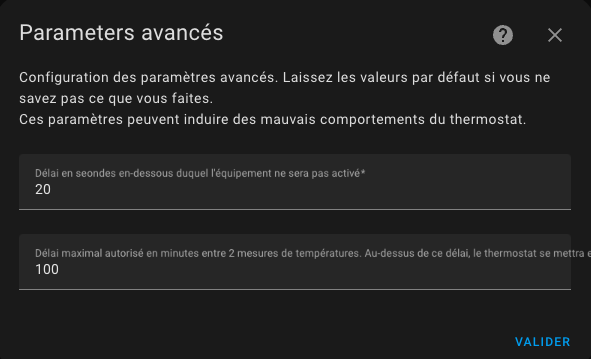

Le premier délai (minimal_activation_delay_sec) en secondes est le délai minimum acceptable pour allumer le chauffage. Lorsque le calcul donne un délai de mise sous tension inférieur à cette valeur, le chauffage reste éteint.

Le deuxième délai (``security_delay_min``) est le délai maximal entre deux mesures de température avant de régler le préréglage sur ``security``. Si le capteur de température ne donne plus de mesures de température, le thermostat et le radiateur passeront en mode ``security`` après ce délai. Ceci est utile pour éviter une surchauffe si la batterie de votre capteur de température est trop faible.

Le troisième paramétre (``security_min_on_percent``) est la valeur minimal de ``on_percent`` en dessous de laquelle le préréglage sécurité ne sera pas activé. Ce paramètre permet de ne pas mettre en sécurité un thermostat, si le radiateur piloté ne chauffe pas suffisament.
Mettre ce paramètre à ``0.00`` déclenchera le préréglage sécurité quelque soit la dernière consigne de chauffage, à l'inverse ``1.00`` ne déclenchera jamais le préréglage sécurité ( ce qui revient à désactiver la fonction).

Le quatrième param§tre (``security_default_on_percent``) est la valeur de ``on_percent`` qui sera utilisée lorsque le thermostat passe en mode ``security``. Si vous mettez ``0`` alors le thermostat sera coupé lorsqu'il passe en mode ``security``, mettre 0,2% par exemple permet de garder un peu de chauffage (20% dans ce cas), même en mode ``security``. Ca évite de retrouver son logement totalement gelé lors d'une panne de thermomètre.

Depuis la version 5.3 il est possible de désactiver la mise en sécurité suite à une absence de données du thermomètre extérieure. En effet, celui-ci ayant la plupart du temps un impact faible sur la régulation (dépendant de votre paramètrage), il est possible qu'il soit absent sans mettre en danger le logement. Pour cela, il faut ajouter les lignes suivantes dans votre `configuration.yaml` :
```
versatile_thermostat:
...
    safety_mode:
        check_outdoor_sensor: false
```
Par défaut, le thermomètre extérieur peut déclencher une mise en sécurité si il n'envoit plus de valeur.

Voir [exemple de réglages](#examples-tuning) pour avoir des exemples de réglage communs

>  _*Notes*_
> 1. Lorsque le capteur de température viendra à la vie et renverra les températures, le préréglage sera restauré à sa valeur précédente,
> 2. Attention, deux températures sont nécessaires : la température interne et la température externe et chacune doit donner la température, sinon le thermostat sera en préréglage "security",
> 3. Un service est disponible qui permet de régler les 3 paramètres de sécurité. Ca peut servir à adapter la fonction de sécurité à votre usage,
> 4. Pour un usage naturel, le ``security_default_on_percent`` doit être inférieur à ``security_min_on_percent``,
> 5. Les thermostats de type ``thermostat_over_climate`` ne sont pas concernés par le mode security.
</details>

<details>
<summary>Le contrôle centralisé</summary>

## Le contrôle centralisé

Depuis la release 5.2, si vous avez défini une configuration centralisée, vous avez une nouvelle entité nommée `select.central_mode` qui permet de piloter tous les VTherms avec une seule action. Pour qu'un VTherm soit contrôlable de façon centralisée, il faut que son attribut de configuration nommé `use_central_mode` soit vrai.

Cette entité se présente sous la forme d'une liste de choix qui contient les choix suivants :
1. `Auto` : le mode 'normal' dans lequel chaque VTherm se comporte comme dans les versions précédentes,
2. `Stooped` : tous les VTherms sont mis à l'arrêt (`hvac_off`),
3. `Heat only` : tous les VTherms sont mis en mode chauffage lorsque ce mode est supporté par le VTherm, sinon il est stoppé,
3. `Cool only` : tous les VTherms sont mis en mode climatisation lorsque ce mode est supporté par le VTherm, sinon il est stoppé,
4. `Frost protection` : tous les VTherms sont mis en preset hors-gel lorsque ce preset est supporté par le VTherm, sinon il est stoppé.

Il est donc possible de contrôler tous les VTherms (que ceux que l'on désigne explicitement) avec un seul contrôle.
Exemple de rendu :

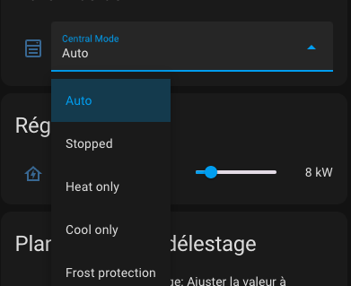
</details>

<details>
<summary>Le contrôle d'une chaudière centrale</summary>

## Le contrôle d'une chaudière centrale

Depuis la release 5.3, vous avez la possibilité de contrôler une chaudière centralisée. A partir du moment où il est possible de déclencher ou stopper cette chaudière depuis Home Assistant, alors Versatile Thermostat va pouvoir la commander directement.

Le principe mis en place est globalement le suivant :
1. une nouvelle entité de type `binary_sensor` et nommée par défaut `binary_sensor.central_boiler` est ajoutée,
2. dans la configuration des VTherms vous indiquez si le VTherm doit contrôler la chaudière. En effet, dans une installation hétérogène, certains VTherm doivent commander la chaudière et d'autres non. Vous devez donc indiquer dans chaque configuration de VTherm si il contrôle la chaudière ou pas,
3. le `binary_sensor.central_boiler` écoute les changements d'états des équipements des VTherm marqués comme contrôlant la chaudière,
4. dès que le nombre d'équipements pilotés par le VTherm demandant du chauffage (ie son `hvac_action` passe à `Heating`) dépasse un seuil paramétrable, alors le `binary_sensor.central_boiler` passe à `on` et **si un service d'activation a été configuré, alors ce service est appelé**,
5. si le nombre d'équipements nécessitant du chauffage repasse en dessous du seuil, alors le `binary_sensor.central_boiler` passe à `off` et si **un service de désactivation a été configuré, alors ce service est appelé**,
6. vous avez accès à deux entités :
   - une de type `number` nommé par défaut `number.boiler_activation_threshold`, donne le seuil de déclenchement. Ce seuil est en nombre d'équipements (radiateurs) qui demande du chauffage.
   - une de type `sensor` nommé par défaut `sensor.nb_device_active_for_boiler`, donne le nombre d'équipements qui demande du chauffage. Par exemple, un VTherm ayant 4 vannes dont 3 demandes du chauffage fera passé ce capteur à 3. Seuls les équipements des VTherms qui sont marqués pour contrôler la chaudière centrale sont comptabilisés.

Vous avez donc en permanence, les informations qui permettent de piloter et régler le déclenchement de la chaudière.

Toutes ces entités sont rattachés au service de configuration centrale :
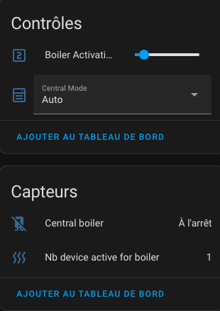

### Configuration
Pour configurer cette fonction, vous devez avoir une configuration centralisée (cf. [Configuration](#configuration)) et cochez la case 'Ajouter une chuadière centrale' :


Sur la page suivante vous pouvez donner la configuration des services à appeler lors de l'allumage / extinction de la chaudière :

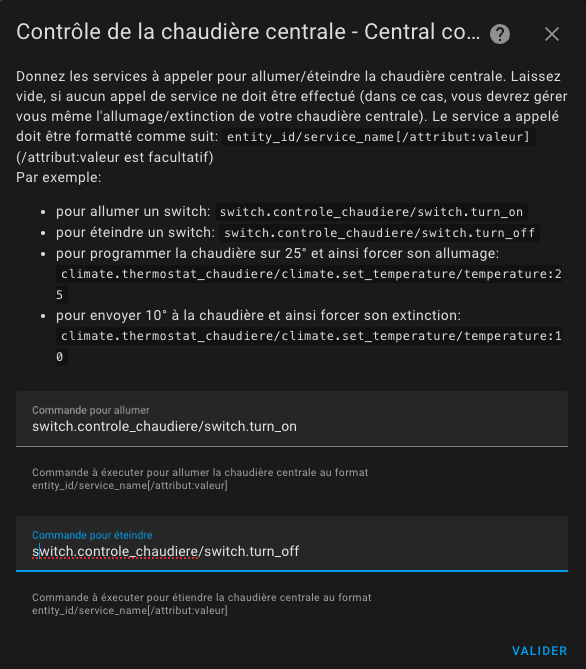

Les services se configurent comme indiqués dans la page :
1. le format général est `entity_id/service_id[/attribut:valeur]` (où `/attribut:valeur` est facultatif),
2. `entity_id` est le nom de l'entité qui commande la chaudière sous la forme `domain.entity_name`. Par exemple: `switch.chaudiere` pour les chaudière commandée par un switch ou `climate.chaudière` pour une chaudière commandée par un thermostat ou tout autre entité qui permet le contrôle de la chaudière (il n'y a pas de limitation).  On peut aussi commuter des entrées (`helpers`) comme des `input_boolean` ou `input_number`.
3. `service_id` est le nom du service à appeler sous la forme `domain.service_name`. Par exemple: `switch.turn_on`, `switch.turn_off`, `climate.set_temperature`, `climate.set_hvac_mode` sont des exemples valides.
4. pour certain service vous aurez besoin d'un paramètre. Cela peut être le 'Mode CVC' `climate.set_hvac_mode` ou la température cible pour `climate.set_temperature`. Ce paramètre doit être configuré sous la forme `attribut:valeur` en fin de chaine.

Exemples (à ajuster à votre cas) :
- `climate.chaudiere/climate.set_hvac_mode/hvac_mode:heat` : pour allumer le thermostat de la chaudière en mode chauffage,
- `climate.chaudiere/climate.set_hvac_mode/hvac_mode:off` : pour stopper le thermostat de la chaudière,
- `switch.pompe_chaudiere/switch.turn_on` : pour allumer le swicth qui alimente la pompe de la chaudière,
- `switch.pompe_chaudiere/switch.turn_off` : pour allumer le swicth qui alimente la pompe de la chaudière,
- ...

### Comment trouver le bon service ?
Pour trouver le services a utiliser, le mieux est d'aller dans "Outils de développement / Services", chercher le service a appelé, l'entité à commander et l'éventuel paramètre à donner.
Cliquez sur 'Appeler le service'. Si votre chaudière s'allume vous avez la bonne configuration. Passez alors en mode Yaml et recopiez les paramètres.

Exemple:

Sous "Outils de développement / Service" :


En mode yaml :


Le service à configurer est alors le suivant: `climate.empty_thermostast/climate.set_hvac_mode/hvac_mode:heat` (notez la suppression du blanc dans `hvac_mode:heat`)

Faite alors de même pour le service d'extinction et vous êtes parés.

### Les évènements

A chaque allumage ou extinction réussie de la chaudière un évènement est envoyé par Versatile Thermostat. Il peut avantageusement être capté par une automatisation, par exemple pour notifier un changement.
Les évènements ressemblent à ça :

Un évènement d'allumage :
```
event_type: versatile_thermostat_central_boiler_event
data:
  central_boiler: true
  entity_id: binary_sensor.central_boiler
  name: Central boiler
  state_attributes: null
origin: LOCAL
time_fired: "2024-01-14T11:33:52.342026+00:00"
context:
  id: 01HM3VZRJP3WYYWPNSDAFARW1T
  parent_id: null
  user_id: null
```

Un évènement d'extinction :
```
event_type: versatile_thermostat_central_boiler_event
data:
  central_boiler: false
  entity_id: binary_sensor.central_boiler
  name: Central boiler
  state_attributes: null
origin: LOCAL
time_fired: "2024-01-14T11:43:52.342026+00:00"
context:
  id: 01HM3VZRJP3WYYWPNSDAFBRW1T
  parent_id: null
  user_id: null
```

### Avertissement

>  _*Notes*_
> Le contrôle par du logiciel ou du matériel de type domotique d'une chaudière centrale peut induire des risques pour son bon fonctionnement. Assurez-vous avant d'utiliser ces fonctions, que votre chaudière possède bien des fonctions de sécurité et que celles-ci fonctionnent. Allumer une chaudière si tous les robinets sont fermés peut générer de la sur-pression par exemple.
</details>

<details>
<summary>Synthèse des paramètres</summary>

## Synthèse des paramètres

| Paramètre                                 | Libellé                                                                           | "over switch" | "over climate"      | "over valve" | "configuration centrale" |
| ----------------------------------------- | --------------------------------------------------------------------------------- | ------------- | ------------------- | ------------ | ------------------------ |
| ``name``                                  | Nom                                                                               | X             | X                   | X            | -                        |
| ``thermostat_type``                       | Type de thermostat                                                                | X             | X                   | X            | -                        |
| ``temperature_sensor_entity_id``          | Temperature sensor entity id                                                      | X             | X (auto-regulation) | X            | -                        |
| ``external_temperature_sensor_entity_id`` | Température de l'exterieur sensor entity id                                       | X             | X (auto-regulation) | X            | X                        |
| ``cycle_min``                             | Durée du cycle (minutes)                                                          | X             | X                   | X            | -                        |
| ``temp_min``                              | Température minimale permise                                                      | X             | X                   | X            | X                        |
| ``temp_max``                              | Température maximale permise                                                      | X             | X                   | X            | X                        |
| ``device_power``                          | Puissance de l'équipement                                                         | X             | X                   | X            | -                        |
| ``use_central_mode``                      | Autorisation du contrôle centralisé                                               | X             | X                   | X            | -                        |
| ``use_window_feature``                    | Avec détection des ouvertures                                                     | X             | X                   | X            | -                        |
| ``use_motion_feature``                    | Avec détection de mouvement                                                       | X             | X                   | X            | -                        |
| ``use_power_feature``                     | Avec gestion de la puissance                                                      | X             | X                   | X            | -                        |
| ``use_presence_feature``                  | Avec détection de présence                                                        | X             | X                   | X            | -                        |
| ``heater_entity1_id``                     | 1er radiateur                                                                     | X             | -                   | -            | -                        |
| ``heater_entity2_id``                     | 2ème radiateur                                                                    | X             | -                   | -            | -                        |
| ``heater_entity3_id``                     | 3ème radiateur                                                                    | X             | -                   | -            | -                        |
| ``heater_entity4_id``                     | 4ème radiateur                                                                    | X             | -                   | -            | -                        |
| ``heater_keep_alive``                     | Intervalle de rafraichissement du switch                                          | X             | -                   | -            | -                        |
| ``proportional_function``                 | Algorithme                                                                        | X             | -                   | -            | -                        |
| ``climate_entity1_id``                    | Thermostat sous-jacent                                                            | -             | X                   | -            | -                        |
| ``climate_entity2_id``                    | 2ème thermostat sous-jacent                                                       | -             | X                   | -            | -                        |
| ``climate_entity3_id``                    | 3ème thermostat sous-jacent                                                       | -             | X                   | -            | -                        |
| ``climate_entity4_id``                    | 4ème thermostat sous-jacent                                                       | -             | X                   | -            | -                        |
| ``valve_entity1_id``                      | Vanne sous-jacente                                                                | -             | -                   | X            | -                        |
| ``valve_entity2_id``                      | 2ème vanne sous-jacente                                                           | -             | -                   | X            | -                        |
| ``valve_entity3_id``                      | 3ème vanne sous-jacente                                                           | -             | -                   | X            | -                        |
| ``valve_entity4_id``                      | 4ème vanne sous-jacente                                                           | -             | -                   | X            | -                        |
| ``ac_mode``                               | utilisation de l'air conditionné (AC) ?                                           | X             | X                   | X            | -                        |
| ``tpi_coef_int``                          | Coefficient à utiliser pour le delta de température interne                       | X             | -                   | X            | X                        |
| ``tpi_coef_ext``                          | Coefficient à utiliser pour le delta de température externe                       | X             | -                   | X            | X                        |
| ``frost_temp``                            | Température en preset Hors-gel                                                    | X             | X                   | X            | X                        |
| ``window_sensor_entity_id``               | Détecteur d'ouverture (entity id)                                                 | X             | X                   | X            | -                        |
| ``window_delay``                          | Délai avant extinction (secondes)                                                 | X             | X                   | X            | X                        |
| ``window_auto_open_threshold``            | Seuil haut de chute de température pour la détection automatique (en °/min)       | X             | X                   | X            | X                        |
| ``window_auto_close_threshold``           | Seuil bas de chute de température pour la fin de détection automatique (en °/min) | X             | X                   | X            | X                        |
| ``window_auto_max_duration``              | Durée maximum d'une extinction automatique (en min)                               | X             | X                   | X            | X                        |
| ``motion_sensor_entity_id``               | Détecteur de mouvement entity id                                                  | X             | X                   | X            | -                        |
| ``motion_delay``                          | Délai avant prise en compte du mouvement (seconds)                                | X             | X                   | X            | -                        |
| ``motion_off_delay``                      | Délai avant prise en compte de la fin de mouvement (seconds)                      | X             | X                   | X            | X                        |
| ``motion_preset``                         | Preset à utiliser si mouvement détecté                                            | X             | X                   | X            | X                        |
| ``no_motion_preset``                      | Preset à utiliser si pas de mouvement détecté                                     | X             | X                   | X            | X                        |
| ``power_sensor_entity_id``                | Capteur de puissance totale (entity id)                                           | X             | X                   | X            | X                        |
| ``max_power_sensor_entity_id``            | Capteur de puissance Max (entity id)                                              | X             | X                   | X            | X                        |
| ``power_temp``                            | Température si délestaqe                                                          | X             | X                   | X            | X                        |
| ``presence_sensor_entity_id``             | Capteur de présence entity id (true si quelqu'un est présent)                     | X             | X                   | X            | -                        |
| ``minimal_activation_delay``              | Délai minimal d'activation                                                        | X             | -                   | -            | X                        |
| ``security_delay_min``                    | Délai maximal entre 2 mesures de températures                                     | X             | -                   | X            | X                        |
| ``security_min_on_percent``               | Pourcentage minimal de puissance pour passer en mode sécurité                     | X             | -                   | X            | X                        |
| ``auto_regulation_mode``                  | Le mode d'auto-régulation                                                         | -             | X                   | -            | -                        |
| ``auto_regulation_dtemp``                 | La seuil d'auto-régulation                                                        | -             | X                   | -            | -                        |
| ``auto_regulation_period_min``            | La période minimale d'auto-régulation                                             | -             | X                   | -            | -                        |
| ``inverse_switch_command``                | Inverse la commande du switch (pour switch avec fil pilote)                       | X             | -                   | -            | -                        |
| ``auto_fan_mode``                         | Mode de ventilation automatique                                                   | -             | X                   | -            | -                        |
| ``auto_regulation_use_device_temp``       | Utilisation de la température interne du sous-jacent                              | -             | X                   | -            | -                        |
| ``use_central_boiler_feature``            | Ajout du controle d'une chaudière centrale                                        | -             | -                   | -            | X                        |
| ``central_boiler_activation_service``     | Service d'activation de la chaudière                                              | -             | -                   | -            | X                        |
| ``central_boiler_deactivation_service``   | Service de desactivation de la chaudière                                          | -             | -                   | -            | X                        |
| ``used_by_controls_central_boiler``       | Indique si le VTherm contrôle la chaudière centrale                               | X             | X                   | X            | -                        |
</details>

# Exemples de réglage

## Chauffage électrique
- cycle : entre 5 et 10 minutes,
- minimal_activation_delay_sec : 30 secondes

## Chauffage central (chauffage gaz ou fuel)
- cycle : entre 30 et 60 min,
- minimal_activation_delay_sec : 300 secondes (à cause du temps de réponse)

## Le capteur de température alimenté par batterie
- security_delay_min : 60 min (parce que ces capteurs sont paresseux)
- security_min_on_percent : 0,5 (50% - on passe en preset ``security`` si le radiateur chauffait plus de 50% du temps)
- security_default_on_percent : 0,1 (10% - en preset ``security``, on garde un fond de chauffe de 20% du temps)

Il faut comprendre ces réglages comme suit :

> Si le thermomètre n'envoie plus la température pendant 1 heure et que le pourcentage de chauffe (``on_percent``) était supérieur à 50 %, alors on ramène ce pourcentage de chauffe à 10 %.

A vous d'adapter ces réglages à votre cas !

Ce qui est important c'est de ne pas prendre trop de risque avec ces paramètres : supposez que vous êtes absent pour une longue période, que les piles de votre thermomètre arrivent en fin de vie, votre radiateur va chauffer 10% du temps pendant toute la durée de la panne.

Versatile Thermostat vous permet d'être notifié lorsqu'un évènement de ce type survient. Mettez en place, les alertes qui vont bien dès l'utilisation de ce thermostat. Cf. (#notifications)

## Capteur de température réactif (sur secteur)
- security_delay_min : 15 min
- security_min_on_percent : 0,7 (70% - on passe en preset ``security`` si le radiateur chauffait plus de 70% du temps)
- security_default_on_percent : 0,25 (25% - en preset ``security``, on garde un fond de chauffe de 25% du temps)

## Mes presets
Ceci est juste un exemple de la façon dont j'utilise le préréglage. A vous de vous adapter à votre configuration mais cela peut être utile pour comprendre son fonctionnement.
``Hors gel`` : 10 °C
``Éco`` : 17 °C
``Confort`` : 19 °C
``Boost`` : 20 °C

Lorsque la présence est désactivée :
``Hors gel`` : 10 °C
``Éco`` : 16,5 °C
``Confort`` : 17 °C
``Boost`` : 18 °C

Le détecteur de mouvement de mon bureau est configuré pour utiliser ``Boost`` lorsqu'un mouvement est détecté et ``Eco`` sinon.

# Algorithme
Cette intégration utilise un algorithme proportionnel. Un algorithme proportionnel est utile pour éviter l'oscillation autour de la température cible. Cet algorithme est basé sur un cycle qui alterne le chauffage et l'arrêt du chauffage. La proportion de chauffage par rapport à l'absence de chauffage est déterminée par la différence entre la température et la température cible. Plus grande est la différence et plus grande est la proportion de chauffage à l'intérieur du cycle.

Cet algorithme fait converger la température et arrête d'osciller.

## Algorithme TPI
L'algorithme TPI consiste à calculer à chaque cycle un pourcentage d'état On vs Off pour le radiateur en utilisant la température cible, la température actuelle dans la pièce et la température extérieure actuelle. Cet algorithme n'est donc valable que pour les Versatile Thermostat qui régulent : `over_switch` et `over_valve`.

Le pourcentage est calculé avec cette formule :

    on_percent = coef_int * (température cible - température actuelle) + coef_ext * (température cible - température extérieure)
    Ensuite, l'algo fait en sorte que 0 <= on_percent <= 1

Les valeurs par défaut pour coef_int et coef_ext sont respectivement : ``0.6`` et ``0.01``. Ces valeurs par défaut conviennent à une pièce standard bien isolée.

Pour régler ces coefficients, gardez à l'esprit que :
1. **si la température cible n'est pas atteinte** après une situation stable, vous devez augmenter le ``coef_ext`` (le ``on_percent`` est trop bas),
2. **si la température cible est dépassée** après une situation stable, vous devez diminuer le ``coef_ext`` (le ``on_percent`` est trop haut),
3. **si l'atteinte de la température cible est trop lente**, vous pouvez augmenter le ``coef_int`` pour donner plus de puissance au réchauffeur,
4. **si l'atteinte de la température cible est trop rapide et que des oscillations apparaissent** autour de la cible, vous pouvez diminuer le ``coef_int`` pour donner moins de puissance au radiateur.

En type `over_valve` le `on_percent` est ramené à une valeur entre 0 et 100% et sert directement à commander l'ouverture de la vanne.

Voir quelques situations à [examples](#some-results).

# Capteurs

Avec le thermostat sont disponibles des capteurs qui permettent de visualiser les alertes et l'état interne du thermostat. Ils sont disponibles dans les entités de l'appareil associé au thermostat :


Dans l'ordre, il y a :
1. l'entité principale climate de commande du thermostat,
2. l'énergie consommée par le thermostat (valeur qui s'incrémente en permanence),
3. l'heure de réception de la dernière température extérieure,
4. l'heure de réception de la dernière température intérieure,
5. la puissance moyenne de l'appareil sur le cycle (pour les TPI seulement),
6. le temps passé à l'état éteint dans le cycle (TPI seulement),
7. le temps passé à l'état allumé dans le cycle (TPI seulement),
8. l'état de délestage,
9. le pourcentage de puissance sur le cycle (TPI seulement),
10. l'état de présence (si la gestion de la présence est configurée),
11. l'état de sécurité,
12. l'état de l'ouverture (si la gestion des ouvertures est configurée),
13. l'état du mouvement (si la gestion du mouvements est configurée)
14. le pourcentage d'ouverture de la vanne (pour le type `over_valve`)

Pour colorer les capteurs, ajouter ces lignes et personnalisez les au besoin, dans votre configuration.yaml :

```
frontend:
  themes:
    versatile_thermostat_theme:
      state-binary_sensor-safety-on-color: "#FF0B0B"
      state-binary_sensor-power-on-color: "#FF0B0B"
      state-binary_sensor-window-on-color: "rgb(156, 39, 176)"
      state-binary_sensor-motion-on-color: "rgb(156, 39, 176)"
      state-binary_sensor-presence-on-color: "lightgreen"
      state-binary_sensor-running-on-color: "orange"
```
et choisissez le thème ```versatile_thermostat_theme``` dans la configuration du panel. Vous obtiendrez quelque-chose qui va ressembler à ça :


# Services

Cette implémentation personnalisée offre des services spécifiques pour faciliter l'intégration avec d'autres composants Home Assistant.

## Forcer la présence/occupation
Ce service permet de forcer l'état de présence indépendamment du capteur de présence. Cela peut être utile si vous souhaitez gérer la présence via un service et non via un capteur. Par exemple, vous pouvez utiliser votre réveil pour forcer l'absence lorsqu'il est allumé.

Le code pour appeler ce service est le suivant :
```
service : versatile_thermostat.set_presence
Les données:
    présence : "off"
cible:
    entity_id : climate.my_thermostat
```

## Modifier la température des préréglages
Ce service est utile si vous souhaitez modifier dynamiquement la température préréglée. Au lieu de changer de préréglage, certains cas d'utilisation doivent modifier la température du préréglage. Ainsi, vous pouvez garder le Programmateur inchangé pour gérer le préréglage et ajuster la température du préréglage.
Si le préréglage modifié est actuellement sélectionné, la modification de la température cible est immédiate et sera prise en compte au prochain cycle de calcul.

Vous pouvez modifier l'une ou les deux températures (lorsqu'elles sont présentes ou absentes) de chaque préréglage.

Utilisez le code suivant pour régler la température du préréglage :
```
service : versatile_thermostat.set_preset_temperature
date:
    preset : boost
    temperature : 17,8
    temperature_away : 15
target:
    entity_id : climate.my_thermostat
```

Ou pour changer le pré-réglage du mode Air Conditionné (AC) ajoutez un préfixe `_ac`` au nom du preset comme ceci :
```
service: versatile_thermostat.set_preset_temperature
data:
    preset: boost_ac
    temperature: 25
    temperature_away: 30
target:
    entity_id: climate.my_thermostat
```

>  _*Notes*_
    - après un redémarrage, les préréglages sont réinitialisés à la température configurée. Si vous souhaitez que votre changement soit permanent, vous devez modifier le préréglage de la température dans la configuration de l'intégration.

## Modifier les paramètres de sécurité
Ce service permet de modifier dynamiquement les paramètres de sécurité décrits ici [Configuration avancée](#configuration-avancée).
Si le thermostat est en mode ``security`` les nouveaux paramètres sont appliqués immédiatement.

Pour changer les paramètres de sécurité utilisez le code suivant :
```
service : versatile_thermostat.set_security
data:
    min_on_percent: "0.5"
    default_on_percent: "0.1"
    delay_min: 60
target:
    entity_id : climate.my_thermostat
```

## ByPass Window Check
Ce service permet d'activer ou non un bypass de la vérification des fenetres.
Il permet de continuer à chauffer même si la fenetre est detectée ouverte.
Mis à ``true`` les modifications de status de la fenetre n'auront plus d'effet sur le thermostat, remis à ``false`` cela s'assurera de désactiver le thermostat si la fenetre est toujours ouverte.

Pour changer le paramètre de bypass utilisez le code suivant :
```
service : versatile_thermostat.set_window_bypass
data:
    window_bypass: true
target:
    entity_id : climate.my_thermostat
```

# Evènements
Les évènements marquant du thermostat sont notifiés par l'intermédiaire du bus de message.
Les évènements notifiés sont les suivants:

- ``versatile_thermostat_security_event`` : un thermostat entre ou sort du preset ``security``
- ``versatile_thermostat_power_event`` : un thermostat entre ou sort du preset ``power``
- ``versatile_thermostat_temperature_event`` : une ou les deux mesures de température d'un thermostat n'ont pas été mis à jour depuis plus de `security_delay_min`` minutes
- ``versatile_thermostat_hvac_mode_event`` : le thermostat est allumé ou éteint. Cet évènement est aussi diffusé au démarrage du thermostat
- ``versatile_thermostat_preset_event`` : un nouveau preset est sélectionné sur le thermostat. Cet évènement est aussi diffusé au démarrage du thermostat
- ``versatile_thermostat_central_boiler_event`` : un évènement indiquant un changement dans l'état de la chaudière.

Si vous avez bien suivi, lorsqu'un thermostat passe en mode sécurité, 3 évènements sont déclenchés :
1. ``versatile_thermostat_temperature_event`` pour indiquer qu'un thermomètre ne répond plus,
2. ``versatile_thermostat_preset_event`` pour indiquer le passage en preset ```security```,
3. ``versatile_thermostat_hvac_mode_event`` pour indiquer l'extinction éventuelle du thermostat

Chaque évènement porte les valeurs clés de l'évènement (températures, preset courant, puissance courante, ...) ainsi que les états du thermostat.

Vous pouvez très facilement capter ses évènements dans une automatisation par exemple pour notifier les utilisateurs.

# Attributs personnalisés

Pour régler l'algorithme, vous avez accès à tout le contexte vu et calculé par le thermostat via des attributs dédiés. Vous pouvez voir (et utiliser) ces attributs dans l'IHM "Outils de développement / états" de HA. Entrez votre thermostat et vous verrez quelque chose comme ceci :


Les attributs personnalisés sont les suivants :

| Attribut                          | Signification                                                                                                                                                            |
| --------------------------------- | ------------------------------------------------------------------------------------------------------------------------------------------------------------------------ |
| ``hvac_modes``                    | La liste des modes supportés par le thermostat                                                                                                                           |
| ``temp_min``                      | La température minimale                                                                                                                                                  |
| ``temp_max``                      | La température maximale                                                                                                                                                  |
| ``preset_modes``                  | Les préréglages visibles pour ce thermostat. Les préréglages cachés ne sont pas affichés ici                                                                             |
| ``temperature_actuelle``          | La température actuelle telle que rapportée par le capteur                                                                                                               |
| ``temperature``                   | La température cible                                                                                                                                                     |
| ``action_hvac``                   | L'action en cours d'exécution par le réchauffeur. Peut être inactif, chauffage                                                                                           |
| ``preset_mode``                   | Le préréglage actuellement sélectionné. Peut être l'un des 'preset_modes' ou un préréglage caché comme power                                                             |
| ``[eco/confort/boost]_temp``      | La température configurée pour le préréglage xxx                                                                                                                         |
| ``[eco/confort/boost]_away_temp`` | La température configurée pour le préréglage xxx lorsque la présence est désactivée ou not_home                                                                          |
| ``temp_power``                    | La température utilisée lors de la détection de la perte                                                                                                                 |
| ``on_percent``                    | Le pourcentage sur calculé par l'algorithme TPI                                                                                                                          |
| ``on_time_sec``                   | La période On en sec. Doit être ```on_percent * cycle_min```                                                                                                             |
| ``off_time_sec``                  | La période d'arrêt en sec. Doit être ```(1 - on_percent) * cycle_min```                                                                                                  |
| ``cycle_min``                     | Le cycle de calcul en minutes                                                                                                                                            |
| ``function``                      | L'algorithme utilisé pour le calcul du cycle                                                                                                                             |
| ``tpi_coef_int``                  | Le ``coef_int`` de l'algorithme TPI                                                                                                                                      |
| ``tpi_coef_ext``                  | Le ``coef_ext`` de l'algorithme TPI                                                                                                                                      |
| ``saved_preset_mode``             | Le dernier preset utilisé avant le basculement automatique du preset                                                                                                     |
| ``saved_target_temp``             | La dernière température utilisée avant la commutation automatique                                                                                                        |
| ``window_state``                  | Le dernier état connu du capteur de fenêtre. Aucun si la fenêtre n'est pas configurée                                                                                    |
| ``window_bypass_state``           | True si le bypass de la détection d'ouverture et activé                                                                                                                  |
| ``motion_state``                  | Le dernier état connu du capteur de mouvement. Aucun si le mouvement n'est pas configuré                                                                                 |
| ``overpowering_state``            | Le dernier état connu du capteur surpuissant. Aucun si la gestion de l'alimentation n'est pas configurée                                                                 |
| ``presence_state``                | Le dernier état connu du capteur de présence. Aucun si la gestion de présence n'est pas configurée                                                                       |
| ``security_delay_min``            | Le délai avant d'activer le mode de sécurité lorsque un des 2 capteurs de température n'envoie plus de mesures                                                           |
| ``security_min_on_percent``       | Pourcentage de chauffe en dessous duquel le thermostat ne passera pas en sécurité                                                                                        |
| ``security_default_on_percent``   | Pourcentage de chauffe utilisé lorsque le thermostat est en sécurité                                                                                                     |
| ``last_temperature_datetime``     | La date et l'heure au format ISO8866 de la dernière réception de température interne                                                                                     |
| ``last_ext_temperature_datetime`` | La date et l'heure au format ISO8866 de la dernière réception de température extérieure                                                                                  |
| ``security_state``                | L'état de sécurité. vrai ou faux                                                                                                                                         |
| ``minimal_activation_delay_sec``  | Le délai d'activation minimal en secondes                                                                                                                                |
| ``last_update_datetime``          | La date et l'heure au format ISO8866 de cet état                                                                                                                         |
| ``friendly_name``                 | Le nom du thermostat                                                                                                                                                     |
| ``supported_features``            | Une combinaison de toutes les fonctionnalités prises en charge par ce thermostat. Voir la documentation officielle sur l'intégration climatique pour plus d'informations |
| ``valve_open_percent``            | Le pourcentage d'ouverture de la vanne                                                                                                                                   |
| ``regulated_target_temperature``  | La température de consigne calculée par l'auto-régulation                                                                                                                |
| ``is_inversed``                   | True si la commande est inversée (fil pilote avec diode)                                                                                                                 |
| ``is_controlled_by_central_mode`` | True si le VTherm peut être controlé de façon centrale                                                                                                                   |
| ``last_central_mode``             | Le dernier mode central utilisé (None si le VTherm n'est pas controlé en central)                                                                                        |
| ``is_used_by_central_boiler``     | Indique si le VTherm peut contrôler la chaudière centrale                                                                                                                |

# Quelques résultats

**Convergence de la température vers la cible configurée par preset:**


[Cycle de marche/arrêt calculé par l'intégration :](https://)


**Coef_int trop élevé (oscillations autour de la cible)**


**Évolution du calcul de l'algorithme**
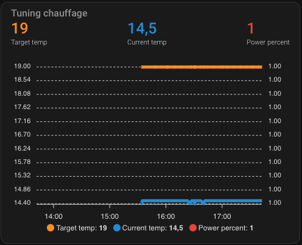
Voir le code de ce composant [[ci-dessous](#even-better-with-apex-chart-to-tune-your-thermostat)]

**Thermostat finement réglé**
Merci [impuR_Shozz](https://forum.hacf.fr/u/impur_shozz/summary) !
On peut voir une stabilité autour de la température cible (consigne) et lorsqu'à cible le on_percent (puissance) est proche de 0,3 ce qui semble une très bonne valeur.


Enjoy !

# Encore mieux

## Bien mieux avec le Versatile Thermostat UI Card
Une carte spéciale pour le Versatile Thermostat a été développée (sur la base du Better Thermostat). Elle est dispo ici [Versatile Thermostat UI Card](https://github.com/jmcollin78/versatile-thermostat-ui-card) et propose une vision moderne de tous les status du VTherm :


## Encore mieux avec le composant Scheduler !

Afin de profiter de toute la puissance du Versatile Thermostat, je vous invite à l'utiliser avec https://github.com/nielsfaber/scheduler-component
En effet, le composant scheduler propose une gestion de la base climatique sur les modes prédéfinis. Cette fonctionnalité a un intérêt limité avec le thermostat générique mais elle devient très puissante avec le thermostat Awesome :

À partir d'ici, je suppose que vous avez installé Awesome Thermostat et Scheduler Component.

Dans Scheduler, ajoutez un planning :


Choisissez le groupe "climat", choisissez une (ou plusieurs) entité(s), sélectionnez "MAKE SCHEME" et cliquez sur suivant :
(il est possible de choisir "SET PRESET", mais je préfère utiliser "MAKE SCHEME")


Définissez votre schéma de mode et enregistrez :


Dans cet exemple, j'ai réglé le mode ECO pendant la nuit et le jour lorsqu'il n'y a personne à la maison BOOST le matin et CONFORT le soir.


J'espère que cet exemple vous aidera, n'hésitez pas à me faire part de vos retours !

## Encore bien mieux avec la custom:simple-thermostat front integration
Le ``custom:simple-thermostat`` [ici](https://github.com/nervetattoo/simple-thermostat) est une excellente intégration qui permet une certaine personnalisation qui s'adapte bien à ce thermostat.
Vous pouvez avoir quelque chose comme ça très facilement 
Exemple de configuration :

```
      type: custom:simple-thermostat
      entity: climate.thermostat_sam2
      layout:
        step: row
      label:
        temperature: T°
        state: Etat
      hide:
        state: false
      control:
        hvac:
          _name: Mode
        preset:
          _name: Preset
      sensors:
        - entity: sensor.total_puissance_radiateur_sam2
          icon: mdi:lightning-bolt-outline
      header:
        toggle:
          entity: input_boolean.etat_ouverture_porte_sam
          name: Porte sam
```

Vous pouvez personnaliser ce composant à l'aide du composant HACS card-mod pour ajuster les couleurs des alertes. Exemple pour afficher en rouge les alertes sécurité et délestage :

```
          card_mod:
            style: |
              
              ha-card .body .sensor-heading ha-icon[icon="mdi:alert-outline"] {
                color: red;
              }
              
              
              ha-card .body .sensor-heading ha-icon[icon="mdi:flash"] {
                color: red;
              }
              
```


## Toujours mieux avec Plotly pour régler votre thermostat
Vous pouvez obtenir une courbe comme celle présentée dans [some results](#some-results) avec une sorte de configuration de graphique Plotly uniquement en utilisant les attributs personnalisés du thermostat décrits [ici](#custom-attributes) :

Remplacez les valeurs entre [[ ]] par les votres.
```
- type: custom:plotly-graph
  entities:
    - entity: '[[climate]]'
      attribute: temperature
      yaxis: y1
      name: Consigne
    - entity: '[[climate]]'
      attribute: current_temperature
      yaxis: y1
      name: T°
    - entity: '[[climate]]'
      attribute: ema_temp
      yaxis: y1
      name: Ema
    - entity: '[[climate]]'
      attribute: regulated_target_temperature
      yaxis: y1
      name: Regulated T°
    - entity: '[[slope]]'
      name: Slope
      fill: tozeroy
      yaxis: y9
      fillcolor: rgba(100, 100, 100, 0.3)
      line:
        color: rgba(100, 100, 100, 0.9)
  hours_to_show: 4
  refresh_interval: 10
  height: 800
  config:
    scrollZoom: true
  layout:
    margin:
      r: 50
    legend:
      x: 0
      'y': 1.2
      groupclick: togglegroup
      title:
        side: top right
    yaxis:
      visible: true
      position: 0
    yaxis9:
      visible: true
      fixedrange: false
      range:
        - -0.5
        - 0.5
      position: 1
    xaxis:
      rangeselector:
        'y': 1.1
        x: 0.7
        buttons:
          - count: 1
            step: hour
          - count: 12
            step: hour
          - count: 1
            step: day
          - count: 7
            step: day
```

Exemple de courbes obtenues avec Plotly :

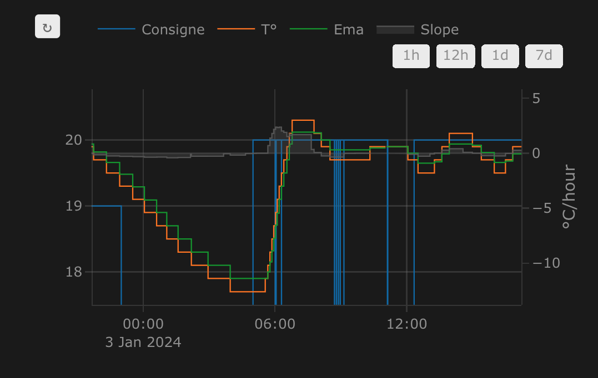

## Et toujours de mieux en mieux avec l'AappDaemon NOTIFIER pour notifier les évènements
Cette automatisation utilise l'excellente App Daemon nommée NOTIFIER développée par Horizon Domotique que vous trouverez en démonstration [ici](https://www.youtube.com/watch?v=chJylIK0ASo&ab_channel=HorizonDomotique) et le code est [ici](https://github.com/jlpouffier/home-assistant-config/blob/master/appdaemon/apps/notifier.py). Elle permet de notifier les utilisateurs du logement lorsqu'un des évènements touchant à la sécurité survient sur un des Versatile Thermostats.

C'est un excellent exemple de l'utilisation des notifications décrites ici [notification](#notifications).

```
alias: Surveillance Mode Sécurité chauffage
description: Envoi une notification si un thermostat passe en mode sécurité ou power
trigger:
  - platform: event
    event_type: versatile_thermostat_security_event
    id: versatile_thermostat_security_event
  - platform: event
    event_type: versatile_thermostat_power_event
    id: versatile_thermostat_power_event
  - platform: event
    event_type: versatile_thermostat_temperature_event
    id: versatile_thermostat_temperature_event
condition: []
action:
  - choose:
      - conditions:
          - condition: trigger
            id: versatile_thermostat_security_event
        sequence:
          - event: NOTIFIER
            event_data:
              action: send_to_jmc
              title: >-
                Radiateur {{ trigger.event.data.name }} - {{
                trigger.event.data.type }} Sécurité
              message: >-
                Le radiateur {{ trigger.event.data.name }} est passé en {{
                trigger.event.data.type }} sécurité car le thermomètre ne répond
                plus.\n{{ trigger.event.data }}
              callback:
                - title: Stopper chauffage
                  event: stopper_chauffage
              image_url: /media/local/alerte-securite.jpg
              click_url: /lovelace-chauffage/4
              icon: mdi:radiator-off
              tag: radiateur_security_alerte
              persistent: true
      - conditions:
          - condition: trigger
            id: versatile_thermostat_power_event
        sequence:
          - event: NOTIFIER
            event_data:
              action: send_to_jmc
              title: >-
                Radiateur {{ trigger.event.data.name }} - {{
                trigger.event.data.type }} Délestage
              message: >-
                Le radiateur {{ trigger.event.data.name }} est passé en {{
                trigger.event.data.type }} délestage car la puissance max est
                dépassée.\n{{ trigger.event.data }}
              callback:
                - title: Stopper chauffage
                  event: stopper_chauffage
              image_url: /media/local/alerte-delestage.jpg
              click_url: /lovelace-chauffage/4
              icon: mdi:radiator-off
              tag: radiateur_power_alerte
              persistent: true
      - conditions:
          - condition: trigger
            id: versatile_thermostat_temperature_event
        sequence:
          - event: NOTIFIER
            event_data:
              action: send_to_jmc
              title: >-
                Le thermomètre du radiateur {{ trigger.event.data.name }} ne
                répond plus
              message: >-
                Le thermomètre du radiateur {{ trigger.event.data.name }} ne
                répond plus depuis longtemps.\n{{ trigger.event.data }}
              image_url: /media/local/thermometre-alerte.jpg
              click_url: /lovelace-chauffage/4
              icon: mdi:radiator-disabled
              tag: radiateur_thermometre_alerte
              persistent: true
mode: queued
max: 30
```


# Les contributions sont les bienvenues !

Si vous souhaitez contribuer, veuillez lire les [directives de contribution](CONTRIBUTING.md)

# Dépannages

<details>
<summary>Utilisation d'un Heatzy</summary>

## Utilisation d'un Heatzy

L'utilisation d'un Heatzy est possible à la condition d'utiliser un switch virtuel sur ce modèle :
```
- platform: template
  switches:
    chauffage_sdb:
      unique_id: chauffage_sdb
      friendly_name: Chauffage salle de bain
      value_template: "{{ is_state_attr('climate.salle_de_bain', 'preset_mode', 'comfort') }}"
      icon_template: >-
        
          mdi:radiator
        
          mdi:snowflake
        
          mdi:radiator-disabled
        
      turn_on:
        service: climate.set_preset_mode
        entity_id: climate.salle_de_bain
        data:
          preset_mode: "comfort"
      turn_off:
        service: climate.set_preset_mode
        entity_id: climate.salle_de_bain
        data:
          preset_mode: "eco"
```
Merci à @gael pour cet exemple.
</details>

<details>
<summary>Utilisation d'un radiateur avec un fil pilote</summary>

## Utilisation d'un radiateur avec un fil pilote
Comme pour le Heatzy ci-dessus vous pouvez utiliser un switch virtuel qui va changer le preset de votre radiateur en fonction de l'état d'allumage du VTherm.
Exemple :
```
- platform: template
  switches:
    radiateur_soan:
        friendly_name: radiateur_soan_inv
        value_template: "{{ is_state('switch.radiateur_soan', 'off') }}"
        turn_on:
          service: switch.turn_off
          data:
            entity_id: switch.radiateur_soan
        turn_off:
          service: switch.turn_on
          data:
            entity_id: switch.radiateur_soan
        icon_template: "mdi:radiator-disabledmdi:radiator"
```

</details>

<details>
<summary>Utilisation d'un radiateur avec un module Nodon</summary>

## Utilisation d'un radiateur avec un fil pilote
Comme pour le Heatzy ci-dessus vous pouvez utiliser un switch virtuel qui va changer le preset de votre radiateur en fonction de l'état d'allumage du VTherm.
Exemple :
```
- platform: template
  switches:
    chauffage_chb_parents:
      unique_id: chauffage_chb_parents
      friendly_name: Chauffage chambre parents
      value_template: "{{ is_state('select.fp_chb_parents_pilot_wire_mode', 'comfort') }}"
      icon_template: >-
        
          mdi:radiator
        
          mdi:snowflake
        
          mdi:radiator-disabled
        
      turn_on:
        service: select.select_option
        target:
          entity_id: select.fp_chb_parents_pilot_wire_mode
        data:
          option: comfort
      turn_off:
        service: select.select_option
        target:
          entity_id: select.fp_chb_parents_pilot_wire_mode
        data:
          option: eco
```

</details>

<details>
<summary>Seul le premier radiateur chauffe</summary>

## Seul le premier radiateur chauffe

En mode `over_switch` si plusieurs radiateurs sont configurés pour un même VTherm, l'alllumage va se faire de façon séquentiel pour lisser au plus possible les pics de consommation.
Cela est tout à fait normal et voulu. C'est décrit ici : [Pour un thermostat de type ```thermostat_over_switch```](#pour-un-thermostat-de-type-thermostat_over_switch)

</details>

<details>
<summary>Le radiateur chauffe alors que la température de consigne est dépassée ou ne chauffe pas alors que la température de la pièce est bien en-dessous de la consigne</summary>

## Le radiateur chauffe alors que la température de consigne est dépassée ou ne chauffe pas alors que la température de la pièce est bien en-dessous de la consigne

### Type `over_switch` ou `over_valve`
Avec un VTherm de type `over_switch` ou `over_valve`, ce défaut montre juste que les paramètres de l'algorithme TPI sont mal réglés. Voir [Algorithme TPI](#algorithme-tpi) pour optimiser les réglages.

### Type `over_climate`
Avec un VTherm de type `over_climate`, la régulation est faite par le `climate` sous-jacent directement et VTherm se contente de lui transmettre les consignes. Donc si le radiateur chauffe alors que la température de consigne est dépassée, c'est certainement que sa mesure de température interne est biaisée. Ca arrive très souvent avec les TRV et les clims réversibles qui ont un capteur de température interne, soit trop près de l'élément de chauffe (donc trop froid l'hiver).

Exemple de discussion autour de ces sujets: [#348](https://github.com/jmcollin78/versatile_thermostat/issues/348), [#316](https://github.com/jmcollin78/versatile_thermostat/issues/316), [#312](https://github.com/jmcollin78/versatile_thermostat/discussions/312), [#278](https://github.com/jmcollin78/versatile_thermostat/discussions/278)

Pour s'en sortir, VTherm est équipé d'une fonction nommée auto-régulation qui permet d'adapter la consigne envoyée au sous-jacent jusqu'à ce que la consigne soit respectée. Cette fonction permet de compenser le biais de mesure des thermomètres internes. Si le biais est important la régulation doit être importante. Voir [L'auto-régulation](#lauto-régulation) pour configurer l'auto-régulation.
</details>

<details>
<summary>Régler les paramètres de détection d'ouverture de fenêtre en mode auto</summary>

## Régler les paramètres de détection d'ouverture de fenêtre en mode auto

Si vous n'arrivez pas à régler la fonction de détection des ouvertures en mode auto (cf. [auto](#le-mode-auto)), vous pouvez essayer de modifier les paramètres de l'algorithme de lissage de la température.
En effet, la détection automatique d'ouverture est basée sur le calcul de la pente de la température (slope). Pour éviter les artefacts due à un capteur de température imprécis, cette pente est calculée sur une température lissée avec un algorithme de lissage nommée Exponential Moving Average (Moyenne mobile exponentielle).
Cet algorithm possède 3 paramètres :
1. `lifecycle_sec` : la durée en secondes prise en compte pour le lissage. Plus elle est forte et plus le lissage sera important mais plus il y aura de délai de détection,
2. `max_alpha` : si deux mesures de température sont éloignées dans le temps, la deuxième aura un poid beaucoup fort. Le paramètre permet de limiter le poid d'une mesure qui arrive bien après la précédente. Cette valeur doit être comprise entre 0 et 1. Plus elle est faible et moins les valeurs éloignées sont prises en compte. La valeur par défaut est de 0,5. Cela fait que lorsqu'une nouvelle valeur de température ne pèsera jamais plus que la moitié de la moyenne mobile,
3. `precision` : le nombre de chiffre après la virgule conservée pour le calcul de la moyenne mobile.

Pour changer ses paramètres, il faut modifier le fichier `configuration.yaml` et ajouter la section suivante (les valeurs sont les valeurs par défaut):
```
versatile_thermostat:
  short_ema_params:
    max_alpha: 0.5
    halflife_sec: 300
    precision: 2
```

Ces paramètres sont sensibles et assez difficiles à régler. Merci de ne les utiliser que si vous savez ce que vous faites et que vos mesures de température ne sont pas déjà lisses.
</details>

<details>
<summary>Pourquoi mon Versatile Thermostat se met en Securite ?</summary>

## Pourquoi mon Versatile Thermostat se met en Securite ?
Le mode sécurité n'est possible que sur les VTherm `over_switch` et `over_valve`. Il survient lorsqu'un des 2 thermomètres qui donne la température de la pièce ou la température extérieure n'a pas envoyé de valeur depuis plus de `security_delay_min` minutes et que le radiateur chauffait à au moins `security_min_on_percent`.

Comme l'algorithme est basé sur les mesures de température, si elles ne sont plus reçues par le VTherm, il y a un risque de surchauffe et d'incendie. Pour éviter ça, lorsque les conditions rappelées ci-dessus sont détectées, la chauffe est limité au paramètre `security_default_on_percent`. Cette valeur doit donc être raisonnablement faible (10% est une bonne valeur). Elle permet d'éviter un incendie tout en évitant de couper totalement le radiateur (risque de gel).

Tous ces paramètres se règlent dans la dernière page de la configuration du VTherm : "Paramètres avancés".

### Comment détecter le mode sécurité ?
Le premier symptôme est une température anormalement basse avec un temps de chauffe faible à chaque cycle et régulier.
Exemple:

[security mode](images/security-mode-symptome1.png)

Si vous avez installé la carte [Versatile Thermostat UI Card](https://github.com/jmcollin78/versatile-thermostat-ui-card), le VTherm en question aura cette forme là :

[security mode UI Card](images/security-mode-symptome2.png)

Vous pouvez aussi vérifier dans les attributs du VTherm les dates de réception des différentes dates. **Les attributs sont disponibles dans les Outils de développement / Etats**.

Exemple :
```
security_state: true
last_temperature_datetime: "2023-12-06T18:43:28.346010+01:00"
last_ext_temperature_datetime: "2023-12-06T13:04:35.164367+01:00"
last_update_datetime: "2023-12-06T18:43:28.351103+01:00"
...
security_delay_min: 60
```

On voit que :
1. le VTherm est bien en mode sécurité (`security_state: true`),
2. l'heure courante est le 06/12/2023 à 18h43:28 (`last_update_datetime: "2023-12-06T18:43:28.351103+01:00"`),
3. l'heure de dernière réception de la température intérieure est le 06/12/2023 à 18h43:28 (`last_temperature_datetime: "2023-12-06T18:43:28.346010+01:00"`). Elle est donc récente,
4. l'heure de dernière réception de la température extérieure est le 06/12/2023 à 13h04:35 (`last_ext_temperature_datetime: "2023-12-06T13:04:35.164367+01:00`). C'est donc l'heure extérieure qui a plus de 5 h de retard et qui a provoquée le passage en mode sécurité, car le seuil est limité à 60 min (`security_delay_min: 60`).

### Comment être averti lorsque cela se produit ?
Pour être averti, le VTherm envoie un évènement dès que ça se produit et un en fin d'alerte sécurité. Vous pouvez capter ces évènements dans une automatisation et envoyer une notification par exemple, faire clignoter un voyant, déclencher une sirène, ... A vous de voir.

Pour manipuler les évènements générés par le VTherm, cf. [Eveènements](#evènements).

### Comment réparer ?
Cela va dépendre de la cause du problème :
1. Si un capteur est en défaut, il faut le réparer (remettre des piles, le changer, vérifier l'intégration Météo qui donne la température extérieure, ...),
2. Si le paramètre `security_delay_min` est trop petit, cela rsique de générer beaucoup de fausses alertes. Une valeur correcte est de l'ordre de 60 min, surtout si vous avez des capteurs de température à pile.
3. Certains capteurs de température, n'envoie pas de mesure si la température n'a pas changée. Donc en cas de température très stable pendant longtemps, le mode sécurité peut se déclencher. Ce n'est pas très grave puisqu'il s'enlève dès que le VTherm reçoit à nouveau une température. Sur certain thermomètre (TuYA par exemple), on peut forcer le délai max entre 2 mesures. Il conviendra de mettre un délai max < `security_delay_min`,
4. Dès que la température sera a nouveau reçue le mode sécurité s'enlèvera et les valeurs précédentes de preset, température cible et mode seront restaurées.
</details>

<details>
<summary>Utilisation d'un groupe de personnes comme capteur de présence</summary>

## Utilisation d'un groupe de personnes comme capteur de présence

Malheureusement, les groupes de personnes ne sont pas reconnus comme des capteurs de présence. On ne peut donc pas les utiliser directement dans VTherm.
Le contournement est de créer un template de binary_sensor avec le code suivant :

Fichier `template.yaml` :
```
- binary_sensor:
    - name: maison_occupee
      unique_id: maison_occupee
      state: "{{is_state('person.person1', 'home') or is_state('person.person2', 'home') or is_state('input_boolean.force_presence', 'on')}}"
      device_class: occupancy
```

Vous noterez dans cet exemple, l'utilisation d'un input_boolean nommé force_presence qui permet de forcer le capteur à `True` et ainsi de forcer les VTherm qui l'utilise avec présence active. Ca permet par exemple, de forcer un pré-chauffage du logement lors du départ du travail, ou lorsqu'une personne non reconnue nativement dans HA est présente.

Fichier `configuration.yaml`:
```
...
template: !include templates.yaml
...
```
</details>

<details>
<summary>Activer les logs du Versatile Thermostat</summary>

## Activer les logs du Versatile Thermostat
Des fois, vous aurez besoin d'activer les logs pour afiner les analyses. Pour cela, éditer le fichier `logger.yaml` de votre configuration et configurer les logs comme suit :
```
default: xxxx
logs:
  custom_components.versatile_thermostat: info
```
Vous devez recharger la configuration yaml (Outils de dev / Yaml / Toute la configuration Yaml) ou redémarrer Home Assistant pour que ce changement soit pris en compte.

</details>

***

[versatile_thermostat]: https://github.com/jmcollin78/versatile_thermostat
[buymecoffee]: https://www.buymeacoffee.com/jmcollin78
[buymecoffeebadge]: https://img.shields.io/badge/Buy%20me%20a%20beer-%245-orange?style=for-the-badge&logo=buy-me-a-beer
[commits-shield]: https://img.shields.io/github/commit-activity/y/jmcollin78/versatile_thermostat.svg?style=for-the-badge
[commits]: https://github.com/jmcollin78/versatile_thermostat/commits/master
[hacs]: https://github.com/custom-components/hacs
[hacs_badge]: https://img.shields.io/badge/HACS-Custom-41BDF5.svg?style=for-the-badge
[forum-shield]: https://img.shields.io/badge/community-forum-brightgreen.svg?style=for-the-badge
[forum]: https://community.home-assistant.io/
[license-shield]: https://img.shields.io/github/license/jmcollin78/versatile_thermostat.svg?style=for-the-badge
[maintenance-shield]: https://img.shields.io/badge/maintainer-Joakim%20Sørensen%20%40ludeeus-blue.svg?style=for-the-badge
[releases-shield]: https://img.shields.io/github/release/jmcollin78/versatile_thermostat.svg?style=for-the-badge
[releases]: https://github.com/jmcollin78/versatile_thermostat/releases
