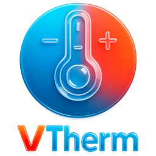
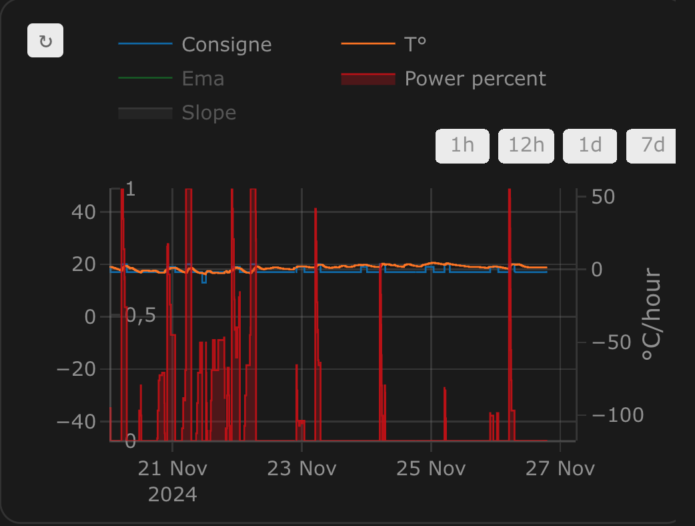
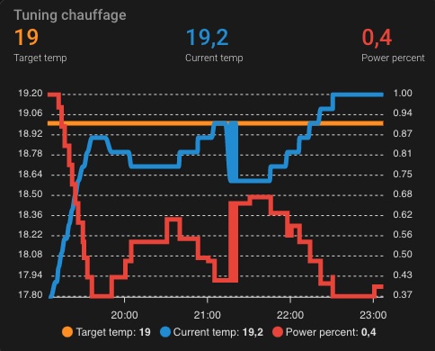
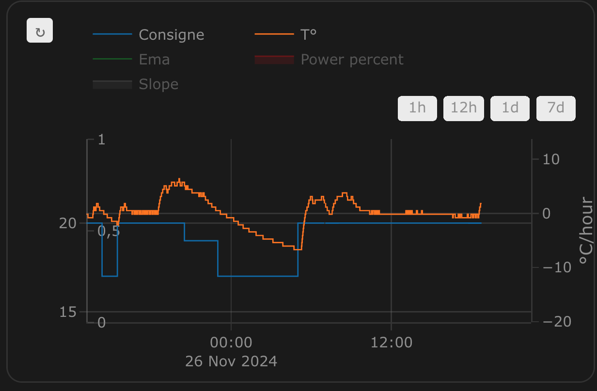
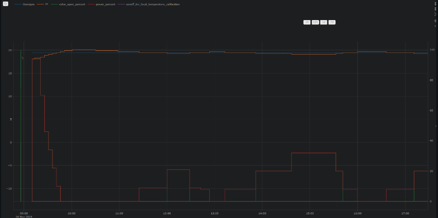

[![GitHub Release][releases-shield]][releases]
[![GitHub Activity][commits-shield]][commits]
[![License][license-shield]](LICENSE)
[![hacs][hacs_badge]][hacs]
[![BuyMeCoffee][buymecoffeebadge]][buymecoffee]

[En](README.md)|[Fr](README-fr.md)

>  Cette intégration de thermostat vise à simplifier considérablement vos automatisations autour de la gestion du chauffage. Parce que tous les événements autour du chauffage classiques sont gérés nativement par le thermostat (personne à la maison ?, activité détectée dans une pièce ?, fenêtre ouverte ?, délestage de puissance ?), vous n'avez pas à vous encombrer de scripts et d'automatismes compliqués pour gérer vos thermostats. ;-).

Ce composant personnalisé pour Home Assistant est une mise à niveau et une réécriture complète du composant "Awesome thermostat" (voir [Github](https://github.com/dadge/awesome_thermostat)) avec l'ajout de fonctionnalités.

# Quoi de neuf ?

> * **Release 7.2**:
>
> - Prise en compte native des équipements pilotable via une entité de type `select` (ou `input_select`) ou `climate` pour des _VTherm_ de type `over_switch`. Cette évolution rend obsolète, la création de switch virtuels pour l'intégration des Nodon ou Heaty ou eCosy ... etc. Plus d'informations [ici](documentation/fr/over-switch.md#la-personnalisation-des-commandes).
>
> - Lien vers la documentation : cette version 7.2 expérimente des liens vers la documentation depuis les pages de configuration. Le lien est accessible via l'icone . Elle est expérimentée sur certaines pages de la configuration.
>
> - Ajout d'un chapitre dans la documentation nommé 'Démarrage rapide' permettant de mettre en oeuvre rapidement un _VTherm_ en fonction de votre équipement. La page est [ici](documentation/quick-start.md)

# 🍻 Merci pour les bières [buymecoffee](https://www.buymeacoffee.com/jmcollin78) 🍻
Un grand merci à tous mes fournisseurs de bières pour leurs dons et leurs encouragments. Ca me fait très plaisir et ça m'encourage à continuer ! Si cette intégration vous a fait économiser, payez moi une p'tite bière en retour, j'en vous en serais très reconnaissant !

# Glossaire

  _VTherm_ : Versatile Thermostat dans la suite de ce document

  _TRV_ : tête thermostatique équipée d'une vanne. La vanne s'ouvre ou se ferme permettant le passage de l'eau chaude

  _AC_ : Air conditionné. Un équipement est AC si il fait du froid. Les températures sont alors inversées : Eco est plus chaud que Confort qui est plus chaud que Boost. Les algorithmes tiennent compte de cette information.

  _EMA_ : Exponential Moving Average. Utilisé pour lisser les mesures de températures de capteur. Elle correspond à une moyenne glissante de la température de la pièce. Elle est utilisée pour calculer la pente de la courbe de température (slope) qui serait trop instable sur la courbe brute.

  _slope_ : la pente de la courbe de température. Elle est mesurée en °(C ou K)/h. Elle est positive si la température augmente et négative si elle diminue. Cette pente est calculée sur l'_EMA_

  _PAC_ : Pompe à chaleur

  _HA_ : Home Assistant

  _sous-jacent_ : l'équipement controlé par _VTherm_

# Documentation

La documentation est maintenant découpée en plusieurs pages pour faciliter la lecture et la recherche d'informations :
1. [présentation](documentation/fr/presentation.md),
2. [Installation](documentation/fr/installation.md),
3. [Démarrage rapide](documentation/fr/quick-start.md)
4. [choisir un type de VTherm](documentation/fr/creation.md),
5. [les attributs de base](documentation/fr/base-attributes.md)
6. [configurer un VTherm sur un `switch`](documentation/fr/over-switch.md)
7. [configurer un VTherm sur un `climate`](documentation/fr/over-climate.md)
8. [configurer un VTherm sur une vanne](documentation/fr/over-valve.md)
9. [les pré-régages (preset)](documentation/fr/feature-presets.md)
10. [la gestion des ouvertures](documentation/fr/feature-window.md)
11. [la gestion de la présence](documentation/fr/feature-presence.md)
12. [la gestion de mouvement](documentation/fr/feature-motion.md)
13. [la gestion de la puissance](documentation/fr/feature-power.md)
14. [l'auto start and stop](documentation/fr/feature-auto-start-stop.md)
15. [la contrôle centralisé de tous vos VTherms](documentation/fr/feature-central-mode.md)
16. [la commande du chauffage central](documentation/fr/feature-central-boiler.md)
17. [aspects avancés, mode sécurité](documentation/fr/feature-advanced.md)
18. [l'auto-régulation](documentation/fr/self-regulation.md)
19. [exemples de réglages](documentation/fr/tuning-examples.md)
20. [les différents algorithmes](documentation/fr/algorithms.md)
21. [documentation de référence](documentation/fr/reference.md)
22. [exemple de réglages](documentation/fr/tuning-examples.md)
23. [dépannage](documentation/fr/troubleshooting.md)
24. [notes de version](documentation/fr/releases.md)

# Quelques résultats

**Stabilité de la température autour de la cible configurée par preset:**

Cycle de marche/arrêt calculé par l'intégration (`over_climate`):

**Régulation avec un `over_switch`**

Voir le code de ce composant [[ci-dessous](#even-better-with-apex-chart-to-tune-your-thermostat)]

**Regulation forte en `over_climate`**

**Regulation avec contrôle direct de la vanne en `over_climate`**

Enjoy !

# Les contributions sont les bienvenues !

Si vous souhaitez contribuer, veuillez lire les [directives de contribution](CONTRIBUTING.md)

***

[versatile_thermostat]: https://github.com/jmcollin78/versatile_thermostat
[buymecoffee]: https://www.buymeacoffee.com/jmcollin78
[buymecoffeebadge]: https://img.shields.io/badge/Buy%20me%20a%20beer-%245-orange?style=for-the-badge&logo=buy-me-a-beer
[commits-shield]: https://img.shields.io/github/commit-activity/y/jmcollin78/versatile_thermostat.svg?style=for-the-badge
[commits]: https://github.com/jmcollin78/versatile_thermostat/commits/master
[hacs]: https://github.com/custom-components/hacs
[hacs_badge]: https://img.shields.io/badge/HACS-Custom-41BDF5.svg?style=for-the-badge
[forum-shield]: https://img.shields.io/badge/community-forum-brightgreen.svg?style=for-the-badge
[forum]: https://community.home-assistant.io/
[license-shield]: https://img.shields.io/github/license/jmcollin78/versatile_thermostat.svg?style=for-the-badge
[maintenance-shield]: https://img.shields.io/badge/maintainer-Joakim%20Sørensen%20%40ludeeus-blue.svg?style=for-the-badge
[releases-shield]: https://img.shields.io/github/release/jmcollin78/versatile_thermostat.svg?style=for-the-badge
[releases]: https://github.com/jmcollin78/versatile_thermostat/releases
