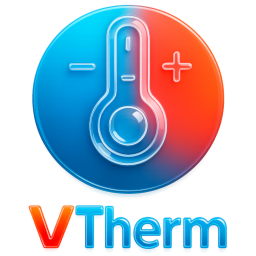
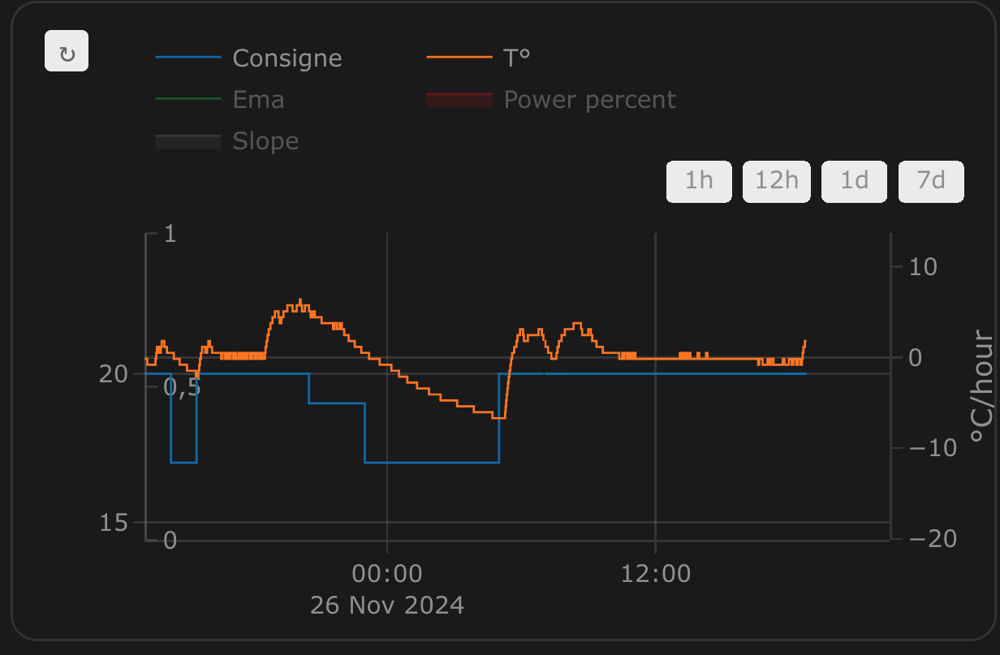

[![GitHub Release][releases-shield]][releases]
[![GitHub Activity][commits-shield]][commits]
[![License][license-shield]](LICENSE)
[![hacs][hacs_badge]][hacs]
[![BuyMeCoffee][buymecoffeebadge]][buymecoffee]

# Versatile Thermostat

Ce fichier README est disponible en
[Anglais](README.md) | [Français](README-fr.md) | [Allemand](README-de.md) | [Czech](README-cs.md) | [Polski](README-pl.md)

>  **Versatile Thermostat** est un thermostat virtuel hautement configurable qui transforme n'importe quel équipement de chauffage (radiateurs, climatiseurs, pompes à chaleur, etc.) en un système intelligent et adaptatif. Il vous permet de consolider et de contrôler centralement plusieurs systèmes de chauffage différents, tout en optimisant automatiquement votre consommation d'énergie. Grâce à ses algorithmes avancés (TPI, auto-TPI) et ses capacités d'apprentissage, le thermostat s'adapte à votre maison 🏠 et à vos habitudes, vous apportant confort optimal et réduction significative de vos factures de chauffage 💰.
> Cette intégration de thermostat vise à simplifier considérablement vos automatisations autour de la gestion du chauffage. Parce que tous les événements autour du chauffage classiques sont gérés nativement par le thermostat (personne à la maison ?, activité détectée dans une pièce ?, fenêtre ouverte ?, délestage de puissance ?), vous n'avez pas à vous encombrer de scripts et d'automatismes compliqués pour gérer vos thermostats. 😉

# Documentation

L'ensemble de la documentation est disponible sur le [Versatile Thermostat Web site](https://www.versatile-thermostat.org/).

# Captures d'écran

Le composant Versatile Thermostat UI Card (Disponible sur [Github](https://github.com/jmcollin78/versatile-thermostat-ui-card)) :

 

# Quoi de neuf ?

## Release 9.3
> 1. **Diagnostic des vannes bloquées** : Amélioration majeure de la détection d'anomalie de chauffe. Lorsqu'une anomalie est détectée sur les VTherms de type `over_climate_valve`, le thermostat diagnostique maintenant si le problème est causé par une vanne TRV bloquée (bloquée ouverte ou fermée) en comparant l'état commandé avec l'état réel. Cette information - `root_cause` - est envoyée dans l'événement d'anomalie, vous permettant de prendre les actions appropriées (notification, relance de la vanne, etc.). Plus d'informations [ici](documentation/fr/feature-heating-failure-detection.md),
> 2. **Relockage automatique du verrou** : Ajout du paramètre `auto_relock_sec` à la fonctionnalité de verrouillage. Lorsque configuré, le thermostat se relockera automatiquement après le délai spécifié (en secondes) suivant un déverrouillage. Vous pouvez complètement désactiver cette fonctionnalité en le mettant à 0. Par défaut, le relockage automatique est configuré à 30 secondes pour améliorer la sécurité. Plus d'informations [ici](documentation/fr/feature-lock.md),
> 3. **Re-émission des commandes** : Nouvelle fonctionnalité permettant de détecter et corriger automatiquement les discrepancies entre l'état désiré du thermostat et l'état réel des équipements sous-jacents. Si une commande n'a pas été correctement appliquée à l'équipement, elle est renvoyée. Cela améliore la fiabilité du système en les environnements instables ou avec des équipements non fiables. Plus d'informations [ici](documentation/fr/feature-advanced.md),
> 4. **Restoration du preset temporisé après redémarrage** : Le preset temporisé configuré est maintenant correctement restauré après un redémarrage du thermostat ou d'Home Assistant. Ce preset continue de fonctionner normalement après le redémarrage. Plus d'informations [ici](documentation/fr/feature-timed-preset.md),
> 5. **Précision accrue du contrôle de puissance** : Le seuil d'activation de la chaudière (`power_activation_threshold`) accepte maintenant des valeurs décimales (0.1, 0.5, etc.) pour un contrôle plus fin de la puissance d'activation. Cela offre une meilleure flexibilité pour optimiser votre consommation d'énergie. Plus d'informations [ici](documentation/fr/feature-power.md),
> 6. **Améliorations de disponibilité des capteurs** : Meilleur support de la détermination de la disponibilité des capteurs de température en utilisant la métadonnée `last_updated` de Home Assistant, améliorant ainsi la détection de la perte de signal des capteurs,

## Release 9.2 - version stable
> 1. Nouvelle façon de gérer les cycles de chauffe/arrêt pour les VTherm `over_switch`. L'algorithme actuel a une dérive dans le temps et les premiers cycles ne sont pas optimum. Ca perturbe le TPI et notamment l'auto-TPI. Le nouveau `Cycle Scheduler` résoud ces difficultés. Cette modification est totalement transparente pour vous,
> 2. Un collecteur de logs. Vos demandes de support échouent souvent sur votre capacité à fournir des logs, sur la bonne période, ciblé sur le thermostat en erreur et au bon niveau de log. C'est particulièrement le cas des bugs difficilement reproductible. Le collecteur de logs vise à résoudre cette difficulté. Il collecte les logs pour vous en arrière plan dans le niveau le plus fin et une action (anciennement service) permet de les extraire dans un fichier. Vous pouvez alors les télécharger pour les joindre à votre demande de support. L'analyseur de logs associé au site web - lancé en 9.1 cf. ci-dessous - s'adapte pour être capable de digérer ces logs. Plus d'informations sur le collecteur de logs [ici](documentation/fr/feature-logs-collector.md),
> 3. stabilisation de la 9.x. La version majeure 9 a amené beaucoup de changement qui ont générés quelques anomalies. Cette version apporte les dernières corrections liées à cette version 9.

## Release 9.1
> 1. Nouveau logo . Inspiré par les travaux de @Krzysztonek (voir [ici](https://github.com/jmcollin78/versatile_thermostat/pull/1598)), VTherm profite d'une nouvelle fonction de [HA 206.03](https://developers.home-assistant.io/blog/2026/02/24/brands-proxy-api/) pour changer de logo. Toute l'équipe espère qu'il vous plaira. Enjoy !
> 2. Un site web réalisé par @bontiv va résoudre une des difficulté majeure de VTherm : la documentation. Ce site permet en plus d'analyser vos logs ! Donnez lui vos logs (en mode debug) et vous pourrez les analyser, zoomer sur un thermostat, sur une période, filter ce qui vous intéresse, ... Je vous laisse découvrir ce site en 1ère version : [Versatile Thermostat Web site](https://www.versatile-thermostat.org/). Un énorme merci à @bontiv pour cette belle réalisation.
> 3. La publication en version officielle de l'auto-TPI. Cette fonction permet de déterminer par le calcul les meilleurs valeurs des coefficients du [TPI](documentation/fr/algorithms.md#lalgorithme-tpi). On peut saluer le travail incroyable de @KipK et de @gael1980 sur ce sujet. Ne faites pas l'économie de lire la documentation si vous souhaitez l'utiliser.
> 4. VTherm se repose maintenant sur l'état remonté par équipements sous-jacents dans HA. Tant que tous les sous-jacents n'ont pas d'état connu dans HA, alors le VTherm est désactivé.

L'historique des releases est accessible [ici](documentation/fr/releases.md)

# 🍻 Merci pour les bières 🍻

Un grand merci à tous mes fournisseurs de bières pour leurs dons et leurs encouragments. Ca me fait très plaisir et ça m'encourage à continuer ! Si cette intégration vous a fait économiser, payez moi une p'tite bière en retour, j'en vous en serais très reconnaissant !

# Glossaire

  `VTherm` : Versatile Thermostat dans la suite de ce document

  `TRV` : tête thermostatique équipée d'une vanne. La vanne s'ouvre ou se ferme permettant le passage de l'eau chaude

  `AC` : Air conditionné. Un équipement est AC si il fait du froid. Les températures sont alors inversées : Eco est plus chaud que Confort qui est plus chaud que Boost. Les algorithmes tiennent compte de cette information.

  `EMA` : Exponential Moving Average. Utilisé pour lisser les mesures de températures de capteur. Elle correspond à une moyenne glissante de la température de la pièce. Elle est utilisée pour calculer la pente de la courbe de température (slope) qui serait trop instable sur la courbe brute.

  `slope` : la pente de la courbe de température. Elle est mesurée en °(C ou K)/h. Elle est positive si la température augmente et négative si elle diminue. Cette pente est calculée sur l'`EMA`

  `PAC` : Pompe à chaleur

  `HA` : Home Assistant

  `sous-jacent` : l'équipement controlé par `VTherm`

# Documentation

La documentation est maintenant découpée en plusieurs pages pour faciliter la lecture et la recherche d'informations :
1. [Présentation](documentation/fr/presentation.md)
2. [Installation](documentation/fr/installation.md)
3. [Démarrage rapide](documentation/fr/quick-start.md)
4. [Choisir un type de VTherm](documentation/fr/creation.md)
5. [Les attributs de base](documentation/fr/base-attributes.md)
6. [Configurer un VTherm sur un `switch`](documentation/fr/over-switch.md)
7. [Configurer un VTherm sur un `climate`](documentation/fr/over-climate.md)
8. [Configurer un VTherm sur une vanne](documentation/fr/over-valve.md)
9. [Les pré-régages (preset)](documentation/fr/feature-presets.md)
10. [La gestion des ouvertures](documentation/fr/feature-window.md)
11. [La gestion de la présence](documentation/fr/feature-presence.md)
12. [La gestion de mouvement](documentation/fr/feature-motion.md)
13. [La gestion de la puissance](documentation/fr/feature-power.md)
14. [L'auto start and stop](documentation/fr/feature-auto-start-stop.md)
15. [La contrôle centralisé de tous vos VTherms](documentation/fr/feature-central-mode.md)
16. [La commande du chauffage central](documentation/fr/feature-central-boiler.md)
17. [Aspects avancés, mode sécurité](documentation/fr/feature-advanced.md)
18. [Détection d'anomalie de chauffe](documentation/fr/feature-heating-failure-detection.md)
19. [L'auto-régulation](documentation/fr/self-regulation.md)
20. [L'apprentissage Auto TPI](documentation/fr/feature-autotpi.md)
21. [Verrouillage / Déverrouillage](documentation/fr/feature-lock.md)
22. [Synchronisation des température](documentation/fr/feature-sync_device_temp.md)
23. [Preset temporisé](documentation/fr/feature-timed-preset.md)
24. [Exemple de réglages](documentation/fr/tuning-examples.md)
25. [Les algorithmes](documentation/fr/algorithms.md)
26. [Documentation de référence](documentation/fr/reference.md)
27. [Dépannage](documentation/fr/troubleshooting.md)
28. [Notes de version](documentation/fr/releases.md)

# Quelques résultats

**Stabilité de la température autour de la cible configurée par preset:** :

**Cycle de marche/arrêt calculé par l'intégration `over_climate`** :

**Régulation avec un `over_switch`** :

**Regulation forte en `over_climate`** :

**Regulation avec contrôle direct de la vanne en `over_climate`** :

# Quelques commentaires sur l'intégration
|                                             |                                             |                                             |
| ------------------------------------------- | ------------------------------------------- | ------------------------------------------- |
|  |  |  |
|  |  |  |

Enjoy !

# ⭐ Star history

# Les contributions sont les bienvenues !

Si vous souhaitez contribuer, veuillez lire les [directives de contribution](CONTRIBUTING.md)

***

[versatile_thermostat]: https://github.com/jmcollin78/versatile_thermostat
[buymecoffee]: https://www.buymeacoffee.com/jmcollin78
[buymecoffeebadge]: https://img.shields.io/badge/Buy%20me%20a%20beer-%245-orange?style=for-the-badge&logo=buy-me-a-beer
[commits-shield]: https://img.shields.io/github/commit-activity/y/jmcollin78/versatile_thermostat.svg?style=for-the-badge
[commits]: https://github.com/jmcollin78/versatile_thermostat/commits/master
[hacs]: https://github.com/custom-components/hacs
[hacs_badge]: https://img.shields.io/badge/HACS-Custom-41BDF5.svg?style=for-the-badge
[forum-shield]: https://img.shields.io/badge/community-forum-brightgreen.svg?style=for-the-badge
[forum]: https://community.home-assistant.io/
[license-shield]: https://img.shields.io/github/license/jmcollin78/versatile_thermostat.svg?style=for-the-badge
[maintenance-shield]: https://img.shields.io/badge/maintainer-Joakim%20Sørensen%20%40ludeeus-blue.svg?style=for-the-badge
[releases-shield]: https://img.shields.io/github/release/jmcollin78/versatile_thermostat.svg?style=for-the-badge
[releases]: https://github.com/jmcollin78/versatile_thermostat/releases
