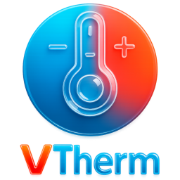
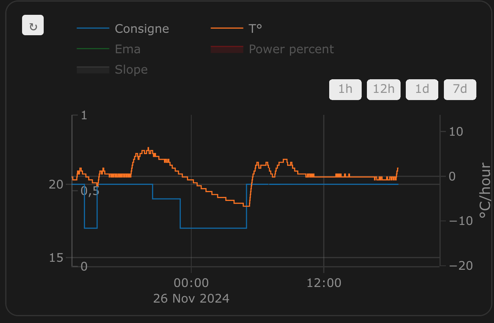
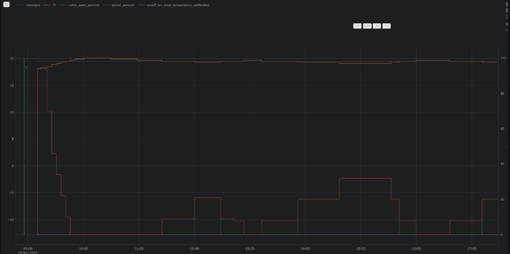

[![GitHub Release][releases-shield]][releases]
[![GitHub Activity][commits-shield]][commits]
[![License][license-shield]](LICENSE)
[![hacs][hacs_badge]][hacs]
[![BuyMeCoffee][buymecoffeebadge]][buymecoffee]

# Versatile Thermostat

Ce fichier README est disponible en
[Anglais](README.md) | [Français](README-fr.md) | [Allemand](README-de.md) | [Czech](README-cs.md) | [Polski](README-pl.md)

>  **Versatile Thermostat** est un thermostat virtuel hautement configurable qui transforme n'importe quel équipement de chauffage (radiateurs, climatiseurs, pompes à chaleur, etc.) en un système intelligent et adaptatif. Il vous permet de consolider et de contrôler centralement plusieurs systèmes de chauffage différents, tout en optimisant automatiquement votre consommation d'énergie. Grâce à ses algorithmes avancés (TPI, auto-TPI) et ses capacités d'apprentissage, le thermostat s'adapte à votre maison 🏠 et à vos habitudes, vous apportant confort optimal et réduction significative de vos factures de chauffage 💰.
> Cette intégration de thermostat vise à simplifier considérablement vos automatisations autour de la gestion du chauffage. Parce que tous les événements autour du chauffage classiques sont gérés nativement par le thermostat (personne à la maison ?, activité détectée dans une pièce ?, fenêtre ouverte ?, délestage de puissance ?), vous n'avez pas à vous encombrer de scripts et d'automatismes compliqués pour gérer vos thermostats. 😉

# Documentation

L'ensemble de la documentation est disponible sur le [Versatile Thermostat Web site](https://www.versatile-thermostat.org/).

# Captures d'écran

Le composant Versatile Thermostat UI Card (Disponible sur [Github](https://github.com/jmcollin78/versatile-thermostat-ui-card)) :

 

# Quoi de neuf ?

## Release 10.4.0
VTherm peut désormais exposer `current_humidity` depuis un capteur d’humidité externe pour tous les types de thermostats. Le capteur se sélectionne dans le menu Humidité ou est détecté automatiquement sur l’appareil du capteur de température ambiante.

Les thermostats `over_valve` ont maintenant les mêmes paramètres de controle de la vanne que les `over_climate` avec régulation par contrôle direct de la vanne. Il s'agit des paramètres `opening_threshold_degree`, `min_opening_degrees`, `max_closing_degree` et `max_opening_degrees`. Plus d'informations ici: [contrôle de la vanne](documentation/fr/over_valve.md)

Les thermostats `over_valve` prennent également en charge le mode sommeil. Le sommeil affiche le VTherm comme arrêté et envoie une demande brute d'ouverture à 100 % sans solliciter la chaudière centrale. Les limites configurées du contrôle de vanne peuvent plafonner l'ouverture physique. Plus d'informations : [mode sommeil](documentation/fr/over-valve.md#mode-sommeil).

## Release 10.3.0
Vous pouvez maintenant spécifier les unités de puissance. Les écrans de configuration proposent une unité pour les mesures de puissance (W par défaut). Les unités d'énergie calculées sont alignées avec l'unité de puissance configurée. Les entités existantes sont migrées en fonction de leur valeur historique de puissance : au-delà de 100, la valeur est considérée en W, sinon en kW.

⚠️ Changement important dans les statistiques
Vous pourrez voir apparaître des messages de réparation comme : `L'unité de « Central configuration Total power active for boiler » (sensor.total_power_active_for_boiler) a été modifiée en « kW »`, ou des messages similaires dans les logs. C'est normal car auparavant, l'unité n'était pas précisée. Vous pouvez choisir l'action de réparation `Mettre à jour l'unité des statistiques à long terme` pour corriger les statistiques.

## Release 10.2.0
Intégration de la fonctionnalité **Auto Fan** sous forme de plugin externe ([vtherm_auto_fan_extended](https://github.com/jmcollin78/vtherm_auto_fan_extended)). La version d'origine (_legacy_) de l'auto-fan reste toujours disponible dans _VTherm_, mais elle doit être désactivée dans la configuration du thermostat pour pouvoir utiliser le plugin. Retrouvez la documentation complète sur le [dépôt GitHub du plugin](https://github.com/jmcollin78/vtherm_auto_fan_extended).

## Release 10.1
Choix du mode d'arrêt de l'auto-start/stop. Une nouvelle entité `select` permet de choisir le mode appliqué lorsque la fonction auto-start/stop détecte une condition d'arrêt : `Arrêt` (par défaut), `Ventilation seule` ou `Déshumidification`. Les modes `Ventilation seule` et `Déshumidification` ne sont proposés que si l'équipement sous-jacent les supporte. Plus d'informations [ici](documentation/fr/feature-auto-start-stop.md).

L'auto-régulation est désormais désactivée lorsqu'un _VTherm_ de type `over_climate` n'est pas en mode `Chauffage` ou `Refroidissement` : la consigne d'origine (non régulée) est envoyée à l'équipement sous-jacent. Plus d'informations [ici](documentation/fr/self-regulation.md).

## Release 10.0
Introduction du mécanisme de plugin. Cela va permettre d'utiliser des intégrations externes comme des plugins à _VTherm_. La liste des plugins disponibles est sur le [Versatile Thermostat Web site](https://www.versatile-thermostat.org/fr/plugins).

L'historique des releases est accessible [ici](documentation/fr/releases.md)

# 🍻 Merci pour les bières 🍻

Un grand merci à tous mes fournisseurs de bières pour leurs dons et leurs encouragments. Ca me fait très plaisir et ça m'encourage à continuer ! Si cette intégration vous a fait économiser, payez moi une p'tite bière en retour, j'en vous en serais très reconnaissant !

# Glossaire

  `VTherm` : Versatile Thermostat dans la suite de ce document

  `TRV` : tête thermostatique équipée d'une vanne. La vanne s'ouvre ou se ferme permettant le passage de l'eau chaude

  `AC` : Air conditionné. Un équipement est AC si il fait du froid. Les températures sont alors inversées : Eco est plus chaud que Confort qui est plus chaud que Boost. Les algorithmes tiennent compte de cette information.

  `EMA` : Exponential Moving Average. Utilisé pour lisser les mesures de températures de capteur. Elle correspond à une moyenne glissante de la température de la pièce. Elle est utilisée pour calculer la pente de la courbe de température (slope) qui serait trop instable sur la courbe brute.

  `slope` : la pente de la courbe de température. Elle est mesurée en °(C ou K)/h. Elle est positive si la température augmente et négative si elle diminue. Cette pente est calculée sur l'`EMA`

  `PAC` : Pompe à chaleur

  `HA` : Home Assistant

  `sous-jacent` : l'équipement controlé par `VTherm`

# Documentation

La documentation est maintenant découpée en plusieurs pages pour faciliter la lecture et la recherche d'informations :
1. [Présentation](documentation/fr/presentation.md)
2. [Installation](documentation/fr/installation.md)
3. [Démarrage rapide](documentation/fr/quick-start.md)
4. [Choisir un type de VTherm](documentation/fr/creation.md)
5. [Les attributs de base](documentation/fr/base-attributes.md)
6. [Configurer un VTherm sur un `switch`](documentation/fr/over-switch.md)
7. [Configurer un VTherm sur un `climate`](documentation/fr/over-climate.md)
8. [Configurer un VTherm sur une vanne](documentation/fr/over-valve.md)
9. [Les pré-régages (preset)](documentation/fr/feature-presets.md)
10. [La gestion des ouvertures](documentation/fr/feature-window.md)
11. [La gestion de la présence](documentation/fr/feature-presence.md)
12. [La gestion de mouvement](documentation/fr/feature-motion.md)
13. [La gestion de la puissance](documentation/fr/feature-power.md)
14. [L'auto start and stop](documentation/fr/feature-auto-start-stop.md)
15. [La contrôle centralisé de tous vos VTherms](documentation/fr/feature-central-mode.md)
16. [La commande du chauffage central](documentation/fr/feature-central-boiler.md)
17. [Aspects avancés, mode sécurité](documentation/fr/feature-advanced.md)
18. [Détection d'anomalie de chauffe](documentation/fr/feature-heating-failure-detection.md)
19. [L'auto-régulation](documentation/fr/self-regulation.md)
20. [L'apprentissage Auto TPI](documentation/fr/feature-autotpi.md)
21. [Verrouillage / Déverrouillage](documentation/fr/feature-lock.md)
22. [Synchronisation des température](documentation/fr/feature-sync_device_temp.md)
23. [Preset temporisé](documentation/fr/feature-timed-preset.md)
24. [Exemple de réglages](documentation/fr/tuning-examples.md)
25. [Les algorithmes](documentation/fr/algorithms.md)
26. [Documentation de référence](documentation/fr/reference.md)
27. [Dépannage](documentation/fr/troubleshooting.md)
28. [Notes de version](documentation/fr/releases.md)

# Quelques résultats

**Stabilité de la température autour de la cible configurée par preset:** :

**Cycle de marche/arrêt calculé par l'intégration `over_climate`** :

**Régulation avec un `over_switch`** :

**Regulation forte en `over_climate`** :

**Regulation avec contrôle direct de la vanne en `over_climate`** :

# Quelques commentaires sur l'intégration
|                                             |                                             |                                             |
| ------------------------------------------- | ------------------------------------------- | ------------------------------------------- |
|  |  |  |
|  |  |  |

Enjoy !

# ⭐ Star history

# Les contributions sont les bienvenues !

Si vous souhaitez contribuer, veuillez lire les [directives de contribution](CONTRIBUTING.md)

***

[versatile_thermostat]: https://github.com/jmcollin78/versatile_thermostat
[buymecoffee]: https://www.buymeacoffee.com/jmcollin78
[buymecoffeebadge]: https://img.shields.io/badge/Buy%20me%20a%20beer-%245-orange?style=for-the-badge&logo=buy-me-a-beer
[commits-shield]: https://img.shields.io/github/commit-activity/y/jmcollin78/versatile_thermostat.svg?style=for-the-badge
[commits]: https://github.com/jmcollin78/versatile_thermostat/commits/master
[hacs]: https://github.com/custom-components/hacs
[hacs_badge]: https://img.shields.io/badge/HACS-Custom-41BDF5.svg?style=for-the-badge
[forum-shield]: https://img.shields.io/badge/community-forum-brightgreen.svg?style=for-the-badge
[forum]: https://community.home-assistant.io/
[license-shield]: https://img.shields.io/github/license/jmcollin78/versatile_thermostat.svg?style=for-the-badge
[maintenance-shield]: https://img.shields.io/badge/maintainer-Joakim%20Sørensen%20%40ludeeus-blue.svg?style=for-the-badge
[releases-shield]: https://img.shields.io/github/release/jmcollin78/versatile_thermostat.svg?style=for-the-badge
[releases]: https://github.com/jmcollin78/versatile_thermostat/releases
