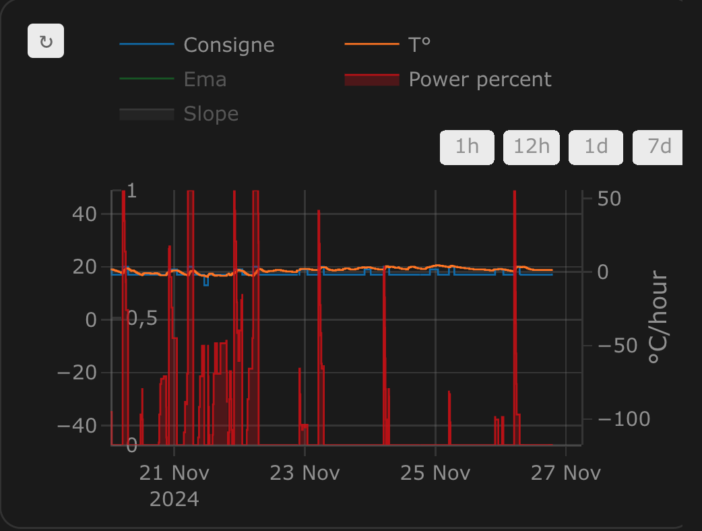
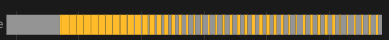
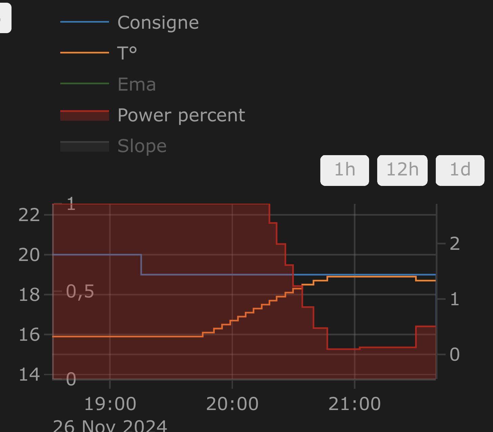
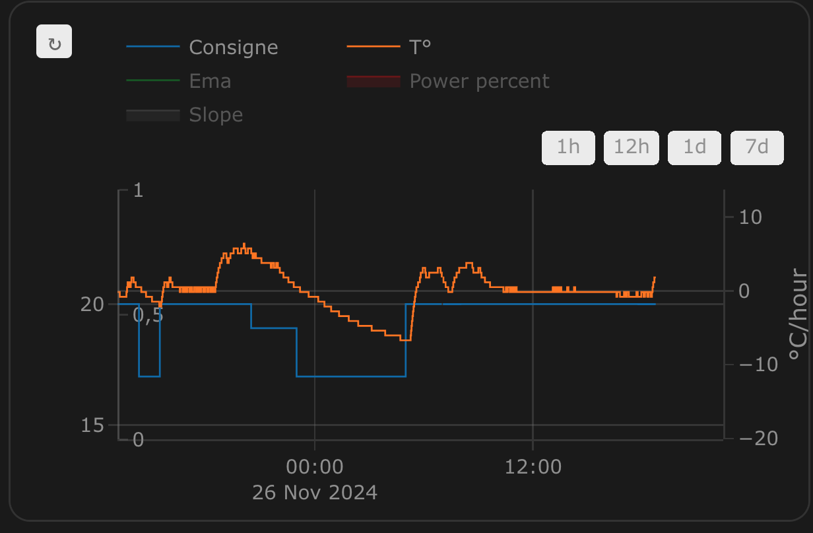

[![GitHub Release][releases-shield]][releases]
[![GitHub Activity][commits-shield]][commits]
[![License][license-shield]](LICENSE)
[![hacs][hacs_badge]][hacs]
[![BuyMeCoffee][buymecoffeebadge]][buymecoffee]

# Versatile Thermostat - Wszechstronny Termostat

Ten plik README jest dostępny
w językach : [Angielski](README.md) | [Francuski](README-fr.md) | [Niemiecki](README-de.md) | [Czeski](README-cs.md) | [Polski](README-pl.md)

 

>  Ta integracja ma na celu znaczne uproszczenie automatyzacji zarządzania ogrzewaniem. Ponieważ wszystkie typowe zdarzenia związane z ogrzewaniem (obecność w domu, wykrycie aktywności w pomieszczeniu, otwarte okno, wyłączenie zasilania, itp.) są natywnie zarządzane przez termostat, nie musisz zajmować się skomplikowanymi skryptami i automatyzacjami, aby zarządzać termostatami. ;-).

Ten niestandardowy komponent Home Assistanta jest ulepszoną i napisaną całkowicie od nowa wersją komponentu „Awesome Thermostat” (patrz: [Github](https://github.com/dadge/awesome_thermostat)) z dodatkowymi funkcjami.

# Zrzuty ekranowe

Karta integracji Versatile Thermostat UI (dostępna na [Github](https://github.com/jmcollin78/versatile-thermostat-ui-card)) :

 

# Co nowego?

> * <u>**Wydanie 7.4**:</u>
>
> - Dodano progi załączania i wyłączania algorytmu TPI, gdy temperatura przekroczy zadaną wartość. Zapobiega to włączaniu i wyłączaniu się grzejnika na krótkie okresy. Idealne rozwiązanie do pieców opalanych drewnem, które długo się nagrzewają. Patrz [TPI](documentation/en/algorithms.md#the-tpi-algorithm),
>
> - Dodano tryb uśpienia dla termostatów typu `Termostat na Klimacie` z regulacją poprzez bezpośrednie sterowanie zaworem. Ten tryb umożliwia ustawienie termostatu w trybie wyłączonym, ale z zaworem otwartym w 100%-ach. Jest to przydatne podczas długich okresów bez ogrzewania, gdy kocioł od czasu do czasu cyrkuluje wodę. Uwaga: aby wyświetlić ten nowy tryb, należy zaktualizować kartę interfejsu użytkownika. Patrz [VTherm UI Card](documentation/en/additions.md#versatile-thermostat-ui-card).
>
> * <u>**Wydanie 7.2**:</u>
>
> - Natywna obsługa urządzeń sterowanych za pomocą encji `select` (lub `input_select`) lub `climate` dla typu `Termostat na Przełączniku`. Ta aktualizacja sprawia, że ​​tworzenie przełączników wirtualnych staje się przestarzałe dla integracji Nodon, Heaty, eCosy itp. Więcej informacji [tutaj](documentation/en/over-switch.md#command-customization).
>
> - Linki do dokumentacji: wydanie 7.2 wprowadza eksperymentalne linki do dokumentacji wprost ze stron konfiguracji. Link jest dostępny za pomocą ikony . Funkcja ta jest obecnie testowana na niektórych stronach konfiguracyjnych.

# 🍻 Dziękuję za piwo! 🍻

Wielkie podziękowania dla wszystkich moich 'piwnych' sponsorów za ich donacje i wszelkie formy zachęty. To bardzo wiele dla mnie znaczy i motywuje do dalszej pracy! Jeśli integracja ta pozwala Ci oszczędzać pieniądze, w zamian za to możesz kupić mi piwo. Z pewnością będę umiał to docenić!

# Słownik

  `VTherm`: Versatile Thermostat (Termostat Wszechstronny) jako odnośnik do dokumentacji.

  `TRV`: Termostatyczny Zawór Grzejnikowy wyposażony w zawór. Zawór, otwierając się lub zamykając, umożliwia kontrolę przepływu ciepłej wody.

  `AC`: Klimatyzacja Powietrza. Urządzenie AC chłodzi lub grzeje. Oznaczenie temperatur: Tryb Eko jest cieplejszy niż Komfort, który z kolei jest cieplejszy niż tzw. Boost. Algorytmy integracji biorą to pod uwagę.

  `EMA`: Zmienna Średnia Wykładnicza. Służy do wygładzania pomiarów temperatury z czujnika. Reprezentuje zmienną średnią temperaturę w pomieszczeniu i służy do obliczania nachylenia krzywej temperatury, co byłoby zbyt niestabilne w przypadku danych surowych.

  `slope`: Nachylenie krzywej temperatury, mierzone w stopniach (°C lub °K)/h. Jest dodatnie, gdy temperatura rośnie, i ujemne, gdy spada. Nachylenie to oblicza się na podstawie `EMA`.

  `PAC`: Pompa ciepła

  `HA`: Home Assistant

  `underlying`: Urządzenie sterowane integracją `Versatile Thermostat` (Termostat Wszechstronny)

# Dokumentacja

Dokumentacja (w jęz. angielskim) podzielona jest na rozdziały i części, aby łatwiej było z niej korzystać:
1. [Introduction](documentation/en/presentation.md)
2. [Installation](documentation/en/installation.md)
3. [Quick start](documentation/en/quick-start.md)
4. [Choosing a VTherm type](documentation/en/creation.md)
5. [Basic attributes](documentation/en/base-attributes.md)
6. [Configuring a VTherm on a `switch`](documentation/en/over-switch.md)
7. [Configuring a VTherm on a `climate`](documentation/en/over-climate.md)
8. [Configuring a VTherm on a valve](documentation/en/over-valve.md)
9. [Presets](documentation/en/feature-presets.md)
10. [Window management](documentation/en/feature-window.md)
11. [Presence management](documentation/en/feature-presence.md)
12. [Motion management](documentation/en/feature-motion.md)
13. [Power management](documentation/en/feature-power.md)
14. [Auto start and stop](documentation/en/feature-auto-start-stop.md)
15. [Centralized control of all VTherms](documentation/en/feature-central-mode.md)
16. [Central heating control](documentation/en/feature-central-boiler.md)
17. [Advanced aspects, security mode](documentation/en/feature-advanced.md)
18. [Self-regulation](documentation/en/self-regulation.md)
19. [Tuning examples](documentation/en/tuning-examples.md)
20. [Algorithms](documentation/en/algorithms.md)
21. [Reference documentation](documentation/en/reference.md)
22. [Tuning examples](documentation/en/tuning-examples.md)
23. [Troubleshooting](documentation/en/troubleshooting.md)
24. [Release notes](documentation/en/releases.md)

# Trochę wyników...

**Stabilizacja temperatury skonfigurowana dzięki ustawieniom wstępnym**:

**Cykle Zał/Wył obliczane przez integrację `Termostat na Klimacie`**:

**Regulacja `Termostatem na Przełączniku`**:

**Regulacja w `Termostacie Na Klimacie`**:

**Regulacja bezpośrednim sterowaniem zaworu 'Termostat na Klimacie`**:

Ciesz się i korzystaj!

# Współpraca mile widziana!

Chciałbyś wnieść swój wkład? Prosze, zapoznaj się z [contribution guidelines](CONTRIBUTING.md).

***

[versatile_thermostat]: https://github.com/jmcollin78/versatile_thermostat
[buymecoffee]: https://www.buymeacoffee.com/jmcollin78
[buymecoffeebadge]: https://img.shields.io/badge/Buy%20me%20a%20beer-%245-orange?style=for-the-badge&logo=buy-me-a-beer
[commits-shield]: https://img.shields.io/github/commit-activity/y/jmcollin78/versatile_thermostat.svg?style=for-the-badge
[commits]: https://github.com/jmcollin78/versatile_thermostat/commits/master
[hacs]: https://github.com/custom-components/hacs
[hacs_badge]: https://img.shields.io/badge/HACS-Custom-41BDF5.svg?style=for-the-badge
[forum-shield]: https://img.shields.io/badge/community-forum-brightgreen.svg?style=for-the-badge
[forum]: https://community.home-assistant.io/
[license-shield]: https://img.shields.io/github/license/jmcollin78/versatile_thermostat.svg?style=for-the-badge
[maintenance-shield]: https://img.shields.io/badge/maintainer-Joakim%20Sørensen%20%40ludeeus-blue.svg?style=for-the-badge
[releases-shield]: https://img.shields.io/github/release/jmcollin78/versatile_thermostat.svg?style=for-the-badge
[releases]: https://github.com/jmcollin78/versatile_thermostat/releases
