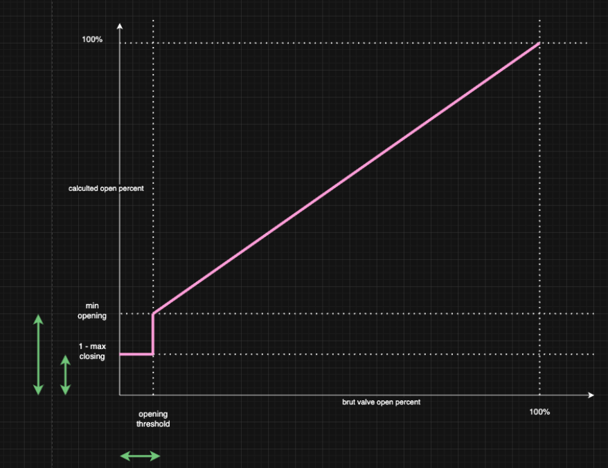

[![GitHub Release][releases-shield]][releases]
[![GitHub Activity][commits-shield]][commits]
[![License][license-shield]](LICENSE)
[![hacs][hacs_badge]][hacs]
[![BuyMeCoffee][buymecoffeebadge]][buymecoffee]

# Versatile Thermostat (Termostat _*VTherm*_)

Ten plik README jest dostępny
w językach : [Angielski](README.md) | [Francuski](README-fr.md) | [Niemiecki](README-de.md) | [Czeski](README-cs.md) | [Polski](README-pl.md)

 

>  Ta integracja ma na celu znaczne uproszczenie automatyzacji zarządzania ogrzewaniem. Ponieważ wszystkie typowe zdarzenia związane z ogrzewaniem (obecność w domu, wykrycie aktywności w pomieszczeniu, otwarte okno, wyłączenie zasilania, itp.) są natywnie zarządzane przez termostat, nie musisz zajmować się skomplikowanymi skryptami i automatyzacjami, aby zarządzać termostatami. ;-).

Ten niestandardowy komponent Home Assistanta jest ulepszoną i napisaną całkowicie od nowa wersją komponentu „Awesome Thermostat” (patrz: [Github](https://github.com/dadge/awesome_thermostat)) z dodatkowymi funkcjami.

# Zrzuty ekranowe

Karta integracji Versatile Thermostat UI (dostępna na [Github](https://github.com/jmcollin78/versatile-thermostat-ui-card)) :

 

# Co nowego?

## Wydanie 8.2
> Dodano opcjonalną funkcję blokowania/odblokowania termostatu _*VTherm*_ za pomocą kodu PIN. Więcej informacji na ten temat znajduje się [tutaj](documentation/pl/feature-lock.md).

## Wydanie 8.1
> - Dla `termostatu na klimacie` z bezpośrednim sterowaniem zaworem, do istniejącego już parametru `minimum_opening_degrees` dodano dwa nowe, następujące parametry:
>    - `opening_threshold`: wartość otwarcia zaworu, poniżej której zawór powinien być uważany za zamknięty (wówczas będzie obowiązywał parametr `max_closing_degree`),
>    - `max_closing_degree`: maksymalna wartość stopnia zamknięcia zaworu. Powyżej tej wartości zawór nigdy nie zostanie zamknięty. Ustaw wartość tego parametru na `100`, aby całkowicie zamknąć zawór, jeśli ogrzewanie jest już niepotrzebne,
>    - `minimum_opening_degrees`: minimalna wartość stopnia otwarcia zaworu dla każdego urządzenia bazowego po przekroczeniu progu `opening_threshold`, rozdzielona przecinkami. Domyślna wartość parametru: `0`. Przykład: 20, 25, 30. Po rozpoczęciu grzania zawór zacznie się otwierać z tą wartością i będzie się stale zwiększać, dopóki będzie potrzebne dalsze ogrzewanie.
>
> 
>
> Więcej informacji na ten temat można uzyskać, przegądając wątek dyskusyjny [#1220](https://github.com/jmcollin78/versatile_thermostat/issues/1220).

## Wydanie główne 8.0

Ta wersja wymaga **szczególnej uwagi**. Przebudowano w niej znaczną część wewnętrznych mechanizmów integracji *Versatile Thermostat*, wprowadzając kilka nowych funkcji, a także znacząco poprawiając wydajność tych już działających:
> 1. `Stan żądany` / `stan bieżący`: termostat _VTherm_ ma teraz 2 stany. `Stan żądany` to stan oczekiwany przez użytkownika (lub harmonogram). `Stan bieżący` to stan aktualny termostatu _VTherm_. Ten ostatni zależy od różnych funkcji termostatu _VTherm_. Np. użytkownik może zażądać (`stan żądany`) włączenia ogrzewania z ustawieniem Komfort, ale ponieważ wykryto otwarte okno, termostat _VTherm_ jest w rzeczywistości wyłączony. To podwójne zarządzanie zawsze zachowuje żądanie użytkownika i aplikuje wyniki różnych funkcji jako odpowiedź na żądanie użytkownika, aby w efekcie uzyskać `stan bieżący`. Takie rozwiązanie lepiej radzi sobie z przypadkami, gdy wiele funkcji chce oddziaływać na stan termostatu (np. otwieranie okna i wyłączanie zasilania). Zapewnia również powrót do pierwotnego `stanu żądanego`, gdy nie ma już żadnych innych zdarzeń, które mogłyby oddziaływać na termostat (np. otwieranie okna i wyłączanie zasilania),
> 2. `Filtrowanie czasu`: operacja filtrowania czasu została znacznie poprawiona. Filtrowanie czasu zapobiega wysyłaniu zbyt wielu poleceń do urządzenia, co mogłoby prowadzić do nadmiernego zużycia baterii (np. termostatu zasilanego bateryjnie), a także zbyt częstej zmiany ustawień (pompy ciepła, pieca na pellet, ogrzewania podłogowego itp.). Nowa funkcja działa teraz następująco: jawne żądania użytkownika (lub harmonogramu) są zawsze natychmiast uwzględniane i **nie są one filtrowane**. Potencjalnie filtrowane są tylko zmiany związane z warunkami zewnętrznymi (np. temperaturą w pomieszczeniu). Filtrowanie polega na ponownym wysłaniu żądanego polecenia w późniejszym czasie, a nie na jego ignorowaniu, jak to miało miejsce dotychczas. Parametr `auto_regulation_dtemp` umożliwia dostosowanie opóźnienia.
> 3. Ulepszenie parametru `hvac_action`: parametr `hvac_action` odzwierciedla aktualny stan aktywacji sterowanego urządzenia. W przypadku typu `termostat na przełączniku` odzwierciedla on stan aktywacji przełącznika, w przypadku `termostatu na zaworze` pozostaje aktywny, gdy otwarcie zaworu jest większe, niż minimalne (lub 0, jeśli nie jest skonfigurowany). W przypadku `termostatu na klimacie` odzwierciedla on parametr `hvac_action` klimatu bazowego, jeśli jest dostępny, lub - w przeciwnym razie - jego symulację.
> 4. `Atrybuty własne`: organizacja atrybutów niestandardowych dostępnych w `Narzędzia deweloperskie -> Stany` została podzielona na sekcje w zależności od typu termostatu _VTherm_ i każdej aktywowanej funkcji.
> 5. `Redukcja mocy`: algorytm redukcji mocy uwzględnia teraz wyłączenie urządzeń między dwoma pomiarami zużycia energii w domu.
Załóżmy, że co 5 minut otrzymujesz informację zwrotną o zużyciu energii. Jeśli grzejnik zostanie wyłączony między dwoma pomiarami, włączenie nowego może zostać autoryzowane. Wcześniej uwzględniano tylko włączenia między dwoma pomiarami. Tak jak poprzednio, kolejny komunikat dotyczący zużycia energii prawdopodobnie spowoduje większą lub mniejszą redukcję mocy.
> 6. `AutoSTART/autoSTOP`: funkcja autoSTART/autoSTOP jest przydatna tylko dla typu `termostatu na klimacie` bez bezpośredniego sterowania zaworem. Opcja ta została usunięta z pozostałych typów termostatów.
> 7. Karta `VTherm UI Card`: wszystkie te modyfikacje pozwoliły na znaczną ewolucję karty `VTherm UI Card`, integrując komunikaty wyjaśniające aktualny stan (dlaczego mój VTherm ma taką temperaturę docelową?) oraz czy trwa filtrowanie czasu – w związku z czym aktualizacja stanu bazowego jest opóźniona.
> 8. Ulepszenia `logów`: ulepszono logi, aby znacząco uprościć debugowanie. Logi w formacie `---> NOWE ZDARZENIE: VersatileThermostat-Inversed ...` informują o zdarzeniu, wpływającym na stan termostatu _VTherm_.
>
> ⚠️ **Ostrzeżenie**
>
> Ta wersja integracji zawiera zasadnicze zmiany w stosunku do wersji poprzedniej:
> - zmianie ulega nazwa zdarzenia z `versatile_thermostat_security_event` na `versatile_thermostat_safety_event`. Jeśli Twoja automatyzacja wykorzystuje to zdarzenie, konieczna jest jej aktualizacja,
> - atrybuty własne zostały całkowicie zreorganizowane. Wymagana jest odpowiednia aktualizacja Twoich automatyzacji lub szablonów Jinja, korzystających z tych atrybutów,
> - karta [VTherm UI Card](documentation/en/additions.md#versatile-thermostat-ui-card) musi być zaktualizowana co najmniej do wersji `v2.0`, aby zachować kompatybilność,
>
> **Pomimo 342 automatycznych testów tej integracji i maksymalnej staranności włożonej w wydanie nowej wersji, nie ma pewności, że jej instalacja nie zakłóci stanu czujników _VTherm_. Po zainstalowaniu aktualizacji, dla każdego sensora _VTherm_ należy sprawdzić presety, tryb HVAC i ewentualnie ustawienie temperatur sensorów _VTherm_.**
>

## 🍻 Dziękuję za piwo! 🍻

Wielkie podziękowania dla wszystkich moich 'piwnych' sponsorów za ich donacje i wszelkie formy zachęty. To bardzo wiele dla mnie znaczy i motywuje do dalszej pracy! Jeśli integracja ta pozwala Ci oszczędzać pieniądze, w zamian za to możesz kupić mi piwo. Z pewnością będę umiał to docenić!

# Słownik

  `VTherm`: Versatile Thermostat, jako odnośnik do dokumentacji.

  `TRV`: Termostatyczny Zawór Grzejnikowy (_ang: Thermostatic Radiator Valve_) wyposażony w zawór. Zawór, otwierając się lub zamykając, umożliwia kontrolę przepływu ciepłej wody.

  `AC`: Klimatyzacja Powietrza. Urządzenie AC chłodzi lub grzeje. Oznaczenie temperatur: Tryb Eko jest cieplejszy niż Komfort, który z kolei jest cieplejszy niż tzw. Boost. Algorytmy integracji biorą to pod uwagę.

  `EMA`: Średnia Zmienna Wykładnicza. Służy do wygładzania pomiarów temperatury z czujnika. Reprezentuje zmienną średnią temperaturę w pomieszczeniu i służy do obliczania nachylenia krzywej temperatury, co byłoby zbyt niestabilne w przypadku danych surowych.

  `slope`: Nachylenie krzywej temperatury, mierzone w stopniach (°C lub °K)/h. Jest dodatnie, gdy temperatura rośnie, i ujemne, gdy spada. Nachylenie to oblicza się na podstawie `EMA`.

  `PAC`: Pompa ciepła

  `HA`: Home Assistant

  `underlying`: Urządzenie sterowane integracją `Versatile Thermostat`

# Dokumentacja

Dla wygody Użytkownika, a także w celu dostępu do pomocy kontekstowej podczas konfiguracji, dokumentacja podzielona jest na rozdziały i sekcje:
1. [Wprowadzenie](documentation/pl/presentation.md)
2. [Instalacja](documentation/pl/installation.md)
3. [Szybki start](documentation/pl/quick-start.md)
4. [Wybór typu termostatu](documentation/pl/creation.md)
5. [Atrybuty podstawowe](documentation/pl/base-attributes.md)
6. [Konfigurowanie `termostatu na przełączniku`](documentation/pl/over-switch.md)
7. [Konfigurowanie `termostatu na klimacie`](documentation/pl/over-climate.md)
8. [Konfigurowanie `termostatu na zaworze`](documentation/pl/over-valve.md)
9. [Ustawienia presetów](documentation/pl/feature-presets.md)
10. [Zarządzanie oknami](documentation/pl/feature-window.md)
11. [Zarządzanie obecnością](documentation/pl/feature-presence.md)
12. [Zarządzanie ruchem](documentation/pl/feature-motion.md)
13. [Zarządzanie mocą/zasilaniem](documentation/pl/feature-power.md)
14. [AutoSTART i autoSTOP](documentation/pl/feature-auto-start-stop.md)
15. [Scentralizowane zarządzanie wszystkimi termostatami _VTherm_](documentation/pl/feature-central-mode.md)
16. [Sterowanie kotłem centralnym](documentation/pl/feature-central-boiler.md)
17. [Zaawansowane ustawienia, tryb bezpieczny](documentation/pl/feature-advanced.md)
18. [Samoregulacja](documentation/pl/self-regulation.md)
19. [Funkcja blokady dostępu kodem PIN](documentation/pl/feature-lock.md)
20. [Algorytmy](documentation/pl/algorithms.md)
21. [Dokumentacja referencyjna](documentation/pl/reference.md)
22. [Przykłady dostrajania układu](documentation/pl/tuning-examples.md)
23. [Usuwanie problemów](documentation/pl/troubleshooting.md)
24. [Informacje o wersjach](documentation/pl/releases.md)

---
# Kilka przykładowych efektów...

**Stabilizacja temperatury skonfigurowana dzięki ustawieniu presetu**:

<h1></h1>

**Cykle Zał/Wył obliczane przez integrację `Termostat na Klimacie`**:

<h1></h1>

**Regulacja `Termostatem na Przełączniku`**:

<h1></h1>

**Regulacja `Termostatem na Klimacie`**:

<h1></h1>

**Regulacja `Termostatem na Klimacie` z bezpośrednim sterowaniem zaworu**:

<h1></h1>

## Ciesz się i korzystaj!

## Wybrane komentarze do integracji `Versatile Thermostat`
|                                             |                                             |                                             |
| ------------------------------------------- | ------------------------------------------- | ------------------------------------------- |
|  |  |  |
|  |  |  |

# ⭐ Historia gwiazdek

## Współpraca mile widziana!

Chciałbyś wnieść swój wkład do projektu? Zapoznaj się z [zasadami współpracy](CONTRIBUTING-pl.md).

[versatile_thermostat]: https://github.com/jmcollin78/versatile_thermostat
[buymecoffee]: https://www.buymeacoffee.com/jmcollin78
[buymecoffeebadge]: https://img.shields.io/badge/Buy%20me%20a%20beer-%245-orange?style=for-the-badge&logo=buy-me-a-beer
[commits-shield]: https://img.shields.io/github/commit-activity/y/jmcollin78/versatile_thermostat.svg?style=for-the-badge
[commits]: https://github.com/jmcollin78/versatile_thermostat/commits/master
[hacs]: https://github.com/custom-components/hacs
[hacs_badge]: https://img.shields.io/badge/HACS-Custom-41BDF5.svg?style=for-the-badge
[forum-shield]: https://img.shields.io/badge/community-forum-brightgreen.svg?style=for-the-badge
[forum]: https://community.home-assistant.io/
[license-shield]: https://img.shields.io/github/license/jmcollin78/versatile_thermostat.svg?style=for-the-badge
[maintenance-shield]: https://img.shields.io/badge/maintainer-Joakim%20Sørensen%20%40ludeeus-blue.svg?style=for-the-badge
[releases-shield]: https://img.shields.io/github/release/jmcollin78/versatile_thermostat.svg?style=for-the-badge
[releases]: https://github.com/jmcollin78/versatile_thermostat/releases
