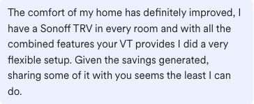
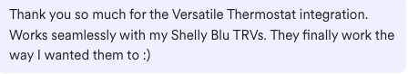
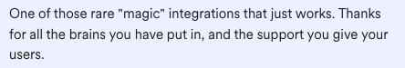

[![GitHub Release][releases-shield]][releases]
[![GitHub Activity][commits-shield]][commits]
[![License][license-shield]](LICENSE)
[![hacs][hacs_badge]][hacs]
[![BuyMeCoffee][buymecoffeebadge]][buymecoffee]

# VTherm 
### (dawniej: _*Versatile Thermostat*_)

Ten plik README dostępny jest
w językach : [Angielski](README.md) | [Francuski](README-fr.md) | [Niemiecki](README-de.md) | [Czeski](README-cs.md) | [Polski](README-pl.md)

 

>  Ta integracja ma na celu znaczne uproszczenie automatyzacji zarządzania ogrzewaniem. Ponieważ wszystkie typowe zdarzenia związane z ogrzewaniem (obecność w domu, wykrycie aktywności w pomieszczeniu, otwarte okno, wyłączenie zasilania, itp.) są natywnie zarządzane przez termostat, nie musisz zajmować się skomplikowanymi skryptami i automatyzacjami, aby zarządzać termostatami. ;-).

Ten niestandardowy komponent Home Assistanta jest ulepszoną i napisaną całkowicie od nowa wersją komponentu „Awesome Thermostat” (patrz: [Github](https://github.com/dadge/awesome_thermostat)) z dodatkowymi funkcjami.

Karta integracji VTherm UI (dostępna na [Github](https://github.com/jmcollin78/versatile-thermostat-ui-card)) :

 

# Co nowego?

## Wydanie 8.5
> 1. Dodanie wykrywania awarii ogrzewania dla termostatów VTherm używających algorytmu TPI. Ta funkcja wykrywa dwa typy anomalii:
>    - **awaria ogrzewania**: grzejnik mocno grzeje (wysoki on_percent), ale temperatura nie rośnie,
>    - **awaria chłodzenia**: grzejnik nie grzeje (on_percent równe 0), ale temperatura nadal rośnie.
>
> Anomalie te mogą wskazywać na otwarte okno, uszkodzony grzejnik lub zewnętrzne źródło ciepła. Funkcja wysyła zdarzenia, które mogą być używane do wyzwalania automatyzacji (powiadomienia, alerty itp.). Więcej informacji [tutaj](documentation/pl/feature-heating-failure-detection.md).
>

## Wydanie 8.4
> 1. Dodanie eksperymentalnej funkcji automatyzacji algorytmu TPI. Ta nowa funkcja pozwala na automatyczne obliczanie najlepszych współczynników dla algorytmu TPI. Więcej informacji znajdziesz [tutaj _(chwilowo tylko w jęz. francuskim)_](./auto_tpi_internal_doc.md).
> 2. Dodanie funkcji synchronizacji temperatury dla urządzenia sterowanego w trybie `na_klimacie`. W zależności od możliwości urządzenia, _VTherm_ może sterować jednostką kalibracji offsetu lub bezpośrednio zewnętrzną encją temperatury. Więcej informacji znajduje się [tutaj](documentation/pl/feature-sync_device_temp.md).
> 3. Dodanie funkcji _**presetu czasowego**_, która umożliwia wybranie presetu na z góry określony czas i powrót do poprzedniego po upływie wkazanego opóźnienia. Nowa funkcja jest szczegółowo opisana [tutaj](documentation/pl/feature-timed-preset.md).
>

## Wydanie 8.3
> 1. Dodanie konfigurowalnego opóźnienia przed załączeniem kotła centralnego.
> 2. Dodanie wyzwalacza kotła centralnego, gdy całkowita moc aktywowana przekroczy założony próg. Aby ta funkcja działała, musisz:
> - skonfigurować próg mocy, który uruchomi kocioł. Jest to nowa jednostka dostępna w urządzeniu _„Konfiguracja centralna”_.
> - skonfigurować wartości mocy termostatów _VTherm_. Można to zrobić na pierwszym ekranie konfiguracji każdego termostatu _VTherm_.
> - zaznaczyć pole „Używane przez kocioł centralny”.
>
> Za każdym razem, gdy VTherm jest aktywowany, jego skonfigurowana moc jest dodawana do sumy, a w przypadku przekroczenia progu, kocioł centralny zostanie uruchomiony po opóźnieniu skonfigurowanym w kroku 1.
>
> Poprzedni licznik liczby aktywowanych urządzeń i jego progu nadal istnieją. Aby wyłączyć jeden z progów (próg mocy lub próg liczby aktywnych urządzeń), ustaw jego wartość na zero (`0`). Po przekroczeniu któregokolwiek z dwóch niezerowych progów kocioł zostanie uruchomiony. Dlatego pomiędzy dwoma progami stosuje się alternatywę logiczną _'lub'_.
>
> Więcej informacji znajdziesz [tutaj](documentation/pl/feature-central-boiler.md).

## 🍻 Dziękuję za piwo! 🍻

Wielkie podziękowania dla wszystkich moich 'piwnych' sponsorów za ich donacje i wszelkie formy zachęty. To bardzo wiele dla mnie znaczy i motywuje do dalszej pracy! Jeśli integracja ta pozwala Ci oszczędzać pieniądze, w zamian za to możesz kupić mi piwo. Z pewnością będę umiał to docenić!

# Słownik

  `VTherm`: Versatile Thermostat, jako odnośnik do dokumentacji.

  `TRV`: Termostatyczny Zawór Grzejnikowy (_ang: Thermostatic Radiator Valve_) wyposażony w zawór. Zawór, otwierając się lub zamykając, umożliwia kontrolę przepływu ciepłej wody.

  `AC`: Klimatyzacja Powietrza. Urządzenie AC chłodzi lub grzeje. Oznaczenie temperatur: Tryb Eko jest cieplejszy niż Komfort, który z kolei jest cieplejszy niż tzw. Boost. Algorytmy integracji biorą to pod uwagę.

  `EMA`: Średnia Zmienna Wykładnicza. Służy do wygładzania pomiarów temperatury z czujnika. Reprezentuje zmienną średnią temperaturę w pomieszczeniu i służy do obliczania nachylenia krzywej temperatury, co byłoby zbyt niestabilne w przypadku danych surowych.

  `slope`: Nachylenie krzywej temperatury, mierzone w stopniach (°C lub °K)/h. Jest dodatnie, gdy temperatura rośnie, i ujemne, gdy spada. Nachylenie to oblicza się na podstawie `EMA`.

  `PAC`: Pompa ciepła

  `HA`: Home Assistant

  `underlying`: Urządzenie sterowane integracją `Versatile Thermostat`

# Dokumentacja

Dla wygody Użytkownika, a także w celu dostępu do pomocy kontekstowej podczas konfiguracji, dokumentacja podzielona jest na rozdziały i sekcje:
1. [Wprowadzenie](documentation/pl/presentation.md)
2. [Instalacja](documentation/pl/installation.md)
3. [Szybki start](documentation/pl/quick-start.md)
4. [Wybór typu termostatu](documentation/pl/creation.md)
5. [Atrybuty podstawowe](documentation/pl/base-attributes.md)
6. [Konfigurowanie `termostatu na przełączniku`](documentation/pl/over-switch.md)
7. [Konfigurowanie `termostatu na klimacie`](documentation/pl/over-climate.md)
8. [Konfigurowanie `termostatu na zaworze`](documentation/pl/over-valve.md)
9. [Ustawienia presetów](documentation/pl/feature-presets.md)
10. [Zarządzanie oknami](documentation/pl/feature-window.md)
11. [Zarządzanie obecnością](documentation/pl/feature-presence.md)
12. [Zarządzanie ruchem](documentation/pl/feature-motion.md)
13. [Zarządzanie mocą/zasilaniem](documentation/pl/feature-power.md)
14. [AutoSTART i autoSTOP](documentation/pl/feature-auto-start-stop.md)
15. [Scentralizowane zarządzanie wszystkimi termostatami _VTherm_](documentation/pl/feature-central-mode.md)
16. [Sterowanie kotłem centralnym](documentation/pl/feature-central-boiler.md)
17. [Zaawansowane ustawienia, tryb bezpieczny](documentation/pl/feature-advanced.md)
18. [Samoregulacja](documentation/pl/self-regulation.md)
19. [Funkcja blokady dostępu kodem PIN](documentation/pl/feature-lock.md)
20. [Temperature synchronisation](documentation/pl/feature-sync_device_temp.md)
21. [Timed preset](documentation/pl/feature-timed-preset.md)
22. [Algorytmy](documentation/pl/algorithms.md)
23. [Dokumentacja referencyjna](documentation/pl/reference.md)
24. [Przykłady dostrajania układu](documentation/pl/tuning-examples.md)
25. [Usuwanie problemów](documentation/pl/troubleshooting.md)
26. [Informacje o wersjach](documentation/pl/releases.md)
27. [Wykrywanie awarii ogrzewania](documentation/pl/feature-heating-failure-detection.md)

---
# Kilka przykładów...

**Stabilizacja temperatury skonfigurowana dzięki ustawieniu presetu**:

<h1></h1>

**Cykle Zał/Wył obliczane przez integrację `Termostat na Klimacie`**:

<h1></h1>

**Regulacja `Termostatem na Przełączniku`**:

<h1></h1>

**Regulacja `Termostatem na Klimacie`**:

<h1></h1>

**Regulacja `Termostatem na Klimacie` z bezpośrednim sterowaniem zaworu**:

<h1></h1>

## Ciesz się i korzystaj!

## Wybrane komentarze do integracji `Versatile Thermostat`
|                                             |                                             |                                             |
| ------------------------------------------- | ------------------------------------------- | ------------------------------------------- |
|  |  |  |
|  |  |  |

# ⭐ Historia gwiazdek

## Współpraca mile widziana!

Chciałbyś wnieść swój wkład do projektu? Zapoznaj się z [zasadami współpracy](CONTRIBUTING-pl.md).

[versatile_thermostat]: https://github.com/jmcollin78/versatile_thermostat
[buymecoffee]: https://www.buymeacoffee.com/jmcollin78
[buymecoffeebadge]: https://img.shields.io/badge/Buy%20me%20a%20beer-%245-orange?style=for-the-badge&logo=buy-me-a-beer
[commits-shield]: https://img.shields.io/github/commit-activity/y/jmcollin78/versatile_thermostat.svg?style=for-the-badge
[commits]: https://github.com/jmcollin78/versatile_thermostat/commits/master
[hacs]: https://github.com/custom-components/hacs
[hacs_badge]: https://img.shields.io/badge/HACS-Custom-41BDF5.svg?style=for-the-badge
[forum-shield]: https://img.shields.io/badge/community-forum-brightgreen.svg?style=for-the-badge
[forum]: https://community.home-assistant.io/
[license-shield]: https://img.shields.io/github/license/jmcollin78/versatile_thermostat.svg?style=for-the-badge
[maintenance-shield]: https://img.shields.io/badge/maintainer-Joakim%20Sørensen%20%40ludeeus-blue.svg?style=for-the-badge
[releases-shield]: https://img.shields.io/github/release/jmcollin78/versatile_thermostat.svg?style=for-the-badge
[releases]: https://github.com/jmcollin78/versatile_thermostat/releases
