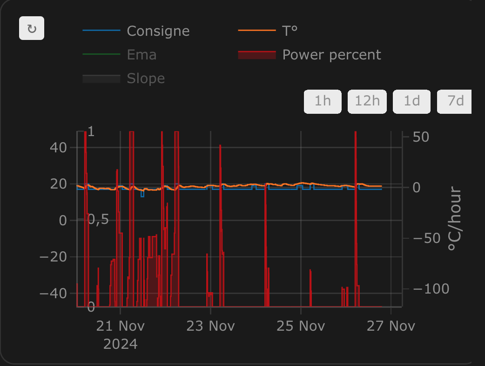

[![GitHub Release][releases-shield]][releases]
[![GitHub Activity][commits-shield]][commits]
[![License][license-shield]](LICENSE)
[![hacs][hacs_badge]][hacs]
[![BuyMeCoffee][buymecoffeebadge]][buymecoffee]

# Versatile Thermostat - Wszechstronny Termostat

Ten plik README jest dostępny
w językach : [Angielski](README.md) | [Francuski](README-fr.md) | [Niemiecki](README-de.md) | [Czeski](README-cs.md) | [Polski](README-pl.md)

 

>  Ta integracja ma na celu znaczne uproszczenie automatyzacji zarządzania ogrzewaniem. Ponieważ wszystkie typowe zdarzenia związane z ogrzewaniem (obecność w domu, wykrycie aktywności w pomieszczeniu, otwarte okno, wyłączenie zasilania, itp.) są natywnie zarządzane przez termostat, nie musisz zajmować się skomplikowanymi skryptami i automatyzacjami, aby zarządzać termostatami. ;-).

Ten niestandardowy komponent Home Assistanta jest ulepszoną i napisaną całkowicie od nowa wersją komponentu „Awesome Thermostat” (patrz: [Github](https://github.com/dadge/awesome_thermostat)) z dodatkowymi funkcjami.

# Zrzuty ekranowe

Karta integracji Versatile Thermostat UI (dostępna na [Github](https://github.com/jmcollin78/versatile-thermostat-ui-card)) :

 

# Co nowego?

## Release 8.0
> This is a major release. It rewrites a significant part of the internal mechanisms of Versatile Thermostat by introducing several new features:
>    1. _requested state / current state_: VTherm now has 2 states. The requested state is the state requested by the user (or Scheduler). The current state is the state currently applied to the VTherm. The latter depends on the different VTherm functions. For example, the user can request (requested state) to have heating on with Comfort preset but since the window has been detected open, the VTherm is actually off. This dual management always preserves the user's request and applies the result of the different functions on this user request to get the current state. This better handles cases where multiple functions want to act on the VTherm state (window opening and power shedding for example). It also ensures a return to the user's initial request when no detection is in progress anymore,
>    2. _time filtering_: the time filtering operation has been revised. Time filtering prevents sending too many commands to a controlled equipment to avoid consuming too much battery (battery-powered TRV for example), changing setpoints too frequently (heat pump, pellet stove, underfloor heating, ...). The new operation is now as follows: explicit user (or Scheduler) requests are always immediately taken into account. They are not filtered. Only changes related to external conditions (room temperature for example) are potentially filtered. Filtering consists of resending the desired command later and not ignoring the command as was previously the case. The `auto_regulation_dtemp` parameter allows adjusting the delay,
>    3. _hvac_action improvement_: the `hvac_action` reflects the current activation state of the controlled equipment. For an `over_switch` type it reflects the switch activation state, for an `over_valve` or valve regulation, it is active when the valve opening is greater than the minimum valve opening (or 0 if not configured), for an `over_climate` it reflects the underlying `climate`'s `hvac_action` if available or a simulation otherwise.
>    4. _custom attributes_: the organization of custom attributes accessible in Developer Tools / States has been reorganized into sections depending on the VTherm type and each activated function. More information [here](documentation/en/reference.md#custom-attributes).
>    5. _power shedding_: the power shedding algorithm now takes into account equipment shutdown between two measurements of home power consumption. Suppose you have power consumption feedback every 5 minutes. If a radiator is turned off between 2 measurements then turning on a new one may be authorized. Before, only turn-ons were taken into account between 2 measurements. As before, the next power consumption feedback will possibly shed more or less.
>    6. _auto-start/stop_: auto-start/stop is only useful for `over_climate` type VTherm without direct valve control. The option has been removed for other VTherm types.
>    7. _VTherm UI Card_: all these modifications allowed a major evolution of the [VTherm UI Card](documentation/en/additions.md#versatile-thermostat-ui-card) to integrate messages explaining the current state (why does my VTherm have this target temperature?) and if time filtering is in progress - so the underlying state update has been delayed.
>    8. _log improvements_: logs have been improved to simplify debugging. Logs in the form `--------------------> NEW EVENT: VersatileThermostat-Inversed ...` inform of an event impacting the VTherm state.
>
> ⚠️ **Warning**
>
> This major release includes breaking changes from the previous version:
> - `versatile_thermostat_security_event` has been renamed to `versatile_thermostat_safety_event`. If your automations use this event, you must update them,
> - custom attributes have been reorganized. You must update your automations or Jinja templates that use them,
> - the [VTherm UI Card](documentation/en/additions.md#versatile-thermostat-ui-card) must be updated to at least V2.0 to be compatible,
>
> **Despite the 342 automated tests of this integration and the care taken with this major release, I cannot guarantee that its installation will not disrupt your VTherms' states. For each VTherm you must check the preset, hvac_mode and possibly the VTherm setpoint temperature after installation.**
>

# 🍻 Dziękuję za piwo! 🍻

Wielkie podziękowania dla wszystkich moich 'piwnych' sponsorów za ich donacje i wszelkie formy zachęty. To bardzo wiele dla mnie znaczy i motywuje do dalszej pracy! Jeśli integracja ta pozwala Ci oszczędzać pieniądze, w zamian za to możesz kupić mi piwo. Z pewnością będę umiał to docenić!

# Słownik

  `VTherm`: Versatile Thermostat (Termostat Wszechstronny) jako odnośnik do dokumentacji.

  `TRV`: Termostatyczny Zawór Grzejnikowy wyposażony w zawór. Zawór, otwierając się lub zamykając, umożliwia kontrolę przepływu ciepłej wody.

  `AC`: Klimatyzacja Powietrza. Urządzenie AC chłodzi lub grzeje. Oznaczenie temperatur: Tryb Eko jest cieplejszy niż Komfort, który z kolei jest cieplejszy niż tzw. Boost. Algorytmy integracji biorą to pod uwagę.

  `EMA`: Zmienna Średnia Wykładnicza. Służy do wygładzania pomiarów temperatury z czujnika. Reprezentuje zmienną średnią temperaturę w pomieszczeniu i służy do obliczania nachylenia krzywej temperatury, co byłoby zbyt niestabilne w przypadku danych surowych.

  `slope`: Nachylenie krzywej temperatury, mierzone w stopniach (°C lub °K)/h. Jest dodatnie, gdy temperatura rośnie, i ujemne, gdy spada. Nachylenie to oblicza się na podstawie `EMA`.

  `PAC`: Pompa ciepła

  `HA`: Home Assistant

  `underlying`: Urządzenie sterowane integracją `Versatile Thermostat` (Termostat Wszechstronny)

# Dokumentacja

Dokumentacja (w jęz. angielskim) podzielona jest na rozdziały i części, aby łatwiej było z niej korzystać:
1. [Introduction](documentation/en/presentation.md)
2. [Installation](documentation/en/installation.md)
3. [Quick start](documentation/en/quick-start.md)
4. [Choosing a VTherm type](documentation/en/creation.md)
5. [Basic attributes](documentation/en/base-attributes.md)
6. [Configuring a VTherm on a `switch`](documentation/en/over-switch.md)
7. [Configuring a VTherm on a `climate`](documentation/en/over-climate.md)
8. [Configuring a VTherm on a valve](documentation/en/over-valve.md)
9. [Presets](documentation/en/feature-presets.md)
10. [Window management](documentation/en/feature-window.md)
11. [Presence management](documentation/en/feature-presence.md)
12. [Motion management](documentation/en/feature-motion.md)
13. [Power management](documentation/en/feature-power.md)
14. [Auto start and stop](documentation/en/feature-auto-start-stop.md)
15. [Centralized control of all VTherms](documentation/en/feature-central-mode.md)
16. [Central heating control](documentation/en/feature-central-boiler.md)
17. [Advanced aspects, security mode](documentation/en/feature-advanced.md)
18. [Self-regulation](documentation/en/self-regulation.md)
19. [Tuning examples](documentation/en/tuning-examples.md)
20. [Algorithms](documentation/en/algorithms.md)
21. [Reference documentation](documentation/en/reference.md)
22. [Tuning examples](documentation/en/tuning-examples.md)
23. [Troubleshooting](documentation/en/troubleshooting.md)
24. [Release notes](documentation/en/releases.md)

# Kilka wyników...

**Stabilizacja temperatury skonfigurowana dzięki ustawieniom wstępnym**:

**Cykle Zał/Wył obliczane przez integrację `Termostat na Klimacie`**:

**Regulacja `Termostatem na Przełączniku`**:

**Regulacja `Termostatem na Klimacie`**:

**Regulacja bezpośrednim sterowaniem zaworu `Termostat na Klimacie`**:

Ciesz się i korzystaj!

# Some comments on the integration
|                                             |                                             |                                             |
| ------------------------------------------- | ------------------------------------------- | ------------------------------------------- |
|  |  |  |
|  |  |  |

# Współpraca mile widziana!

Chciałbyś wnieść swój wkład? Zapoznaj się z [contribution guidelines](CONTRIBUTING.md).

***

[versatile_thermostat]: https://github.com/jmcollin78/versatile_thermostat
[buymecoffee]: https://www.buymeacoffee.com/jmcollin78
[buymecoffeebadge]: https://img.shields.io/badge/Buy%20me%20a%20beer-%245-orange?style=for-the-badge&logo=buy-me-a-beer
[commits-shield]: https://img.shields.io/github/commit-activity/y/jmcollin78/versatile_thermostat.svg?style=for-the-badge
[commits]: https://github.com/jmcollin78/versatile_thermostat/commits/master
[hacs]: https://github.com/custom-components/hacs
[hacs_badge]: https://img.shields.io/badge/HACS-Custom-41BDF5.svg?style=for-the-badge
[forum-shield]: https://img.shields.io/badge/community-forum-brightgreen.svg?style=for-the-badge
[forum]: https://community.home-assistant.io/
[license-shield]: https://img.shields.io/github/license/jmcollin78/versatile_thermostat.svg?style=for-the-badge
[maintenance-shield]: https://img.shields.io/badge/maintainer-Joakim%20Sørensen%20%40ludeeus-blue.svg?style=for-the-badge
[releases-shield]: https://img.shields.io/github/release/jmcollin78/versatile_thermostat.svg?style=for-the-badge
[releases]: https://github.com/jmcollin78/versatile_thermostat/releases
