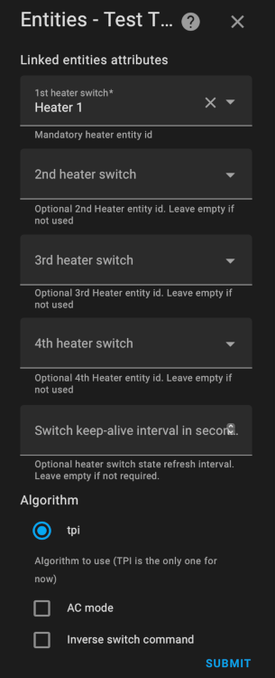
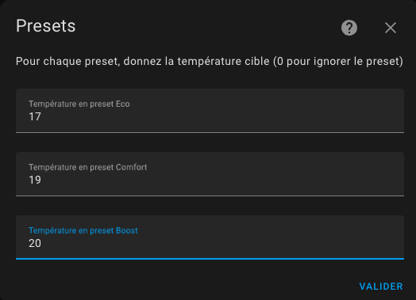

[![GitHub Release][releases-shield]][releases]
[![GitHub Activity][commits-shield]][commits]
[![License][license-shield]](LICENSE)
[![hacs][hacs_badge]][hacs]
[![BuyMeCoffee][buymecoffeebadge]][buymecoffee]


>  This thermostat integration aims to drastically simplify your automations around climate management. Because all classical events in climate are natively handled by the thermostat (nobody at home ?, activity detected in a room ?, window open ?, power shedding ?), you don't have to build over complicated scripts and automations to manage your climates ;-).

- [Major changes in version 5.0](#major-changes-in-version-50)
- [Thanks for the beer buymecoffee](#thanks-for-the-beer-buymecoffee)
- [When to use / not use](#when-to-use--not-use)
  - [Incompatibilities](#incompatibilities)
- [Why another thermostat implementation ?](#why-another-thermostat-implementation-)
- [How to install this incredible Versatile Thermostat ?](#how-to-install-this-incredible-versatile-thermostat-)
  - [HACS installation (recommended)](#hacs-installation-recommended)
  - [Manual installation](#manual-installation)
- [Configuration](#configuration)
  - [Creation of a new Versatile Thermostat](#creation-of-a-new-versatile-thermostat)
  - [Minimal configuration update](#minimal-configuration-update)
  - [Select the driven entity](#select-the-driven-entity)
    - [For a ```thermostat_over_switch``` type thermostat](#for-a-thermostat_over_switch-type-thermostat)
    - [For a thermostat of type ```thermostat_over_climate```:](#for-a-thermostat-of-type-thermostat_over_climate)
      - [Self-regulation](#self-regulation)
      - [Self-regulation in Expert mode](#self-regulation-in-expert-mode)
      - [Auto-fan mode](#auto-fan-mode)
    - [For a thermostat of type ```thermostat_over_valve```:](#for-a-thermostat-of-type-thermostat_over_valve)
  - [Configure the TPI algorithm coefficients](#configure-the-tpi-algorithm-coefficients)
  - [Configure the preset temperature](#configure-the-preset-temperature)
  - [Configure the doors/windows turning on/off the thermostats](#configure-the-doorswindows-turning-onoff-the-thermostats)
    - [The sensor mode](#the-sensor-mode)
    - [Auto mode](#auto-mode)
  - [Configure the activity mode or motion detection](#configure-the-activity-mode-or-motion-detection)
  - [Configure the power management](#configure-the-power-management)
  - [Configure presence or occupancy](#configure-presence-or-occupancy)
  - [Advanced configuration](#advanced-configuration)
  - [Centralized control](#centralized-control)
  - [Control of a central boiler](#control-of-a-central-boiler)
    - [Setup](#setup)
    - [How to find the right service?](#how-to-find-the-right-service)
    - [The events](#the-events)
    - [Warning](#warning)
  - [Parameter summary](#parameter-summary)
- [Examples tuning](#examples-tuning)
  - [Electrical heater](#electrical-heater)
  - [Central heating (gaz or fuel heating system)](#central-heating-gaz-or-fuel-heating-system)
  - [Temperature sensor will battery](#temperature-sensor-will-battery)
  - [Reactive temperature sensor (on mains)](#reactive-temperature-sensor-on-mains)
  - [My preset configuration](#my-preset-configuration)
- [Algorithm](#algorithm)
  - [TPI algorithm](#tpi-algorithm)
- [Sensors](#sensors)
- [Services](#services)
  - [Force the presence / occupancy](#force-the-presence--occupancy)
  - [Change the temperature of presets](#change-the-temperature-of-presets)
  - [Change safety settings](#change-safety-settings)
  - [ByPass Window Check](#bypass-window-check)
- [Events](#events)
- [Custom attributes](#custom-attributes)
- [Some results](#some-results)
- [Even better](#even-better)
  - [Much better with the Veersatile Thermostat UI Card](#much-better-with-the-veersatile-thermostat-ui-card)
  - [Even Better with Scheduler Component !](#even-better-with-scheduler-component-)
  - [Even-even better with custom:simple-thermostat front integration](#even-even-better-with-customsimple-thermostat-front-integration)
  - [Even better with Plotly to tune your Thermostat](#even-better-with-plotly-to-tune-your-thermostat)
  - [And always better and better with the NOTIFIER daemon app to notify events](#and-always-better-and-better-with-the-notifier-daemon-app-to-notify-events)
- [Contributions are welcome!](#contributions-are-welcome)
- [Troubleshooting](#troubleshooting)
  - [Using a Heatzy](#using-a-heatzy)
  - [Using a Heatsink with a Pilot Wire](#using-a-heatsink-with-a-pilot-wire)
  - [Only the first radiator heats](#only-the-first-radiator-heats)
  - [The radiator heats up even though the setpoint temperature is exceeded or does not heat up even though the room temperature is well below the setpoint](#the-radiator-heats-up-even-though-the-setpoint-temperature-is-exceeded-or-does-not-heat-up-even-though-the-room-temperature-is-well-below-the-setpoint)
    - [Type `over_switch` or `over_valve`](#type-over_switch-or-over_valve)
    - [Type `over_climate`](#type-over_climate)
  - [Adjust window opening detection parameters in auto mode](#adjust-window-opening-detection-parameters-in-auto-mode)
  - [Why does my Versatile Thermostat go into Safety?](#why-does-my-versatile-thermostat-go-into-safety)
    - [How to detect safety mode?](#how-to-detect-safety-mode)
    - [How can I be notified when this happens?](#how-can-i-be-notified-when-this-happens)
    - [How to repair?](#how-to-repair)
  - [Using a group of people as a presence sensor](#using-a-group-of-people-as-a-presence-sensor)


This custom component for Home Assistant is an upgrade and is a complete rewrite of the component "Awesome thermostat" (see [Github](https://github.com/dadge/awesome_thermostat)) with addition of features.

> _*News*_
> * **Release 5.4**: Added a temperature step [#311](https://github.com/jmcollin78/versatile_thermostat/issues/311). Added some regulation thresholdfor `over_valve` VTherm in order to avoid drowing the battery of TRV devices [#338](https://github.com/jmcollin78/versatile_thermostat/issues/338).
> * **Release 5.3**: Added a central boiler control function [#234](https://github.com/jmcollin78/versatile_thermostat/issues/234) - more information here: [Controlling a central boiler](#controlling-a-central-boiler). Added the ability to disable security mode for outdoor thermometer [#343](https://github.com/jmcollin78/versatile_thermostat/issues/343)
> * **Release 5.2**: Added a `central_mode` allowing all VTherms to be controlled centrally [#158](https://github.com/jmcollin78/versatile_thermostat/issues/158).
> * **Release 5.1**: Limitation of the values sent to the valves and the temperature sent to the underlying climate.
> * **Release 5.0**: Added a central configuration allowing the sharing of attributes that can be shared [#239](https://github.com/jmcollin78/versatile_thermostat/issues/239).
<details>
<summary>Others releases</summary>

> * **Release 4.3**: Added an auto-fan mode for the `over_climate` type allowing ventilation to be activated if the temperature difference is significant [#223](https://github.com/jmcollin78/versatile_thermostat/issues/223).
> * **Release 4.2**: The calculation of the slope of the temperature curve is now done in °/hour and no longer in °/min [#242](https://github.com/jmcollin78/versatile_thermostat/issues/242). Correction of automatic detection of openings by adding smoothing of the temperature curve.
> * **Release 4.1**: Added an **Expert** regulation mode in which the user can specify their own auto-regulation parameters instead of using the pre-programmed ones [#194]( https://github.com/jmcollin78/versatile_thermostat/issues/194).
> * **Release 4.0**: Added the support of **Versatile Thermostat UI Card**. See [Versatile Thermostat UI Card](https://github.com/jmcollin78/versatile-thermostat-ui-card). Added a **Slow** regulation mode for slow latency heating devices [#168](https://github.com/jmcollin78/versatile_thermostat/issues/168). Change the way **the power is calculated** in case of VTherm with multi-underlying equipements [#146](https://github.com/jmcollin78/versatile_thermostat/issues/146). Added the support of AC and Heat for VTherm over switch alse [#144](https://github.com/jmcollin78/versatile_thermostat/pull/144)
> * **Release 3.8**: Added a **self-regulation function** for `over climate` thermostats whose regulation is done by the underlying climate. See [Self-regulation](#self-regulation) and [#129](https://github.com/jmcollin78/versatile_thermostat/issues/129). Added the possibility of **inverting the command** for an `over switch` thermostat to address installations with pilot wire and diode [#124](https://github.com/jmcollin78/versatile_thermostat/issues/124).
> * **Release 3.7**: Addition of the **Versatile Thermostat type `over valve`** to control a TRV valve directly or any other dimmer type equipment for heating. Regulation is then done directly by acting on the opening percentage of the underlying entity: 0 the valve is cut off, 100: the valve is fully opened. See [#131](https://github.com/jmcollin78/versatile_thermostat/issues/131). Added a function allowing the bypass of opening detection [#138](https://github.com/jmcollin78/versatile_thermostat/issues/138). Added Slovak language
> * **Release 3.6**: Added the `motion_off_delay` parameter to improve motion management [#116](https://github.com/jmcollin78/versatile_thermostat/issues/116), [#128](https://github.com/jmcollin78/versatile_thermostat/issues/128). Added AC (air conditioning) mode for a VTherm over switch. Preparing the Github project to facilitate contributions [#127](https://github.com/jmcollin78/versatile_thermostat/issues/127)
> * **Release 3.5**: Multiple thermostats when using "thermostat over another thermostat" mode [#113](https://github.com/jmcollin78/versatile_thermostat/issues/113)
> * **Release 3.4**: bug fixes and expose preset temperatures for AC mode [#103](https://github.com/jmcollin78/versatile_thermostat/issues/103)
> * **Release 3.3**: add the Air Conditionned mode (AC). This feature allow to use the eventual AC mode of your underlying climate entity. You have to check the "Use AC mode" checkbox in configuration and give preset temperature value for AC mode and AC mode when absent if absence is configured
> * **Release 3.2**: add the ability to control multiple switches from the same thermostat. In this mode, the switches are triggered with a delay to minimize the power required at one time (we minimize the recovery periods). See [Configuration](#select-the-driven-entity)
> * **Release 3.1**: added detection of open windows/doors by temperature drop. This new function makes it possible to automatically stop a radiator when the temperature drops suddenly. See [Auto mode](#auto-mode)
> * **Major release 3.0**: addition of thermostat equipment and associated sensors (binary and non-binary). Much closer to the Home Assistant philosophy, you now have direct access to the energy consumed by the radiator controlled by the thermostat and many other sensors that will be useful in your automations and dashboard.
> * **release 2.3**: addition of the power and energy measurement of the radiator controlled by the thermostat.
> * **release 2.2**: addition of a safety function allowing a radiator not to be left heating forever in the event of a thermometer failure
> * **major release 2.0**: addition of the "over climate" thermostat allowing you to transform any thermostat into a Versatile Thermostat and add all the functions of the latter.
</details>

# Major changes in version 5.0


You can now define a central configuration which will allow you to share certain attributes on all your VTherms (or only part of them). To use this possibility, you must:
1. Create a VTherm of type “Central Configuration”,
2. Enter the attributes of this central configuration

To then use it in the other VTherms, you must reconfigure them and whenever possible check the "Use central configuration" box. This check box appears in all attribute groups that can use central configuration: main attributes, TPI, openings, movement, power, presence and advanced parameters.

The configurable attributes in the central configuration are listed here: [Parameter summary](#parameter-synthesis).

When changing the central configuration, all VTherms will be reloaded to take these changes into account.

Consequently, the entire configuration phase of a VTherm has been profoundly modified to be able to use the central configuration or overload the values of the central configuration with values specific to the VTherm being configured.

**Note:** the VTherm configuration screenshots have not been updated.

# Thanks for the beer [buymecoffee](https://www.buymeacoffee.com/jmcollin78)
Many thanks to @salabur, @pvince83, @bergoglio, @EPicLURcher, @ecolorado66, @Kriss1670, @maia, @f.maymil, @moutte69, @Jerome, @Gunnar M, @Greg.o, @John Burgess, @abyssmal, @capinfo26, @Helge, @MattG, @MattG, @Mexx62, @Someone, @Lajull, @giopeco, @fredericselier, @philpagan for the beers. It's very nice and encourages me to continue!

# When to use / not use
This thermostat can control 3 types of equipment:
1. a radiator that only operates in on/off mode (called ``thermostat_over_switch```). The minimum configuration necessary to use this type thermostat is:
   1. equipment such as a radiator (a ``switch``` or equivalent),
   2. a temperature probe for the room (or an input_number),
   3. an outdoor temperature sensor (consider weather integration if you don't have one)
2. another thermostat which has its own operating modes (named ``thermostat_over_climate```). For this type of thermostat the minimum configuration requires:
   1. equipment - such as air conditioning, a thermostatic valve - which is controlled by its own ``climate'' type entity,
3. equipment which can take a value from 0 to 100% (called `thermostat_over_valve`). At 0 the heating is cut off, 100% it is fully opened. This type allows you to control a thermostatic valve (see Shelly valve) which exposes an entity of type `number.` allowing you to directly control the opening of the valve. Versatile Thermostat regulates the room temperature by adjusting the opening percentage, using the interior and exterior temperature sensors using the TPI algorithm described below.

The ```thermostat_over_climate``` type allows you to add all the functionality provided by VersatileThermostat to your existing equipment. The climate VersatileThermostat entity will control your existing climate entity, turning it off if the windows are open, switching it to Eco mode if no one is present, etc. See [here](#why-a-new-implementation-of-the-thermostat). For this type of thermostat, any heating cycles are controlled by the underlying climate entity and not by the Versatile Thermostat itself. An optional self-regulation function allows the Versatile Thermostat to adjust the temperature given as a setpoint to the underlying in order to reach the setpoint.

Installations with pilot wire and activation diode benefit from an option which allows the on/off control of the underlying radiator to be reversed. To do this, use the `over switch` type and check the command inversion option.

## Incompatibilities

Some TRV type thermostats are known to be incompatible with the Versatile Thermostat. This is the case for the following valves:
1. Danfoss POPP valves with temperature feedback. It is impossible to turn off this valve and it self-regulates, causing conflicts with the VTherm,
2. "Homematic" (and possible Homematic IP) thermostats are known to have problems with Versatile Thermostats because of limitations of the underlying RF protocol. This problem especially occurs when trying to control several Homematic thermostats at once in one Versatile Thermostat instance. In order to reduce duty cycle load, you may e.g. group thermostats with Homematic-specific procedures (e.g. using a wall thermostat) and let Versatile Thermostat only control the wall thermostat directly. Another option is to control only one thermostat and propagate the changes in HVAC mode and temperature by an automation.
3. Thermostat of type Heatzy which doesn't supports the set_temperature command.
4. Thermostats of type Rointe tends to awake alone even if VTherm turns it off. Others functions works fine.
5. TRV of type Aqara SRTS-A01 which doesn't have the return state `hvac_action` allowing to know if it is heating or not. So return states are not available. Others features, seems to work normally.

# Why another thermostat implementation ?

This component named __Versatile thermostat__ manage the following use cases :
- Configuration through standard integration GUI (using Config Entry flow),
- Full uses of **presets mode**,
- Unset the preset mode when the temperature is **manually defined** on a thermostat,
- Turn off/on a thermostat when a **door or windows is opened/closed** after a certain delay,
- Change preset when an **activity is detected** or not in a room for a defined time,
- Use a **TPI (Time Proportional Interval) algorithm** thank's to [[Argonaute](https://forum.hacf.fr/u/argonaute/summary)] algorithm ,
- Add **power shedding management** or regulation to avoid exceeding a defined total power. When max power is exceeded, a hidden 'power' preset is set on the climate entity. When power goes below the max, the previous preset is restored.
- Add **home presence management**. This feature allows you to dynamically change the temperature of preset considering a occupancy sensor of your home.
- Add **services to interact with the thermostat** from others integration: you can force the presence / un-presence using a service, and you can dynamically change the temperature of the presets and change dynamically the safety parameters.
- Add sensors to see the internal states of the thermostat,
- Centralized control of all Versatile Thermostats to stop them all, switch them all to frost protection, force them into Heating mode (winter), force them into Cooling mode (summer).
- Control of a central boiler and the VTherms which must control this boiler.

# How to install this incredible Versatile Thermostat ?

## HACS installation (recommended)

1. Install [HACS](https://hacs.xyz/). That way you get updates automatically.
2. The Versatile Thermostat integration is now offered directly from the HACF interface (integration tab).
3. search and install "Versatile Thermostat" in HACS and click `install`.
4. Restart Home Assistant,
5. Then you can add an Versatile Thermostat integration in the integration page. You add as many Versatile Thermostat that you need (typically one per heater that should be managed)

## Manual installation

1. Using the tool of choice open the directory (folder) for your HA configuration (where you find `configuration.yaml`).
2. If you do not have a `custom_components` directory (folder) there, you need to create it.
3. In the `custom_components` directory (folder) create a new folder called `versatile_thermostat`.
4. Download _all_ the files from the `custom_components/versatile_thermostat/` directory (folder) in this repository.
5. Place the files you downloaded in the new directory (folder) you created.
6. Restart Home Assistant
7. Configure new Versatile Thermostat integration


# Configuration

-- VTherm = Versatile Thermostat in the remainder of this document --

>  _*Notes*_
>
> Three ways to configure VTherms are available:
> 1. Each Versatile Thermostat is completely independently configured. Choose this option if you do not want to have any central configuration or management.
> 2. Some aspects are configured centrally. This allows e.g. define the min/max temperature, open window detection, etc. at the level of a single central instance. For each VTherm you configure, you can then choose to use the central configuration or override it with custom settings.
> 3. In addition to this centralized configuration, all VTherms can be controlled by a single entity of type `select`. This function is named `central_mode`. This allows you to stop / start / freeze / etc. all VTherms at once. For each VTherm, the user indicates whether he is affected by this `central_mode`.


## Creation of a new Versatile Thermostat
Click on Add integration button in the integration page


The configuration can be change through the same interface. Simply select the thermostat to change, hit "Configure" and you will be able to change some parameters or configuration.

Then follow the configurations steps as follow:

## Minimal configuration update


Give the main mandatory attributes:
1. a name (will be the name of the integration and also the name of the climate entity)
2. the thermostat type ```thermostat_over_switch``` to control a radiator controlled by a switch or ```thermostat_over_climate``` to control another thermostat, or ```thermostat_over_valve``` Cf. [above](# why-a-new-thermostat-implementation)
4. a temperature sensor entity identifier which gives the temperature of the room in which the radiator is installed,
5. a temperature sensor entity giving the outside temperature. If you don't have an external sensor, you can use local weather integration
6. a cycle duration in minutes. On each cycle, the heater will cycle on and then off for a calculated time to reach the target temperature (see [preset](#configure-the-preset-temperature) below). In ```over_climate``` mode, the cycle is only used to carry out basic controls but does not directly regulate the temperature. It's the underlying climate that does it,
7. minimum and maximum thermostat temperatures,
8. the power of the l'équipement which will activate the power and energy sensors of the device,
9. the possibility of controlling the thermostat centrally. Cf [centralized control](#centralized-control),
10. the list of features that will be used for this thermostat. Depending on your choices, the following configuration screens will appear or not.

>  _*Notes*_
> 1. With the ```thermostat_over_switch``` type, calculation are done at each cycle. So in case of conditions change, you will have to wait for the next cycle to see a change. For this reason, the cycle should not be too long. **5 min is a good value**,
> 2. if the cycle is too short, the heater could never reach the target temperature. For the storage radiator for example it will be used unnecessarily.

## Select the driven entity
Depending on your choice of thermostat type, you will need to choose one or more `switch`, `climate` or `number` type entities. Only entities compatible with the type are presented.

>  _*How to choose the type*_
> The choice of type is important. Even if it is always possible to modify it afterwards via the configuration HMI, it is preferable to ask yourself the following few questions:
> 1. **what type of equipment am I going to pilot?** In order, here is what to do:
>    1. if you have a thermostatic valve (TRV) that can be controlled in Home Assistant via a ```number``` type entity (for example a _Shelly TRV_), choose the `over_valve` type. It is the most direct type and which ensures the best regulation,
>    2. if you have an electric radiator (with or without pilot wire) and a ```switch``` type entity allows you to turn it on or off, then the ```over_switch``` type is preferable. Regulation will be done by the Versatile Thermostat according to the temperature measured by your thermometer, where you have placed it,
>    3. in all other cases, use the ```over_climate``` mode. You keep your original `climate` entity and the Versatile Thermostat "only" controls the on/off and the target temperature of your original thermostat. Regulation is done by your original thermostat in this case. This mode is particularly suitable for all-in-one reversible air conditioning systems whose exposure in Home Assistant is limited to a `climate` type entity.
> 2. **what type of regulation do I want?** If the controlled equipment has its own regulation mechanism (air conditioning, certain TRV valve) and this regulation works well, opt for an ``over_climate```
It is possible to choose an over switch thermostat which controls air conditioning by checking the "AC Mode" box. In this case, only the cooling mode will be visible.

### For a ```thermostat_over_switch``` type thermostat


Some heater switches require regular "keep-alive messages" to prevent them from triggering a failsafe switch off. This feature can be enabled through the switch keep-alive interval configuration field.

The algorithm to use is currently limited to TPI is available. See [algorithm](#algorithm).
If several type entities are configured, the thermostat shifts the activations in order to minimize the number of switches active at a time t. This allows for better power distribution since each radiator will turn on in turn.
Example of synchronized triggering:


It is possible to choose an over switch thermostat which controls air conditioning by checking the "AC Mode" box. In this case, only the cooling mode will be visible.

If your equipment is controlled by a pilot wire with a diode, you will certainly need to check the "Invert Check" box. It allows you to set the switch to On when you need to turn the equipment off and to Off when you need to turn it on.

### For a thermostat of type ```thermostat_over_climate```:


It is possible to choose an over climate thermostat which controls reversible air conditioning by checking the “AC Mode” box. In this case, depending on the equipment ordered, you will have access to heating and/or cooling.

#### Self-regulation
Since release 3.8, you have the possibility to activate the self-regulation function. This function allows VersatileThermostat to adapt the temperature setpoint given to the underlying climate so that the room temperature actually reaches the setpoint.
To do this, the VersatileThermostat calculates an offset based on the following information:
1. the current difference between the actual temperature and the set temperature,
2. the accumulation of past differences,
3. the difference between the outside temperature and the setpoint

These three pieces of information are combined to calculate the offset which will be added to the current setpoint and sent to the underlying climate.

The self-regulation function is configured with:
1. a degree of regulation:
    1. Light - for low self-regulation needs. In this mode, the maximum offset will be 1.5°,
    2. Medium - for average self-regulation. A maximum offset of 2° is possible in this mode,
    3. Strong - for a strong need for self-regulation. The maximum offset is 3° in this mode and the auto-regulation will react strongly to temperature changes.
2. A self-regulation threshold: value below which new regulation will not be applied. Let us imagine that at a time t, the offset is 2°. If in the next calculation, the offset is 2.4°, it will not be applied. It will only be applied that the difference between 2 offsets will be at least equal to this threshold,
3. Minimum period between 2 self-regulation changes: this number, expressed in minutes, indicates the duration between 2 regulation changes.

These three parameters make it possible to modulate the regulation and avoid multiplying the regulation sendings. Some equipment such as TRVs and boilers do not like the temperature setpoint to be changed too often.

>  _*Implementation tip*_
> 1. Do not start self-regulation straight away. Watch how the natural regulation of your equipment works. If you notice that the set temperature is not reached or that it is taking too long to be reached, start the regulation,
> 2. First start with a slight self-regulation and keep both parameters at their default values. Wait a few days and check if the situation has improved,
> 3. If this is not sufficient, switch to Medium self-regulation, wait for stabilization,
> 4. If this is still not sufficient, switch to Strong self-regulation,
> 5. If it is still not good, you will have to switch to expert mode to be able to finely adjust the regulation parameters. See below.

Self-regulation consists of forcing the equipment to go further by forcing its set temperature regularly. Its consumption can therefore be increased, as well as its wear.

#### Self-regulation in Expert mode

In **Expert** mode you can finely adjust the auto-regulation parameters to achieve your objectives and optimize as best as possible. The algorithm calculates the difference between the setpoint and the actual temperature of the room. This discrepancy is called error.
The adjustable parameters are as follows:
1. `kp`: the factor applied to the raw error,
2. `ki`: the factor applied to the accumulation of errors,
3. `k_ext`: the factor applied to the difference between the interior temperature and the exterior temperature,
4. `offset_max`: the maximum correction (offset) that the regulation can apply,
5. `stabilization_threshold`: a stabilization threshold which, when reached by the error, resets the accumulation of errors to 0,
6. `accumulated_error_threshold`: the maximum for error accumulation.

For tuning, these observations must be taken into account:
1. `kp * error` will give the offset linked to the raw error. This offset is directly proportional to the error and will be 0 when the target is reached,
2. the accumulation of the error makes it possible to correct the stabilization of the curve while there remains an error. The error accumulates and the offset therefore gradually increases which should eventually stabilize at the target temperature. For this fundamental parameter to have an effect it must not be too small. An average value is 30
3. `ki * accumulated_error_threshold` will give the maximum offset linked to the accumulation of the error,
4. `k_ext` allows a correction to be applied immediately (without waiting for errors to accumulate) when the outside temperature is very different from the target temperature. If the stabilization is done too high when the temperature differences are significant, it is because this parameter is too high. It should be possible to cancel completely to let the first 2 offsets take place

The pre-programmed values are as follows:

Slow régulation :

    kp: 0.2  # 20% of the current internal regulation offset are caused by the current difference of target temperature and room temperature
    ki: 0.8 / 288.0  # 80% of the current internal regulation offset are caused by the average offset of the past 24 hours
    k_ext: 1.0 / 25.0  # this will add 1°C to the offset when it's 25°C colder outdoor than indoor
    offset_max: 2.0  # limit to a final offset of -2°C to +2°C
    stabilization_threshold: 0.0  # this needs to be disabled as otherwise the long term accumulated error will always be reset when the temp briefly crosses from/to below/above the target
    accumulated_error_threshold: 2.0 * 288  # this allows up to 2°C long term offset in both directions

Light régulation :

    kp: 0.2
    ki: 0.05
    k_ext: 0.05
    offset_max: 1.5
    stabilization_threshold: 0.1
    accumulated_error_threshold: 10

Medium régulation :

    kp: 0.3
    ki: 0.05
    k_ext: 0.1
    offset_max: 2
    stabilization_threshold: 0.1
    accumulated_error_threshold: 20

Strong régulation :

    """Strong parameters for regulation
    A set of parameters which doesn't take into account the external temp
    and concentrate to internal temp error + accumulated error.
    This should work for cold external conditions which else generates
    high external_offset"""

    kp: 0.4
    ki: 0.08
    k_ext: 0.0
    offset_max: 5
    stabilization_threshold: 0.1
    accumulated_error_threshold: 50

To use Expert mode you must declare the values you want to use for each of these parameters in your `configuration.yaml` in the following form:
```
versatile_thermostat:
     auto_regulation_expert:
         kp: 0.4
         ki: 0.08
         k_ext: 0.0
         offset_max: 5
         stabilization_threshold: 0.1
         accumulated_error_threshold: 50
```
and of course, configure the VTherm's self-regulation mode in **Expert** mode. All VTherms in Expert mode will use these same settings.

For the changes to be taken into account, you must either **completely restart Home Assistant** or just the **Versatile Thermostat integration** (Dev tools / Yaml / reloading the configuration / Versatile Thermostat).

#### Auto-fan mode
This mode introduced in 4.3 makes it possible to force the use of ventilation if the temperature difference is significant. In fact, by activating ventilation, distribution occurs more quickly, which saves time in reaching the target temperature.
You can choose which ventilation you want to activate between the following settings: Low, Medium, High, Turbo.

Obviously your underlying equipment must be equipped with ventilation and be controllable for this to work.
If your equipment does not include Turbo mode, Forte` mode will be used as a replacement.
Once the temperature difference becomes low again, the ventilation will go into a "normal" mode which depends on your equipment, namely (in order): `Silence (mute)`, `Auto (auto)`, `Low (low)`. The first value that is possible for your equipment will be chosen.

### For a thermostat of type ```thermostat_over_valve```:

You can choose up to domain entity ```number``` or ```ìnput_number``` which will control the valves.
The algorithm to use is currently limited to TPI is available. See [algorithm](#algorithm).

It is possible to choose an over valve thermostat which controls air conditioning by checking the "AC Mode" box. In this case, only the cooling mode will be visible.

## Configure the TPI algorithm coefficients
click on 'Validate' on the previous page, and if you choose a  ```over_switch``` or ```over_valve``` thermostat and you will get there:


For more informations on the TPI algorithm and tuned please refer to [algorithm](#algorithm).

## Configure the preset temperature
Click on 'Validate' on the previous page and you will get there:


The preset mode allows you to pre-configurate targeted temperature. Used in conjonction with Scheduler (see [scheduler](#even-better-with-scheduler-component) you will have a powerfull and simple way to optimize the temperature vs electrical consumption of your hous. Preset handled are the following :
 - **Eco** : device is running an energy-saving mode
 - **Comfort** : device is in comfort mode
 - **Boost** : device turn all valve full up

 If AC mode is used, you will also be able to configure temperatures when the equipment is in cooling mode.

**None** is always added in the list of modes, as it is a way to not use the presets modes but a **manual temperature** instead.

>  _*Notes*_
>  1. Changing manually the target temperature, set the preset to None (no preset). This way you can always set a target temperature even if no preset are available.
>  2. standard ``Away`` preset is a hidden preset which is not directly selectable. Versatile Thermostat uses the presence management or movement management to set automatically and dynamically the target temperature depending on a presence in the home or an activity in the room. See [presence management](#configure-the-presence-management).
>  3. if you uses the power shedding management, you will see a hidden preset named ``power``. The heater preset is set to ``power`` when overpowering conditions are encountered and shedding is active for this heater. See [power management](#configure-the-power-management).
>  4. if you uses the advanced configuration you will see the preset set to ``safety`` if the temperature could not be retrieved after a certain delay
>  5. ff you don't want to use the preseet, give 0 as temperature. The preset will then been ignored and will not displayed in the front component

## Configure the doors/windows turning on/off the thermostats
You must have chosen the ```With opening detection``` feature on the first page to arrive on this page.
The detection of openings can be done in 2 ways:
1. either with a sensor placed on the opening (sensor mode),
2. either by detecting a sudden drop in temperature (auto mode)

### The sensor mode
In sensor mode, you must fill in the following information:


1. an entity ID of a **window/door sensor**. It should be a binary_sensor or an input_boolean. The state of the entity must be 'on' when the window is open or 'off' when it is closed
2. a **delay in seconds** before any change. This allows a window to be opened quickly without stopping the heating.

### Auto mode
In auto mode, the configuration is as follows:


1. a detection threshold in degrees per minute. When the temperature drops below this threshold, the thermostat will turn off. The lower this value, the faster the detection will be (in return for a risk of false positives),
2. an end of detection threshold in degrees per minute. When the temperature drop goes above this value, the thermostat will go back to the previous mode (mode and preset),
3. maximum detection time. Beyond this time, the thermostat will return to its previous mode and preset even if the temperature continues to drop.

To set the thresholds it is advisable to start with the reference values ​​and adjust the detection thresholds. A few tries gave me the following values ​​(for a desktop):
- detection threshold: 0.05°C/min
- non-detection threshold: 0 °C/min
- maximum duration: 60 min.

A new "slope" sensor has been added for all thermostats. It gives the slope of the temperature curve in °C/min (or °K/min). This slope is smoothed and filtered to avoid aberrant values ​​from the thermometers which would interfere with the measurement.


To properly adjust it is advisable to display on the same historical graph the temperature curve and the slope of the curve (the "slope"):


And that's all ! your thermostat will turn off when the windows are open and turn back on when closed.

>  _*Notes*_
> 1. If you want to use **multiple door/window sensors** to automate your thermostat, just create a group with the usual behavior (https://www.home-assistant.io/integrations/binary_sensor.group/)
> 2. If you don't have a window/door sensor in your room, just leave the sensor entity id blank,
> 3. **Only one mode is allowed**. You cannot configure a thermostat with a sensor and automatic detection. The 2 modes may contradict each other, it is not possible to have the 2 modes at the same time,
> 4. It is not recommended to use the automatic mode for equipment subject to frequent and normal temperature variations (corridors, open areas, ...)

## Configure the activity mode or motion detection
If you choose the ```Motion management``` feature, lick on 'Validate' on the previous page and you will get there:


We will now see how to configure the new Activity mode.
What we need:
- a **motion sensor**. The entity id of a motion sensor. Motion sensor states should be 'on' (motion detected) or 'off' (no motion detected)
- a **motion delay** (in seconds) duration defining how long we wait for motion confirmation before considering the motion
- a **end of motion delay** (in seconds) duration defining how long we wait for end of motion confirmation before considering the end of motion
- a **target "motion" preset**. We will used the temperature of this preset when an activity is detected.
- a **target "no motion" preset**. We will used the temperature of this second preset when no activity is detected.

- we have a room with a thermostat set to activity mode, the "movement" mode chosen is comfort (21.5°C), the "no movement" mode chosen is Eco (18.5°C) and the movement delay is 30 sec during detection and 5 minutes at the end of detection.
- the room has been empty for a while (no activity detected), the temperature of this room is 18.5°
- someone enters the room, activity is detected if movement is present for at least 30 seconds. The temperature then rises to 21.5°
- if the movement is present for less than 30 seconds (rapid passage), the temperature remains at 18.5°,
- imagine that the temperature has risen to 21.5°, when the person leaves the room, after 5 minutes the temperature is reduced to 18.5°.
- if the person returns before 5 minutes, the temperature remains at 21.5°

For this to work, the climate thermostat should be in ``Activity`` preset mode.

>   _*Notes*_
> 1. Be aware that as for the others preset modes, ``Activity`` will only be proposed if it's correctly configure. In other words, the 4 configuration keys have to be set if you want to see Activity in home assistant Interface

## Configure the power management

If you choose the ```Power management``` feature, click on 'Validate' on the previous page and you will get there:


This feature allows you to regulate the power consumption of your radiators. Known as shedding, this feature allows you to limit the electrical power consumption of your heater if overpowering conditions are detected. Give a **sensor to the current power consumption of your house**, a **sensor to the max power** that should not be exceeded, the **power consumption of your heaters linked to the VTherm** (in the first step of the configuration) and the algorithm will not start a radiator if the max power will be exceeded after radiator starts.


Note that all power values should have the same units (kW or W for example).
This allows you to change the max power along time using a Scheduler or whatever you like.

>   _*Notes*_
> 1. When shedding is encountered, the heater is set to the preset named ``power``. This is a hidden preset, you cannot select it manually.
> 2. I use this to avoid exceeded the limit of my electrical power contract when an electrical vehicle is charging. This makes a kind of auto-regulation.
> 3. Always keep a margin, because max power can be briefly exceeded while waiting for the next cycle calculation typically or by not regulated equipement.
> 4. If you don't want to use this feature, just leave the entities id empty
> 5. If you control several heaters, the **power consumption of your heater** setup should be the sum of the power.

## Configure presence or occupancy
If selected on the first page, this feature allows you to dynamically change the temperature of all configured thermostat presets when no one is home or when someone comes home. To do this, you must configure the temperature that will be used for each preset when presence is disabled. When the presence sensor turns off, these temperatures will be used. When it turns back on, the "normal" temperature configured for the preset is used. See [preset management](#configure-the-preset-temperature).
To configure presence, complete this form:


To do this, you must configure:
1. An **occupancy sensor** whose state must be 'on' or 'home' if someone is present or 'off' or 'not_home' otherwise,
2. The **temperature used in Eco** predefined in the event of absence,
3. The **temperature used in Comfort** preset in case of absence,
4. The **temperature used in Boost** preset in case of absence

If AC mode is used, you will also be able to configure temperatures when the equipment is in cooling mode.

ATTENTION: groups of people do not function as a presence sensor. They are not recognized as a presence sensor. You must use a template as described here [Using a group of people as a presence sensor](#using-a-group-of-people-as-a-presence-sensor).

>  _*Notes*_
> 1. the change in temperature is immediate and is reflected on the front shutter. The calculation will take into account the new target temperature at the next calculation of the cycle,
> 2. you can use the person.xxxx direct sensor or a group of Home Assistant sensors. The presence sensor manages the ``on`` or ``home`` states as present and the ``off`` or ``not_home`` states as absent.

## Advanced configuration
Those parameters allows to fine tune the thermostat.
The advanced configuration form is the following:


The first delay (minimal_activation_delay_sec) in sec in the minimum delay acceptable for turning on the heater. When calculation gives a power on delay below this value, the heater will stays off.

The second delay (security_delay_min) is the maximal delay between two temperature measure before setting the preset to ``safety`` and turning off the thermostat. If the temperature sensor is no more giving temperature measures, the thermostat and heater will turns off after this delay and the preset of the thermostat will be set to ``safety``. This is useful to avoid overheating is the battery of your temperature sensor is too low.

The third parameter (``security_min_on_percent``) is the minimum value of ``on_percent`` below which the safety preset will not be activated. This parameter makes it possible not to put a thermostat in safety, if the controlled radiator does not heat sufficiently.
Setting this parameter to ``0.00`` will trigger the safety preset regardless of the last heating setpoint, conversely ``1.00`` will never trigger the safety preset (which amounts to disabling the function).

The fourth parameter (``security_default_on_percent``) is the ``on_percent`` value that will be used when the thermostat enters ``safety`` mode. If you put ``0`` then the thermostat will be cut off when it goes into ``safety`` mode, putting 0.2% for example allows you to keep a little heating (20% in this case), even in mode ``safety``. It avoids finding your home totally frozen during a thermometer failure.

Since version 5.3 it is possible to deactivate the safety device following a lack of data from the outdoor thermometer. Indeed, this most of the time having a low impact on regulation (depending on your settings), it is possible that it is absent without endangering the home. To do this, you must add the following lines to your `configuration.yaml`:
```
versatile_thermostat:
...
     safety_mode:
         check_outdoor_sensor: false
```
By default, the outdoor thermometer can trigger a trip if it no longer sends a value.

See [example tuning](#examples-tuning) for common tuning examples

> _*Notes*_
> 1. When the temperature sensor comes to life and returns the temperatures, the preset will be restored to its previous value,
> 2. Attention, two temperatures are needed: internal temperature and external temperature and each must give the temperature, otherwise the thermostat will be in "safety" preset,
> 3. A service is available that allows you to set the 3 safety parameters. This can be used to adapt the safety function to your use.
> 4. For natural usage, the ``security_default_on_percent`` should be less than ``security_min_on_percent``,
> 5. Thermostat of type ``thermostat_over_climate`` are not concerned by the safety feature.

## Centralized control
Since release 5.2, if you have defined a centralized configuration, you have a new entity named `select.central_mode` which allows you to control all VTherms with a single action. For a VTherm to be centrally controllable, its configuration attribute named `use_central_mode` must be true.

This entity is presented in the form of a list of choices which contains the following choices:
1. `Auto`: the 'normal' mode in which each VTherm behaves as in previous versions,
2. `Stooped`: all VTherms are turned off (`hvac_off`),
3. `Heat only`: all VTherms are put in heating mode when this mode is supported by the VTherm, otherwise it is stopped,
3. `Cool only`: all VTherms are put in cooling mode when this mode is supported by the VTherm, otherwise it is stopped,
4. `Frost protection`: all VTherms are put in frost protection preset when this preset is supported by the VTherm, otherwise it is stopped.

It is therefore possible to control all VTherms (only those explicitly designated) with a single control.
Example rendering:


## Control of a central boiler
Since release 5.3, you have the possibility of controlling a centralized boiler. From the moment it is possible to start or stop this boiler from Home Assistant, then Versatile Thermostat will be able to control it directly.

The principle put in place is generally as follows:
1. a new entity of type `binary_sensor` and named by default `binary_sensor.central_boiler` is added,
2. in the VTherms configuration you indicate whether the VTherm should control the boiler. Indeed, in a heterogeneous installation, some VTherm must control the boiler and others not. You must therefore indicate in each VTherm configuration whether it controls the boiler or not,
3. the `binary_sensor.central_boiler` listens for changes in state of VTherm equipment marked as controlling the boiler,
4. as soon as the number of devices controlled by the VTherm requesting heating (ie its `hvac_action` goes to `Heating`) exceeds a configurable threshold, then the `binary_sensor.central_boiler` goes to `on` and **if a activation service has been configured, then this service is called**,
5. if the number of devices requiring heating falls below the threshold again, then the `binary_sensor.central_boiler` goes to `off` and if **a deactivation service has been configured, then this service is called**,
6. you have access to two entities:
    - one of type `number` named by default `number.boiler_activation_threshold`, gives the trigger threshold. This threshold is in number of equipment (radiators) which requires heating.
    - one of type `sensor` named by default `sensor.nb_device_active_for_boiler`, gives the number of devices requiring heating. For example, a VTherm having 4 valves including 3 heating requests will increase this sensor to 3. Only VTherm equipment that is marked to control the central boiler is counted.

You therefore always have the information which allows you to control and adjust the activation of the boiler.

All these entities are attached to the central configuration service:


### Setup
To configure this function, you must have a centralized configuration (see [Configuration](#configuration)) and check the 'Add a central boiler' box:


On the following page you can configure the services to be called when switching the boiler on/off:


The services are configured as indicated on the page:
1. the general format is `entity_id/service_id[/attribute:value]` (where `/attribute:value` is optional),
2. `entity_id` is the name of the entity that controls the boiler in the form `domain.entity_name`. For example: `switch.boiler` for boilers controlled by a switch or `climate.boiler` for a boiler controlled by a thermostat or any other entity which allows control of the boiler (there is no limitation). We can also switch inputs (`helpers`) like `input_boolean` or `input_number`.
3. `service_id` is the name of the service to call in the form `domain.service_name`. For example: `switch.turn_on`, `switch.turn_off`, `climate.set_temperature`, `climate.set_hvac_mode` are valid examples.
4. For some service you will need a parameter. This can be the 'HVAC Mode' `climate.set_hvac_mode` or the target temperature for `climate.set_temperature`. This parameter must be configured in the form `attribute:value` at the end of the string.

Examples (to be adjusted to your case):
- `climate.chaudiere/climate.set_hvac_mode/hvac_mode:heat`: to turn on the boiler thermostat in heating mode,
- `climate.chaudiere/climate.set_hvac_mode/hvac_mode:off`: to stop the boiler thermostat,
- `switch.pompe_chaudiere/switch.turn_on`: to turn on the switch which powers the boiler pump,
- `switch.pompe_chaudiere/switch.turn_off`: to turn on the switch which powers the boiler pump,
- ...

### How to find the right service?
To find the service to use, the best is to go to "Development tools / Services", look for the service called, the entity to order and the possible parameter to give.
Click on 'Call Service'. If your boiler lights up you have the correct configuration. Then switch to Yaml mode and copy the parameters.

Example:

Under "Development Tools / Service":


In yaml mode:


The service to configure is then the following: `climate.empty_thermostast/climate.set_hvac_mode/hvac_mode:heat` (note the removal of the blank in `hvac_mode:heat`)

Then do the same for the extinguishing service and you are all set.

### The events

Each time the boiler is successfully switched on or off, an event is sent by Versatile Thermostat. It can advantageously be captured by automation, for example to notify a change.
The events look like this:

An ignition event:
```
event_type: versatile_thermostat_central_boiler_event
data:
   central_boiler: true
   entity_id: binary_sensor.central_boiler
   name: Central boiler
   state_attributes: null
origin: LOCAL
time_fired: "2024-01-14T11:33:52.342026+00:00"
context:
   id: 01HM3VZRJP3WYYWPNSDAFARW1T
   parent_id: null
   user_id: null
```

An extinction event:
```
event_type: versatile_thermostat_central_boiler_event
data:
   central_boiler: false
   entity_id: binary_sensor.central_boiler
   name: Central boiler
   state_attributes: null
origin: LOCAL
time_fired: "2024-01-14T11:43:52.342026+00:00"
context:
   id: 01HM3VZRJP3WYYWPNSDAFBRW1T
   parent_id: null
   user_id: null
```

### Warning

>  _*Notes*_
> Controlling a central boiler using software or hardware such as home automation can pose risks to its proper functioning. Before using these functions, make sure that your boiler has safety functions and that they are working. Turning on a boiler if all the taps are closed can generate excess pressure, for example.

## Parameter summary

| Parameter                                 | Description                                                                   | "over switch" | "over climate"      | "over valve" | "central configuration" |
| ----------------------------------------- | ----------------------------------------------------------------------------- | ------------- | ------------------- | ------------ | ----------------------- |
| ``name``                                  | Name                                                                          | X             | X                   | X            | -                       |
| ``thermostat_type``                       | Thermostat type                                                               | X             | X                   | X            | -                       |
| ``temperature_sensor_entity_id``          | Temperature sensor entity id                                                  | X             | X (self-regulation) | X            | -                       |
| ``external_temperature_sensor_entity_id`` | External temperature sensor entity id                                         | X             | X (self-regulation) | X            | X                       |
| ``cycle_min``                             | Cycle duration (minutes)                                                      | X             | X                   | X            | -                       |
| ``temp_min``                              | Minimal temperature allowed                                                   | X             | X                   | X            | X                       |
| ``temp_max``                              | Maximal temperature allowed                                                   | X             | X                   | X            | X                       |
| ``device_power``                          | Total device power                                                            | X             | X                   | X            | -                       |
| ``use_central_mode``                      | Allow the centralized control                                                 | X             | X                   | X            | -                       |
| ``use_window_feature``                    | Use window detection                                                          | X             | X                   | X            | -                       |
| ``use_motion_feature``                    | Use motion detection                                                          | X             | X                   | X            | -                       |
| ``use_power_feature``                     | Use power management                                                          | X             | X                   | X            | -                       |
| ``use_presence_feature``                  | Use presence detection                                                        | X             | X                   | X            | -                       |
| ``heater_entity1_id``                     | 1rst heater switch                                                            | X             | -                   | -            | -                       |
| ``heater_entity2_id``                     | 2nd heater switch                                                             | X             | -                   | -            | -                       |
| ``heater_entity3_id``                     | 3rd heater switch                                                             | X             | -                   | -            | -                       |
| ``heater_entity4_id``                     | 4th heater switch                                                             | X             | -                   | -            | -                       |
| ``heater_keep_alive``                     | Switch keep-alive interval                                                    | X             | -                   | -            | -                       |
| ``proportional_function``                 | Algorithm                                                                     | X             | -                   | X            | -                       |
| ``climate_entity1_id``                    | 1rst underlying climate                                                       | -             | X                   | -            | -                       |
| ``climate_entity2_id``                    | 2nd underlying climate                                                        | -             | X                   | -            | -                       |
| ``climate_entity3_id``                    | 3rd underlying climate                                                        | -             | X                   | -            | -                       |
| ``climate_entity4_id``                    | 4th underlying climate                                                        | -             | X                   | -            | -                       |
| ``valve_entity1_id``                      | 1rst underlying valve                                                         | -             | -                   | X            | -                       |
| ``valve_entity2_id``                      | 2nd underlying valve                                                          | -             | -                   | X            | -                       |
| ``valve_entity3_id``                      | 3rd underlying valve                                                          | -             | -                   | X            | -                       |
| ``valve_entity4_id``                      | 4th underlying valve                                                          | -             | -                   | X            | -                       |
| ``ac_mode``                               | Use the Air Conditioning (AC) mode                                            | X             | X                   | X            | -                       |
| ``tpi_coef_int``                          | Coefficient to use for internal temperature delta                             | X             | -                   | X            | X                       |
| ``tpi_coef_ext``                          | Coefficient to use for external temperature delta                             | X             | -                   | X            | X                       |
| ``frost_temp``                            | Temperature in frost protection preset                                        | X             | X                   | X            | X                       |
| ``eco_temp``                              | Temperature in Eco preset                                                     | X             | X                   | X            | X                       |
| ``comfort_temp``                          | Temperature in Comfort preset                                                 | X             | X                   | X            | X                       |
| ``boost_temp``                            | Temperature in Boost preset                                                   | X             | X                   | X            | X                       |
| ``eco_ac_temp``                           | Temperature in Eco preset for AC mode                                         | X             | X                   | X            | X                       |
| ``comfort_ac_temp``                       | Temperature in Comfort preset for AC mode                                     | X             | X                   | X            | X                       |
| ``boost_ac_temp``                         | Temperature in Boost preset for AC mode                                       | X             | X                   | X            | X                       |
| ``window_sensor_entity_id``               | Window sensor entity id                                                       | X             | X                   | X            | -                       |
| ``window_delay``                          | Window sensor delay (seconds)                                                 | X             | X                   | X            | X                       |
| ``window_auto_open_threshold``            | Temperature decrease threshold for automatic window open detection (in °/min) | X             | X                   | X            | X                       |
| ``window_auto_close_threshold``           | Temperature increase threshold for end of automatic detection (in °/min)      | X             | X                   | X            | X                       |
| ``window_auto_max_duration``              | Maximum duration of automatic window open detection (in min)                  | X             | X                   | X            | X                       |
| ``motion_sensor_entity_id``               | Motion sensor entity id                                                       | X             | X                   | X            | -                       |
| ``motion_delay``                          | Delay before considering the motion (seconds)                                 | X             | X                   | X            | X                       |
| ``motion_off_delay``                      | Delay before considering the end of motion (seconds)                          | X             | X                   | X            | X                       |
| ``motion_preset``                         | Preset to use when motion is detected                                         | X             | X                   | X            | X                       |
| ``no_motion_preset``                      | Preset to use when no motion is detected                                      | X             | X                   | X            | X                       |
| ``power_sensor_entity_id``                | Power sensor entity id                                                        | X             | X                   | X            | X                       |
| ``max_power_sensor_entity_id``            | Max power sensor entity id                                                    | X             | X                   | X            | X                       |
| ``power_temp``                            | Temperature for Power shedding                                                | X             | X                   | X            | X                       |
| ``presence_sensor_entity_id``             | Presence sensor entity id                                                     | X             | X                   | X            | X                       |
| ``frost_away_temp``                       | Temperature in Frost protection preset when no presence                       | X             | X                   | X            | X                       |
| ``eco_away_temp``                         | Temperature in Eco preset when no presence                                    | X             | X                   | X            | X                       |
| ``comfort_away_temp``                     | Temperature in Comfort preset when no presence                                | X             | X                   | X            | X                       |
| ``boost_away_temp``                       | Temperature in Boost preset when no presence                                  | X             | X                   | X            | X                       |
| ``eco_ac_away_temp``                      | Temperature in Eco preset when no presence in AC mode                         | X             | X                   | X            | X                       |
| ``comfort_ac_away_temp``                  | Temperature in Comfort preset when no presence in AC mode                     | X             | X                   | X            | X                       |
| ``boost_ac_away_temp``                    | Temperature in Boost preset when no presence in AC mode                       | X             | X                   | X            | X                       |
| ``minimal_activation_delay``              | Minimal activation delay                                                      | X             | -                   | X            | X                       |
| ``security_delay_min``                    | Safety delay (in minutes)                                                     | X             | -                   | X            | X                       |
| ``security_min_on_percent``               | Minimal power percent to enable safety mode                                   | X             | -                   | X            | X                       |
| ``security_default_on_percent``           | Power percent to use in safety mode                                           | X             | -                   | X            | X                       |
| ``auto_regulation_mode``                  | Le mode d'auto-régulation                                                     | -             | X                   | -            | -                       |
| ``auto_regulation_dtemp``                 | La seuil d'auto-régulation                                                    | -             | X                   | -            | -                       |
| ``auto_regulation_period_min``            | La période minimale d'auto-régulation                                         | -             | X                   | -            | -                       |
| ``inverse_switch_command``                | Inverse the switch command (for pilot wire switch)                            | X             | -                   | -            | -                       |
| ``auto_fan_mode``                         | Auto fan mode                                                                 | -             | X                   | -            | -                       |
| ``add_central_boiler_control``            | Add the control of a central boiler                                           | -             | -                   | -            | X                       |
| ``central_boiler_activation_service``     | Activation service of the boiler                                              | -             | -                   | -            | X                       |
| ``central_boiler_deactivation_service``   | Deactivaiton service of the boiler                                            | -             | -                   | -            | X                       |
| ``used_by_controls_central_boiler``       | Indicate if the VTherm control the central boiler                             | X             | X                   | X            | -                       |


# Examples tuning

## Electrical heater
- cycle: between 5 and 10 minutes,
- minimal_activation_delay_sec: 30 seconds

## Central heating (gaz or fuel heating system)
- cycle: between 30 and 60 min,
- minimal_activation_delay_sec: 300 seconds (because of the response time)

## Temperature sensor will battery
- security_delay_min: 60 min (because these sensors are lazy)
- security_min_on_percent: 0.5 (50% - we go to the ``safety`` preset if the radiator was heating more than 50% of the time)
- security_default_on_percent: 0.1 (10% - in preset ``safety``, we keep a heating background 20% of the time)

These settings should be understood as follows:

> If the thermometer no longer sends the temperature for 1 hour and the heating percentage (``on_percent``) was greater than 50%, then this heating percentage is reduced to 10%.

It's up to you to adapt these settings to your case!

What is important is not to take too many risks with these parameters: suppose you are away for a long period, that the batteries of your thermometer reach the end of their life, your radiator will heat up 10% of the time for the whole the duration of the outage.

Versatile Thermostat allows you to be notified when an event of this type occurs. Set up the alerts that go well as soon as you use this thermostat. See (#notifications)

## Reactive temperature sensor (on mains)
- security_delay_min: 15min
- security_min_on_percent: 0.7 (70% - we go to the ``safety`` preset if the radiator was heating more than 70% of the time)
- security_default_on_percent: 0.25 (25% - in preset ``safety``, we keep a heating background 25% of the time)

## My preset configuration
This is just an example of how I use the preset. It up to you to adapt to your configuration but it can be useful to understand how it works.
``Frost``: 10 °C
``Eco``: 17 °C
``Comfort``: 19 °C
``Boost``: 20 °C

When presence if off:
``Frost``: 10 °C
``Eco``: 16.5 °C
``Comfort``: 17 °C
``Boost``: 18 °C

Motion detector in my office is set to use ``Boost`` when motion is detected and ``Eco`` if not.

# Algorithm
This integration uses a proportional algorithm. A Proportional algorithm is useful to avoid the oscillation around the target temperature. This algorithm is based on a cycle which alternate heating and stop heating. The proportion of heating vs not heating is determined by the difference between the temperature and the target temperature. Bigger the difference is and bigger is the proportion of heating inside the cycle.

This algorithm make the temperature converge and stop oscillating.

## TPI algorithm
The TPI algorithm consist in the calculation at each cycle of a percentage of On state vs Off state for the heater using the target temperature, the current temperature in the room and the current external temperature. This algorithm is therefore only valid for Versatile Thermostats which regulate: `over_switch` and `over_valve`.

The percentage is calculated with this formula:

    on_percent = coef_int * (target temperature - current temperature) + coef_ext * (target temperature - external temperature)
    Then make 0 <= on_percent <= 1

Defaults values for coef_int and coef_ext are respectively: ``0.6`` and ``0.01``. Those defaults values are suitable for a standard well isolated room.

To tune those coefficients keep in mind that:
1. **if target temperature is not reach** after stable situation, you have to augment the ``coef_ext`` (the ``on_percent`` is too low),
2. **if target temperature is exceeded** after stable situation, you have to decrease the ``coef_ext`` (the ``on_percent`` is too high),
3. **if reaching the target temperature is too slow**, you can increase the ``coef_int`` to give more power to the heater,
4. **if reaching the target temperature is too fast and some oscillations appears** around the target, you can decrease the ``coef_int`` to give less power to the heater

In type `over_valve` the `on_percent` is reduced to a value between 0 and 100% and is used directly to control the opening of the valve.

See some situations at [examples](#some-results).

# Sensors

With the thermostat are available sensors that allow you to view the alerts and the internal status of the thermostat. They are available in the entities of the device associated with the thermostat:


In order, there are:
1. the main climate thermostat command entity,
2. the energy consumed by the thermostat (value which continuously increases),
3. the time of receipt of the last outside temperature,
4. the time of receipt of the last indoor temperature,
5. the average power of the device over the cycle (for TPIs only),
6. the time spent in the off state in the cycle (TPI only),
7. the time spent in the on state in the cycle (TPI only),
8. load shedding status,
9. cycle power percentage (TPI only),
10. presence status (if presence management is configured),
11. safety status,
12. opening status (if opening management is configured),
13. motion status (if motion management is configured),
14. the valve opening percentage (for the `over_valve` type)

To color the sensors, add these lines and customize them as needed, in your configuration.yaml:

```
frontend:
  themes:
    versatile_thermostat_theme:
      state-binary_sensor-safety-on-color: "#FF0B0B"
      state-binary_sensor-power-on-color: "#FF0B0B"
      state-binary_sensor-window-on-color: "rgb(156, 39, 176)"
      state-binary_sensor-motion-on-color: "rgb(156, 39, 176)"
      state-binary_sensor-presence-on-color: "lightgreen"
      state-binary_sensor-running-on-color: "orange"
```
and choose the ```versatile_thermostat_theme``` theme in the panel configuration. You will get something that will look like this:


# Services

This custom implementation offers some specific services to facilitate integration with others Home Assisstant components.

## Force the presence / occupancy
This service allows you to force the presence status independantly of the presence sensor. This can be useful if you want to manage the presence through a service and not through a sensor. For example, you could use your alarm to force the absence when it is switched on.

The code to call this service is the following:
```
service: versatile_thermostat.set_presence
data:
    presence: "off"
target:
    entity_id: climate.my_thermostat
```

## Change the temperature of presets
This services is useful if you want to dynamically change the preset temperature. Instead of changing preset, some use-case need to change the temperature of the preset. So you can keep the Scheduler unchanged to manage the preset and adjust the temperature of the preset.
If the changed preset is currently selectionned, the modification of the target temperature is immediate and will be taken into account at the next calculation cycle.

You can change the one or the both temperature (when present or when absent) of each preset.

Use the following code the set the temperature of the preset:
```
service: versatile_thermostat.set_preset_temperature
data:
    preset: boost
    temperature: 17.8
    temperature_away: 15
target:
    entity_id: climate.my_thermostat
```

Or to change the preset of the AC mode, add _ac to the preset name like this:
```
service: versatile_thermostat.set_preset_temperature
data:
    preset: boost_ac
    temperature: 25
    temperature_away: 30
target:
    entity_id: climate.my_thermostat
```

>   _*Notes*_
    - after a restart the preset are resetted to the configured temperature. If you want your change to be permanent you should modify the temperature preset into the confguration of the integration.

## Change safety settings
This service is used to dynamically modify the safety parameters described here [Advanced configuration](#configuration-avanced).
If the thermostat is in ``safety`` mode the new settings are applied immediately.

To change the safety settings use the following code:
```
service : thermostat_polyvalent.set_security
data:
    min_on_percent: "0.5"
    default_on_percent: "0.1"
    delay_min: 60
target:
    entity_id : climate.my_thermostat
```
## ByPass Window Check
This service is used to bypass the window check implemented to stop thermostat when an open window is detected.
When set to ``true`` window event won't have any effect on the thermostat, when set back to ``false`` it will make sure to disable the thermostat if window is still open.

To change the bypass setting use the following code:
```
service : thermostat_polyvalent.set_window_bypass
data:
    window_bypass: true
target:
    entity_id : climate.my_thermostat
```

# Events
Significant thermostat events are notified via the message bus.
The notified events are as follows:

- ``versatile_thermostat_security_event``: a thermostat enters or exits the ``safety`` preset
- ``versatile_thermostat_power_event``: a thermostat enters or exits the ``power`` preset
- ``versatile_thermostat_temperature_event``: one or both temperature measurements of a thermostat have not been updated for more than ``security_delay_min`` minutes
- ``versatile_thermostat_hvac_mode_event``: the thermostat is on or off. This event is also broadcast when the thermostat starts up
- ``versatile_thermostat_preset_event``: a new preset is selected on the thermostat. This event is also broadcast when the thermostat starts up
- ``versatile_thermostat_central_boiler_event``: an event indicating a change in the state of the central boiler.

If you have followed correctly, when a thermostat goes into safety mode, 3 events are triggered:
1. ``versatile_thermostat_temperature_event`` to indicate that a thermometer has become unresponsive,
2. ``versatile_thermostat_preset_event`` to indicate the switch to ```safety``` preset,
3. ``versatile_thermostat_hvac_mode_event`` to indicate the possible extinction of the thermostat

Each event carries the key values ​​of the event (temperatures, current preset, current power, etc.) as well as the states of the thermostat.

You can very easily capture its events in an automation, for example to notify users.

# Custom attributes

To tune the algorithm you have access to all context seen and calculted by the thermostat through dedicated attributes. You can see (and use) those attributes in the "Development tools / states" HMI of HA. Enter your thermostat and you will see something like this:


Custom attributes are the following:

| Attribute                         | Meaning                                                                                                                          |
| --------------------------------- | -------------------------------------------------------------------------------------------------------------------------------- |
| ``hvac_modes``                    | The list of modes supported by the thermostat                                                                                    |
| ``min_temp``                      | The minimal temperature                                                                                                          |
| ``max_temp``                      | The maximal temperature                                                                                                          |
| ``preset_modes``                  | The presets visible for this thermostat. Hidden presets are not showed here                                                      |
| ``current_temperature``           | The current temperature as reported by the sensor                                                                                |
| ``temperature``                   | The target temperature                                                                                                           |
| ``hvac_action``                   | The action currently running by the heater. Can be idle, heating                                                                 |
| ``preset_mode``                   | The currently selected preset. Can be one of the 'preset_modes' or a hidden preset like power                                    |
| ``[eco/comfort/boost]_temp``      | The temperature configured for the preset xxx                                                                                    |
| ``[eco/comfort/boost]_away_temp`` | The temperature configured for the preset xxx when presence is off or not_home                                                   |
| ``power_temp``                    | The temperature used when shedding is detected                                                                                   |
| ``on_percent``                    | The percentage on calculated by the TPI algorithm                                                                                |
| ``on_time_sec``                   | The On period in sec. Should be ```on_percent * cycle_min```                                                                     |
| ``off_time_sec``                  | The Off period in sec. Should be ```(1 - on_percent) * cycle_min```                                                              |
| ``cycle_min``                     | The calculation cycle in minutes                                                                                                 |
| ``function``                      | The algorithm used for cycle calculation                                                                                         |
| ``tpi_coef_int``                  | The ``coef_int`` of the TPI algorithm                                                                                            |
| ``tpi_coef_ext``                  | The ``coef_ext`` of the TPI algorithm                                                                                            |
| ``saved_preset_mode``             | The last preset used before automatic switch of the preset                                                                       |
| ``saved_target_temp``             | The last temperature used before automatic switching                                                                             |
| ``window_state``                  | The last known state of the window sensor. None if window is not configured                                                      |
| ``window_bypass_state``           | True if the bypass of the window detection is activated                                                                          |
| ``motion_state``                  | The last known state of the motion sensor. None if motion is not configured                                                      |
| ``overpowering_state``            | The last known state of the overpowering sensor. None if power management is not configured                                      |
| ``presence_state``                | The last known state of the presence sensor. None if presence management is not configured                                       |
| ``security_delay_min``            | The delay before setting the safety mode when temperature sensor are off                                                         |
| ``security_min_on_percent``       | The minimal on_percent below which safety preset won't be trigger                                                                |
| ``security_default_on_percent``   | The on_percent used when thermostat is in ``safety``                                                                             |
| ``last_temperature_datetime``     | The date and time in ISO8866 format of the last internal temperature reception                                                   |
| ``last_ext_temperature_datetime`` | The date and time in ISO8866 format of the last external temperature reception                                                   |
| ``security_state``                | The safety state. true or false                                                                                                  |
| ``minimal_activation_delay_sec``  | The minimal activation delay in seconds                                                                                          |
| ``last_update_datetime``          | The date and time in ISO8866 format of this state                                                                                |
| ``friendly_name``                 | The name of the thermostat                                                                                                       |
| ``supported_features``            | A combination of all features supported by this thermostat. See official climate integration documentation for more informations |
| ``valve_open_percent``            | The opening percentage of the valve                                                                                              |
| ``regulated_target_temperature``  | The self-regulated target temperature calculated                                                                                 |
| ``is_inversed``                   | True if the command is inversed (pilot wire with diode)                                                                          |
| ``is_controlled_by_central_mode`` | True if the VTherm can be centrally controlled                                                                                   |
| ``last_central_mode``             | The last central mode used (None if the VTherm is not centrally controlled)                                                      |
| ``is_used_by_central_boiler``     | Indicate if the VTherm can control the central boiler                                                                            |

# Some results

**Convergence of temperature to target configured by preset:**


[Cycle of on/off calculated by the integration:](https://)


**Coef_int too high (oscillations around the target)**


**Algorithm calculation evolution**

See the code of this component [[below](#even-better-with-apex-chart-to-tune-your-thermostat)]

**Fine tuned thermostat**
Thank's [impuR_Shozz](https://forum.hacf.fr/u/impur_shozz/summary) !
We can see stability around the target temperature (consigne) and when at target the on_percent (puissance) is near 0.3 which seems a very good value.


Enjoy !

# Even better

## Much better with the Veersatile Thermostat UI Card
A special card for the Versatile Thermostat has been developed (based on the Better Thermostat). It is available here [Versatile Thermostat UI Card](https://github.com/jmcollin78/versatile-thermostat-ui-card) and offers a modern vision of all the VTherm statuses:


## Even Better with Scheduler Component !

In order to enjoy the full power of Versatile Thermostat, I invite you to use it with https://github.com/nielsfaber/scheduler-component
Indeed, the scheduler component porpose a management of the climate base on the preset modes. This feature has limited interest with the generic thermostat but it becomes highly powerfull with Awesome thermostat :

Starting here, I assume you have installed Awesome Thermostat and Scheduler Component.

In Scheduler, add a schedule :


Choose "climate" group, choose one (or multiple) entity/ies, select "MAKE SCHEME" and click next :
(it is possible to choose "SET PRESET", but I prefer to use "MAKE SCHEME")


Set your mode scheme and save :


In this example I set ECO mode during the night and the day when nobody's at home BOOST in the morning and COMFORT in the evening.


I hope this example helps you, don't hesitate to give me your feedbacks !

## Even-even better with custom:simple-thermostat front integration
The ``custom:simple-thermostat`` [here](https://github.com/nervetattoo/simple-thermostat) is a great integration which allow some customisation which fits well with this thermostat.
You can have something like that very easily 
Example configuration:

```
      type: custom:simple-thermostat
      entity: climate.thermostat_sam2
      layout:
        step: row
      label:
        temperature: T°
        state: Etat
      hide:
        state: false
      control:
        hvac:
          _name: Mode
        preset:
          _name: Preset
      sensors:
        - entity: sensor.total_puissance_radiateur_sam2
          icon: mdi:lightning-bolt-outline
      header:
        toggle:
          entity: input_boolean.etat_ouverture_porte_sam
          name: Porte sam
```
You can customize this component using the HACS card-mod component to adjust the alert colors. Example for displaying safety and load shedding alerts in red:

```
          card_mod:
            style: |
              
              ha-card .body .sensor-heading ha-icon[icon="mdi:alert-outline"] {
                color: red;
              }
              
              
              ha-card .body .sensor-heading ha-icon[icon="mdi:flash"] {
                color: red;
              }
              
```


## Even better with Plotly to tune your Thermostat
You can get curve like presented in [some results](#some-results) with kind of Plotly configuration only using the custom attributes of the thermostat described [here](#custom-attributes):

Replace values in [[ ]] by yours.
```
- type: custom:plotly-graph
  entities:
    - entity: '[[climate]]'
      attribute: temperature
      yaxis: y1
      name: Consigne
    - entity: '[[climate]]'
      attribute: current_temperature
      yaxis: y1
      name: T°
    - entity: '[[climate]]'
      attribute: ema_temp
      yaxis: y1
      name: Ema
    - entity: '[[climate]]'
      attribute: regulated_target_temperature
      yaxis: y1
      name: Regulated T°
    - entity: '[[slope]]'
      name: Slope
      fill: tozeroy
      yaxis: y9
      fillcolor: rgba(100, 100, 100, 0.3)
      line:
        color: rgba(100, 100, 100, 0.9)
  hours_to_show: 4
  refresh_interval: 10
  height: 800
  config:
    scrollZoom: true
  layout:
    margin:
      r: 50
    legend:
      x: 0
      'y': 1.2
      groupclick: togglegroup
      title:
        side: top right
    yaxis:
      visible: true
      position: 0
    yaxis9:
      visible: true
      fixedrange: false
      range:
        - -0.5
        - 0.5
      position: 1
    xaxis:
      rangeselector:
        'y': 1.1
        x: 0.7
        buttons:
          - count: 1
            step: hour
          - count: 12
            step: hour
          - count: 1
            step: day
          - count: 7
            step: day
```

Example of graph obtained with Plotly :


## And always better and better with the NOTIFIER daemon app to notify events
This automation uses the excellent App Daemon named NOTIFIER developed by Horizon Domotique that you will find in demonstration [here](https://www.youtube.com/watch?v=chJylIK0ASo&ab_channel=HorizonDomotique) and the code is [here](https ://github.com/jlpouffier/home-assistant-config/blob/master/appdaemon/apps/notifier.py). It allows you to notify the users of the accommodation when one of the events affecting safety occurs on one of the Versatile Thermostats.

This is a great example of using the notifications described here [notification](#notifications).

```
alias: Surveillance Mode Sécurité chauffage
description: Envoi une notification si un thermostat passe en mode sécurité ou power
trigger:
  - platform: event
    event_type: versatile_thermostat_security_event
    id: versatile_thermostat_security_event
  - platform: event
    event_type: versatile_thermostat_power_event
    id: versatile_thermostat_power_event
  - platform: event
    event_type: versatile_thermostat_temperature_event
    id: versatile_thermostat_temperature_event
condition: []
action:
  - choose:
      - conditions:
          - condition: trigger
            id: versatile_thermostat_security_event
        sequence:
          - event: NOTIFIER
            event_data:
              action: send_to_jmc
              title: >-
                Radiateur {{ trigger.event.data.name }} - {{
                trigger.event.data.type }} Sécurité
              message: >-
                Le radiateur {{ trigger.event.data.name }} est passé en {{
                trigger.event.data.type }} sécurité car le thermomètre ne répond
                plus.\n{{ trigger.event.data }}
              callback:
                - title: Stopper chauffage
                  event: stopper_chauffage
              image_url: /media/local/alerte-securite.jpg
              click_url: /lovelace-chauffage/4
              icon: mdi:radiator-off
              tag: radiateur_security_alerte
              persistent: true
      - conditions:
          - condition: trigger
            id: versatile_thermostat_power_event
        sequence:
          - event: NOTIFIER
            event_data:
              action: send_to_jmc
              title: >-
                Radiateur {{ trigger.event.data.name }} - {{
                trigger.event.data.type }} Délestage
              message: >-
                Le radiateur {{ trigger.event.data.name }} est passé en {{
                trigger.event.data.type }} délestage car la puissance max est
                dépassée.\n{{ trigger.event.data }}
              callback:
                - title: Stopper chauffage
                  event: stopper_chauffage
              image_url: /media/local/alerte-delestage.jpg
              click_url: /lovelace-chauffage/4
              icon: mdi:radiator-off
              tag: radiateur_power_alerte
              persistent: true
      - conditions:
          - condition: trigger
            id: versatile_thermostat_temperature_event
        sequence:
          - event: NOTIFIER
            event_data:
              action: send_to_jmc
              title: >-
                Le thermomètre du radiateur {{ trigger.event.data.name }} ne
                répond plus
              message: >-
                Le thermomètre du radiateur {{ trigger.event.data.name }} ne
                répond plus depuis longtemps.\n{{ trigger.event.data }}
              image_url: /media/local/thermometre-alerte.jpg
              click_url: /lovelace-chauffage/4
              icon: mdi:radiator-disabled
              tag: radiateur_thermometre_alerte
              persistent: true
mode: queued
max: 30
```

# Contributions are welcome!

If you want to contribute to this please read the [Contribution guidelines](CONTRIBUTING.md)

# Troubleshooting

## Using a Heatzy
The use of a Heatzy is possible provided you use a virtual switch on this model:
```
- platform:template
   switches:
     bathroom_heating:
       unique_id: heating_bathroom
       friendly_name: Bathroom heating
       value_template: "{{ is_state_attr('climate.bathroom', 'preset_mode', 'comfort') }}"
       icon_template: >-
         
           mdi:radiator
         
           mdi:snowflake
         
           mdi:radiator-disabled
         
       turn on:
         service: climate.set_preset_mode
         entity_id: climate.bathroom
         data:
           preset_mode: "comfort"
       turn_off:
         service: climate.set_preset_mode
         entity_id: climate.bathroom
         data:
           preset_mode: "eco"
```
Thanks to @gael for this example.

## Using a Heatsink with a Pilot Wire
As with the Heatzy above you can use a virtual switch which will change the preset of your radiator depending on the ignition state of the VTherm.
Example :
```
- platform:template
   switches:
     radiator_soan:
         friendly_name: radiator_soan_inv
         value_template: "{{ is_state('switch.radiateur_soan', 'off') }}"
         turn on:
           service: switch.turn_off
           data:
             entity_id: switch.radiateur_soan
         turn_off:
           service: switch.turn_on
           data:
             entity_id: switch.radiateur_soan
         icon_template: "mdi:radiator-disabledmdi:radiator"
```

## Only the first radiator heats
In `over_switch` mode if several radiators are configured for the same VTherm, switching on will be done sequentially to smooth out consumption peaks as much as possible.
This is completely normal and desired. It is described here: [For a thermostat of type ``thermostat_over_switch```](#for-a-thermostat-of-type-thermostat_over_switch)v

## The radiator heats up even though the setpoint temperature is exceeded or does not heat up even though the room temperature is well below the setpoint

### Type `over_switch` or `over_valve`
With a VTherm of type `over_switch` or `over_valve`, this fault just shows that the parameters of the TPI algorithm are incorrectly set. See [TPI Algorithm](#tpi-algorithm) to optimize the settings.

### Type `over_climate`
With an `over_climate` type VTherm, the regulation is done by the underlying `climate` directly and VTherm simply transmits the instructions to it. So if the radiator heats up when the set temperature is exceeded, it is certainly because its internal temperature measurement is biased. This happens very often with TRVs and reversible air conditioning units which have an internal temperature sensor, or too close to the heating element (therefore too cold in winter).

Example of discussion around these topics: [#348](https://github.com/jmcollin78/versatile_thermostat/issues/348), [#316](https://github.com/jmcollin78/versatile_thermostat/issues/316), [#312](https://github.com/jmcollin78/versatile_thermostat/discussions/312 ), [#278](https://github.com/jmcollin78/versatile_thermostat/discussions/278)

To get around this, VTherm is equipped with a function called self-regulation which allows the instruction sent to the underlying to be adapted until the target temperature is respected. This function compensates for the measurement bias of internal thermometers. If the bias is important the regulation must be important. See [Self-regulation](#self-regulation) to configure self-regulation.

## Adjust window opening detection parameters in auto mode

If you cannot set the opening detection function in auto mode (see [auto](#auto-mode)), you can try modifying the parameters of the temperature smoothing algorithm.
In fact, automatic opening detection is based on the calculation of the temperature slope. To avoid artifacts due to an imprecise temperature sensor, this slope is calculated on a smoothed temperature with a smoothing algorithm called Exponential Moving Average.
This algorithm has 3 parameters:
1. `lifecycle_sec`: the duration in seconds taken into account for smoothing. The stronger it is, the greater the smoothing will be, but the longer there will be a detection delay,
2. `max_alpha`: if two temperature measurements are separated in time, the second will have a very strong weight. The parameter makes it possible to limit the weight of a measurement which arrives well after the previous one. This value must be between 0 and 1. The lower it is, the less distant values are taken into account. The default is 0.5. This means that when a new temperature value will never weigh more than half of the moving average,
3. `precision`: the number of digits after the decimal point retained for calculating the moving average.

To change its parameters, you must modify the `configuration.yaml` file and add the following section (the values are the default values):
```
versatile_thermostat:
  short_ema_params:
    max_alpha: 0.5
    halflife_sec: 300
    accuracy: 2
```

These parameters are sensitive and quite difficult to adjust. Please only use them if you know what you are doing and your temperature measurements are not already smooth.

## Why does my Versatile Thermostat go into Safety?
Safety mode is only possible on VTherm `over_switch` and `over_valve`. It occurs when one of the 2 thermometers which gives the room temperature or the outside temperature has not sent a value for more than `security_delay_min` minutes and the radiator was heating at least `security_min_on_percent`.

As the algorithm is based on temperature measurements, if they are no longer received by the VTherm, there is a risk of overheating and fire. To avoid this, when the conditions mentioned above are detected, heating is limited to the `security_default_on_percent` parameter. This value must therefore be reasonably low. It helps prevent a fire while avoiding completely cutting off the radiator (risk of freezing).

All these parameters are adjusted on the last page of the VTherm configuration: “Advanced parameters”.

### How to detect safety mode?
The first symptom is an abnormally low temperature with a slow and regular heating time in each cycle.
Example:

[safety mode](images/security-mode-symptome1.png)

If you installed the [Versatile Thermostat UI Card](https://github.com/jmcollin78/versatile-thermostat-ui-card), the VTherm in question will have this shape:

[safety mode UI Card](images/security-mode-symptome2.png)

You can also check in the VTherm attributes the dates of receipt of the different dates. Attributes are available in Development Tools / Reports.

Example :
```
security_state: true
last_temperature_datetime: "2023-12-06T18:43:28.346010+01:00"
last_ext_temperature_datetime: "2023-12-06T13:04:35.164367+01:00"
last_update_datetime: "2023-12-06T18:43:28.351103+01:00"
...
security_delay_min: 60
```

We see that :
1. the VTherm is in safety mode (`security_state: true`),
2. the current time is 06/12/2023 at 18:43:28 (`last_update_datetime: "2023-12-06T18:43:28.351103+01:00"`),
3. the last received time of indoor temperature is 06/12/2023 at 18:43:28 (`last_temperature_datetime: "2023-12-06T18:43:28.346010+01:00"`). So she's on time,
4. the last reception time of the outdoor temperature is 06/12/2023 at 1:04:35 p.m. (`last_ext_temperature_datetime: "2023-12-06T13:04:35.164367+01:00`). external time which is more than 5 hours late and which caused the switch to safety mode, because the threshold is limited to 60 min (`security_delay_min: 60`)

### How can I be notified when this happens?
To be notified, the VTherm sends an event as soon as it happens and one at the end of the safety alert. You can capture these events in an automation and send a notification for example, flash a light, trigger a siren, etc. It's up to you.

To manipulate the events generated by VTherm, cf. [Events](#events).

### How to repair?
This will depend on the cause of the problem:
1. If a sensor is faulty, it must be repaired (replace batteries, change it, check the Weather integration which gives the outside temperature, etc.),
2. If the `security_delay_min` parameter is too small, it risks generating a lot of false alerts. A correct value is around 60 min, especially if you have battery-powered temperature sensors.
3. Some temperature sensors do not send a measurement if the temperature has not changed. So in the event of a very stable temperature for a long time, the safety mode may be triggered. This is not very serious since it is removed as soon as the VTherm receives a temperature again. On certain thermometers (TuYA for example), you can force the maximum delay between 2 measurements. It will be appropriate to set a max delay < `security_delay_min`,
4. As soon as the temperature is received again the safety mode will be removed and the previous values of preset, target temperature and mode will be restored.

## Using a group of people as a presence sensor
Unfortunately, groups of people are not recognized as presence sensors. We cannot therefore use them directly in VTherm.
The workaround is to create a binary_sensor template with the following code:

`template.yaml` file:
```
- binary_sensor:
     - name: occupied_house
       unique_id: occupied_house
       state: "{{is_state('person.person1', 'home') or is_state('person.person2', 'home') or is_state('input_boolean.force_presence', 'on')}}"
       device_class: occupancy
```

You will note in this example, the use of an input_boolean named force_presence which allows you to force the sensor to `True` and thus force the VTherm which uses it with active presence. This allows, for example, to force pre-heating of the home when leaving work, or when a person not natively recognized in HA is present.

`configuration.yaml` file:
```
...
template: !include templates.yaml
...
```

***

[versatile_thermostat]: https://github.com/jmcollin78/versatile_thermostat
[buymecoffee]: https://www.buymeacoffee.com/jmcollin78
[buymecoffeebadge]: https://img.shields.io/badge/Buy%20me%20a%20beer-%245-orange?style=for-the-badge&logo=buy-me-a-beer
[commits-shield]: https://img.shields.io/github/commit-activity/y/jmcollin78/versatile_thermostat.svg?style=for-the-badge
[commits]: https://github.com/jmcollin78/versatile_thermostat/commits/master
[hacs]: https://github.com/custom-components/hacs
[hacs_badge]: https://img.shields.io/badge/HACS-Custom-41BDF5.svg?style=for-the-badge
[forum-shield]: https://img.shields.io/badge/community-forum-brightgreen.svg?style=for-the-badge
[forum]: https://community.home-assistant.io/
[license-shield]: https://img.shields.io/github/license/jmcollin78/versatile_thermostat.svg?style=for-the-badge
[maintenance-shield]: https://img.shields.io/badge/maintainer-Joakim%20Sørensen%20%40ludeeus-blue.svg?style=for-the-badge
[releases-shield]: https://img.shields.io/github/release/jmcollin78/versatile_thermostat.svg?style=for-the-badge
[releases]: https://github.com/jmcollin78/versatile_thermostat/releases
