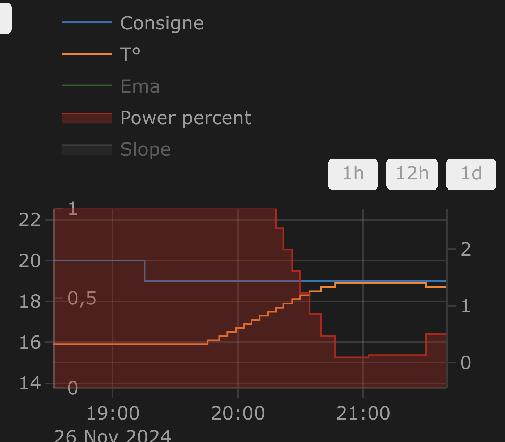

[![GitHub Release][releases-shield]][releases]
[![GitHub Activity][commits-shield]][commits]
[![License][license-shield]](LICENSE)
[![hacs][hacs_badge]][hacs]
[![BuyMeCoffee][buymecoffeebadge]][buymecoffee]

[En](README.md)|[Fr](README-fr.md)

>  This thermostat integration aims to greatly simplify your heating management automations. Since all typical heating events (nobody home?, activity detected in a room?, window open?, power load shedding?), are natively managed by the thermostat, you don’t need to deal with complicated scripts and automations to manage your thermostats. ;-).

This custom component for Home Assistant is an upgrade and a complete rewrite of the "Awesome thermostat" component (see [Github](https://github.com/dadge/awesome_thermostat)) with added features.

# What's new?

> * **Release 6.8**:
>
> Added a new regulation method for `over_climate` type Versatile Thermostats. This method, called 'Direct control of valve', allows direct control of a TRV valve and optionally a calibration offset for the internal thermometer of your TRV. This new method has been tested with Sonoff TRVZB and generalized for other TRV types whose valves can be directly controlled via `number` entities.
>
> More information [here](documentation/en/over-climate.md) and [here](documentation/en/self-regulation.md).
>
> * **Documentation overhaul**:
>
> With all the developments since the start of the integration, the documentation needed a major reorganization, which has been completed in this version. All feedback on this new organization is welcome.

# 🍻 Thanks for the beers [buymecoffee](https://www.buymeacoffee.com/jmcollin78) 🍻
A big thank you to all my beer sponsors for their donations and encouragements. It means a lot to me and motivates me to keep going! If this integration has saved you money, buy me a beer in return; I would greatly appreciate it!

# Glossary

  _VTherm_: Versatile Thermostat as referred to in this document

  _TRV_: Thermostatic Radiator Valve equipped with a valve. The valve opens or closes to allow hot water to pass.

  _AC_: Air Conditioning. An AC device cools instead of heats. Temperatures are reversed: Eco is warmer than Comfort, which is warmer than Boost. The algorithms take this information into account.

# Documentation

The documentation is now divided into several pages for easier reading and searching:
1. [Introduction](documentation/en/presentation.md),
2. [Choosing a VTherm type](documentation/en/creation.md),
3. [Basic attributes](documentation/en/base-attributes.md)
3. [Configuring a VTherm on a `switch`](documentation/en/over-switch.md)
3. [Configuring a VTherm on a `climate`](documentation/en/over-climate.md)
3. [Configuring a VTherm on a valve](documentation/en/over-valve.md)
4. [Presets](documentation/en/feature-presets.md)
5. [Window management](documentation/en/feature-window.md)
6. [Presence management](documentation/en/feature-presence.md)
7. [Motion management](documentation/en/feature-motion.md)
8. [Power management](documentation/en/feature-power.md)
9. [Auto start and stop](documentation/en/feature-auto-start-stop.md)
10. [Centralized control of all VTherms](documentation/en/feature-central-mode.md)
11. [Central heating control](documentation/en/feature-central-boiler.md)
12. [Advanced aspects, security mode](documentation/en/feature-advanced.md)
12. [Self-regulation](documentation/en/self-regulation.md)
13. [Tuning examples](documentation/en/tuning-examples.md)
14. [Algorithms](documentation/en/algorithms.md)
15. [Reference documentation](documentation/en/reference.md)
16. [Tuning examples](documentation/en/tuning-examples.md)
17. [Troubleshooting](documentation/en/troubleshooting.md)
18. [Release notes](documentation/en/releases.md)

# Some results

**Temperature stability around the target configured by preset:**

On/off cycles calculated by the integration (`over_climate`):

**Regulation with an `over_switch`**

See the component's code [[below](#even-better-with-apex-chart-to-tune-your-thermostat)]

**Strong regulation in `over_climate`**

**Regulation with direct valve control in `over_climate`**

Enjoy!

# Contributions are welcome!

If you wish to contribute, please read the [contribution guidelines](CONTRIBUTING.md).

***

[versatile_thermostat]: https://github.com/jmcollin78/versatile_thermostat
[buymecoffee]: https://www.buymeacoffee.com/jmcollin78
[buymecoffeebadge]: https://img.shields.io/badge/Buy%20me%20a%20beer-%245-orange?style=for-the-badge&logo=buy-me-a-beer
[commits-shield]: https://img.shields.io/github/commit-activity/y/jmcollin78/versatile_thermostat.svg?style=for-the-badge
[commits]: https://github.com/jmcollin78/versatile_thermostat/commits/master
[hacs]: https://github.com/custom-components/hacs
[hacs_badge]: https://img.shields.io/badge/HACS-Custom-41BDF5.svg?style=for-the-badge
[forum-shield]: https://img.shields.io/badge/community-forum-brightgreen.svg?style=for-the-badge
[forum]: https://community.home-assistant.io/
[license-shield]: https://img.shields.io/github/license/jmcollin78/versatile_thermostat.svg?style=for-the-badge
[maintenance-shield]: https://img.shields.io/badge/maintainer-Joakim%20Sørensen%20%40ludeeus-blue.svg?style=for-the-badge
[releases-shield]: https://img.shields.io/github/release/jmcollin78/versatile_thermostat.svg?style=for-the-badge
[releases]: https://github.com/jmcollin78/versatile_thermostat/releases