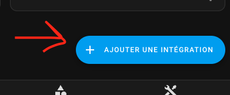

# Výběr VTherm

- [Výběr VTherm](#výběr-vtherm)
  - [Vytvoření nového Versatile Thermostat](#vytvoření-nového-versatile-thermostat)
- [Výběr typu VTherm](#výběr-typu-vtherm)
  - [Centralizovaná konfigurace](#centralizovaná-konfigurace)
  - [VTherm nad spínačem](#vtherm-nad-spínačem)
  - [VTherm nad jiným termostatem](#vtherm-nad-jiným-termostatem)
  - [VTherm nad ventilem](#vtherm-nad-ventilem)
- [Správná volba](#správná-volba)
- [Referenční článek](#referenční-článek)

>  _*Poznámky*_
>
> Existují tři způsoby práce s VTherm:
> 1. Každý Versatile Thermostat je plně konfigurován nezávisle. Vyberte tuto možnost, pokud nechcete žádnou centralizovanou konfiguraci nebo správu.
> 2. Některé aspekty jsou konfigurovány centrálně. Například můžete definovat minimální/maximální teploty, parametry detekce otevřených oken atd. v jedné centrální instanci. Pro každý VTherm, který konfigurujete, pak můžete vybrat použití centrální konfigurace nebo ji přepsat vlastními parametry.
> 3. Kromě centralizované konfigurace mohou být všechny VTherm ovládány jednou entitou `select` nazvanou `central_mode`. Tato funkce umožňuje zastavit/spustit/nastavit ochranu proti mrazu/atd. pro všechny VTherm najednou. Pro každý VTherm můžete specifikovat, zda je ovlivněn tímto `central_mode`.

## Vytvoření nového Versatile Thermostat

Klikněte na "Přidat integraci" na stránce integrací (nebo klikněte na 'Přidat zařízení' na stránce integrací)

poté vyhledejte integraci "versatile thermostat":

a vyberte typ vašeho termostatu:

Konfiguraci lze změnit prostřednictvím stejného rozhraní. Jednoduše vyberte termostat k úpravě, stiskněte "Konfigurovat" a budete moci změnit některé parametry nebo nastavení.

Postupujte podle konfiguračních kroků výběrem možnosti menu ke konfiguraci.

# Výběr typu VTherm

## Centralizovaná konfigurace
Tato možnost umožňuje konfigurovat určité opakující se aspekty pro všechny VTherm najednou, jako jsou:
1. Parametry pro různé algoritmy (TPI, detekce otevřených oken, detekce pohybu, výkonové senzory pro váš domov, detekce přítomnosti). Tyto parametry platí napříč všemi VTherm. Stačí je zadat jednou v `Centralizované konfiguraci`. Tato konfigurace nevytváří VTherm sama o sobě, ale centralizuje parametry, které by bylo únavné znovu zadávat pro každý VTherm. Poznámka: tyto parametry můžete přepsat na jednotlivých VTherm, abyste je specializovali podle potřeby.
2. Konfigurace pro ovládání centrálního topného systému,
3. Určité pokročilé parametry, jako jsou bezpečnostní nastavení.

## VTherm nad spínačem
Tento typ VTherm ovládá spínač, který zapíná nebo vypína radiátor. Spínač může být fyzický spínač přímo ovládající radiátor (často elektrický) nebo virtuální spínač, který může při zapnutí nebo vypnutí provést jakoukoli akci. Posledně jmenovaný typ může například ovládat spínače pilotního drátu nebo DIY řešení pilotního drátu s diodami. VTherm moduluje podíl času, kdy je radiátor zapnutý (`on_percent`), aby dosáhl požadované teploty. Pokud je chladno, zapíná častěji (až na 100%); pokud je teplo, snižuje čas zapnutí.

Podkladové entity pro tento typ jsou `switches` nebo `input_booleans`.

## VTherm nad jiným termostatem
Když je vaše zařízení ovládáno entitou `climate` v Home Assistant a máte přístup pouze k ní, měli byste použít tento typ VTherm. V tomto případě VTherm jednoduše upravuje cílovou teplotu podkladové entity `climate`.

Tento typ také zahrnuje pokročilé funkce samo-regulace pro úpravu setpointu zaslaného podkladovému zařízení, což pomáhá dosáhnout cílové teploty rychleji a zmírňuje špatnou vnitřní regulaci. Například pokud je vnitřní teploměr zařízení příliš blízko topného prvku, může nesprávně předpokládat, že je v místnosti teplo, zatímco setpoint je daleko od dosažení v jiných oblastech.

Od verze 6.8 může tento typ VTherm také regulovat přímo ovládáním ventilu. Ideální pro ovladatelné TRV, jako je Sonoff TRVZB, tento typ je doporučován, pokud máte taková zařízení.

Podkladové entity pro tento typ VTherm jsou výhradně `climate`.

## VTherm nad ventilem
Pokud je jedinou entitou dostupnou pro regulaci teploty vašeho radiátoru entita `number`, měli byste použít typ `over_valve`. VTherm upravuje otevření ventilu na základě rozdílu mezi cílovou teplotou a skutečnou teplotou místnosti (a venkovní teplotou, pokud je dostupná).

Tento typ lze použít pro TRV bez přidružené entity `climate` nebo jiná DIY řešení vystavující entitu `number`.

# Správná volba
>  _*Jak vybrat typ*_
> Výběr správného typu je zásadní. Nelze jej později změnit prostřednictvím konfiguračního rozhraní. Pro správnou volbu zvažte následující otázky:
> 1. **Jaký typ vybavení budu ovládat?** Postupujte podle tohoto pořadí preferencí:
>    1. Pokud máte ovladatelný termostatický ventil (TRV) v Home Assistant prostřednictvím entity `number` (např. Shelly TRV), vyberte typ `over_valve`. To je nejpřímější typ a zajišťuje nejlepší regulaci.
>    2. Pokud máte elektrický radiátor (s pilotním drátem nebo bez něj) ovládaný entitou `switch` pro jeho zapnutí/vypnutí, pak je typ `over_switch` vhodnější. Regulace bude spravována Versatile Thermostat na základě teploty měřené vaším teploměrem na jeho umístění.
>    3. Ve všech ostatních případech použijte režim `over_climate`. Zachováte vaši původní entitu `climate` a Versatile Thermostat "pouze" ovládá stav zapnuto/vypnuto a cílovou teplotu vašeho původního termostatu. Regulace je v tomto případě řešena vaším původním termostatem. Tento režim je obzvláště vhodný pro kompletní reverzibilní klimatizační systémy vystavené jako entita `climate` v Home Assistant. Pokročilá samo-regulace může dosáhnout setpointu rychleji vynucením setpointu nebo přímým ovládáním ventilu, když je to možné.
> 2. **Jaký typ regulace chci?** Pokud má ovládané vybavení vlastní vestavěný regulační mechanismus (např. HVAC systémy, určité TRV) a funguje dobře, vyberte `over_climate`. Pro TRV s ovladatelným ventilem v Home Assistant je typ `over_climate` s samo-regulací `Přímé ovládání ventilu` nejlepší volbou.

# Referenční článek
Pro více informací o těchto konceptech se podívejte na tento článek (ve francouzštině): https://www.hacf.fr/optimisation-versatile-thermostat/#optimiser-vos-vtherm
