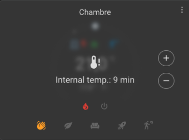

# Pokročilá konfigurace

- [Pokročilá konfigurace](#pokročilá-konfigurace)
  - [Proč tato funkce?](#proč-tato-funkce)
  - [Kontext bezpečnosti](#kontext-bezpečnosti)
  - [Princip režimu bezpečnosti](#princip-režimu-bezpečnosti)
    - [Co je režim bezpečnosti?](#co-je-režim-bezpečnosti)
    - [Kdy se aktivuje?](#kdy-se-aktivuje)
    - [Omezení](#omezení)
  - [Konfigurace](#konfigurace)
  - [Parametry bezpečnosti](#parametry-bezpečnosti)
  - [Vystavené atributy](#vystavené-atributy)
  - [Dostupné akce](#dostupné-akce)
  - [Globální pokročilá konfigurace](#globální-pokročilá-konfigurace)
  - [Praktické rady](#praktické-rady)
  - [Oprava nesprávného stavu zařízení](#oprava-nesprávného-stavu-zařízení)
    - [Proč tato funkce?](#proč-tato-funkce-1)
    - [Případy použití](#případy-použití)
    - [Princip činnosti](#princip-činnosti)
    - [Konfigurace](#konfigurace-1)
    - [Parametry](#parametry)
    - [Vystavené atributy](#vystavené-atributy-1)
    - [Omezení a bezpečnost](#omezení-a-bezpečnost)

## Proč tato funkce?

Pokročilá konfigurace _VTherm_ nabízí základní nástroje pro zajištění bezpečnosti a spolehlivosti vašeho topného systému. Tyto parametry vám umožňují spravovat situace, kdy senzory teploty již nekomunikují správně, což by mohlo vést k nebezpečným nebo neúčinným příkazům.

## Kontext bezpečnosti

Absence nebo selhání teplotního senzoru může být **velmi nebezpečné** pro váš domov. Zvažte tento konkrétní příklad:

- Váš teplotní senzor se zasekne na hodnotě 10°
- Váš _VTherm_ typu `over_climate` nebo `over_valve` detekuje velmi nízkou teplotu
- Příkazuje maximální vytápění podkladního zařízení
- **Výsledek**: místnost se výrazně přehřeje

Důsledky mohou být od jednoduché hmotné škody až po vážnější rizika, jako je požár nebo výbuch (v případě vadného elektrického radiátoru).

## Princip režimu bezpečnosti

### Co je režim bezpečnosti?

Režim bezpečnosti je ochranný mechanismus, který detekuje, kdy senzory teploty již reagují nepravidelně. Když je detekována absence dat, _VTherm_ aktivuje speciální režim, který:

1. **Snižuje okamžité riziko**: systém již neposílá příkazy maximálního výkonu
2. **Udržuje minimální vytápění**: zajišťuje, že se dům nepřeměřuje nadměrně
3. **Vás upozorňuje**: změnou stavu termostatu, viditelnou v Home Assistant

### Kdy se aktivuje?

Režim bezpečnosti se aktivuje, když:

- **Chybí vnitřní teplota**: od nastavené maximální prodlevy nebyla přijata žádná měření
- **Chybí venkovní teplota**: od nastavené maximální prodlevy nebyla přijata žádná měření (volitelné)
- **Senzor je zaseknutý**: senzor již neposílá změny hodnot (typické chování baterií napájených senzorů)

Zvláštní výzvou jsou bateriemi napájené senzory, které odesílají data pouze při **změně** hodnoty. Je proto možné po mnoho hodin nepřijímat aktualizace bez skutečné poruchy senzoru. Proto jsou parametry konfigurovatelné, aby se detekce přizpůsobila vaší instalaci.

### Omezení

- **_VTherm_ typu `over_climate` s vlastní regulací**: režim bezpečnosti je automaticky zakázán. Neexistuje žádné nebezpečí, pokud se zařízení reguluje samo (udržuje svou vlastní teplotu). Jediným rizikem je nepohodlná teplota, ne fyzické nebezpečí.

## Konfigurace

Konfigurace pokročilých parametrů bezpečnosti:

1. Otevřete konfiguraci svého _VTherm_
2. Přejděte na parametry obecné konfigurace
3. Posuňte se dolů do sekce "Pokročilá konfigurace"

Formulář pokročilé konfigurace vypadá takto:


>  _*Doporučení*_
>
> Pokud má váš teploměr atribut `last_seen` nebo podobný, který udává čas posledního kontaktu, **nakonfigurujte tento atribut** v hlavních výběrech vašeho _VTherm_. To výrazně zlepšuje detekci a snižuje falešné varování. Podívejte se na [konfiguraci základních atributů](base-attributes.md#volba-základních-atributů) a [řešení problémů](troubleshooting.md#proč-můj-versatile-thermostat-přejde-do-režimu-bezpečnosti-) pro více podrobností.

## Parametry bezpečnosti

| Parametr | Popis | Výchozí hodnota | Název atributu |
| --- | --- | --- | --- |
| **Maximální prodleva před režimem bezpečnosti** | Maximální povolená prodleva mezi dvěma měřeními teploty, než _VTherm_ vstoupí do režimu bezpečnosti. Pokud po této prodlevě nebude přijato nové měření, aktivuje se režim bezpečnosti. | 60 minut | `safety_delay_min` |
| **Minimální prahová hodnota `on_percent` pro bezpečnost** | Minimální procento `on_percent`, pod kterým se režim bezpečnosti neaktivuje. To zabraňuje aktivaci režimu bezpečnosti, když radiátor běží velmi málo (`on_percent` nízký), protože neexistuje okamžité riziko přehřátí. `0.00` režim vždy aktivuje, `1.00` jej úplně zakáže. | 0.5 (50%) | `safety_min_on_percent` |
| **Výchozí hodnota `on_percent` v režimu bezpečnosti** | Topný výkon používaný, když je termostat v režimu bezpečnosti. `0` zcela zastaví vytápění (riziko zmrznutí), `0.1` udržuje minimální vytápění, aby se zabránilo zmrznutí v případě dlouhodobého selhání teploměru. | 0.1 (10%) | `safety_default_on_percent` |

## Vystavené atributy

Když je režim bezpečnosti aktivní, _VTherm_ vystavují následující atributy:

```yaml
safety_mode: "on"                # "on" nebo "off"
safety_delay_min: 60             # Nastavená prodleva v minutách
safety_min_on_percent: 0.5       # Prahová hodnota on_percent (0.0 až 1.0)
safety_default_on_percent: 0.1   # Výkon v režimu bezpečnosti (0.0 až 1.0)
last_safety_event: "2024-03-20 14:30:00"  # Čas poslední události
```

## Dostupné akce

Akce _VTherm_ umožňuje dynamickou rekonfiguraci 3 parametrů bezpečnosti bez restartování Home Assistant:

- **Služba**: `versatile_thermostat.set_safety_parameters`
- **Parametry**:
  - `entity_id`: _VTherm_ k rekonfiguraci
  - `safety_delay_min`: nová prodleva (minuty)
  - `safety_min_on_percent`: nová prahová hodnota (0.0 až 1.0)
  - `safety_default_on_percent`: nový výkon (0.0 až 1.0)

To umožňuje dynamicky přizpůsobit citlivost režimu bezpečnosti podle vašeho použití (například snížit prodlevu, když jsou doma lidé, nebo ji zvýšit, když je dům neobsazený).

## Globální pokročilá konfigurace

Je možné zakázat kontrolu **venkovního teplotního senzoru** pro režim bezpečnosti. Venkovní senzor má obecně malý vliv na regulaci (v závislosti na vaší konfiguraci) a může být nepřítomný bez ohrožení bezpečnosti domu.

To se provádí přidáním následujících řádků do `configuration.yaml`:

```yaml
versatile_thermostat:
  safety_mode:
    check_outdoor_sensor: false
```

>  _*Důležité*_
>
> - Tato změna je **společná pro všechny _VTherm_** v systému
> - Ovlivňuje detekci venkovního teploměru pro všechny termostaty
> - **Home Assistant musí být restartován**, aby se změny projevily
> - Ve výchozím nastavení může venkovní teploměr aktivovat režim bezpečnosti, pokud přestane odesílat data

## Praktické rady

>  _*Poznámky a osvědčené postupy*_

1. **Obnovení po opravě**: Když se teplotní senzor vrátí k životu a znovu začne odesílat data, režim přednastaveného nastavení bude obnoven na jeho předchozí hodnotu.

2. **Vyžadovány dvě teploty**: Systém potřebuje jak vnitřní, tak venkovní teplotu, aby fungoval správně. Pokud některá z nich chybí, termostat vstoupí do režimu bezpečnosti.

3. **Vztah mezi parametry**: Pro přirozený provoz by měla být hodnota `safety_default_on_percent` **menší než** `safety_min_on_percent`. Například: `safety_min_on_percent = 0.5` a `safety_default_on_percent = 0.1`.

4. **Přizpůsobení vašemu senzoru**:
   - Pokud máte **falešná varování**, zvyšte prodlevu (`safety_delay_min`) nebo snižte `safety_min_on_percent`
   - Pokud máte senzory napájené bateriemi, zvyšte prodlevu dále (např.: 2-4 hodiny)
   - Pokud používáte atribut `last_seen`, lze prodlevu snížit (systém je přesnější)

5. **Vizualizace v uživatelském rozhraní**: Pokud používáte [kartičku _Versatile Thermostat UI_](additions.md#lépe-s-kartičkou-versatile-thermostat-ui), _VTherm_ v režimu bezpečnosti je vizuálně indikován:
   - Šedavým závojem přes termostat
   - Zobrazením vadného senzoru
   - Časem uplynulým od poslední aktualizace

   .

## Oprava nesprávného stavu zařízení

### Proč tato funkce?

Při použití _VTherm_ s topným zařízením (`over_switch`, `over_valve`, `over_climate`, `over_climate_valve`) se může stát, že zařízení správně nedodržuje příkaz odeslaný termostatem. Například:

- Zaujetý relé, které se nepřepne do příkazovaného stavu
- Termostatický ventil, který neposlechne příkazy
- Dočasná ztráta komunikace se zařízením
- Zařízení, které trvá příliš dlouho v reagování

Funkce **"Oprava nesprávného stavu"** detekuje tyto situace a automaticky opětovně odešle příkaz pro synchronizaci skutečného stavu s požadovaným stavem.

### Případy použití

Tato funkce je obzvláště užitečná pro:

- **Nestabilní relé**: relé, která se zasekávají nebo ne vždy správně přepínají
- **Přerušovaná komunikace Zigbee/WiFi**: zařízení, která občas ztrácí připojení
- **Pomalé ventily**: termostatické ventily, které reagují pomalu na příkazy
- **Vadné zařízení**: elektrické radiátory nebo ventily, které již neposlechají příkazy
- **Tepelná čerpadla**: aby se zajistilo, že tepelné čerpadlo správně provádí příkazy vytápění/chlazení

### Princip činnosti

V každém cyklu řízení termostatu funkce:

1. **Porovnává stavy**: ověřuje, že skutečný stav každého zařízení odpovídá příkazovanému stavu
2. **Detekuje nesrovnalosti**: pokud zařízení příkazu nedodrželo, jedná se o nesrovnalost
3. **Opětovně odešle příkaz**: pokud je detekována nesrovnalost, opětovně odešle příkaz pro synchronizaci stavu
4. **Počítá pokusy**: počet po sobě jdoucích oprav je omezen, aby se zabránilo nekonečným smyčkám
5. **Řídí aktivaci**: funkce se aktivuje pouze po minimální prodlevě, aby zařízení skončily inicializaci

### Konfigurace

Tato funkce se konfiguruje v rozhraní konfigurace _VTherm_:

1. Otevřete konfiguraci svého _VTherm_
2. Přejděte na parametry obecné konfigurace
3. Posuňte se dolů do sekce "Pokročilá konfigurace"
4. Povolte možnost **"Opravit nesprávný stav zařízení"**

### Parametry

| Parametr | Popis | Výchozí hodnota |
| --- | --- | --- |
| **Opravit nesprávný stav** | Povolí nebo zakáže automatickou detekci a opravu nesrovnalostí řetězu. Pokud je povoleno, každá detekovaná nesrovnalost spustí opětovné odeslání příkazu. | Zakázáno |

>  _*Interní parametry systému*_
>
> Některé parametry se konfigurují na úrovni systému a nelze je měnit:
> - **Minimální prodleva před aktivací**: 30 sekund po spuštění termostatu (umožňuje inicializaci všech zařízení)
> - **Maximální po sobě jdoucí pokusy**: 5 po sobě jdoucích oprav před dočasným zastavením
> - **Prodleva resetování**: počitadlo oprav se resetuje, jakmile se zařízení vrátí do správného stavu

### Vystavené atributy

Když je funkce opravy povolena, _VTherm_ vystavují následující atribut:

```yaml
repair_incorrect_state_manager:
  consecutive_repair_count: 2       # Počet provedených po sobě jdoucích oprav
  max_attempts: 5                   # Maxima před dočasným zastavením
  min_delay_after_init_sec: 30      # Minimální prodleva před aktivací
is_repair_incorrect_state_configured: true  # Stav funkce
```

Počitadlo `consecutive_repair_count` vám umožní:
- Diagnostikovat časté hardwarové problémy
- Identifikovat vadné zařízení
- Sledovat stabilitu instalace

### Omezení a bezpečnost

>  _*Důležité*_

1. **Žádná změna chování**: Tato funkce nezmění logiku vytápění. Jednoduše zajišťuje, aby se vaše příkazy správně prováděly.

2. **Bezpečnostní uzávěr**: Maximální po sobě jdoucí pokusy (5) zabraňují nekonečným smyčkám. Pokud je dosaženo tohoto limitu, je zaznamenána chyba a opravy se dočasně zastaví.

3. **Prodleva spuštění**: Funkce se aktivuje pouze po 30 sekundách, aby všechna zařízení měla čas se plně inicializovat.

4. **Použitelné pro všechny typy _VTherm_**: Tato funkce funguje pro všechny typy `over_switch`, `over_valve`, `over_climate` a `over_climate_valve` (`over_climate` s přímou regulací ventilu). U posledně jmenovaných se ověřuje stav podkladního `climate` i stav otevření ventilu.

5. **Příznaky nadměrné aktivity**: Pokud pravidelně vidíte varovné zprávy o opravách, znamená to hardwarový problém:
   - Zkontrolujte připojení zařízení
   - Zkontrolujte stabilitu sítě (Zigbee/WiFi)
   - Ručně otestujte zařízení přes Home Assistant
   - Zvažte výměnu, pokud problém přetrvává

6. **Resetování počitadla**: Počitadlo se automaticky resetuje, jakmile se zařízení vrátí do správného stavu, což umožňuje nové pokusy v případě přerušovaných problémů.

7. **Běžné opakování**: Po 5 neúspěšných pokusech o opravu se oprava pozastaví, aby se zabránilo nekonečným smyčkám. Obnoví se po 10 cyklech bez opravy, což umožňuje nové pokusy v případě přerušovaných problémů.
