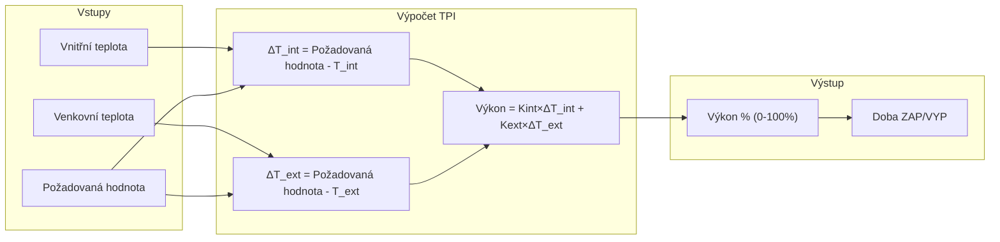
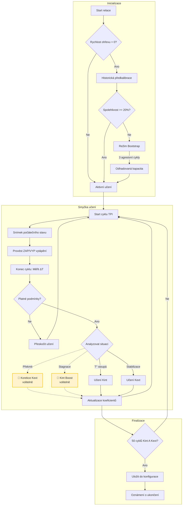
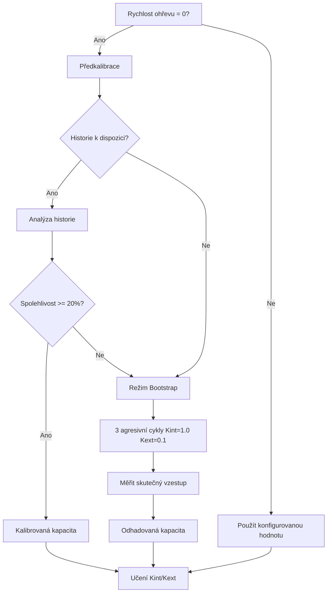
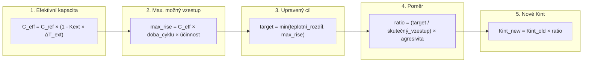
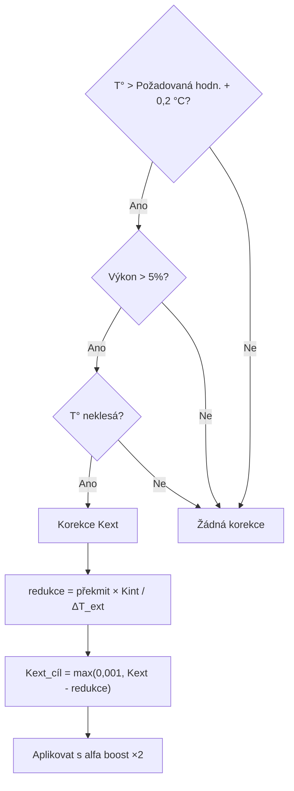
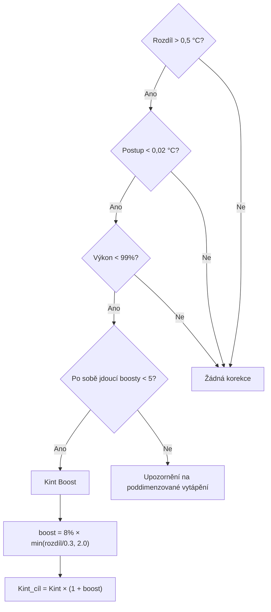
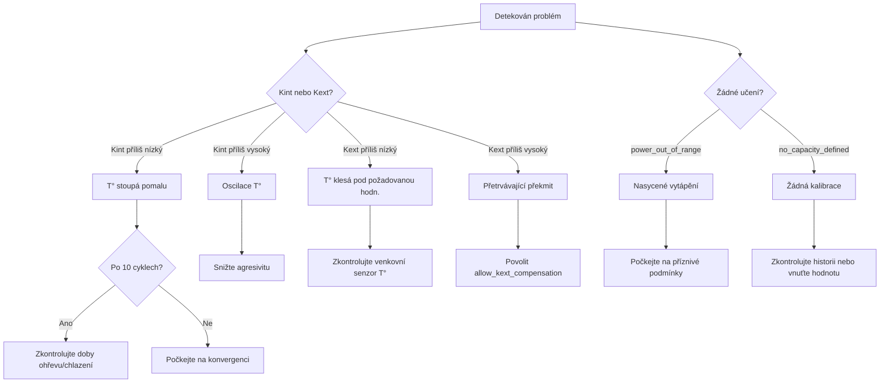

# 🧠 Auto TPI: Podrobný technický průvodce

> [!NOTE]
> Tento dokument je určen pro pokročilé uživatele, kteří chtějí podrobně porozumět algoritmu Auto TPI. Pro přístupnější úvod viz [Uživatelská příručka Auto TPI](feature-autotpi.md).

---

## Obsah

1. [Algoritmus TPI](#algoritmus-tpi)
2. [Detailní cyklus učení](#detailní-cyklus-učení)
3. [Kalibrace tepelné kapacity](#kalibrace-tepelné-kapacity)
4. [Algoritmy pro výpočet koeficientů](#algoritmy-pro-výpočet-koeficientů)
5. [Mechanismy automatické korekce](#mechanismy-automatické-korekce)
6. [Pokročilé parametry a konstanty](#pokročilé-parametry-a-konstanty)
7. [Služby a API](#služby-a-api)
8. [Pokročilá diagnostika a řešení problémů](#pokročilá-diagnostika-a-řešení-problémů)

---

## Algoritmus TPI

### Základní princip

Algoritmus **TPI** (Time Proportional & Integral) vypočítává v každém cyklu **procento výkonu**. Toto procento určuje, jak dlouho bude ohřívač během cyklu aktivní (např. 60 % v 10minutovém cyklu = 6 minut vytápění).

### Základní vzorec

```
Výkon = (Kint × ΔT_vnitřní) + (Kext × ΔT_venkovní)
```

Kde:
- **Kint** (`tpi_coef_int`): Vnitřní koeffizient, reaguje na rozdíl od požadované hodnoty
- **Kext** (`tpi_coef_ext`): Venkovní koeficient, kompenzuje tepelné ztráty
- **ΔT_vnitřní** = Požadovaná hodnota − Vnitřní teplota
- **ΔT_venkovní** = Požadovaná hodnota − Venkovní teplota



### Role koeficientů

| Koeficient | Role | Situační učení |
|-------------|------|-------------------|
| **Kint** | Řídí **reaktivitu**: čím vyšší je, tím rychleji vytápění reaguje na rozdíly | Během **vzestupu teploty** (rozdíl > 0,05 °C, výkon < 99 %) |
| **Kext** | Kompenzuje **tepelné ztráty**: čím vyšší je, tím více vytápění předvídá ochlazování | Během **stabilizace** kolem požadované hodnoty (rozdíl < 0,5 °C) |

---

## Detailní cyklus učení

### Přehled toku



> [!NOTE]
> **Žluté boxy s čárkovanými čarami** (🔸) představují **volitelné** korekční mechanismy. Musí být explicitně povoleny prostřednictvím parametrů služby `set_auto_tpi_mode`.

### Podrobnosti o snímku cyklu

Na začátku každého cyklu algoritmus zachytí aktuální stav:

| Zachycená data | Využití |
|---------------|-------|
| `last_temp_in` | Vnitřní teplota na začátku cyklu |
| `last_temp_out` | Venkovní teplota na začátku cyklu |
| `last_order` | Požadovaná hodnota na začátku cyklu |
| `last_power` | Vypočtený výkon pro tento cyklus (0,0 až 1,0) |
| `last_state` | Režim HVAC (vytápění/chlazení) |

Na konci cyklu jsou tyto hodnoty porovnány s aktuálními měřeními pro výpočet postupu.

### Podmínky validace cyklu

Cyklus je pro učení **ignorován**, pokud:

| Podmínka | Důvod |
|-----------|--------|
| Výkon = 0 % nebo 100 % | Nasycení: žádné využitelné informace o účinnosti |
| Požadovaná hodnota změněna | Cíl změněn uprostřed cyklu |
| Aktivní odpojování zátěže | Vytápění bylo nuceně vypnuto Správcem výkonu |
| Detekována porucha | Detekována anomálie (neúčinné vytápění) |
| Centrální kotel VYPNUT | Termostat vyžaduje, ale kotel nereaguje |
| První cyklus po restartu | Žádná platná referenční data |

---

## Kalibrace tepelné kapacity

### Definice

**Tepelná kapacita** (nebo **rychlost ohřevu**) představuje maximální rychlost vzestupu teploty vašeho systému, vyjádřenou v **°C za hodinu** (°C/h).

Příklad: Kapacita 2,0 °C/h znamená, že váš radiátor dokáže při plném výkonu zvýšit teplotu o 2 °C za jednu hodinu (za ideálních adiabatických podmínek).

### Metody určení



### Předkalibrace pomocí analýzy historie

Služba `auto_tpi_calibrate_capacity` analyzuje historii senzorů:

1. **Získání** dat `temperature_slope` a `power_percent` za 30 dní
2. **Filtrování**: ponechá pouze body, kde `power >= 95 %`
3. **Eliminace odlehlých hodnot** pomocí metody IQR (Interquartile Range)
4. **Výpočet 75. percentilu** sklonů (reprezentativnější než medián)
5. **Adiabatická korekce**: `Kapacita = P75 + Kext × ΔT`
6. **Aplikace bezpečnostní rezervy**: standardně 20 %

### Režim Bootstrap

Pokud je historie nedostatečná (spolehlivost < 20 %), systém přejde do **režimu bootstrap**:

- **Agresivní koeficienty**: Kint = 1.0, Kext = 0.1
- **Trvání**: minimálně 3 cykly
- **Cíl**: Vyvolat významný vzestup teploty pro měření skutečné kapacity
- **Bezpečnostní časový limit**: Pokud dojde k selhání po 5 cyklech, výchozí kapacita = 0,3 °C/h (pomalé systémy)

---

## Algoritmy pro výpočet koeficientů

### Učení Kint (Vnitřní koeficient)

Algoritmus upravuje Kint, když teplota **stoupá** k požadované hodnotě.

#### Podrobný vzorec



#### Použité proměnné

| Proměnná | Popis | Typická hodnota |
|----------|-------------|---------------|
| `C_ref` | Kalibrovaná referenční kapacita | 1,5 °C/h |
| `Kext` | Aktuální venkovní koeficient | 0,02 |
| `ΔT_ext` | Rozdíl vnitřní/venkovní teploty | 15 °C |
| `doba_cyklu` | V hodinách | 0,167 (10 min) |
| `účinnost` | Použité procento výkonu | 0,70 |
| `agresivita` | Faktory moderování | 0,9 |

### Učení Kext (Venkovní koeficient)

Algoritmus upravuje Kext, když je teplota **blízko požadované hodnoty** (|rozdíl| < 0,5 °C).

#### Vzorec

```
Korekce = Kint × (vnitřní_rozdíl / venkovní_rozdíl)
Kext_new = Kext_old + Korekce
```

- Pokud je vnitřní_rozdíl **záporný** (překmit) → Záporná korekce → **Kext klesá**
- Pokud je vnitřní_rozdíl **kladný** (nedostatečný ohřev) → Kladná korekce → **Kext stoupá**

### Metody vyhlazování

K vyhlazení nových hodnot jsou k dispozici dvě metody:

#### Vážený průměr (režim "Discovery")

```
Kint_final = (Kint_old × počet + Kint_new) / (počet + 1)
```

| Cyklus | Stará váha | Nová váha | Dopad nové hodnoty |
|-------|------------|------------|------------------|
| 1 | 1 | 1 | 50 % |
| 10 | 10 | 1 | 9 % |
| 50 | 50 | 1 | 2 % |

> Počítadlo je omezeno na 50 pro zachování minimální reaktivity.

#### EWMA (režim "Fine Tuning")

```
Kint_final = (1 - α) × Kint_old + α × Kint_new
α(n) = α₀ / (1 + decay_rate × n)
```

| Parametr | Výchozí | Popis |
|-----------|---------|-------------|
| `α₀` (počáteční alfa) | 0,08 | Počáteční váha nových hodnot |
| `decay_rate` | 0,12 | Rychlost poklesu alfa |

---

## Mechanismy automatické korekce

### Korekce překmitu (Kext Deboost)

> **Aktivace**: Parametr `allow_kext_compensation_on_overshoot` ve službě `set_auto_tpi_mode`

Detekuje a koriguje stav, kdy teplota **překročí požadovanou hodnotu**, aniž by klesala zpět.



### Korekce stagnace (Kint Boost)

> **Aktivierung**: Parametr `allow_kint_boost_on_stagnation` ve službě `set_auto_tpi_mode`

Detekuje a koriguje stav, kdy teplota **stagnuje** navzdory významnému rozdílu.



---

## Pokročilé parametry a konstanty

### Interní konstanty (nekonfigurovatelné)

| Konstanta | Hodnota | Popis |
|----------|-------|-------------|
| `MIN_KINT` | 0,01 | Spodní hranice Kint pro zachování reaktivity |
| `OVERSHOOT_THRESHOLD` | 0,2 °C | Práh překmitu pro spuštění korekce |
| `OVERSHOOT_POWER_THRESHOLD` | 5 % | Minimální výkon pro považování překmitu za chybu Kext |
| `OVERSHOOT_CORRECTION_BOOST` | 2,0 | Násobitel alfa během korekce |
| `NATURAL_RECOVERY_POWER_THRESHOLD` | 20 % | Max. výkon pro přeskočení učení v přirozené obnově |
| `INSUFFICIENT_RISE_GAP_THRESHOLD` | 0,5 °C | Min. rozdíl pro spuštění Kint boostu |
| `MAX_CONSECUTIVE_KINT_BOOSTS` | 5 | Limit před upozorněním na poddimenzování |
| `MIN_PRE_BOOTSTRAP_CALIBRATION_RELIABILITY` | 20 % | Min. spolehlivost pro přeskočení bootstrapu |

### Konfigurovatelné parametry

| Parametr | Typ | Výchozí | Rozsah |
|-----------|------|---------|-------|
| **Agresivita** | Posuvník | 1.0 | 0.5 - 1.0 |
| **Doba ohřevu** | Minuty | 5 | 1 - 30 |
| **Doba ochlazování** | Minuty | 7 | 1 - 60 |
| **Rychlost ohřevu** | °C/h | 0 (auto) | 0 - 5.0 |
| **Počáteční váha** (Discovery) | Celé číslo | 1 | 1 - 50 |
| **Alpha** (Fine Tuning) | Float | 0.08 | 0.01 - 0.3 |
| **Rychlost poklesu** | Float | 0.12 | 0.0 - 0.5 |

---

## Služby a API

### `versatile_thermostat.set_auto_tpi_mode`

Ovládá spuštění/zastavení učení.

```yaml
service: versatile_thermostat.set_auto_tpi_mode
target:
  entity_id: climate.my_thermostat
data:
  auto_tpi_mode: true                    # true = start, false = stop
  reinitialise: true                     # true = úplný reset, false = pokračovat
  allow_kint_boost_on_stagnation: false  # Boost Kint při stagnaci
  allow_kext_compensation_on_overshoot: false  # Korekce Kext při překmitu
```

### `versatile_thermostat.auto_tpi_calibrate_capacity`

Kalibruje tepelnou kapacitu z historie.

```yaml
service: versatile_thermostat.auto_tpi_calibrate_capacity
target:
  entity_id: climate.my_thermostat
data:
  start_date: "2024-01-01T00:00:00+00:00"  # Volitelné
  end_date: "2024-02-01T00:00:00+00:00"    # Volitelné
  min_power_threshold: 95                   # Min % výkonu
  capacity_safety_margin: 20                # % bezpečnostní rezervy
  save_to_config: true                      # Uložit do konfigurace
```

**Návratové hodnoty služby**:

| Klíč | Popis |
|-----|-------------|
| `max_capacity` | Vypočtená hrubá kapacita (°C/h) |
| `recommended_capacity` | Kapacita po rezervě (°C/h) |
| `reliability` | Index spolehlivosti (%) |
| `samples_used` | Počet použitých vzorků |
| `outliers_removed` | Počet odstraněných odlehlých hodnot |

---

## Pokročilá diagnostika a řešení problémů

### Diagnostický senzor

Entita: `sensor.<name>_auto_tpi_learning_state`

| Atribut | Popis |
|-----------|-------------|
| `active` | Učení probíhá |
| `heating_cycles_count` | Celkový počet sledovaných cyklů |
| `coeff_int_cycles` | Validované cykly Kint |
| `coeff_ext_cycles` | Validované cykly Kext |
| `model_confidence` | Spolehlivost 0.0 - 1.0 |
| `calculated_coef_int` | Aktuální Kint |
| `calculated_coef_ext` | Aktuální Kext |
| `last_learning_status` | Důvod posledního cyklu |
| `capacity_heat_status` | `learning` nebo `learned` |
| `capacity_heat_value` | Aktuální kapacita (°C/h) |

### Společné stavy učení

| Stav | Význam | Doporučená akce |
|--------|---------|------------------|
| `learned_indoor_heat` | Kint úspěšně aktualizováno | Normální |
| `learned_outdoor_heat` | Kext úspěšně aktualizováno | Normální |
| `power_out_of_range` | Výkon na 0 % nebo 100 % | Počkejte na nenasycený cyklus |
| `real_rise_too_small` | Vzestup < 0,01 °C | Zkontrolujte senzor nebo dobu cyklu |
| `setpoint_changed_during_cycle` | Požadovaná hodnota změněna | Neměňte požadovanou hodnotu |
| `no_capacity_defined` | Žádná kalibrovaná kapacita | Počkejte na kalibraci/bootstrap |
| `corrected_kext_overshoot` | Aplikována korekce překmitu | Normální, pokud je Kext příliš vysoký |
| `corrected_kint_insufficient_rise` | Aplikován boost Kint | Normální, pokud je Kint příliš nízký |
| `max_kint_boosts_reached` | 5 po sobě jdoucích boostů | **Poddimenzované vytápění** |

### Diagnostický rozhodovací strom



### Soubor perzistence

**Umístění**: `.storage/versatile_thermostat_{unique_id}_auto_tpi_v2.json`

Tento soubor obsahuje kompletní stav učení a obnovuje se při restartu Home Assistant. Lze jej smazat pro vynucení úplného resetu (nedoporučuje se).

---

## Přílohy

### Doporučené referenční hodnoty

| Typ vytápění | Doba ohřevu | Doba chladnutí | Typická kapacita |
|--------------|--------------|--------------|------------------|
| Elektrický konvektor | 2-5 min | 3-7 min | 2,0-3,0 °C/h |
| Akumulační radiátor | 5-10 min | 10-20 min | 1,0-2,0 °C/h |
| Podlahové vytápění | 15-30 min | 30-60 min | 0,3-0,8 °C/h |
| Centrální kotel | 5-15 min | 10-30 min | 1,0-2,5 °C/h |

### Kompletní matematické vzorce

**Efektivní kapacita**:
$$C_{eff} = C_{ref} \times (1 - K_{ext} \times \Delta T_{ext})$$

**Adaptivní Alpha (EWMA)**:
$$\alpha(n) = \frac{\alpha_0}{1 + k \times n}$$

**Spolehlivost kalibrace**:
$$reliability = 100 \times \min\left(\frac{samples}{20}, 1\right) \times \max\left(0, 1 - \frac{CV}{2}\right)$$

Kde CV = variační koeficient (směrodatná odchylka / průměr)
