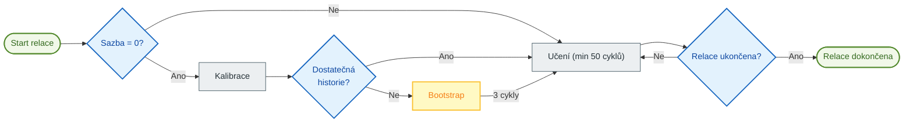

# 🧠 Auto TPI: Automatické učení

> [!NOTE]
> Tato funkce je primárně určena pro systémy vytápění typu **Switch** (On/Off), jako jsou elektrické radiátory, kotle, podlahové vytápění nebo peletová kamna. Přizpůsobení pro termostatické radiátorové ventily (TRV) zůstává problematické kvůli jejich nelinearitě.

**Auto TPI** umožňuje vašemu termostatu, aby se sám naučil tepelné charakteristiky vaší místnosti. Automaticky upravuje koeficienty $K_{int}$ (vnitřní setrvačnost) a $K_{ext}$ (vnější izolace), aby dosáhl a udržel vaši požadovanou teplotu s optimální přesností.

> [!TIP]
> **Pro pokročilé uživatele**: Detailní technická dokumentace vysvětlující algoritmy, matematické vzorce a vnitřní mechanismy je k dispozici zde: [Technická dokumentace Auto TPI](feature-autotpi-technical.md).

---

## 🔄 Cyklus relace

Auto TPI pracuje prostřednictvím **jednorázových učebních relací**. Během relace systém dynamicky analyzuje reakci vaší místnosti: nejprve vyhodnotí skutečný výkon vašeho vytápění, poté upraví Kint a Kext v průběhu minimálně 50 TPI cyklů na každý koeficient.

1.  **Inicializace**: Pokud je **Rychlost ohřevu** (Heat Rate) 0, systém se nejprve pokusí o **Kalibraci** analýzou vašich historických dat o teplotě, sklonu a výkonu (přes službu `calibrate_capacity`).
2.  **Režim Bootstrap**: Pokud historie není dostatečně spolehlivá pro odhad rychlosti ohřevu, systém přejde do režimu **Bootstrap**. Provede 3 intenzivní topné cykly, aby určil topný výkon vašeho radiátoru.
3.  **Aktivní učení**: Jakmile je rychlost ohřevu známa, systém zpřesňuje koeficienty TPI v každém cyklu. Tato fáze trvá **minimálně 50 cyklů** na každý koeficient, aby byla zajištěna jejich stabilita.
4.  **Ukládání**: Na konci relace (přibližně 48 hodin) se naučené koeficienty **a** konečná rychlost ohřevu automaticky uloží do vaší trvalé konfigurace.

### Kdy se upravují Kint a Kext?

Systém se učí oba koeficienty v různých situacích:

| Koeficient | Situační učení | Vysvětlení |
| :--- | :--- | :--- |
| **Kint** (vnitřní setrvačnost) | Během **vzestupu teploty**, když je odchylka od požadované hodnoty významná (> 0,05 °C) a vytápění není nasycené (100 %). | Kint řídí citlivost vytápění. Upravuje se, když systém potřebuje "dohnat" požadovanou hodnotu. |
| **Kext** (vnější izolace) | Během **stabilizace kolem požadované hodnoty**, když je odchylka malá (< 1 °C). | Kext kompenzuje tepelné ztráty směrem ven. Upravuje se, když systém udržuje teplotu. |

> [!TIP]
> Proto je důležité během učení vytvářet rozmanité topné cykly: vzestup teploty umožňuje nastavení Kint a stabilizace umožňuje nastavení Kext.

> [!NOTE]
> **Nasycené cykly**: Cykly s výkonem **0 %** nebo **100 %** jsou pro výpočet koeficientů Kint a Kext **ignorovány** (protože neposkytují žádné využitelné informace o tepelné odezvě). Cykly na 100 % se však používají k nastavení **rychlosti ohřevu**.

---

## 🚀 Spuštění učení

Jakmile je funkce **Auto TPI** povolena a nakonfigurována pro váš termostat, učení se nespustí automaticky. Musíte jej spustit ručně:

1.  **Přes vyhrazenou kartu (doporučeno)**: Použijte tlačítko "Play" na kartě [Auto TPI Learning Card](https://github.com/KipK/auto-tpi-learning-card).
2.  **Přes službu "Set Auto TPI Mode"**: Zavolejte tuto službu (`set_auto_tpi_mode`) z vývojářských nástrojů. Tato služba spouští nebo zastavuje relaci Auto TPI.

---

## ⚙️ Standardní konfigurace

Při povolení Auto TPI jsou k dispozici následující parametry:

| Parametr | Popis |
| :--- | :--- |
| **Typ učení** | **Discovery** (pro počáteční učení) nebo **Fine Tuning** (pro doladění stávajícího nastavení). |
| **Agresivita** | Redukční faktor koeficientu (1.0 = 100 %). Snižte tuto hodnotu (např. 0.8), pokud pozorujete časté překmity teploty. |
| **Doba ohřevu** | Čas potřebný k tomu, aby vaše zařízení dosáhlo plného výkonu (např. 5 min pro elektrický radiátor). |
| **Doba ochlazování** | Čas potřebný k ochlazení po vypnutí (např. 7 min pro elektrický radiátor). |
| **Rychlost ohřevu** | Kapacita vzestupu teploty (°C/hodinu). Ponechte na **0**, aby ji systém vypočítal automaticky pomocí kalibrace nebo bootstrapu. |

---

## 🛠️ Pokročilá konfigurace

Pokud zaškrtnete "Povolit pokročilé parametry", získáte přístup k jemnému nastavení algoritmů.

### Metoda "Discovery" (Vážený průměr)
Používá se pro rychlou stabilizaci nového systému.
-   **Počáteční váha** (1 až 50): Definuje důležitost aktuálních koeficientů ve srovnání s novými zjištěními.
    -   Při **1**: Nově vypočtené koeficienty téměř úplně nahradí ty staré. Učení je rychlé, ale citlivé na rušení.
    -   Při **50**: Staré koeficienty mají mnohem větší váhu. Učení je velmi pomalé, ale velmi stabilní.
    -   **Tip**: Pro počáteční učení ponechte na 1. Pokud chcete pokračovat v přerušeném učení při zachování určitého pokroku, použijte střední hodnotu (např. 25).

### Metoda "Fine Tuning" (EWMA)
Používá se pro hladkou a velmi přesnou adaptaci.
-   **Alpha**: Vyhlazovací faktor. Čím vyšší je, tím rychleji systém reaguje na nedávné změny.
-   **Rychlost poklesu (Decay Rate)**: Umožňuje postupně snižovat rychlost učení pro stabilizaci na nejlepších nalezených hodnotách.

---

## 💡 Best Practices

### Vyhněte se vnějším vlivům
Během učební relace (zejména v prvních několika hodinách) se snažte vyhnout:
-   Přímému slunečnímu záření na teplotní senzor.
-   Používání sekundárního zdroje tepla (krb, kamna).
-   Masivnímu průvanu (otevřené dveře).
Tyto faktory zkreslují vnímání izolace vaší místnosti systémem.

### Vyhněte se extrémním podmínkám

> [!CAUTION]
> **Nespouštějte učení, pokud jsou vaše ohřívače nasycené** (neustále 100 % výkonu). K tomu obvykle dochází během výjimečných mrazů, kdy vytápění již nemůže dosáhnout požadované hodnoty. V těchto podmínkách se systém nemůže správně učit, protože nemá žádnou rezervu pro úpravu výkonu. Na spuštění učební relace počkejte na mírnější počasí.

### Ideální průběh relace "Discovery"

> [!TIP]
> **Konkrétní příklad**: Pokud je vaše obvyklá požadovaná teplota **18 °C**, dočasně ji snižte na **15 °C** a počkejte, až se místnost stabilizuje. Poté restartujte učení a nastavte požadovanou teplotu zpět na **18 °C**. Tím vznikne rozdíl 3 °C, který systém bude sledovat pro své učení.

1.  **Příprava**: Snižte požadovanou teplotu alespoň o 3 °C pod vaši obvyklou teplotu. Nechte místnost vychladnout a stabilizovat na této nové teplotě.
2.  **Spuštění**: Aktivujte učení a **nastavte požadovanou teplotu zpět na její obvyklou hodnotu**. Systém bude sledovat vzestup teploty.
3.  **Stabilizace**: Nechte systém několik hodin stabilizovat teplotu kolem požadované hodnoty.
4.  **Stimulace**: Jakmile se koeficienty přestanou výrazně měnit, vyvolejte nový topný cyklus snížením požadované teploty o 2 °C a následným zvýšením zpět.
5.  **Stabilizace**: Nechte systém několik hodin stabilizovat teplotu kolem požadované hodnoty.
6.  **Dokončení**: Pokud učení ještě není dokončeno, nechte systém běžet až do konce při obnovení vašich běžných zvyklostí. Auto TPI se samo zastaví, jakmile se koeficienty po minimálně 50 cyklech u každého stabilizují.

> [!NOTE]
> **O překmitu (overshoot)**: Překmit při prvním vzestupu teploty je **normální** a dokonce prospěšný! Poskytuje cenná data pro učení. Systém je využije k upřesnění koeficientů. Pokud však překmity **přetrvávají nebo se zhoršují** i po několika cyklech, může to znamenat problém v konfiguraci Auto TPI (nesprávné časy ohřevu/chlazení, příliš vysoká agresivita) nebo problém v samotné konfiguraci VTherm.

### Ideální průběh relace "Fine Tuning"
1.  **Stabilita**: Dodržujte své obvyklé topné návyky a vyhněte se pouze výjimečným rušivým vlivům (dlouho otevřená okna, pomocné vytápění).
2.  **Pozorování**: Nechte systém pozorovat mikrozměny a upravovat koeficienty v průběhu 50 cyklů.
3.  **Přeorientování**: Pokud si všimnete, že se koeficienty výrazně mění nebo se zhoršuje komfort, je lepší restartovat kompletní relaci v režimu **Discovery**.
---

## 📊 Vizuální monitorování

Pro sledování vývoje učení v reálném čase se důrazně doporučuje nainstalovat kartu **Auto TPI Learning Card**.

### Instalace přes HACS

Nebo ručně přidejte vlastní repozitář: [https://github.com/KipK/auto-tpi-learning-card](https://github.com/KipK/auto-tpi-learning-card)

### Funkce karty

-   📈 Progres kalibrace a učení v reálném čase
-   🔢 Vypočítávané koeficienty `Kint`, `Kext` a rychlost ohřevu
-   ▶️ Ovládací tlačítko pro spuštění/zastavení relace
-   🔧 Možnosti resetování relace, povolení Kint Boost nebo Kext Deboost
