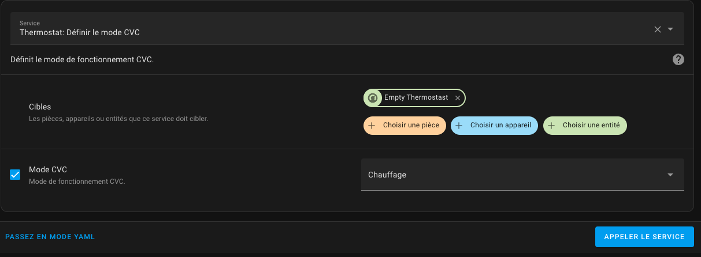
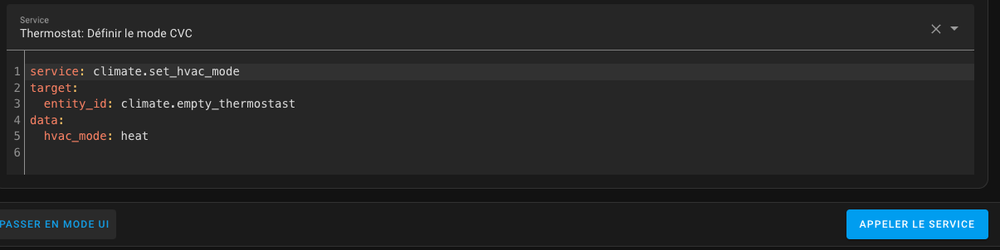

# Ovládání centrálního kotle

- [Ovládání centrálního kotle](#ovládání-centrálního-kotle)
  - [Princip](#princip)
  - [Konfigurace](#konfigurace)
    - [Jak najít správnou akci?](#jak-najít-správnou-akci)
  - [Události](#události)
  - [Varování](#varování)

Můžete ovládat centralizovaný kotel. Pokud je možné spustit nebo zastavit kotel z Home Assistant, Versatile Thermostat jej bude moci přímo ovládat.

## Princip

<please update translation from English version>

Základní princip je následující:
1. Přidá se nová entita typu `binary_sensor`, pojmenovaná ve výchozím nastavení `binary_sensor.central_boiler`.
2. V konfiguraci _VTherm_ specifikujete, zda by _VTherm_ měl ovládat kotel. V heterogenní instalaci by některé _VTherm_ měly ovládat kotel a jiné ne. Proto musíte v každé konfiguraci _VTherm_ uvést, zda ovládá kotel.
3. `binary_sensor.central_boiler` poslouchá změny stavu zařízení _VTherm_ označených jako ovládající kotel.
4. Když počet zařízení ovládaných _VTherm_ požadujících vytápění (tj. když se jejich `hvac_action` změní na `Heating`) překročí konfigurovatelný práh, `binary_sensor.central_boiler` se zapne `on` a **pokud byla nakonfigurována aktivační služba, tato služba se zavolá**.
5. Pokud počet zařízení požadujících vytápění klesne pod práh, `binary_sensor.central_boiler` se vypne `off` a **pokud byla nakonfigurována deaktivační služba, tato služba se zavolá**.
6. Máte přístup ke dvěma entitám:
   - Entita typu `number`, pojmenovaná ve výchozím nastavení `number.boiler_activation_threshold`, která udává aktivační práh. Tento práh je počet zařízení (radiátorů) požadujících vytápění.
   - Entita typu `sensor`, pojmenovaná ve výchozím nastavení `sensor.nb_device_active_for_boiler`, která zobrazuje počet zařízení požadujících vytápění. Například _VTherm_ se 4 ventily, z nichž 3 požadují vytápění, způsobí, že tento senzor zobrazí 3. Počítají se pouze zařízení z _VTherm_ označených pro ovládání centrálního kotle.

Máte tedy vždy informace pro správu a úpravu spouštění kotle.

Všechny tyto entity jsou propojeny s centrální konfigurační službou:


## Konfigurace
Pro konfiguraci této funkce potřebujete centralizovanou konfiguraci (viz [Konfigurace](#konfigurace)) a zaškrtněte pole 'Přidat centrální kotel':


Na další stránce můžete poskytnout konfiguraci pro akce (např. služby), které se mají volat při zapnutí/vypnutí kotle:


Akce (např. služby) se konfigurují podle popisu na stránce:
1. Obecný formát je `entity_id/service_id[/attribute:value]` (kde `/attribute:value` je volitelné).
2. `entity_id` je název entity ovládající kotel ve formě `domain.entity_name`. Například: `switch.chaudiere` pro kotel ovládaný spínačem, nebo `climate.chaudière` pro kotel ovládaný termostatem, nebo jakákoli jiná entita, která umožňuje ovládání kotle (není žádné omezení). Můžete také přepínat vstupy (`helpers`) jako `input_boolean` nebo `input_number`.
3. `service_id` je název služby, která se má volat, ve formě `domain.service_name`. Například: `switch.turn_on`, `switch.turn_off`, `climate.set_temperature`, `climate.set_hvac_mode` jsou platné příklady.
4. Některé služby vyžadují parametr. To by mohla být 'HVAC Mode' pro `climate.set_hvac_mode` nebo cílová teplota pro `climate.set_temperature`. Tento parametr by měl být nakonfigurován ve formátu `attribute:value` na konci řetězce.

Příklady (přizpůsobte svému případu):
- `climate.chaudiere/climate.set_hvac_mode/hvac_mode:heat`: pro zapnutí termostat kotle v režimu vytápění.
- `climate.chaudiere/climate.set_hvac_mode/hvac_mode:off`: pro vypnutí termostat kotle.
- `switch.pompe_chaudiere/switch.turn_on`: pro zapnutí spínače napájejícího čerpadlo kotle.
- `switch.pompe_chaudiere/switch.turn_off`: pro vypnutí spínače napájejícího čerpadlo kotle.
- ...

### Jak najít správnou akci?
Pro nalezení správné akce je nejlepší jít do "Developer Tools / Services", vyhledat akci k zavolání, entitu k ovládání a jakékoli požadované parametry.
Klikněte na 'Call Service'. Pokud se váš kotel zapne, máte správnou konfiguraci. Pak přepněte do YAML režimu a zkopírujte parametry.

Příklad:

V "Developer Tools / Actions":



V YAML režimu:



Služba k nakonfigurování bude pak: `climate.sonoff/climate.set_hvac_mode/hvac_mode:heat` (všimněte si odstranění mezer v `hvac_mode:heat`).

Udělejte totéž pro službu vypnutí a jste připraveni.

## Události

Každá úspěšná aktivace nebo deaktivace kotle odešle událost z Versatile Thermostat. To může být zachyceno automatizací, například pro upozornění na změnu.
Události vypadají takto:

Událost aktivace:
```yaml
event_type: versatile_thermostat_central_boiler_event
data:
  central_boiler: true
  entity_id: binary_sensor.central_boiler
  name: Central boiler
  state_attributes: null
origin: LOCAL
time_fired: "2024-01-14T11:33:52.342026+00:00"
context:
  id: 01HM3VZRJP3WYYWPNSDAFARW1T
  parent_id: null
  user_id: null
```

Událost vypnutí:
```yaml
event_type: versatile_thermostat_central_boiler_event
data:
  central_boiler: false
  entity_id: binary_sensor.central_boiler
  name: Central boiler
  state_attributes: null
origin: LOCAL
time_fired: "2024-01-14T11:43:52.342026+00:00"
context:
  id: 01HM3VZRJP3WYYWPNSDAFBRW1T
  parent_id: null
  user_id: null
```

## Varování

>  _*Poznámky*_
>
> Softwarové nebo domácí automatizační ovládání centrálního kotle může představovat rizika pro jeho správný provoz. Před použitím těchto funkcí se ujistěte, že váš kotel má správné bezpečnostní prvky a že fungují správně. Například zapnutí kotle se všemi uzavřenými ventily může vytvořit nadměrný tlak.
