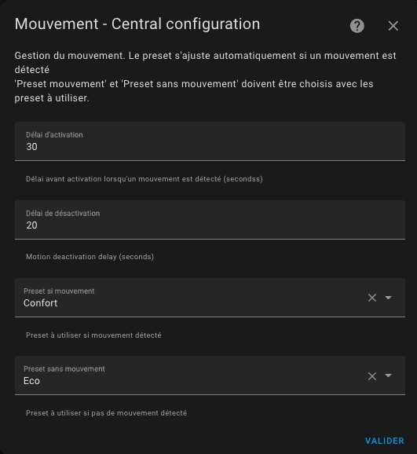

# Detekce pohybu nebo aktivity

- [Detekce pohybu nebo aktivity](#detekce-pohybu-nebo-aktivity)
  - [Konfigurace režimu aktivity nebo detekce pohybu](#konfigurace-režimu-aktivity-nebo-detekce-pohybu)
  - [Použití](#použití)

Tato funkce umožňuje změnit preset, když je detekován pohyb v místnosti. Pokud nechcete topit vaši kancelář, když je místnost prázdná, ale pouze když je místnost obsazena, potřebujete senzor pohybu (nebo přítomnosti) v místnosti a nakonfigurovat tuto funkci.

Tato funkce je často zaměňována s funkcí přítomnosti. Jsou komplementární, ale ne zaměnitelné. Funkce 'pohyb' je lokální pro místnost vybavenou senzorem pohybu, zatímco funkce 'přítomnost' je navržena jako globální pro celý domov.

## Konfigurace režimu aktivity nebo detekce pohybu

Pokud jste vybrali funkci `S detekcí pohybu`:

Co potřebujeme:
- **senzor pohybu**. ID entity senzoru pohybu. Stavy senzoru pohybu musí být "on" (pohyb detekován) nebo "off" (žádný pohyb detekován),
- **zpoždění detekce** (v sekundách) definující, jak dlouho čekáme na potvrzení pohybu před považováním pohybu. Tento parametr může být **větší než zpoždění vašeho senzoru pohybu**, jinak se detekce stane s každým pohybem detekovaným senzorem,
- **zpoždění nečinnosti** (v sekundách) definující, jak dlouho čekáme na potvrzení žádného pohybu před tím, než přestaneme považovat pohyb,
- **preset "pohyb"**. Použijeme teplotu tohoto preset, když je detekována aktivita,
- **preset "žádný pohyb"**. Použijeme teplotu tohoto druhého preset, když není detekována žádná aktivita.

## Použití

Aby _VTherm_ věděl, že má poslouchat senzor pohybu, musíte jej nastavit na speciální preset 'Activity' (Aktivita). Pokud máte nainstalovanou Versatile Thermostat UI kartu (viz [zde](additions.md#much-better-with-the-versatile-thermostat-ui-card)), tento preset se zobrazuje takto: .

Poté můžete na požádání nastavit _VTherm_ do režimu detekce pohybu.

Chování bude následující:
- máme místnost s termostatem nastaveným na režim aktivity, vybraný režim "pohyb" je comfort (21,5°C), vybraný režim "žádný pohyb" je Eco (18,5°C) a zpoždění pohybu je 30 sekund na detekci a 5 minut na konec detekce.
- místnost byla nějakou dobu prázdná (žádná aktivita detekována), cílová teplota v této místnosti je 18,5°.
- někdo vstoupí do místnosti a aktivita je detekována, pokud je pohyb přítomen alespoň 30 sekund. Teplota pak stoupne na 21,5°.
- pokud je pohyb přítomen méně než 30 sekund (rychlý průchod), teplota zůstává na 18,5°.
- představte si, že teplota stoupla na 21,5°, když osoba opustí místnost, po 5 minutách se teplota vrátí na 18,5°.
- pokud se osoba vrátí před 5 minutami, teplota zůstává na 21,5°.

>  _*Poznámky*_
> 1. Stejně jako u jiných preset bude `Activity` nabízena pouze pokud je správně nakonfigurována. Jinými slovy, všechny 4 konfigurační klíče musí být nastaveny.
> 2. Pokud používáte Versatile Thermostat UI kartu (viz [zde](additions.md#much-better-with-the-versatile-thermostat-ui-card)), detekce pohybu je reprezentována takto: .
