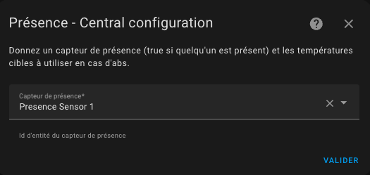

# Správa přítomnosti / nepřítomnosti

- [Správa přítomnosti / nepřítomnosti](#správa-přítomnosti--nepřítomnosti)
  - [Konfigurace přítomnosti (nebo nepřítomnosti)](#konfigurace-přítomnosti-nebo-nepřítomnosti)

## Konfigurace přítomnosti (nebo nepřítomnosti)

Pokud je tato funkce vybrána, umožňuje dynamicky upravovat preset teploty termostatu, když je detekována přítomnost (nebo nepřítomnost). K tomu musíte nakonfigurovat teplotu, která se má použít pro každý preset, když je přítomnost zakázána. Když se senzor přítomnosti vypne, tyto teploty budou aplikovány. Když se znovu zapne, bude použita "normální" teplota nakonfigurovaná pro preset. Viz [správa preset](feature-presets.md).

Pro konfiguraci přítomnosti vyplňte tento formulář:

K tomu jednoduše potřebujete nakonfigurovat **senzor obsazenosti**, jehož stav musí být 'on' nebo 'home', pokud je někdo přítomen, nebo 'off' nebo 'not_home' jinak.

Teploty jsou konfigurovány v entitách zařízení odpovídajícího vašemu _VTherm_ (Nastavení/Integrace/Versatile Thermostat/vtherm).

UPOZORNĚNÍ: Skupiny osob nefungují jako senzor přítomnosti. Nejsou rozpoznány jako senzor přítomnosti. Musíte použít šablonu, jak je popsáno zde [Použití skupiny osob jako senzoru přítomnosti](troubleshooting.md#using-a-people-group-as-a-presence-sensor).

>  _*Poznámky*_
>
> 1. Změna teploty je okamžitá a odráží se na předním panelu. Výpočet bude uvažovat novou cílovou teplotu při dalším výpočtu cyklu.
> 2. Můžete použít přímý senzor person.xxxx nebo skupinu senzorů Home Assistant. Senzor přítomnosti zpracovává stavy `on` nebo `home` jako přítomný a `off` nebo `not_home` jako nepřítomný.
> 3. Pro předehřátí vašeho domova, když jsou všichni nepřítomni, můžete přidat entitu `input_boolean` do vaší skupiny osob. Pokud nastavíte tento `input_boolean` na 'On', senzor přítomnosti bude nucen na 'On' a preset s přítomností budou použity. Můžete také nastavit tento `input_boolean` na 'On' prostřednictvím automatizace, například když opustíte zónu, abyste spustili předehřívání vašeho domova.
