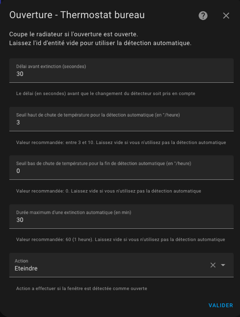

# Detekce otevřených dveří/oken

- [Detekce otevřených dveří/oken](#detekce-otevřených-dveříoken)
  - [Režim senzoru](#režim-senzoru)
  - [Auto režim](#auto-režim)

Musíte mít vybranou funkci `S detekcí otevření` na první stránce, abyste se dostali na tuto stránku.
Detekce otevření lze provést dvěma způsoby:
1. Pomocí senzoru umístěného na otevření (režim senzoru),
2. Detekcí náhlého poklesu teploty (auto režim)

## Režim senzoru
Pro přepnutí do režimu senzoru musíte poskytnout entitu typu `binary_sensor` nebo `input_boolean`.
V tomto režimu musíte vyplnit následující informace:

1. **Zpoždění v sekundách** před jakoukoliv změnou. To vám umožní rychle otevřít okno bez zastavení vytápění.
2. Akci, která se má provést, když je otevření detekováno jako otevřené. Možné akce jsou:
   1. _Vypnout_: _VTherm_ bude vypnut.
   2. _Pouze ventilátor_: vytápění nebo chlazení bude vypnuto, ale zařízení bude pokračovat ve ventilaci (pro kompatibilní zařízení).
   3. _Ochrana proti mrazu_: teplota preset "Ochrana proti mrazu" bude vybrána na _VTherm_ bez změny aktuálního preset (viz poznámky níže).
   4. _Eco_: teplota preset "Eco" bude aplikována na _VTherm_ bez změny aktuálního preset (viz poznámky níže).

Když detektor přepne na otevřeno:
1. _VTherm_ čeká specifikované zpoždění.
2. Pokud je okno stále otevřené po zpoždění, stav _VTherm_ (Vytápění / Chlazení / ..., aktuální preset, aktuální cílová teplota) je uložen a akce je provedena.

Podobně, když detektor přepne na zavřeno:
1. _VTherm_ čeká specifikované zpoždění.
2. Pokud je okno stále zavřené po zpoždění, stav před otevřením okna je obnoven.

## Auto režim
V auto režimu je konfigurace následující:

1. **Zpoždění v sekundách** před jakoukoliv změnou. To vám umožní rychle otevřít okno bez zastavení vytápění.
2. Práh detekce ve stupních za hodinu. Když teplota klesne pod tento práh, termostat se vypne. Čím nižší je tato hodnota, tím rychlejší je detekce (s vyšším rizikem falešných pozitiv).
3. Práh pro ukončení detekce ve stupních za hodinu. Když pokles teploty překročí tuto hodnotu, termostat se vrátí do předchozího režimu (režim a preset).
4. Maximální doba detekce. Po této době se termostat vrátí do předchozího režimu a preset, i když teplota nadále klesá.
5. Akci, která se má provést, když je otevření detekováno jako otevřené. Akce jsou stejné jako v režimu senzoru popsaném výše.

Pro úpravu prahů se doporučuje začít s referenčními hodnotami a upravit prahy detekce. Některé testy mi daly následující hodnoty (pro kancelář):
- Práh detekce: 3°C/hodina
- Práh bez detekce: 0°C/hodina
- Maximální doba: 30 min.

Nový senzor nazvaný "sklon" byl přidán pro všechny termostaty. Poskytuje sklon teplotní křivky v °C/hodina (nebo °K/hodina). Tento sklon je vyhlazen a filtrován, aby se zabránilo aberantním hodnotám teploměru, které by mohly interferovat s měřením.

Pro správné nastavení se doporučuje zobrazit jak teplotní křivku, tak sklon křivky ("slope") na stejném historickém grafu:

>  _*Poznámky*_
>
> 1. Pokud chcete použít **více senzorů dveří/oken** pro automatizaci vašeho termostatu, jednoduše vytvořte skupinu s obvyklým chováním (https://www.home-assistant.io/integrations/binary_sensor.group/)
> 2. Pokud nemáte senzor dveří/oken ve vaší místnosti, jednoduše nechte ID entity senzoru prázdné.
> 3. **Povolen je pouze jeden režim**. Nemůžete konfigurovat termostat jak se senzorem, tak s auto detekcí. Oba režimy by si mohly odporovat, takže oba režimy nemohou být aktivní současně.
> 4. Nedoporučuje se používat auto režim pro zařízení vystavená častým a normálním teplotním změnám (chodby, otevřené prostory atd.).
> 5. Aby se zabránilo interferenci s vašimi aktuálními nastaveními preset, akce _Ochrana proti mrazu_ a _Eco_ mění cílovou teplotu bez změny preset. Takže můžete zaznamenat nesoulad mezi vybraným preset a setpointem. Viz více popis [zde](troubleshooting.md#open-window-detection-does-not-prevent-preset-changes)
> 6. Pokud používáte Versatile Thermostat UI kartu (viz [zde](additions.md#even-better-with-the-versatile-thermostat-ui-card)), detekce otevření je reprezentována takto: .
