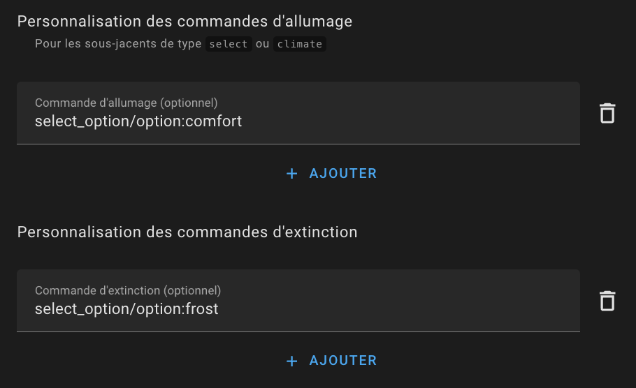

# Termostat typu `over_switch`

- [Termostat typu `over_switch`](#termostat-typu-over_switch)
  - [Předpoklady](#předpoklady)
  - [Konfigurace](#konfigurace)
    - [Podkladová zařízení](#podkladová-zařízení)
    - [Keep-Alive](#keep-alive)
    - [AC režim](#ac-režim)
    - [Inverze příkazů](#inverze-příkazů)
    - [Přizpůsobení příkazů](#přizpůsobení-příkazů)

## Předpoklady

Instalace by měla vypadat takto:

1. Uživatel nebo automatizace, nebo Scheduler, nastaví setpoint prostřednictvím preset nebo přímo pomocí teploty.
2. Periodicky vnitřní teploměr (2) nebo vnější teploměr (2b) pošle naměřenou teplotu. Vnitřní teploměr by měl být umístěn na relevantním místě pro pohodlí uživatele: ideálně uprostřed obytného prostoru. Vyhněte se umístění příliš blízko okna nebo příliš blízko radiátoru.
3. Na základě hodnot setpointu, různých teplot a parametrů algoritmu TPI (viz [TPI](algorithms.md#lalgorithme-tpi)), VTherm vypočítá procento času zapnutí.
4. Poté bude pravidelně ovládat zapínání a vypínání podkladových entit `switch` (nebo `select` nebo `climate`).
5. Tyto podkladové entity budou ovládat fyzické zařízení.
6. Fyzický spínač zapne nebo vypne radiátor.

> Procento času zapnutí se přepočítává každý cyklus, což umožňuje regulaci teploty místnosti.

## Konfigurace

Nejprve nakonfigurujte hlavní nastavení společná pro všechny _VTherm_ (viz [hlavní nastavení](base-attributes.md)).
Poté klikněte na možnost "Podkladové entity" z menu a uvidíte tuto konfigurační stránku:

### Podkladová zařízení

V "seznamu zařízení k ovládání" přidáte spínače, které budou ovládány VTherm. Akceptovány jsou pouze entity typu `switch`, `input_boolean`, `select`, `input_select` nebo `climate`.

Pokud jedno z podkladových zařízení není `switch`, pak je přizpůsobení příkazů povinné. Ve výchozím nastavení pro entity `switch` jsou příkazy standardní příkazy zapnutí/vypnutí spínače (`turn_on`, `turn_off`).

Aktuálně dostupný algoritmus je TPI. Viz [algoritmus](#algorithm).
Pokud je nakonfigurováno více entit, termostat rozloží aktivace, aby minimalizoval počet spínačů zapnutých v danou chvíli. To umožňuje lepší distribuci výkonu, protože každý radiátor se zapne postupně.

VTherm bude vyhlazovat spotřebovaný výkon co nejvíce střídáním aktivací. Příklad rozložených aktivací:

Samozřejmě, pokud je požadovaný výkon (`on_percent`) příliš vysoký, dojde k překrytí aktivací.

### Keep-Alive

Některá zařízení vyžadují periodickou aktivaci, aby se zabránilo bezpečnostnímu vypnutí. Známá jako "keep-alive", tato funkce může být aktivována zadáním nenulového počtu sekund do pole intervalu keep-alive termostatu. Pro zakázání funkce nebo pokud si nejste jisti, nechte pole prázdné nebo zadejte nulu (výchozí hodnota).

### AC režim

Je možné vybrat `thermostat_over_switch` pro ovládání klimatizace zaškrtnutím políčka "AC režim". V tomto případě bude viditelný pouze chladicí režim.

### Inverze příkazů

Pokud je vaše zařízení ovládáno pilotním drátem s diodou, možná budete muset zaškrtnout políčko "Invertovat příkaz". To nastaví spínač na `On`, když potřebujete vypnout zařízení, a na `Off`, když jej potřebujete zapnout. Časy cyklů budou s touto možností invertovány.

### Přizpůsobení příkazů

Tato konfigurační sekce umožňuje přizpůsobit příkazy zapnutí a vypnutí zasílané podkladovému zařízení.
Tyto příkazy jsou povinné, pokud jedno z podkladových zařízení není `switch` (pro entity `switch` se používají standardní příkazy zapnutí/vypnutí).

Pro přizpůsobení příkazů klikněte na `Přidat` ve spodní části stránky pro příkazy zapnutí i vypnutí:

Poté zadejte příkazy zapnutí a vypnutí pomocí formátu `příkaz[/atribut[:hodnota]]`.
Dostupné příkazy závisí na typu podkladového zařízení:

| Typ podkladového zařízení   | Možné příkazy zapnutí                 | Možné příkazy vypnutí                          | Platí pro                         |
| --------------------------- | ------------------------------------- | ---------------------------------------------- | --------------------------------- |
| `switch` nebo `input_boolean` | `turn_on`                             | `turn_off`                                     | Všechny spínače                   |
| `select` nebo `input_select`  | `select_option/option:comfort`        | `select_option/option:frost_protection`        | Nodon SIN-4-FP-21 a podobné (*) |
| `climate` (hvac_mode)       | `set_hvac_mode/hvac_mode:heat`        | `set_hvac_mode/hvac_mode:off`                  | eCosy (přes Tuya Local)           |
| `climate` (preset)          | `set_preset_mode/preset_mode:comfort` | `set_preset_mode/preset_mode:frost_protection` | Heatzy (*)                        |

(*) Zkontrolujte hodnoty akceptované vaším zařízením v **Developer Tools / States** a vyhledejte vaše zařízení. Uvidíte možnosti, které podporuje. Musí být identické, včetně rozlišování velkých a malých písmen.

Samozřejmě tyto příklady lze přizpůsobit vašemu konkrétnímu případu.

Příklad pro Nodon SIN-4-FP-21:

Klikněte na "Potvrdit" pro potvrzení úprav.

Pokud dojde k následující chybě:

> Konfigurace přizpůsobení příkazů je nesprávná. Je vyžadována pro podkladová zařízení, která nejsou spínače, a formát musí být 'název_služby[/atribut:hodnota]'. Více podrobností v README.

To znamená, že jeden ze zadaných příkazů je neplatný. Musí být dodržena následující pravidla:
1. Každý příkaz musí následovat formát `příkaz[/atribut[:hodnota]]` (např. `select_option/option:comfort` nebo `turn_on`) bez mezer nebo speciálních znaků kromě `_`.
2. Musí být tolik příkazů, kolik je deklarovaných podkladových zařízení, kromě případu, kdy jsou všechna podkladová zařízení entity `switch`, v takovém případě není přizpůsobení příkazů vyžadováno.
3. Pokud je nakonfigurováno více podkladových zařízení, příkazy musí být ve stejném pořadí. Počet příkazů zapnutí se musí rovnat počtu příkazů vypnutí a počtu podkladových zařízení (ve správném pořadí). Je možné míchat různé typy podkladových zařízení. Jakmile jedno podkladové zařízení není `switch`, všechny příkazy pro všechna podkladová zařízení, včetně entit `switch`, musí být nakonfigurovány.
