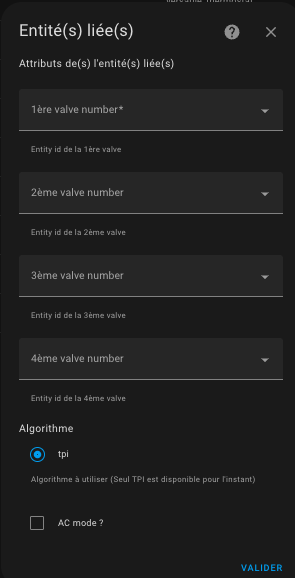

# Termostat typu `thermostat_over_valve`

>  _*Poznámky*_
> 1. Typ `over_valve` je často zaměňován s typem `over_climate` vybaveným auto-regulací a přímým ovládáním ventilu.
> 2. Tento typ byste měli volit pouze když nemáte přidruženou entitu `climate` pro vaši _TRV_ v Home Assistant a pokud máte pouze entitu typu `number` pro ovládání procenta otevření ventilu. `over_climate` s auto-regulací na ventilu je mnohem výkonnější než typ `over_valve`.

## Předpoklady

Instalace by měla být podobná nastavení VTherm `over_switch`, kromě toho, že ovládané zařízení je přímo ventil _TRV_:

1. Uživatel nebo automatizace, nebo Scheduler, nastaví setpoint prostřednictvím preset nebo přímo pomocí teploty.
2. Periodicky vnitřní teploměr (2) nebo vnější teploměr (2b) nebo vnitřní teploměr zařízení (2c) pošle naměřenou teplotu. Vnitřní teploměr by měl být umístěn na relevantním místě pro pohodlí uživatele: ideálně uprostřed obytného prostoru. Vyhněte se umístění příliš blízko okna nebo příliš blízko zařízení.
3. Na základě hodnot setpointu, různých teplot a parametrů algoritmu TPI (viz [TPI](algorithms.md#algoritmus-tpi)), VTherm vypočítá procento otevření ventilu.
4. Poté upraví hodnotu podkladových entit `number`.
5. Tyto podkladové entity `number` budou ovládat míru otevření ventilu na _TRV_.
6. To bude regulovat vytápění radiátoru.

> Míra otevření se přepočítává každý cyklus, což umožňuje regulaci teploty místnosti.

## Konfigurace

Nejprve nakonfigurujte hlavní nastavení společná pro všechny _VTherm_ (viz [hlavní nastavení](base-attributes.md)).
Poté klikněte na možnost "Podkladové entity" z menu a uvidíte tuto konfigurační stránku, měli byste přidat entity `number`, které budou ovládány VTherm. Akceptovány jsou pouze entity `number` nebo `input_number`.

Aktuálně dostupný algoritmus je TPI. Viz [algoritmus](#algorithm).

### Řízení otevření ventilu

`over_valve` může upravit povel otevření TPI podle fyzických limitů každého
ventilu. `opening_threshold_degree` se vyhodnocuje podle surového procenta
TPI. Je-li tato hodnota pod prahem, cílová hodnota je
`100 - max_closing_degree`. Poté se použije minimální stupeň otevření a
následně maximální stupeň otevření. `opening_threshold_degree` a
`max_closing_degree` platí pro celý termostat. Při výchozím nastavení zůstává
odeslaný povel stejný jako surové procento TPI.

`min_opening_degrees` a `max_opening_degrees` jsou seznamy CSV v pořadí
podkladových ventilů. Neúplné seznamy jsou povoleny: chybějící hodnoty použijí
výchozí nastavení. Seznamy s více hodnotami než nakonfigurovaných ventilů jsou
odmítnuty.

Je možné vybrat `thermostat_over_valve` pro ovládání klimatizace zaškrtnutím políčka "AC režim". V tomto případě bude viditelný pouze chladicí režim.
