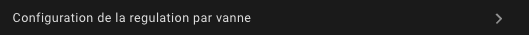
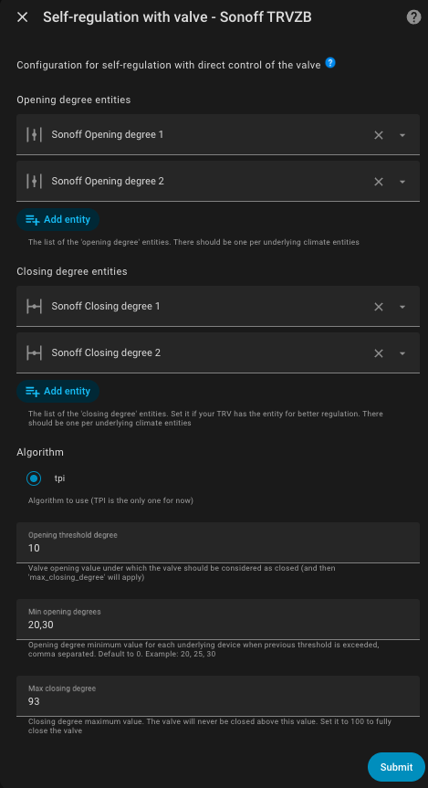

# Samo-regulace

- [Samo-regulace](#samo-regulace)
  - [Konfigurace](#konfigurace)
    - [Samo-regulace přímým ovládáním ventilu](#samo-regulace-přímým-ovládáním-ventilu)
    - [Jiná samo-regulace](#jiná-samo-regulace)
      - [Samo-regulace v expertním režimu](#samo-regulace-v-expertním-režimu)
  - [Shrnutí algoritmu auto-regulace](#shrnutí-algoritmu-auto-regulace)

Máte možnost aktivovat funkci samo-regulace pouze pro _VTherm_ typu `over_climate`.

Obecně existují dva případy:
1. Pokud je vaše podkladové zařízení _TRV_ a ventil je přímo ovladatelný v Home Assistant (např. Sonoff TRVZB), tato funkce umožní _VTherm_ přímo manipulovat s otevřením ventilu pro regulaci teploty. Otevření je pak vypočítáno algoritmem typu _TPI_ (viz [zde](algorithms.md)).
2. Jinak bude Versatile Thermostat upravovat teplotní setpoint daný podkladové klimatizaci, aby zajistil, že teplota místnosti skutečně dosáhne setpoint.

## Konfigurace

### Samo-regulace přímým ovládáním ventilu

-- this § is not updated since v 8.0. Please see the English version --

Tento typ samo-regulace, nazývaný `Přímé ovládání ventilu`, vyžaduje:
1. Entitu typu `climate`, která je zahrnuta v podkladových zařízeních _VTherm_.
2. Entitu typu `number` pro ovládání míry otevření ventilu _TRV_.
3. Volitelnou entitu typu `number` pro ovládání uzavření ventilu.

Když je zvolena samo-regulace `Přímé ovládání ventilu` na _VTherm_ `over_climate`, objeví se nová konfigurační stránka s názvem `Konfigurace regulace ventilu`:



To vám umožní konfigurovat entity ovládání ventilu:



Musíte poskytnout:
1. Tolik entit ovládání otevření ventilu, kolik je podkladových zařízení, ve stejném pořadí. Tyto parametry jsou povinné.
2. Tolik entit ovládání míry uzavření ventilu, kolik je podkladových zařízení, ve stejném pořadí. Tyto parametry jsou volitelné; buď musí být poskytnuty všechny, nebo žádné.
3. `opening_threshold`: minimální otevření ventilu, pod kterým se ventil považuje za uzavřený, a proto se použije parametr 'max_closing_degree',
4. `max_closing_degree`: absolutní maximální procento uzavření. Ventil se nikdy nezavře více, než je uvedeno v této hodnotě. Pokud chcete povolit úplné uzavření ventilu, ponechte tento parametr na 100,
5. `minimum_opening_degrees`: minimální procento otevření, když je `opening_threshold` překročen a VTherm potřebuje topit. Toto pole je přizpůsobitelné pro každý ventil v případě VTherm s více ventily. Zadáváte seznam minimálních otevření oddělených ','. Výchozí hodnota je 0. Příklad: '20, 25, 30'. Když začne topení (tj. požadované otevření je větší než `opening_threshold`), ventil se otevře s hodnotou větší nebo rovnou této a bude se při potřebě pravidelně zvyšovat.
6. `max_opening_degrees`: maximální procento otevření, kterého může ventil dosáhnout. Toto pole je přizpůsobitelné pro každý ventil v případě VTherm s více ventily. Zadáváte seznam maximálních otevření oddělených ','. Výchozí hodnota je 100 (plné otevření). Příklad: '80, 85, 90'. Ventil se nikdy neotevře nad tuto hodnotu, což vám umožní omezit průtok horké vody a optimalizovat spotřebu energie. Tato hodnota musí být pro každý ventil striktně větší než `minimum_opening_degrees`.

Algoritmus pro výpočet míry otevření je založen na _TPI_, který je popsán [zde](algorithms.md). Je to stejný algoritmus používaný pro _VTherm_ `over_switch` a `over_valve`.

Pokud je nakonfigurována entita míry uzavření ventilu, bude nastavena na `100 - míra otevření` pro vynucení ventilu do specifického stavu, jinak je nastavena na 100.

>  _*Poznámky*_
> 1. Od verze 7.2.2 je možné použít entitu "closing degree" na Sonoff TRVZB.
> 2. Atribut `hvac_action` Sonoff TRVZB TRV je nespolehlivý. Pokud se vnitřní teplota TRV příliš odchyluje od teploty místnosti, entita `climate` může indikovat, že _TRV_ netopí, i když je ventil vynuceně otevřen _VTherm_. Tento problém nemá dopad, protože entita `climate` _VTherm_ je opravena a bere v úvahu otevření ventilu pro nastavení svého atributu `hvac_action`. Tento problém je zmírněn, ale ne úplně eliminován konfigurací kalibrace teplotního offsetu.
> 3. Atribut `valve_open_percent` _VTherm_ nemusí odpovídat hodnotě `opening degree` poslané ventilu. Pokud používáte jeden ze čtyř parametrů `opening_threshold`, `max_closing_degree`, `minimum_opening_degrees` nebo `max_opening_degrees`, provádí se úprava. Atribut `valve_open_percent` představuje surovou hodnotu vypočítanou _VTherm_. Hodnota `opening degree` poslaná ventilu může být odpovídajícím způsobem upravena.

### Jiná samo-regulace

Ve druhém případě Versatile Thermostat vypočítá offset na základě následujících informací:
1. Aktuální rozdíl mezi skutečnou teplotou a setpoint teplotou, nazývaný hrubá chyba.
2. Akumulace minulých chyb.
3. Rozdíl mezi venkovní teplotou a setpointem.

Tyto tři informace jsou kombinovány pro výpočet offsetu, který bude přidán k aktuálnímu setpointu a odeslán podkladové klimatizaci.

Samo-regulace je konfigurována s:
1. Stupněm regulace:
   1. Lehká - pro malé potřeby samo-regulace. V tomto režimu bude maximální offset 1,5°C.
   2. Střední - pro střední potřeby samo-regulace. V tomto režimu je možný maximální offset 2°C.
   3. Silná - pro vysoké potřeby samo-regulace. Maximální offset je v tomto režimu 3°C a samo-regulace bude silně reagovat na změny teploty.
2. Práh samo-regulace: hodnota, pod kterou nebude aplikována žádná nová regulace. Například pokud v čase t je offset 2°C a při dalším výpočtu je offset 2,4°C, regulace nebude aplikována. Bude aplikována pouze když rozdíl mezi dvěma offsety je alespoň roven tomuto prahu.
3. Minimální období mezi dvěma samo-regulacemi: toto číslo, vyjádřené v minutách, indikuje dobu mezi dvěma změnami regulace.

Tyto tři parametry vám umožní upravit regulaci a vyhnout se aplikaci příliš mnoha změn regulace. Některá zařízení, jako TRV nebo kotle, nemají ráda časté změny setpointů.

>  _*Rady pro nastavení*_
> 1. Nezačínejte samo-regulaci okamžitě. Pozorujte, jak funguje přirozená regulace vašeho vybavení. Pokud si všimnete, že setpoint není dosažen nebo trvá příliš dlouho jej dosáhnout, spusťte regulaci.
> 2. Začněte s lehkou samo-regulací a ponechte oba parametry na jejich výchozích hodnotách. Počkejte několik dní a zkontrolujte, zda se situace zlepšuje.
> 3. Pokud to nestačí, přepněte na střední samo-regulaci a počkejte na stabilizaci.
> 4. Pokud to stále nestačí, přepněte na silnou samo-regulaci.
> 5. Pokud to stále není správné, budete muset přepnout do expertního režimu pro jemné doladění parametrů regulace.

Samo-regulace nutí vybavení tlačit více pravidelným upravováním jeho setpointu. To může zvýšit jak jeho spotřebu, tak opotřebení.

#### Samo-regulace v expertním režimu

V **expertním** režimu můžete jemně doladit parametry samo-regulace pro splnění vašich cílů a optimalizaci výkonu. Algoritmus vypočítá rozdíl mezi setpointem a skutečnou teplotou místnosti. Tento rozdíl se nazývá chyba.

Nastavitelné parametry jsou následující:
1. `kp`: faktor aplikovaný na hrubou chybu,
2. `ki`: faktor aplikovaný na akumulované chyby,
3. `k_ext`: faktor aplikovaný na rozdíl mezi vnitřní teplotou a venkovní teplotou,
4. `offset_max`: maximální korekce (offset), kterou může regulace aplikovat,
5. `stabilization_threshold`: práh stabilizace, který když je dosažen chybou, resetuje akumulované chyby na 0,
6. `accumulated_error_threshold`: maximum pro akumulaci chyb.

Pro ladění by měly být uvažovány následující pozorování:
1. `kp * error` dá offset související s hrubou chybou. Tento offset je přímo úměrný chybě a bude 0, když je cíl dosažen.
2. Akumulace chyby pomáhá opravit stabilizační křivku, i když stále existuje chyba. Chyba se akumuluje a offset postupně roste, což by mělo stabilizovat teplotu kolem cíle. Pro znatelný efekt by tento parametr neměl být příliš malý. Střední hodnota je 30.
3. `ki * accumulated_error_threshold` dá maximální offset související s akumulovanou chybou.
4. `k_ext` umožňuje okamžitou (bez čekání na akumulované chyby) korekci, když je venkovní teplota velmi odlišná od cílové teploty. Pokud stabilizace probíhá příliš vysoko, když jsou teplotní rozdíly velké, tento parametr může být příliš vysoký. Měl by být nastavitelný na nulu, aby první dva offsety mohly udělat práci.

Předprogramované hodnoty jsou následující:

**Pomalá regulace**:

    kp: 0.2  # 20% současného offsetu vnitřní regulace je způsobeno současným rozdílem cílové teploty a teploty místnosti
    ki: 0.8 / 288.0  # 80% současného offsetu vnitřní regulace je způsobeno průměrným offsetem minulých 24 hodin
    k_ext: 1.0 / 25.0  # to přidá 1°C k offsetu, když je venku o 25°C chladněji než uvnitř
    offset_max: 2.0  # omezení na finální offset -2°C až +2°C
    stabilization_threshold: 0.0  # to musí být zakázáno, jinak bude dlouhodobá akumulovaná chyba vždy resetována, když teplota krátce přejde pod/nad cíl
    accumulated_error_threshold: 2.0 * 288  # to umožňuje až 2°C dlouhodobý offset v obou směrech

**Lehká regulace**:

    kp: 0.2
    ki: 0.05
    k_ext: 0.05
    offset_max: 1.5
    stabilization_threshold: 0.1
    accumulated_error_threshold: 10

**Střední regulace**:

    kp: 0.3
    ki: 0.05
    k_ext: 0.1
    offset_max: 2
    stabilization_threshold: 0.1
    accumulated_error_threshold: 20

**Silná regulace**:

    """Silné parametry pro regulaci
    Sada parametrů, která nebere v úvahu vnější teplotu
    a koncentruje se na chybu vnitřní teploty + akumulovanou chybu.
    To by mělo fungovat pro chladné vnější podmínky, které jinak generují
    vysoký external_offset"""

    kp: 0.4
    ki: 0.08
    k_ext: 0.0
    offset_max: 5
    stabilization_threshold: 0.1
    accumulated_error_threshold: 50

Pro použití expertního režimu musíte deklarovat hodnoty, které chcete použít pro každý z těchto parametrů ve vašem `configuration.yaml` takto. Příklad pro 'Extrémní regulaci':

```yaml
versatile_thermostat:
    auto_regulation_expert:
        kp: 0.6
        ki: 0.1
        k_ext: 0.0
        offset_max: 10
        stabilization_threshold: 0.1
        accumulated_error_threshold: 80
```
a samozřejmě nakonfigurovat režim auto-regulace VTherm na expertní režim. Všechny _VTherm_ v **expertním** režimu budou používat stejné parametry, není možné mít různá expertní nastavení.

Pro aplikaci změn musíte buď **kompletně restartovat Home Assistant** nebo jen integraci Versatile Thermostat (Developer Tools / YAML / Reload Configuration / Versatile Thermostat).

>  _*Poznámky*_
>
> 1. V expertním režimu je zřídka nutné používat možnost [Kompenzovat vnitřní teplotu podkladového](over-climate.md#compensate-the-internal-temperature-of-the-underlying). To by mohlo mít za následek velmi vysoké setpointy.

## Shrnutí algoritmu auto-regulace

Shrnutí algoritmu auto-regulace je popsáno [zde](algorithms.md#the-auto-regulation-algorithm-without-valve-control)
