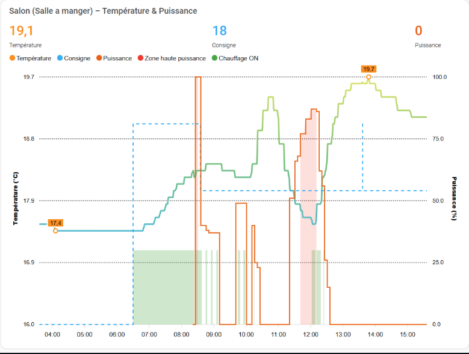

# Einige unverzichtbare Ergänzungen

- [Einige unverzichtbare Ergänzungen](#einige-unverzichtbare-ergänzungen)
  - [Die Versatile Thermostat UI Card](#die-versatile-thermostat-ui-card)
  - [Die Scheduler Komponente!](#die-scheduler-komponente)
  - [Regelungskurven mit Plotly](#regelungskurven-mit-plotly)
  - [Regulation curves with Apex-charts (thanks to @gael1980)](#regulation-curves-with-apex-charts-thanks-to-gael1980)
  - [Benachrichtigung mit dem AppDaemon NOTIFIER](#benachrichtigung-mit-dem-appdaemon-notifier)
  - [Eine sehr schöne Karte (Danke @Jeffodilo)](#eine-sehr-schöne-karte-danke-jeffodilo)
  - [Indoor "Feels Like" Temperature and the "Damp Cold" Effect (thanks to @nicola-spreafico)](#indoor-feels-like-temperature-and-the-damp-cold-effect-thanks-to-nicola-spreafico)
  - [A complementary integration to anticipate setpoint changes (thanks to @RastaChaum)](#a-complementary-integration-to-anticipate-setpoint-changes-thanks-to-rastachaum)

## Die Versatile Thermostat UI Card
Es wurde eine spezielle Karte für das Versatile Thermostat entwickelt (basierend auf Better Thermostat). Sie ist hier verfügbar: [Versatile Thermostat UI Card](https://github.com/jmcollin78/versatile-thermostat-ui-card) und bietet einen modernen Überblick über aller VTherm-Statie:


## Die Scheduler Komponente!

Um die volle Leistungsfähigkeit von Versatile Thermostat voll auszuschöpfen, empfehle ich es zusammen mit der [Scheduler Komponente](https://github.com/nielsfaber/scheduler-component) zu verwenden. Die Scheduler-Komponente ermöglicht die Klimasteuerung anhand vordefinierter Modi. Diese Funktion ist bei einem herkömmlichen Thermostat nur von begrenztem Nutzen, wird jedoch mit dem Versatile Thermostat zu einem leistungsstarken Werkzeug:

Angenommen, es ist sowohl Versatile Thermostat als auch die Scheduler-Komponente installiert.

Fügen Sie im Scheduler einen Zeitplan hinzu:


Zuerst die Gruppe "Klima" auswählen, dann eine (oder mehrere) Entität(en) wählen, "MAKE SCHEME" anwählen und auf "Weiter" klicken:
(Man kann auch "SET PRESET" wählen, aber ich bevorzuge "MAKE SCHEME".)


Nun Modusschema definieren und speichern:


In diesem Beispiel habe ich den ECO-Modus für die Nacht und für den Tag eingestellt, wenn niemand zu Hause ist, den BOOST-Modus für den Morgen und den KOMFORT-Modus für den Abend.

Ich hoffe, dieses Beispiel hilft weiter. Über Feedback freuen wir uns!

## Regelungskurven mit Plotly
Man kann eine Kurve ähnlich der in [einige Ergebnisse](#../../README-de.md#einige-ergebnisse) gezeigten erhalten, indem ausschließlich die [hier](reference.md#benutzerdefinierte-attribute) beschriebenen benutzerdefinierten Attribute des Thermostats verwendet werden:

Ersetzen Sie die Werte zwischen `[[ ]]` durch Ihre eigenen.
<details>

```yaml
- type: custom:plotly-graph
  entities:
    - entity: '[[climate]]'
      attribute: temperature
      yaxis: y1
      name: Anweisung
    - entity: '[[climate]]'
      attribute: current_temperature
      yaxis: y1
      name: T°
    - entity: '[[ema_temperature]]'
      yaxis: y1
      name: Ema
    - entity: '[[power_percent]]'
      yaxis: y2
      name: Leistungsprozentsatz
      fill: tozeroy
      fillcolor: rgba(200, 10, 10, 0.3)
      line:
        color: rgba(200, 10, 10, 0.9)
    - entity: '[[slope]]'
      name: Slope
      fill: tozeroy
      yaxis: y9
      fillcolor: rgba(100, 100, 100, 0.3)
      line:
        color: rgba(100, 100, 100, 0.9)
  hours_to_show: 4
  refresh_interval: 10
  height: 800
  config:
    scrollZoom: true
  layout:
    margin:
      r: 50
    legend:
      x: 0
      'y': 1.2
      groupclick: togglegroup
      title:
        side: top right
    yaxis:
      visible: true
      position: 0
    yaxis2:
      visible: true
      position: 0
      fixedrange: true
      range:
        - 0
        - 1
    yaxis9:
      visible: true
      fixedrange: false
      range:
        - -2
        - 2
      position: 1
    xaxis:
      rangeselector:
        'y': 1.1
        x: 0.7
        buttons:
          - count: 1
            step: hour
          - count: 12
            step: hour
          - count: 1
            step: day
          - count: 7
            step: day
```
</details>

Beispiel für mit Plotly erstellte Kurven:


## Regulation curves with Apex-charts (thanks to @gael1980)
Apex chart allows to display some great reguation curves. @Gael1980 gives us a very good example [here](https://github.com/jmcollin78/versatile_thermostat/discussions/1239).



## Benachrichtigung mit dem AppDaemon NOTIFIER
Diese Automatisierung nutzt die hervorragende AppDaemon-App namens NOTIFIER, die von Horizon Domotique entwickelt wurde und [hier](https://www.youtube.com/watch?v=chJylIK0ASo&ab_channel=HorizonDomotique) vorgestellt wird. Der Code ist [hier](https://github.com/jlpouffier/home-assistant-config/blob/master/appdaemon/apps/notifier.py) verfügbar. Damit können Benutzer über sicherheitsrelevante Ereignisse benachrichtigt werden, die an einem beliebigen Versatile Thermostat auftreten.

Dies ist ein hervorragendes Beispiel für die Verwendung der hier beschriebenen Benachrichtigungen: [Ereignis](reference.md#ereignisse).
<details>

```yaml
alias: Überwachung Heizungsicherheitsmodus
description: Sendet eine Benachrichtigung, wenn ein Thermostat in den Sicherheits- oder Power-Modus wechselt.
trigger:
  - platform: event
    event_type: versatile_thermostat_safety_event
    id: versatile_thermostat_safety_event
  - platform: event
    event_type: versatile_thermostat_power_event
    id: versatile_thermostat_power_event
  - platform: event
    event_type: versatile_thermostat_temperature_event
    id: versatile_thermostat_temperature_event
condition: []
action:
  - choose:
      - conditions:
          - condition: trigger
            id: versatile_thermostat_safety_event
        sequence:
          - event: NOTIFIER
            event_data:
              action: send_to_jmc
              title: >-
                Heizkörper {{ trigger.event.data.name }} - {{
                trigger.event.data.type }} Sicherheit
              message: >-
                Der Heizkörper {{ trigger.event.data.name }} wurde in den Sicherheitsmodus {{
                trigger.event.data.type }} versetzt, da das Thermometer nicht mehr reagiert
                .\n{{ trigger.event.data }}
              callback:
                - title: Heizungsstopp
                  event: heizungsstopp
              image_url: /media/local/alerte-securite.jpg
              click_url: /lovelace-chauffage/4
              icon: mdi:radiator-off
              tag: Heizkörper_Sicherheitsalarm
              persistent: true
      - conditions:
          - condition: trigger
            id: versatile_thermostat_power_event
        sequence:
          - event: NOTIFIER
            event_data:
              action: send_to_jmc
              title: >-
                Heizkörper {{ trigger.event.data.name }} - {{
                trigger.event.data.type }} Lastabwurf
              message: >-
                Der Heizkörper {{ trigger.event.data.name }} wurde auf {{
                trigger.event.data.type }} Lastabwurf umgeschaltet, da die maximale Leistung
                überschritten wurde.\n{{ trigger.event.data }}
              callback:
                - title: Heizungsstopp
                  event: heizungsstopp
              image_url: /media/local/alerte-delestage.jpg
              click_url: /lovelace-chauffage/4
              icon: mdi:radiator-off
              tag: Heizkörper_Lastabwurf_Alarm
              persistent: true
      - conditions:
          - condition: trigger
            id: versatile_thermostat_temperature_event
        sequence:
          - event: NOTIFIER
            event_data:
              action: send_to_jmc
              title: >-
                Das Thermometer des Heizkörpers {{ trigger.event.data.name }} reagiert nicht mehr
.
              message: >-
                Das Thermometer des Heizkörpers {{ trigger.event.data.name }}
                reagiert schon seit längerer Zeit nicht mehr.\n{{ trigger.event.data }}
              image_url: /media/local/thermometre-alerte.jpg
              click_url: /lovelace-chauffage/4
              icon: mdi:radiator-disabled
              tag: Heizkörper-Thermometer-Alarm
              persistent: true
mode: queued
max: 30
```
</details>

## Eine sehr schöne Karte (Danke @Jeffodilo)

@Jeffodilo hat den Code für eine sehr schöne Karte erstellt und geteilt, die für das TRV geeignet ist:


Diese Karte verwendet nicht card_mod, sondern die folgenden gängigen benutzerdefinierten Karten
Ein Teil der Benutzeroberfläche bleibt erhalten, mit Ausnahme der horizontalen Ausrichtung der zweiten Zeile
- custom:vertical-stack-in-card
- custom:stack-in-card
- custom:mini-graph-card
- custom:mushroom-template-card
- custom:button-card

Das Original finden Sie hier (auf Französisch): [forum HACF](https://forum.hacf.fr/t/carte-mise-en-forme-vanne-avec-thermostant-versatile/56132)

Natürlich müssen Sie es an Ihren Code anpassen.

Der Code:

<details>

```yaml
type: vertical-stack
cards:
  - type: heading
    icon: mdi:bed-double
    heading: Parents
    heading_style: title
  - type: custom:vertical-stack-in-card
    cards:
      - type: custom:mini-graph-card
        entities:
          - entity: sensor.sonde_parents_temperature
            name: Température
            state_adaptive_color: true
          - entity: climate.valve_parents
            name: Temp
            attribute: current_temperature
            unit: °C
            state_adaptive_color: true
            show_graph: false
            show_state: true
        hour24: true
        hours_to_show: 24
        points_per_hour: 2
        font_size: 50
        show:
          name: false
          icon: false
          legend: false
          labels: true
          extrema: false
        color_thresholds:
          - color: "#33ccff"
            value: 19
          - color: "#00ffff"
            value: 19.5
          - color: "#33ffcc"
            value: 20
          - color: "#00ff99"
            value: 20.5
          - color: "#ffff99"
            value: 21
          - color: "#ffff33"
            value: 21.5
          - color: "#ff9933"
            value: 22
          - color: "#cc6633"
            value: 24
          - color: "#ff6000"
            value: 26
      - type: custom:stack-in-card
        mode: horizontal
        cards:
          - type: custom:mushroom-template-card
            secondary: ""
            layout: horizontal
            tap_action:
              action: more-info
            entity: sensor.sonde_parents_temperature
            fill_container: false
            multiline_secondary: false
            primary: >-
              
               🗜️ {{ states('number.valve_parents_valve_opening_degree', with_unit=True,)}} |🔋{{ states('sensor.valve_parents_battery') }} % | Inactif
              
               🗜️ {{ states('number.valve_parents_valve_opening_degree', with_unit=True,)}} |🔋{{ states('sensor.valve_parents_battery') }} % | Chauffe
               🗜️ {{
              states('number.valve_parents_valve_opening_degree',
              with_unit=True,)}} | 🔋{{ states('sensor.valve_parents_battery')
              }} % | Off 
            icon: ""
          - type: horizontal-stack
            cards:
              - type: custom:button-card
                name: Conf.
                entity: climate.versatile_parents
                show_state: false
                show_icon: true
                show_name: false
                icon: mdi:fire
                size: 80%
                styles:
                  icon:
                    - color: |
                        [[[
                          if (states['climate.versatile_parents']) {
                          if (states['climate.versatile_parents'].attributes.preset_mode == 'comfort')
                            return 'darkorange';
                          else
                            return 'white'; }
                        ]]]
                  name:
                    - color: white
                    - font-size: 60%
                  card:
                    - height: 40px
                    - width: 30px
                tap_action:
                  action: perform-action
                  perform_action: climate.set_preset_mode
                  target:
                    entity_id:
                      - climate.versatile_parents
                  data:
                    preset_mode: comfort
              - type: custom:button-card
                name: Eco
                entity: climate.versatile_parents
                show_state: false
                show_icon: true
                show_name: false
                icon: mdi:leaf
                size: 80%
                styles:
                  icon:
                    - color: |
                        [[[
                          if (states['climate.versatile_parents']) {
                          if (states['climate.versatile_parents'].attributes.preset_mode == 'eco')
                            return 'lightgreen';
                          else
                            return 'white'; }
                        ]]]
                  name:
                    - color: white
                    - font-size: 60%
                  card:
                    - height: 40px
                    - width: 30px
                tap_action:
                  action: perform-action
                  perform_action: climate.set_preset_mode
                  target:
                    entity_id:
                      - climate.versatile_parents
                  data:
                    preset_mode: eco
              - type: custom:button-card
                name: Manu
                entity: climate.versatile_parents
                show_state: false
                show_icon: true
                show_name: false
                icon: mdi:hand-back-left
                size: 80%
                styles:
                  icon:
                    - color: |
                        [[[
                          if (states['climate.versatile_parents']) {
                          if (states['climate.versatile_parents'].attributes.preset_mode == 'none')
                            return 'indianred';
                          else
                            return 'white'; }
                        ]]]
                  name:
                    - color: white
                    - font-size: 60%
                  card:
                    - height: 40px
                    - width: 30px
                tap_action:
                  action: perform-action
                  perform_action: climate.set_preset_mode
                  target:
                    entity_id:
                      - climate.versatile_parents
                  data:
                    preset_mode: none
              - type: custom:button-card
                name: Abs.
                entity: climate.versatile_parents
                show_state: false
                show_icon: true
                show_name: false
                icon: mdi:snowflake
                size: 80%
                styles:
                  icon:
                    - color: |
                        [[[
                          if (states['climate.versatile_parents']) {
                          if (states['climate.versatile_parents'].attributes.preset_mode == 'frost')
                            return 'skyblue';
                          else
                            return 'white'; }
                        ]]]
                  name:
                    - color: white
                    - font-size: 60%
                  card:
                    - height: 40px
                    - width: 30px
                tap_action:
                  action: perform-action
                  perform_action: climate.set_preset_mode
                  target:
                    entity_id:
                      - climate.versatile_parents
                  data:
                    preset_mode: frost
              - type: custom:button-card
                name: Boost
                entity: climate.versatile_parents
                show_state: false
                show_icon: true
                show_name: false
                icon: mdi:rocket-launch
                size: 80%
                styles:
                  icon:
                    - color: |
                        [[[
                          if (states['climate.versatile_parents']) {
                          if (states['climate.versatile_parents'].attributes.preset_mode == 'boost')
                            return 'red';
                          else
                            return 'white'; }
                        ]]]
                  name:
                    - color: white
                    - font-size: 60%
                  card:
                    - height: 40px
                    - width: 30px
                tap_action:
                  action: perform-action
                  perform_action: climate.set_preset_mode
                  target:
                    entity_id:
                      - climate.versatile_parents
                  data:
                    preset_mode: boost
      - type: custom:mushroom-climate-card
        entity: climate.versatile_parents
        show_temperature_control: true
        hvac_modes: []
        tap_action:
          action: more-info
        primary_info: state
        icon: mdi:radiator
        secondary_info: last-updated
        fill_container: false
        layout: horizontal
```
</details>

## Indoor "Feels Like" Temperature and the "Damp Cold" Effect (thanks to @nicola-spreafico)
An brillant post to add a feature name "Feels like" or "Damp Cold". You can force the target temperature to a higher value depending on weather conditions like humidity or wind.
The post is [here](https://github.com/jmcollin78/versatile_thermostat/discussions/1211)

## A complementary integration to anticipate setpoint changes (thanks to @RastaChaum)
This integration (in beta as of 11/23/2025) proposes to anticipate the setpoint changes of your Scheduler so that the target temperature is reached at the time of the Scheduler change. It learns the behavior of your VTherm (temperature rise time, speed and temperature rise time) and applies a predictive algorithm to anticipate the Scheduler change.
The approach is very interesting and offers a good complement to _VTherm_.

It is available [here](https://github.com/RastaChaum/Intelligent-Heating-Pilot)