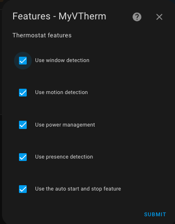

- [Auswahl der grundlegenden Attribute](#auswahl-der-grundlegenden-attribute)
- [Auswahl der zu verwendenden Eigenschaften](#auswahl-der-zu-verwendenden-eigenschaften)

# Auswahl der grundlegenden Attribute

Wählen Sie das Menü "Hauptmerkmale".

Geben Sie die obligatorischen Hauptmerkmale an. Diese Merkmale sind für alle VTherms gleich:
1. Ein Name (dies ist sowohl der Name der Integration als auch der `climate`-Entity-Name),
2. Eine Entity-ID eines Temperatursensors aus dem Raum, in der der Heizkörper installiert ist,
3. Diese Sensorentity ist optional, sie gibt das Datum und die Uhrzeit der letzten Meldung vom Sensor an (`last_seen`). Ist ein solcher Sensor vorhanden, bitte hier eintragen. Es hilft, Sicherheitsabschaltungen zu verhindern, wenn die Temperatur stabil ist und der Sensor für längere Zeit keine Meldungen mehr abgibt (siehe [hier](troubleshooting.md#why-does-my-versatile-thermostat-go-into-safety-mode)),
4. Eine Zyklusdauer in Minuten. Bei jedem Zyklus:
   1. Für `over_switch`: VTherm schaltet den Heizkörper ein/aus, dabei wird die Einschaltzeit moduliert,
   2. Für `over_valve`: VTherm berechnet ein neues Ventilöffnungsniveau und sendet es, sobald es sich geändert hat,
   3. Für `over_climate`: Der Zyklus führt grundlegende Kontrollen durch und berechnet die Selbstregulierungskoeffizienten neu. Der Zyklus kann zu einem neuen Sollwert führen, der an die darunter liegenden Geräte gesendet wird, oder zu einer Anpassung der Ventilöffnung im Falle eines steuerbaren Regelventils (TRV).
5. Die Geräteleistung, aktiviert die Leistungs- und Energieverbrauchssensoren des Gerätes. Wenn mehrere Geräte mit demselben VTherm verbunden sind, geben Sie hier die maximale Gesamtleistung aller Geräte an. Die Leistungseinheit ist hier nicht wichtig. Wichtig ist, dass alle _VTherm_ und alle Leistungssensoren die gleiche Einheit haben (siehe: Lastabwurf-Funktion),
6. Die Möglichkeit, zusätzliche Parameter aus der zentralen Konfiguration zu verwenden:
   1. Außentemperaturfühler,
   2. Minimale/maximale Temperatur und Temperaturschrittweite,
7. Die Option zur zentralen Steuerung des Thermostats. Siehe [centralized control](#centralized-control),
8. Ein Aktivierungsfeld, wenn dieses VTherm zur Auslösung eines zentralen Heizkessels verwendet wird.

>  _*Hinweise*_
>  1. Bei den Typen `over_switch` und `over_valve` werden die Berechnungen bei jedem Zyklus durchgeführt. Wenn sich die Bedingungen ändern, werden diese erst im nächsten Zyklus sichtbar. Daher sollte der Zyklus nicht zu lang sein. **5 Minuten sind ein guter Wert**, der jedoch an Ihren Heizungstyp angepasst werden sollte. Je größer die Trägheit ist, desto länger sollte der Zyklus sein. Siehe [Tuning-Beispiele](tuning-examples.md).
>  2. Ist der Zyklus zu kurz, erreicht der Heizkörper möglicherweise nie die Zieltemperatur. Bei einer Speicherheizung beispielsweise wird sie unnötigerweise aktiviert.

# Auswahl der zu verwendenden Eigenschaften

Wählen Sie das Menü "Eigenschaften".

Wählen Sie die Eigenschaften, die Sie für dieses VTherm verwenden möchten:
1. **Öffnungserkennung** (Türen, Fenster) stoppt die Heizung, wenn eine Öffnung erkannt wird. (siehe [Verwaltung von Öffnungen](feature-window.md)),
2. **Bewegungserkennung**: VTherm kann die Solltemperatur anpassen, wenn eine Bewegung im Raum erkannt wird (siehe [Bewegungserkennung](feature-motion.md)),
3. **Energieverwaltung**: VTherm kann ein Gerät abschalten, wenn der Stromverbrauch in Ihrer Wohnung einen Schwellenwert überschreitet. (siehe [Energieverwaltung](feature-power.md)),
4. **Anwesenheitserkennung**: Wenn Sie einen Sensor haben, der die An- oder Abwesenheit in Ihrer Wohnung anzeigt, können Sie damit die Zieltemperatur ändern. Siehe [Anwesenheitserkennung](feature-presence.md). Beachten Sie den Unterschied zwischen dieser Funktion und der Bewegungserkennung: Anwesenheit wird normalerweise auf Hausebene verwendet, während die Bewegungserkennung eher raumspezifisch ist.
5. **Automatischer Start/Stopp**: Nur für `Over_climate` VTherms. Diese Funktion stoppt ein Gerät, wenn VTherm feststellt, dass es eine Zeit lang nicht benötigt wird. Anhand der Temperaturkurve wird vorhergesagt, wann das Gerät wieder benötigt wird, und es wird zu diesem Zeitpunkt wieder eingeschaltet. Siehe [Start/Stopp-Automatik](feature-auto-start-stop.md).

>  _*Hinweise*_
> 1. Die Liste der verfügbaren Eigenschaften passt sich an Ihren VTherm-Typ an.
> 2. Wenn Sie eine Eigenschaften aktivieren, wird ein neuer Menüeintrag zur Konfiguration dieser Eigenschaften hinzugefügt.
> 3. Sie können die Erstellung eines VTherms nicht abschließen, wenn nicht alle Parameter für alle aktivierten Funktionen konfiguriert wurden.
