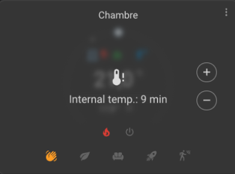

# Fortgeschrittene Konfiguration

- [Fortgeschrittene Konfiguration](#fortgeschrittene-konfiguration)
  - [Erweiterte Einstellungen](#erweiterte-einstellungen)
    - [Minimale Aktivierungsverzögerung](#minimale-aktivierungsverzögerung)
    - [Minimale Deaktivierungsverzögerung](#minimale-deaktivierungsverzögerung)
    - [Sicherheitsmodus](#sicherheitsmodus)

Diese Einstellungen verfeinern den Betrieb des Thermostats, insbesondere den Sicherheitsmechanismus für ein _VTherm_. Fehlende Temperatursensoren (Raum- oder Außentemperatur) können ein Risiko für Ihr Haus darstellen. Bleibt der Temperaturfühler beispielsweise bei 10°C hängen, befehlen die _VTherm_-Typen `over_climate` oder `over_valve` eine maximale Beheizung der dazugehörigen Geräte, was zu einer Überhitzung des Raums oder sogar zu Sachschäden führen kann, die im schlimmsten Fall eine Brandgefahr darstellen.

Um dies zu verhindern, sorgt das _VTherm_ dafür, dass die Thermometer regelmäßig Werte melden. Tun sie das nicht, schaltet _VTherm_ in einen speziellen Modus, den sogenannten Sicherheitsmodus. Dieser Modus sorgt für eine minimale Beheizung, um das gegenteilige Risiko zu vermeiden: beispielsweise eine völlig unbeheizte Wohnung mitten im Winter.

Die Herausforderung besteht darin, dass einige Thermometer - insbesondere batteriebetriebene - nur dann Temperaturaktualisierungen senden, wenn sich der Wert ändert. Es ist durchaus möglich, dass stundenlang keine Temperaturaktualisierungen empfangen werden, ohne dass das Thermometer ausfällt. Die nachstehenden Parameter ermöglichen eine Feinabstimmung der Schwellenwerte für die Aktivierung des Sicherheitsmodus.

Wenn Ihr Thermometer über ein Attribut `Zuletzt gesehen` verfügt, das den Zeitpunkt des letzten Kontakts angibt, können Sie es in den Hauptattributen des _VTherm_ angeben, um falsche Aktivierungen des Sicherheitsmodus stark zu reduzieren. Siehe [Konfiguration](base-attributes.md#choosing-base-attributes) und [Störungsbeseitigung](troubleshooting.md#why-does-my-versatile-thermostat-switch-to-safety-mode).

Bei `over_climate`-_VTherms_, die sich selbst regulieren, ist der Sicherheitsmodus deaktiviert. In diesem Fall besteht keine Gefahr, nur das Risiko einer falschen Temperatur.

## Erweiterte Einstellungen

Die Maske für die erweiterte Einstellung sieht wie folgt aus:


### Minimale Aktivierungsverzögerung

Die erste Verzögerung (`minimal_activation_delay_sec`) in Sekunden ist die minimal zulässige Verzögerung zum Einschalten der Heizung. Wenn die berechnete Einschaltzeit kürzer als dieser Wert ist, bleibt die Heizung ausgeschaltet. Dieser Parameter gilt nur für _VTherm_ mit zyklischer Auslösung `over_switch`. Wenn die Einschaltzeit zu kurz ist, kann das Gerät bei schnellem Schalten nicht richtig aufheizen.

### Minmale Dektivierungsverzögerung

Die Verzögerung (`minimal_deactivation_delay_sec`) in Sekunden ist die minimale akzeptable Verzögerung zum Ausschalten der Heizung. Wenn die berechnete Abschaltzeit kürzer als dieser Wert ist, bleibt die Heizung eingeschaltet.

### Sicherheitsmodus

| Parameter | Beschreibung | Standardwert | Attributname |
| ---------- | ------------ | ------------ | ------------ |
| **Maximale Verzögerung** | Maximale Zeit zwischen zwei Temperaturmessungen, bevor das _VTherm_ in den Sicherheitsmodus schaltet. | 60 Minuten | `safety_delay_min` |
| **Minimaler `on_percent`-Wert** | Minimaler `on_percent`, unter dem der Sicherheitsmodus nicht aktiviert wird. Verhindert Aktivierung, wenn der Heizkörper nicht ausreichend heizt (Über-/Unterhitzungsrisiko ohne physische Gefahr). `0.00` aktiviert immer, `1.00` deaktiviert. | 0.5 (50%) | `safety_min_on_percent` |
| **Standard-`on_percent` im Sicherheitsmodus** | `on_percent` im Sicherheitsmodus. `0` schaltet Thermostat aus, `0.1` hält minimale Heizung aufrecht, um Einfrieren bei Thermometerausfall zu verhindern. | 0.1 (10%) | `safety_default_on_percent` |

Es ist möglich, den Sicherheitsmodus zu deaktivieren, der durch fehlende Daten des Außenthermometers ausgelöst wird. Da das Außenthermometer in der Regel nur einen geringen Einfluss auf die Regelung hat (abhängig von Ihrer Konfiguration), ist es möglicherweise nicht kritisch, wenn es nicht verfügbar ist. Fügen Sie dazu die folgenden Zeilen in Ihre `configuration.yaml` ein:

```yaml
versatile_thermostat:
...
    safety_mode:
        check_outdoor_sensor: false
```

Standardmäßig kann das Außenthermometer den Sicherheitsmodus auslösen, wenn es keine Daten mehr sendet. Denken Sie daran, dass der Home Assistant neu gestartet werden muss, damit diese Änderungen wirksam werden. Diese Einstellung gilt für alle _VTherms_, die das Außenthermometer gemeinsam nutzen.

>  _*Hinweise*_
> 1. Wenn der Temperatursensor wieder Werte sendet, wird die Voreinstellung auf den vorherigen Wert zurückgesetzt.
> 2. Es werden zwei Temperaturquellen benötigt: die Innen- und die Außentemperatur. Beide müssen Werte melden, sonst schaltet der Thermostat auf die Voreinstellung "Sicherheit".
> 3. Mit einer Aktion können Sie die drei Sicherheitsparameter einstellen. Dies kann helfen, den Sicherheitsmodus an Ihre Bedürfnisse anzupassen.
> 4. Bei normaler Verwendung sollte `safety_default_on_percent` niedriger sein als `safety_min_on_percent`.
> 5. Wenn Sie die Versatile Thermostat UI-Karte verwenden (siehe [hier](additions.md#better-with-the-versatile-thermostat-ui-card)), wird ein _VTherm_ im Sicherheitsmodus durch ein graues Overlay angezeigt, das das fehlerhafte Thermometer und die Zeit seit der letzten Wertaktualisierung zeigt: .