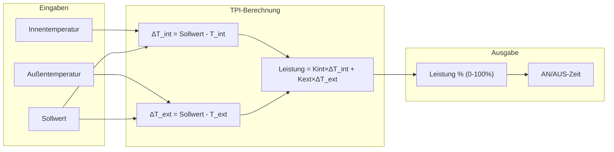
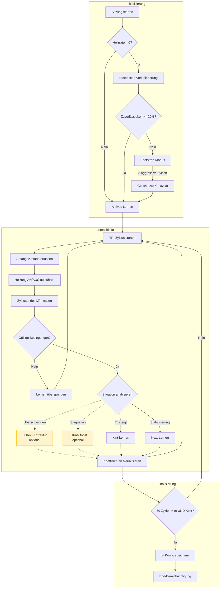
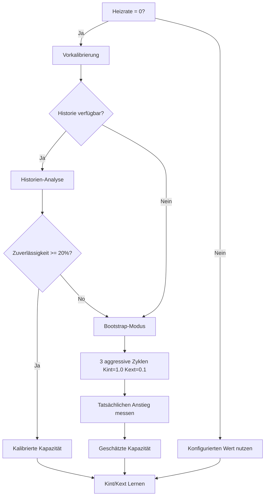
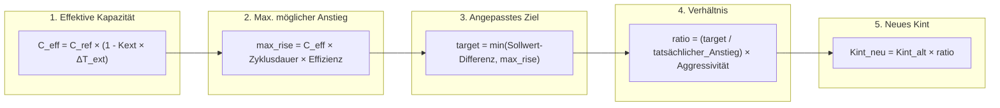
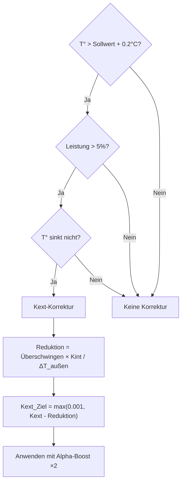
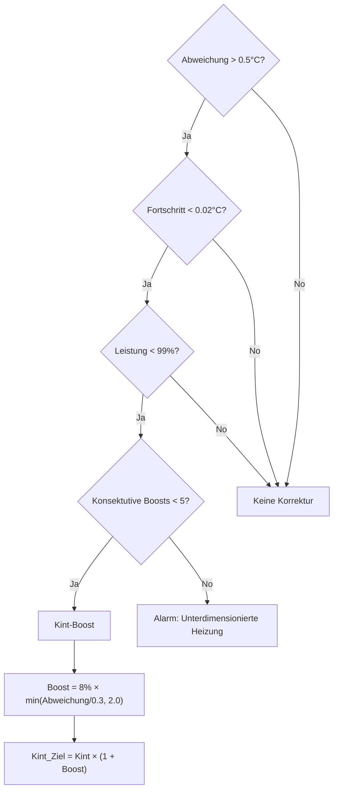
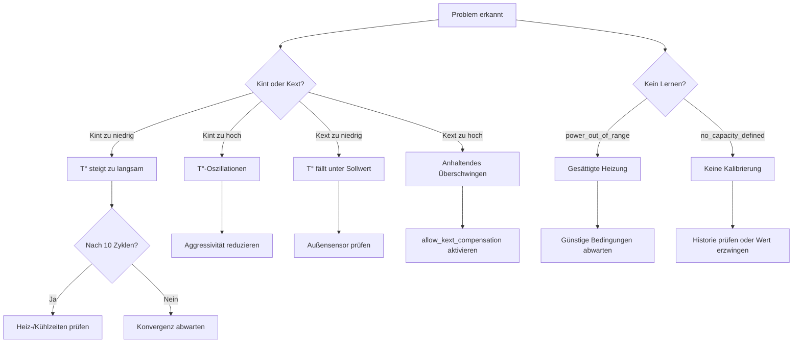

# 🧠 Auto TPI: Detaillierter technischer Leitfaden

> [!NOTE]
> Dieses Dokument richtet sich an fortgeschrittene Benutzer, die den Auto-TPI-Algorithmus im Detail verstehen möchten. Eine zugänglichere Einführung finden Sie im [Auto TPI Benutzerleitfaden](feature-autotpi.md).

---

## Inhaltsverzeichnis

1. [Der TPI-Algorithmus](#der-tpi-algorithmus)
2. [Detaillierter Lernzyklus](#detaillierter-lernzyklus)
3. [Kalibrierung der thermischen Kapazität](#kalibrierung-der-thermischen-kapazität)
4. [Algorithmen zur Koeffizientenberechnung](#algorithmen-zur-koeffizientenberechnung)
5. [Automatische Korrekturmechanismen](#automatische-korrekturmechanismen)
6. [Erweiterte Parameter und Konstanten](#erweiterte-parameter-und-konstanten)
7. [Dienste und API](#dienste-und-api)
8. [Erweiterte Diagnose und Fehlerbehebung](#erweiterte-diagnose-und-fehlerbehebung)

---

## Der TPI-Algorithmus

### Grundlegendes Prinzip

Der **TPI**-Algorithmus (Time Proportional & Integral) berechnet bei jedem Zyklus einen **Leistungsprozentsatz**. Dieser Prozentsatz bestimmt, wie lange die Heizung während des Zyklus aktiv ist (z. B. 60 % bei einem 10-Minuten-Zyklus = 6 Minuten Heizen).

### Basiskonzept

```
Leistung = (Kint × ΔT_innen) + (Kext × ΔT_außen)
```

Wobei:
- **Kint** (`tpi_coef_int`): Innenkoeffizient, reagiert auf die Differenz zum Sollwert
- **Kext** (`tpi_coef_ext`): Außenkoeffizient, kompensiert thermische Verluste
- **ΔT_innen** = Sollwert − Innentemperatur
- **ΔT_außen** = Sollwert − Außentemperatur



### Rolle der Koeffizienten

| Koeffizient | Rolle | Lern-Situation |
|-------------|-------|-------------------|
| **Kint** | Steuert die **Reaktivität**: Je höher er ist, desto schneller reagiert die Heizung auf Abweichungen | Während des **Temperaturanstiegs** (Abweichung > 0,05°C, Leistung < 99%) |
| **Kext** | Kompensiert **thermische Verluste**: Je höher er ist, desto mehr antizipiert die Heizung die Abkühlung | Während der **Stabilisierung** um den Sollwert (Abweichung < 0,5°C) |

---

## Detaillierter Lernzyklus

### Ablauf-Übersicht



> [!NOTE]
> **Gelbe Boxen mit gestrichelten Linien** (🔸) stellen **optionale** Korrekturmechanismen dar. Diese müssen explizit über die Parameter des Dienstes `set_auto_tpi_mode` aktiviert werden.

### Details zur Zustandserfassung (Snapshot)

Zu Beginn jedes Zyklus erfasst der Algorithmus den aktuellen Zustand:

| Erfasste Daten | Verwendung |
|----------------|------------|
| `last_temp_in` | Innentemperatur zu Zyklusbeginn |
| `last_temp_out` | Außentemperatur zu Zyklusbeginn |
| `last_order` | Sollwert zu Zyklusbeginn |
| `last_power` | Berechnete Leistung für diesen Zyklus (0,0 bis 1,0) |
| `last_state` | HVAC-Modus (Heizen/Kühlen) |

Am Ende des Zyklus werden diese Werte mit den aktuellen Messungen verglichen, um den Fortschritt zu berechnen.

### Validierungsbedingungen für Zyklen

Ein Zyklus wird für das Lernen **ignoriert**, wenn:

| Bedingung | Grund |
|-----------|--------|
| Leistung = 0% oder 100% | Sättigung: Keine verwertbaren Informationen zur Effizienz |
| Sollwert geändert | Zielwert mitten im Zyklus geändert |
| Lastabwurf aktiv | Heizung wurde vom Power Manager zwangsweise AUS geschaltet |
| Fehler erkannt | Anomalie festgestellt (Heizung ohne Wirkung) |
| Zentralheizkessel AUS | Thermostat fordert an, aber Kessel reagiert nicht |
| Erster Zyklus nach Neustart | Keine gültigen Referenzdaten |

---

## Kalibrierung der thermischen Kapazität

### Definition

Die **thermische Kapazität** (oder **Heizrate**) repräsentiert die maximale Geschwindigkeit des Temperaturanstiegs Ihres Systems, ausgedrückt in **°C pro Stunde** (°C/h).

Beispiel: Eine Kapazität von 2,0 °C/h bedeutet, dass Ihr Heizkörper die Temperatur unter idealen (adiabatischen) Bedingungen bei voller Leistung in einer Stunde um 2 °C anheben kann.

### Bestimmungsmethoden



### Vorkalibrierung via Historien-Analyse

Der Dienst `auto_tpi_calibrate_capacity` analysiert die Sensorhistorie:

1. **Abruf** der Daten von `temperature_slope` und `power_percent` über 30 Tage
2. **Filterung**: Behält nur Punkte bei, an denen `power >= 95 %` war
3. **Ausreißer-Eliminierung** mittels IQR-Methode (Interquartile Range)
4. **Berechnung des 75. Perzentils** der Steigungen (repräsentativer als der Median)
5. **Adiabatische Korrektur**: `Kapazität = P75 + Kext × ΔT`
6. **Anwendung einer Sicherheitsmarge**: standardmäßig 20 %

### Bootstrap-Modus

Wenn die Historie unzureichend ist (Zuverlässigkeit < 20 %), wechselt das System in den **Bootstrap-Modus**:

- **Aggressive Koeffizienten**: Kint = 1.0, Kext = 0.1
- **Dauer**: mindestens 3 Zyklen
- **Ziel**: Einen signifikanten Temperaturanstieg auslösen, um die tatsächliche Kapazität zu messen
- **Sicherheits-Timeout**: Wenn nach 5 Zyklen kein Erfolg eintritt, wird eine Standardkapazität von 0,3 °C/h angenommen (für langsame Systeme)

---

## Algorithmen zur Koeffizientenberechnung

### Kint-Lernen (Innenkoeffizient)

Der Algorithmus passt Kint an, wenn die Temperatur in Richtung des Sollwerts **steigt**.

#### Detaillierte Formel



#### Verwendete Variablen

| Variable | Beschreibung | Typischer Wert |
|----------|-------------|---------------|
| `C_ref` | Kalibrierte Referenzkapazität | 1.5 °C/h |
| `Kext` | Aktueller Außenkoeffizient | 0.02 |
| `ΔT_ext` | Differenz Innen-/Außentemp | 15°C |
| `Zyklusdauer` | In Stunden | 0.167 (10 Min.) |
| `Effizienz` | Verwendeter Leistungsprozentsatz | 0.70 |
| `Aggressivität` | Moderationsfaktor | 0.9 |

### Kext-Lernen (Außenkoeffizient)

Der Algorithmus passt Kext an, wenn die Temperatur **nahe am Sollwert** ist (|Abweichung| < 0,5°C).

#### Formel

```
Korrektur = Kint × (Abweichung_innnen / Abweichung_außen)
Kext_neu = Kext_alt + Korrektur
```

- Wenn Abweichung_innen **negativ** (Überschwingen) → Negative Korrektur → **Kext sinkt**
- Wenn Abweichung_innen **positiv** (Unterschreiten) → Positive Korrektur → **Kext steigt**

### Glättungsmethoden

Es stehen zwei Methoden zur Glättung neuer Werte zur Verfügung:

#### Gewichteter Durchschnitt ("Discovery"-Modus)

```
Kint_final = (Kint_alt × Zähler + Kint_neu) / (Zähler + 1)
```

| Zyklus | Altes Gewicht | Neues Gewicht | Einfluss des neuen Wertes |
|-------|------------|------------|------------------|
| 1 | 1 | 1 | 50% |
| 10 | 10 | 1 | 9% |
| 50 | 50 | 1 | 2% |

> Der Zähler ist bei 50 gedeckelt, um eine minimale Reaktivität zu erhalten.

#### EWMA ("Fine Tuning"-Modus)

```
Kint_final = (1 - α) × Kint_alt + α × Kint_neu
α(n) = α₀ / (1 + decay_rate × n)
```

| Parameter | Standard | Beschreibung |
|-----------|---------|-------------|
| `α₀` (initiales Alpha) | 0.08 | Ursprüngliches Gewicht neuer Werte |
| `decay_rate` | 0.12 | Verringerungsgeschwindigkeit von Alpha |

---

## Automatische Korrekturmechanismen

### Überschwing-Korrektur (Kext Deboost)

> **Aktivierung**: Parameter `allow_kext_compensation_on_overshoot` im Dienst `set_auto_tpi_mode`

Erkennt und korrigiert, wenn die Temperatur den **Sollwert überschreitet**, ohne wieder zu sinken.



### Stagnations-Korrektur (Kint Boost)

> **Aktivierung**: Parameter `allow_kint_boost_on_stagnation` im Dienst `set_auto_tpi_mode`

Erkennt und korrigiert, wenn die Temperatur trotz signifikantem Bedarf **stagniert**.



---

## Erweiterte Parameter und Konstanten

### Interne Konstanten (Nicht konfigurierbar)

| Konstante | Wert | Beschreibung |
|----------|-------|-------------|
| `MIN_KINT` | 0.01 | Untergrenze für Kint zur Aufrechterhaltung der Reaktivität |
| `OVERSHOOT_THRESHOLD` | 0.2°C | Schwelle für Überschwingen zur Auslösung der Korrektur |
| `OVERSHOOT_POWER_THRESHOLD` | 5% | Mindestleistung, um Überschwingen als Kext-Fehler zu werten |
| `OVERSHOOT_CORRECTION_BOOST` | 2.0 | Alpha-Multiplikator während der Korrektur |
| `NATURAL_RECOVERY_POWER_THRESHOLD` | 20% | Max Leistung, um Lernen bei natürlicher Erholung zu überspringen |
| `INSUFFICIENT_RISE_GAP_THRESHOLD` | 0.5°C | Mindestabweichung für Kint-Boost |
| `MAX_CONSECUTIVE_KINT_BOOSTS` | 5 | Limit vor Alarm wegen Unterdimensionierung |
| `MIN_PRE_BOOTSTRAP_CALIBRATION_RELIABILITY` | 20% | Mindestzuverlässigkeit zur Umgehung des Bootstrap |

### Konfigurierbare Parameter

| Parameter | Typ | Standard | Bereich |
|-----------|------|---------|-------|
| **Aggressiveness** | Slider | 1.0 | 0.5 - 1.0 |
| **Heating Time** | Minuten | 5 | 1 - 30 |
| **Cooling Time** | Minuten | 7 | 1 - 60 |
| **Heating Rate** | °C/h | 0 (auto) | 0 - 5.0 |
| **Initial Weight** (Discovery) | Ganzzahl | 1 | 1 - 50 |
| **Alpha** (Fine Tuning) | Float | 0.08 | 0.01 - 0.3 |
| **Decay Rate** | Float | 0.12 | 0.0 - 0.5 |

---

## Dienste und API

### `versatile_thermostat.set_auto_tpi_mode`

Steuert den Start/Stopp des Lernens.

```yaml
service: versatile_thermostat.set_auto_tpi_mode
target:
  entity_id: climate.mein_thermostat
data:
  auto_tpi_mode: true                    # true = Start, false = Stopp
  reinitialise: true                     # true = Vollständiger Reset, false = Fortsetzen
  allow_kint_boost_on_stagnation: false  # Kint bei Stagnation boosten
  allow_kext_compensation_on_overshoot: false  # Kext bei Überschwingen korrigieren
```

### `versatile_thermostat.auto_tpi_calibrate_capacity`

Kalibriert die thermische Kapazität anhand der Historie.

```yaml
service: versatile_thermostat.auto_tpi_calibrate_capacity
target:
  entity_id: climate.mein_thermostat
data:
  start_date: "2024-01-01T00:00:00+00:00"  # Optional
  end_date: "2024-02-01T00:00:00+00:00"    # Optional
  min_power_threshold: 95                   # Min. Leistung in %
  capacity_safety_margin: 20                # Sicherheitsmarge in %
  save_to_config: true                      # In Konfig speichern
```

**Rückgabewerte des Dienstes**:

| Schlüssel | Beschreibung |
|-----|-------------|
| `max_capacity` | Berechnete Bruttokapazität (°C/h) |
| `recommended_capacity` | Kapazität nach Marge (°C/h) |
| `reliability` | Zuverlässigkeitsindex (%) |
| `samples_used` | Anzahl verwendeter Proben |
| `outliers_removed` | Anzahl entfernter Ausreißer |

---

## Erweiterte Diagnose und Fehlerbehebung

### Diagnose-Sensor

Entität: `sensor.<Name>_auto_tpi_learning_state`

| Attribut | Beschreibung |
|-----------|-------------|
| `active` | Lernen läuft |
| `heating_cycles_count` | Gesamtzahl beobachteter Zyklen |
| `coeff_int_cycles` | Validierte Kint-Zyklen |
| `coeff_ext_cycles` | Validierte Kext-Zyklen |
| `model_confidence` | Vertrauen 0.0 - 1.0 |
| `calculated_coef_int` | Aktuelles Kint |
| `calculated_coef_ext` | Aktuelles Kext |
| `last_learning_status` | Status des letzten Zyklus |
| `capacity_heat_status` | `learning` oder `learned` |
| `capacity_heat_value` | Aktuelle Kapazität (°C/h) |

### Häufige Lernstatus-Meldungen

| Status | Bedeutung | Empfohlene Aktion |
|--------|---------|------------------|
| `learned_indoor_heat` | Kint erfolgreich aktualisiert | Normal |
| `learned_outdoor_heat` | Kext erfolgreich aktualisiert | Normal |
| `power_out_of_range` | Leistung bei 0 % oder 100 % | Auf nicht-gesättigten Zyklus warten |
| `real_rise_too_small` | Anstieg < 0,01 °C | Sensor oder Zyklusdauer prüfen |
| `setpoint_changed_during_cycle` | Sollwert geändert | Sollwert während des Zyklus nicht verändern |
| `no_capacity_defined` | Keine kalibrierte Kapazität | Auf Kalibrierung/Bootstrap warten |
| `corrected_kext_overshoot` | Überschwing-Korrektur angewandt | Normal, falls Kext zu hoch |
| `corrected_kint_insufficient_rise` | Kint-Boost angewandt | Normal, falls Kint zu niedrig |
| `max_kint_boosts_reached` | 5 konsekutive Boosts | **Heizung unterdimensioniert** |

### Diagnose-Entscheidungsbaum



### Persistenzdatei

**Speicherort**: `.storage/versatile_thermostat_{unique_id}_auto_tpi_v2.json`

Diese Datei enthält den kompletten Lernzustand und wird bei einem Neustart von Home Assistant wiederhergestellt. Sie kann gelöscht werden, um einen vollständigen Reset zu erzwingen (nicht empfohlen).

---

## Anhänge

### Empfohlene Referenzwerte

| Heizungstyp | Aufheizzeit | Abkühlzeit | Typische Kapazität |
|--------------|--------------|--------------|------------------|
| Elektrokonvektor | 2-5 Min. | 3-7 Min. | 2.0-3.0 °C/h |
| Speicherheizung | 5-10 Min. | 10-20 Min. | 1.0-2.0 °C/h |
| Fußbodenheizung | 15-30 Min. | 30-60 Min. | 0.3-0.8 °C/h |
| Zentralheizkessel | 5-15 Min. | 10-30 Min. | 1.0-2.5 °C/h |

### Vollständige mathematische Formeln

**Effektive Kapazität**:
$$C_{eff} = C_{ref} \times (1 - K_{ext} \times \Delta T_{ext})$$

**Adaptives Alpha (EWMA)**:
$$\alpha(n) = \frac{\alpha_0}{1 + k \times n}$$

**Zuverlässigkeit der Kalibrierung**:
$$reliability = 100 \times \min\left(\frac{samples}{20}, 1\right) \times \max\left(0, 1 - \frac{CV}{2}\right)$$

Wobei CV = Variationskoeffizient (Standardabweichung / Mittelwert)
