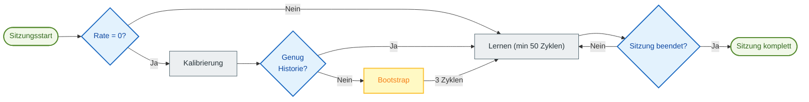

# 🧠 Auto TPI: Automatisches Lernen

> [!NOTE]
> Dieses Feature ist primär für **Schalt**-Heizsysteme (An/Aus) konzipiert, wie z.B. Elektroheizkörper, Heizkessel, Fußbodenheizungen oder Pelletöfen. Die Anpassung für thermostatische Heizkörperventile (TRV) bleibt aufgrund deren Nichtlinearität problematisch.

**Auto TPI** ermöglicht es Ihrem Thermostat, die thermischen Eigenschaften Ihres Raumes selbstständig zu erlernen. Es passt automatisch die Koeffizienten $K_{int}$ (Interne Trägheit) und $K_{ext}$ (Externe Isolierung) an, um Ihren Sollwert mit optimaler Präzision zu erreichen und zu halten.

> [!TIP]
> **Für fortgeschrittene Benutzer**: Eine detaillierte technische Dokumentation, die die Algorithmen, mathematischen Formeln und internen Mechanismen erklärt, finden Sie hier: [Auto TPI Technische Dokumentation](feature-autotpi-technical.md).

---

## 🔄 Sitzungszyklus

Auto TPI arbeitet in **punktuellen Lern-Sitzungen**. Während einer Sitzung analysiert das System dynamisch die Reaktion Ihres Raumes: Zuerst wird die tatsächliche Leistung Ihrer Heizung bewertet, dann werden Kint und Kext über mindestens 50 TPI-Zyklen pro Koeffizient angepasst.

1.  **Initialisierung**: Wenn die **Heizrate** (Heat Rate) 0 ist, versucht das System zunächst eine **Kalibrierung**, indem es Ihre historischen Temperatur-, Steigungs- und Leistungsdaten analysiert (über den Dienst `calibrate_capacity`).
2.  **Bootstrap-Modus**: Wenn die Historie nicht zuverlässig genug ist, um die Heizrate zu schätzen, wechselt das System in den **Bootstrap-Modus**. Es führt 3 intensive Heizzyklen durch, um die Heizkapazität Ihres Heizkörpers zu bestimmen.
3.  **Aktives Lernen**: Sobald die Heizrate bekannt ist, verfeinert das System die TPI-Koeffizienten bei jedem Zyklus. Diese Phase dauert **mindestens 50 Zyklen** pro Koeffizient, um deren Stabilität zu gewährleisten.
4.  **Speichern**: Am Ende der Sitzung (ca. 48 Stunden) werden die erlernten Koeffizienten **und** die endgültige Heizrate automatisch in Ihrer permanenten Konfiguration gespeichert.

### Wann werden Kint und Kext angepasst?

Das System erlernt beide Koeffizienten in unterschiedlichen Situationen:

| Koeffizient | Lern-Situation | Erklärung |
| :--- | :--- | :--- |
| **Kint** (Interne Trägheit) | Während des **Temperaturanstiegs**, wenn die Abweichung vom Sollwert signifikant ist (> 0,05°C) und die Heizung nicht gesättigt ist (100%). | Kint steuert die Reaktionsfähigkeit der Heizung. Er passt sich an, wenn das System zum Sollwert "aufholen" muss. |
| **Kext** (Externe Isolierung) | Während der **Stabilisierung um den Sollwert**, wenn die Abweichung gering ist (< 1°C). | Kext kompensiert Wärmeverluste nach außen. Er passt sich an, wenn das System die Temperatur hält. |

> [!TIP]
> Deshalb ist es wichtig, während des Lernens abwechslungsreiche Heizzyklen zu erzeugen: Der Temperaturanstieg ermöglicht die Kint-Anpassung, und die Stabilisierung ermöglicht die Kext-Anpassung.

> [!NOTE]
> **Gesättigte Zyklen**: Zyklen mit **0%** oder **100%** Leistung werden für die Berechnung der Kint- und Kext-Koeffizienten **ignoriert** (da sie keine brauchbaren Informationen über die thermische Reaktion liefern). Zyklen bei 100% werden jedoch zur Anpassung der **Heizrate** verwendet.

---

## 🚀 Das Lernen starten

Sobald das **Auto TPI**-Feature für Ihren Thermostat aktiviert und konfiguriert ist, startet das Lernen nicht automatisch. Sie müssen es manuell starten:

1.  **Über die dedizierte Karte (Empfohlen)**: Verwenden Sie den "Play"-Button auf der [Auto TPI Learning Card](https://github.com/KipK/auto-tpi-learning-card).
2.  **Über den Dienst "Set Auto TPI Mode"**: Rufen Sie diesen Dienst (`set_auto_tpi_mode`) aus den Entwicklerwerkzeugen auf. Dieser Dienst startet oder stoppt eine Auto-TPI-Sitzung.

---

## ⚙️ Standard-Konfiguration

Bei der Aktivierung von Auto TPI stehen folgende Parameter zur Verfügung:

| Parameter | Beschreibung |
| :--- | :--- |
| **Learning Type** | **Discovery** (für das erste Lernen) oder **Fine Tuning** (um bestehende Einstellungen zu verfeineren). |
| **Aggressiveness** | Reduktionsfaktor der Koeffizienten (1.0 = 100%). Reduzieren Sie diesen Wert (z.B. 0.8), wenn Sie häufige Sollwert-Überschreitungen (Overshoots) beobachten. |
| **Heating Time** | Erforderliche Zeit, bis Ihr Gerät die volle Leistung erreicht (z.B. 5 Min. für einen Elektroheizkörper). |
| **Cooling Time** | Erforderliche Zeit zum Abkühlen nach dem Abschalten (z.B. 7 Min. für einen Elektroheizkörper). |
| **Heat Rate** | Temperaturanstiegskapazität (°C/Stunde). Auf **0** lassen, damit das System sie automatisch über Kalibrierung oder Bootstrap berechnet. |

---

## 🛠️ Erweiterte Konfiguration

Wenn Sie "Enable advanced parameters" aktivieren, erhalten Sie Zugriff auf die Feinabstimmung der Algorithmen.

### "Discovery"-Methode (Gewichteter Durchschnitt)
Wird verwendet, um ein neues System schnell zu stabilisieren.
-   **Initial Weight** (1 bis 50): Definiert die Bedeutung der aktuellen Koeffizienten im Verhältnis zu neuen Entdeckungen.
    -   Bei **1**: Neu berechnete Koeffizienten ersetzen die alten fast vollständig. Das Lernen ist schnell, aber empfindlich gegenüber Störungen.
    -   Bei **50**: Alte Koeffizienten haben viel mehr Gewicht. Das Lernen ist sehr langsam, aber sehr stabil.
    -   **Empfehlung**: Für das erste Lernen auf 1 lassen. Wenn Sie ein unterbrochenes Lernen fortsetzen möchten, während ein Teil des Fortschritts erhalten bleibt, verwenden Sie einen Zwischenwert (z.B. 25).

### "Fine Tuning"-Methode (EWMA)
Wird für eine sanfte und sehr präzise Anpassung verwendet.
-   **Alpha** : Glättungsfaktor. Je höher dieser ist, desto schneller reagiert das System auf aktuelle Änderungen.
-   **Decay Rate** : Ermöglicht es, die Lerngeschwindigkeit schrittweise zu reduzieren, um sich auf den besten gefundenen Werten zu stabilisieren.

---

## 💡 Best Practices

### Externe Störungen vermeiden
Versuchen Sie während einer Lern-Sitzung (besonders in den ersten Stunden) Folgendes zu vermeiden:
-   Direkte Sonneneinstrahlung auf den Temperatursensor.
-   Nutzung einer sekundären Wärmequelle (Kamin, Ofen).
-   Massive Zugluft (offene Türen).
Diese Faktoren verfälschen die Wahrnehmung des Systems über die Isolierung Ihres Raumes.

### Extreme Bedingungen vermeiden

> [!CAUTION]
> **Starten Sie kein Lernen, wenn Ihre Heizkörper gesättigt sind** (ständig 100% Leistung). Dies tritt typischerweise bei außergewöhnlichen Kältewellen auf, wenn die Heizung den Sollwert nicht mehr erreichen kann. Unter diesen Bedingungen kann das System nicht richtig lernen, da es keinen Spielraum zur Leistungsanpassung hat. Warten Sie auf mildere Wetterbedingungen, um eine Lern-Sitzung zu starten.

### Idealer Ablauf einer "Discovery"-Sitzung

> [!TIP]
> **Konkretes Beispiel**: Wenn Ihr üblicher Sollwert **18°C** ist, senken Sie ihn vorübergehend auf **15°C** und warten Sie, bis sich der Raum stabilisiert hat. Starten Sie dann das Lernen neu und stellen Sie den Sollwert wieder auf **18°C**. Dadurch entsteht eine Differenz von 3°C, die das System zum Lernen beobachten wird.

1.  **Vorbereitung**: Senken Sie den Sollwert um mindestens 3°C unter Ihre übliche Temperatur. Lassen Sie den Raum abkühlen und sich bei dieser neuen Temperatur stabilisieren.
2.  **Start**: Aktivieren Sie das Lernen und **stellen Sie den Sollwert wieder auf seinen üblichen Wert**. Das System wird den Temperaturanstieg beobachten.
3.  **Stabilisierung**: Lassen Sie das System die Temperatur für einige Stunden um den Sollwert stabilisieren.
4.  **Stimulation**: Sobald sich die Koeffizienten nicht mehr signifikant ändern, lösen Sie einen neuen Heizzyklus aus, indem Sie den Sollwert um 2°C senken und dann wieder anheben.
5.  **Stabilisierung**: Lassen Sie das System die Temperatur für einige Stunden um den Sollwert stabilisieren.
6.  **Abschluss**: Wenn das Lernen noch nicht abgeschlossen ist, lassen Sie das System bis zum Ende laufen, während Sie zu Ihren normalen Lebensgewohnheiten zurückkehren. Auto TPI stoppt von selbst, sobald die Koeffizienten nach jeweils mindestens 50 Zyklen stabilisiert sind.

> [!NOTE]
> **Über das Überschwingen (Overshoot)**: Ein Überschwingen beim ersten Temperaturanstieg ist **normal** und sogar vorteilhaft! Es liefert wertvolle Daten für das Lernen. Das System wird diese nutzen, um die Koeffizienten zu verfeinern. Wenn die Überschwingungen jedoch nach mehreren Zyklen **bestehen bleiben oder sich verschlimmern**, kann dies auf ein Problem in der Auto-TPI-Konfiguration (falsche Heiz-/Kühlzeiten, zu hohe Aggressivität) oder ein Problem in der VTherm-Konfiguration selbst hindeuten.

### Idealer Ablauf einer "Fine Tuning"-Sitzung
1.  **Stabilität**: Behalten Sie Ihre gewohnten Heizgewohnheiten bei und vermeiden Sie lediglich außergewöhnliche Störungen (lange geöffnete Fenster, Zusatzheizung).
2.  **Beobachtung**: Lassen Sie das System Mikrowariationen beobachten und die Koeffizienten über 50 Zyklen anpassen.
3.  **Neubewertung**: Wenn Sie feststellen, dass die Koeffizienten stark driften oder der Komfort nachlässt, ist es besser, eine komplette Sitzung im **Discovery**-Modus neu zu starten.
---

## 📊 Visuelle Überwachung

Um die Lernentwicklung in Echtzeit zu verfolgen, wird dringend empfohlen, die benutzerdefinierte Karte **Auto TPI Learning Card** zu installieren.

### Installation über HACS

Oder fügen Sie das benutzerdefinierte Repository manuell hinzu: [https://github.com/KipK/auto-tpi-learning-card](https://github.com/KipK/auto-tpi-learning-card)

### Kartenfunktionen

-   📈 Echtzeit-Fortschritt von Kalibrierung und Lernen
-   🔢 Koeffizienten `Kint`, `Kext` und Heizrate in Berechnung
-   ▶️ Steuerungs-Button zum Starten/Stoppen der Sitzung
-   🔧 Optionen zum Zurücksetzen der Sitzung, Aktivieren von Kint Boost oder Kext Deboost