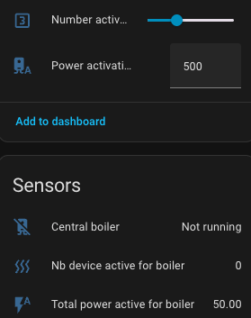
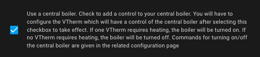
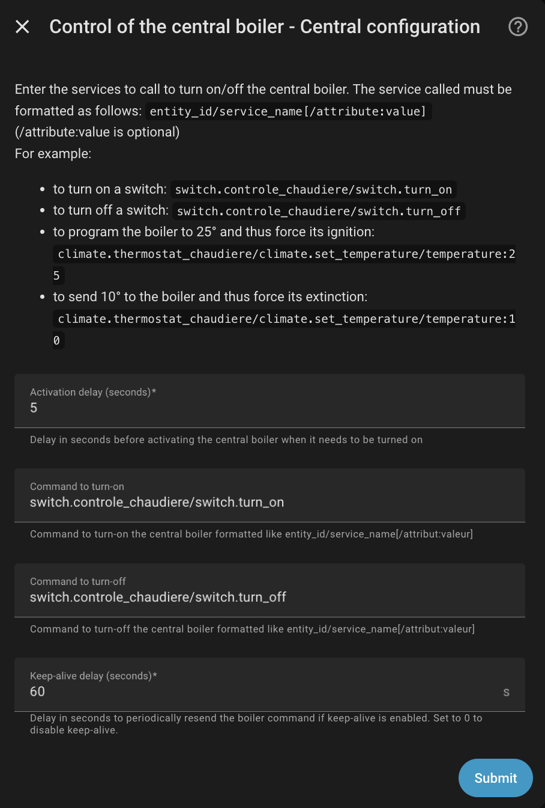

# Steuerung der Zentralheizung

- [Steuerung der Zentralheizung](#steuerung-der-zentralheizung)
  - [Prinzip](#prinzip)
    - [Berechnung der Wirkleistung](#berechnung-der-wirkleistung)
  - [Konfiguration](#konfiguration)
    - [Wie findet man die richtige Maßnahme?](#wie-findet-man-die-richtige-maßnahme)
  - [Ereignisse](#ereignisse)
  - [Warnhinweis](#warnhinweis)

Es besteht die Möglichkeit, einen Zentralheizungskessel zu steuern. Sobald es möglich ist, diesen Kessel über Home Assistant zu starten oder zu stoppen, kann Versatile Thermostat ihn direkt entsprechend dem Status bestimmter _VTherm_ steuern. Wenn genügend _VTherm_ Heizung anfordern, wird der Kessel nach einer bestimmten, einstellbaren Verzögerungszeit eingeschaltet.

## Prinzip
Grundlegend funktioniert das so:
1. Eine neue Entität des Typs `binary_sensor` mit dem Standardnamen `binary_sensor.central_boiler` wird hinzugefügt.
2. In der Konfiguration des _VTherms_ wird festgelegt, ob das _VTherm_ den Heizkessel steuern soll. In einer heterogenen Installation müssen einige _VTherms_ den Kessel steuern, andere hingegen nicht. Daher muss in jeder _VTherm_-Konfiguration angeben werden, ob es den Heizkessel steuert oder nicht. Jedem _VTherm_, der den Heizkessel steuert, kannen eine Leistung zuordnen werden.
3. Der `binary_sensor.central_boiler` überwacht Statusänderungen der _VTherm_-Geräte, die als Kesselsteuerung gekennzeichnet sind.
4. Sobald die Anzahl der vom _VTherm_ gesteuerten Geräte, die eine Heizung anfordern (d. h. deren `hvac_action` auf `Heizen` wechselt), oder die Gesamtleistung einen konfigurierbaren Schwellwert überschreitet, wechselt der `binary_sensor.central_boiler` auf ein (`on`), und **wenn ein Aktivierungsdienst konfiguriert wurde, wird dieser Dienst aufgerufen**.
5. Wenn die Anzahl der zu beheizenden Geräte wieder unter den Schwellwert fällt, wechselt der `binary_sensor.central_boiler` zu aus (`off`), und **wenn ein Deaktivierungsdienst konfiguriert wurde, wird dieser Dienst aufgerufen**.
6. Sie haben Zugriff auf vier Entitäten:
   - Eine vom Typ `number` mit dem Namen `number.boiler_activation_threshold` gibt den Auslöseschwellwert an. Dieser Schwellwert bezieht sich auf die Anzahl der Geräte (Heizkörper), die Heizleistung benötigen, und nicht auf die Anzahl der _VTherm_, die Heizleistung anfordern.
   - Eine vom Typ `sensor` mit dem Namen `sensor.nb_device_active_for_boiler`, die die Anzahl der Geräte angibt, die Heizleistung benötigen. Beispielsweise setzt ein _VTherm_ mit 4 Ventilen, von denen 3 Heizleistung anfordern, diesen Sensor 3. Es werden nur die Geräte von _VTherms_ gezählt, die zfür die Steuerung des Zentralheizkessels gekennzeichnet sind.
   - Ein Sensor vom Typ `number` mit dem Namen `number.boiler_power_activation_threshold`, der den Schwellenwert für die Auslösung der Leistung angibt. Wenn die Gesamtleistung, durch die von den Heizkessel steuernden _Vtherms_ überschritten wird, wird der Heizkessel gestartet.
  - Eine vom Typ `sensor` mit dem Namen `sensor.total_power_active_for_boiler`, die die zuletzt berechnete Gesamtleistung angibt.

Der Zugriff auf Informationen zur Steuerung und Regulierung des Heizkessels ist jederzeit gegeben.

Alle diese Entities sind dem zentralen Konfigurationsdienst zugeordnet:



In diesem Beispiel:
1. Der Heizkessel ist ausgeschaltet.
2. Er schaltet sich ein, wenn 3 Geräte aktiv sind oder wenn die Gesamtleistungsaufnahme 500 beträgt.
3. Die Anzahl der aktiven Geräte beträgt 1.
4. Die Gesamtleistungsaufnahme beträgt 230.

### Berechnung der Wirkleistung
Die Berechnung der Wirkleistung hängt vom Typ des _VTherm_ ab:
1. Für alle _VTherm_, die auf dem [TPI](./algorithms.md#der-tpi-algorithmus) basieren, ist die aktive Leistung [die für das Gerät konfigurierte Leistung](base-attributes.md#auswahl-der-grundlegenden-attribute) x `on_percent`, die aus dem TPI-Algorithmus hervorgeht. Für alle diese _VTherm_ ist die Leistung daher variabel und ändert sich entsprechend der angeforderten Heizleistung. Die Leistungen haben keine Einheiten, Sie können beliebige Werte eingeben, wichtig ist nur, dass alle in allen _VTherm_ angegebenen Leistungen die gleiche Einheit haben.
2. Für die _VTherm_ `over_climate` ist die berechnete Leistung entweder ganz oder gar nicht vorhanden. Wenn das Gerät aktiv ist (`is_device_ative`), entspricht die Leistung der des _VTherm_, andernfalls ist sie gleich Null. In dieser Konfiguration gibt es keine Möglichkeit, die angeforderte Leistung zu modulieren.

## Konfiguration
Um diese Funktion zu konfigurieren, wird eine zentrale Konfiguration (siehe [Konfiguration](#konfiguration)) benötigt, durch setzen von 'Zentralheizung hinzufügen' wird es aktiviert:



Auf der nächsten Seite können Sie die Aktionen (z. B. Dienste) konfigurieren, die beim Ein- und Ausschalten des Heizkessels aufgerufen werden sollen:



Der erste Parameter gibt eine Verzögerung in Sekunden vor der Heizkesselaktivierung an. Der Standardwert ist 0, sodass der Heizkessel sofort startet, sobald ein Schwellenwert überschritten wird. Wenn Beispielsweise die Ventile Zeit zum Öffnen benötigen, sollte ein positiver Wert in Sekunden angegeben werden. Bei einigen Ventilen für Fußbodenheizungen kann das Öffnen mehrere Minuten dauern, und es kann schädlich sein, die Kesselpumpe zu aktivieren, bevor die Ventile geöffnet sind.

Die Aktionen (ehemals Dienste) werden folgendermaßen konfiguriert:
1. Das allgemeine Format ist `entity_id/service_id[/attribute:value]` (wobei `/attribute:value` optional ist).
2. `entity_id` ist der Name der Entity, die den Kessel steuert, in der Form `domain.entity_name`. Zum Beispiel: `switch.heizungsanlage` für einen Kessel, der von einem Schalter gesteuert wird, oder `climate.heizungsanlage` für einen Kessel, der von einem Thermostat gesteuert wird, oder jede andere Entity, die eine Kesselsteuerung erlaubt (es gibt keine Einschränkung). Sie können auch Eingänge (`Helfer`) wie `input_boolean` oder `input_number` umschalten.
3. `service_id` ist der Name des aufzurufenden Dienstes in der Form `domain.service_name`. Beispielsweise: `switch.turn_on`, `switch.turn_off`, `climate.set_temperature`, `climate.set_hvac_mode` sind gültige Beispiele.
4. Einige Dienste benötigen einen Parameter. Dies könnte der 'HVAC-Modus' für `climate.set_hvac_mode` oder die Zieltemperatur für `climate.set_temperature` sein. Dieser Parameter sollte im Format `Attribut:Wert` am Ende des Strings konfiguriert werden.

Beispiele (zur Anpassung an Ihre Gegebenheiten):
- `climate.heizungsanlage/climate.set_hvac_mode/hvac_mode:heat`: um den Kesselthermostat im Heizbetrieb einzuschalten.
- `climate.heizungsanlage/climate.set_hvac_mode/hvac_mode:off`: zum Ausschalten des Kesselthermostats.
- `switch.pumpe_heizungsanlage/switch.turn_on`: zum Einschalten des Schalters, der die Kesselpumpe steuert.
- `switch.pumpe_heizungsanlage/switch.turn_off`: zum Ausschalten des Schalters, der die Kesselpumpe steuert.
- ...

> **Hinweis**
> Es gibt keine Verzögerung für das Abschalten des Heizkessels. Dies ist bewusst so gewählt, damit Sie den Heizkessel nicht laufen lassen, wenn alle Ventile geschlossen sind. Richtig wäre eine negative Verzögerung (d. h. Ausschalten des Heizkessels vor dem Schließen der Ventile), aber das ist in der aktuellen Situation nicht möglich, da die Betätigung der Ventile den Heizkessel auslöst und nicht umgekehrt.

### Wie findet man die richtige Maßnahme?
Um den richtige Auslöser zu finden, gehen Sie am besten zu "Entwicklertools / Dienste" und suchen Sie nach der aufzurufenden Aktion, der zu steuernden Entität und allen erforderlichen Parametern.
Klicken Sie auf 'Dienst aufrufen'. Wenn sich Ihr Kessel einschaltet, haben Sie die richtige Konfiguration. Wechseln Sie dann in den YAML-Modus und kopieren Sie die Parameter.

Beispiel:

Unter "Entwicklertools / Aktionen":


Im YAML-Mmode:


Der zu konfigurierende Dienst wird dann sein: `climate.sonoff/climate.set_hvac_mode/hvac_mode:heat` (bitte das Entfernen der Leerzeichen in `hvac_mode:heat` beachten).

Machen Sie das Gleiche für den ausgeschalteten Dienst, und schon sind Sie startklar.

## Ereignisse

Bei jedem erfolgreichen Ein- und Ausschalten des Heizkessels, wird von Versatile Thermostat ein Ereignis gesendet. Dieses kann von einer Automatisierung erfasst werden, um eine Änderung zu melden.
Die Ereignisse sehen so aus:

Ein Einschalt-Ereignis:
```yaml
event_type: versatile_thermostat_central_boiler_event
data:
  central_boiler: true
  entity_id: binary_sensor.central_boiler
  name: Zentralheizung
  state_attributes: null
origin: LOCAL
time_fired: "2024-01-14T11:33:52.342026+00:00"
context:
  id: 01HM3VZRJP3WYYWPNSDAFARW1T
  parent_id: null
  user_id: null
```

Ein Ausschalt-Ereignis:
```yaml
event_type: versatile_thermostat_central_boiler_event
data:
  central_boiler: false
  entity_id: binary_sensor.central_boiler
  name: Zentralheizung
  state_attributes: null
origin: LOCAL
time_fired: "2024-01-14T11:43:52.342026+00:00"
context:
  id: 01HM3VZRJP3WYYWPNSDAFBRW1T
  parent_id: null
  user_id: null
```

## Warnhinweis

>  _*Hinweise*_
>
> Die Steuerung einer Zentralheizungsanlage durch Software oder Hausautomation kann deren ordnungsgemäßen Betrieb gefährden. Vergewissern Sie sich vor der Nutzung dieser Funktionen, dass Ihr Heizkessel über geeignete Sicherheitsvorrichtungen verfügt und dass diese korrekt funktionieren. Wenn Sie beispielsweise einen Heizkessel bzw. dessen Pumpe, bei geschlossenen Ventilen einschalten, kann ein Überdruck entstehen.
