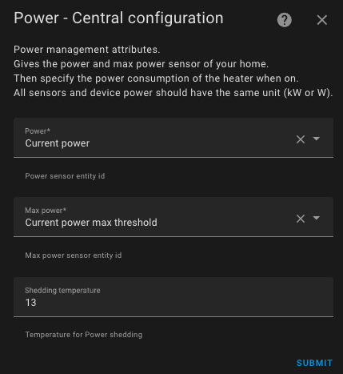

# Energieverwaltung - Lastabwurf

- [Energieverwaltung - Lastabwurf](#energieverwaltung---lastabwurf)
    - [Anwendungsbeispiel](#anwendungsbeispiel)
  - [Energieverwaltung konfigurieren](#energieverwaltung-konfigurieren)

Diese Funktion ermöglicht es Ihnen, den Stromverbrauch Ihrer Heizgeräte zu regulieren. Mit dieser Funktion, die auch als Lastabwurf bezeichnet wird, können Sie den Stromverbrauch Ihrer Heizungsanlage begrenzen, wenn ein zu hoher Verbrauch festgestellt wird.
Sie benötigen einen **Sensor für den momentanen Gesamtstromverbrauch** Ihrer Wohnung und einen **Sensor für die maximal zulässige Leistung**.

Das Verhalten dieser Funktion ist wie folgt:
1. Wenn eine neue Messung des Stromverbrauchs der Wohnung oder der maximal zulässigen Leistung empfangen wird,
2. Wenn die maximale Leistung überschritten wird, schaltet die Zentrale die Last aller aktiven Geräte ab, beginnend mit denen, die dem Sollwert am nächsten sind. Dies wird so lange fortgesetzt, bis genügend _VTherms_ abgeschaltet sind,
3. Wenn eine Leistungsreserve vorhanden ist und einige _VTherms_ abgeschaltet sind, schaltet die Zentrale so viele Geräte wie möglich wieder ein, beginnend mit denen, die am weitesten vom Sollwert entfernt sind (zum Zeitpunkt der Abschaltung).
4. Wenn ein _VTherm_ startet, wird geprüft, ob die angegebene Leistung verfügbar ist. Ist dies nicht der Fall, wird das _VTherm_ in den Abwurfmodus versetzt.

**WARNUNG:** Dies ist **keine Sicherheitsfunktion**, sondern eine Optimierungsfunktion zur Steuerung des Verbrauchs auf Kosten einer gewissen Heizungsverschlechterung. Ein zu hoher Verbrauch ist immer noch möglich, abhängig von der Häufigkeit der Aktualisierungen Ihres Verbrauchssensors und der tatsächlich von Ihrem Gerät verwendeten Leistung. Behalten Sie immer eine Sicherheitsspielraum bei.

### Anwendungsbeispiel:
1. Sie haben einen Stromzähler, der auf 11 kW begrenzt ist,
2. Sie laden gelegentlich ein Elektrofahrzeug mit 5 kW,
3. Damit bleiben 6 kW für alles andere, einschließlich Heizung,
4. Sie haben 1 kW an anderen aktiven Geräten,
5. Sie deklarieren einen Sensor (`input_number`) für die maximal zulässige Leistung von 9 kW (= 11 kW - reservierte Leistung für andere Geräte - Sicherheitsspielraum).

Wenn das Fahrzeug geladen wird, beträgt die verbrauchte Gesamtleistung 6 kW (5 + 1), und ein _VTherm_ schaltet sich nur ein, wenn seine angegebene Leistung maximal 3 kW beträgt (9 kW - 6 kW).
Wenn das Fahrzeug geladen wird und ein weiteres _VTherm_ mit 2 kW eingeschaltet ist, beträgt die verbrauchte Gesamtleistung 8 kW (5 + 1 + 2), und ein _VTherm_ schaltet sich nur ein, wenn seine angegebene Leistung maximal 1 kW (9 kW - 8 kW) beträgt. Andernfalls überspringt es seine Runde (Zyklus).
Wenn das Fahrzeug nicht geladen wird, beträgt die verbrauchte Gesamtleistung 1 kW, und ein _VTherm_ schaltet sich nur ein, wenn seine angegebene Leistung maximal 8 kW (9 kW - 1 kW) beträgt.

## Energieverwaltung konfigurieren

Wenn Sie in der zentralisierten Konfiguration die Funktion „Mit Energieerkennung“ gewählt haben, konfigurieren Sie sie wie folgt:

1. Die Entity-ID des **Sensors für den momentanen Gesamtstromverbrauch** Ihres Hauses,
2. Die Entity-ID des **Sensors für die maximal zulässige Leistung**,
3. Die Temperatur, die angewendet werden soll, wenn der Lastabwurf aktiviert ist.

Achten Sie darauf, dass alle Leistungswerte die gleichen Einheiten verwenden (z. B. kW oder W).
Mit einem **Sensor für die maximal zulässige Leistung** können Sie die maximale Leistung dynamisch mithilfe eines Zeitplaners oder einer Automatisierung ändern.

Beachten Sie, dass es aufgrund des zentralisierten Lastabwurfs nicht möglich ist, die Sensoren für den Verbrauch und den maximalen Verbrauch an einzelnen _VTherms_ zu überschreiben. Diese Konfiguration muss in den zentralisierten Einstellungen vorgenommen werden. Siehe [Zentrale Konfiguration](./creation.md#centralized-configuration).

>  _*Hinweise*_
>
> 1. Während des Lastabwurfs wird die Heizung auf die Voreinstellung mit dem Namen `power` eingestellt. Dies ist eine versteckte Voreinstellung, die nicht manuell ausgewählt werden kann.
> 2. Behalten Sie immer einen Spielraum ein, da die maximale Leistung kurzzeitig überschritten werden kann, während Sie auf die Berechnung des nächsten Zyklus warten oder aufgrund von unkontrollierten Geräten.
> 3 Wenn Sie diese Funktion nicht verwenden möchten, deaktivieren Sie sie im Menü 'Funktionen'.
> 4. Wenn ein einzelnes _VTherm_ mehrere Geräte steuert, sollte der **deklarierte Heizleistungsverbrauch** der Gesamtleistung aller Geräte entsprechen.
> 5. wenn Sie die Versatile Thermostat UI-Karte verwenden (siehe [hier](additions.md#better-with-the-versatile-thermostat-ui-card)), wird der Lastabwurf wie folgt dargestellt: .
> 6. Es kann eine Verzögerung von bis zu 20 Sekunden zwischen dem Empfang eines neuen Wertes vom Stromverbrauchssensor und dem Auslösen des Lastabwurfs für _VTherms_ geben. Diese Verzögerung verhindert eine Überlastung des Home Assistant, wenn der Verbrauch sehr häufig aktualisiert wird.