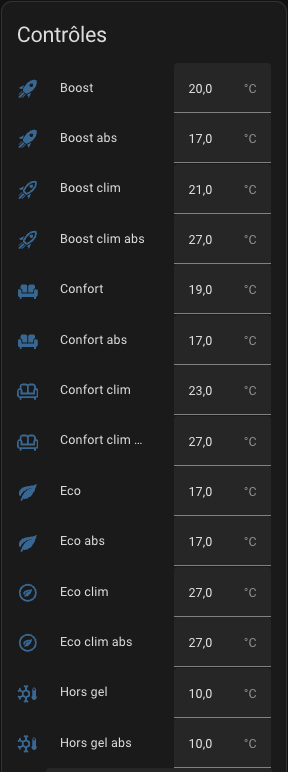

# Voreinstellungen (Vorkonfigurierte Einstellungen)

- [Voreinstellungen (Vorkonfigurierte Einstellungen))](#voreinstellungen-vorkonfigurierte-einstellungen)
  - [Vorkonfigurierte Temperaturen einrichten](#vorkonfigurierte-temperaturen-einrichten)

## Vorkonfigurierte Temperaturen einrichten

Im Voreinstellungsmodus können Sie die Zieltemperatur vorkonfigurieren. In Verbindung mit dem Zeitplaner (siehe [Zeitplaner](additions.md#the-scheduler-component)) haben Sie eine leistungsfähige und einfache Möglichkeit, die Temperatur in Abhängigkeit vom Stromverbrauch in Ihrem Haus zu optimieren. Die verwalteten Voreinstellungen sind wie folgt:
 - **Eco**: das Gerät befindet sich im Energiesparmodus
 - **Komfort**: Das Gerät befindet sich im Komfortmodus
 - **Boost**: das Gerät öffnet alle Ventile vollständig

Wenn der AC-Modus verwendet wird, können Sie auch die Temperaturen einstellen, wenn sich das Gerät im Klimatisierungsmodus befindet.

**Keine** ist immer der Modusliste hinzugefügt, da dies eine Möglichkeit ist, keine Voreinstellungen zu verwenden und stattdessen eine **manuelle Temperatur** einzustellen.

Die Voreinstellungen werden direkt von den _VTherm_-Entities oder der zentralen Konfiguration übernommen, wenn Sie eine zentralisierte Steuerung verwenden. Nach der Erstellung des _VTherm_ haben Sie verschiedene Entities, mit denen Sie die Temperaturen für jede Voreinstellung einstellen können:

.

Die Liste der Entities variiert je nach der von Ihnen gewählten Funktion:
1. Wenn die Funktion `Anwesenheitserkennung` aktiviert ist, haben Sie die Voreinstellungen mit einer `Abwesenheits`-Version mit dem Präfix _abs_.
2. Wenn Sie die Option _AC_ gewählt haben, haben Sie auch Voreinstellungen für die `Klimaanlage` mit dem Präfix _clim_.

>  _*Hinweise*_
>
> 1. Wenn Sie die Zieltemperatur manuell ändern, wechselt die Voreinstellung zu Keine (keine Voreinstellung).
> 2. Die Standardvoreinstellung `Auswärts` ist eine versteckte Voreinstellung, die nicht direkt ausgewählt werden kann. Das Versatile Thermostat nutzt das Anwesenheitsmanagement oder die Bewegungserkennung, um die Zieltemperatur automatisch und dynamisch auf der Grundlage der Anwesenheit im Haus oder der Aktivität im Raum anzupassen. Siehe [Präsenzmanagement](feature-presence.md).
> 3. Wenn Sie das Lastabwurfmanagement verwenden, sehen Sie eine versteckte Voreinstellung namens `Leistung`. Die Voreinstellung des Heizelements wird auf `Leistung` gesetzt, wenn die Überlastbedingungen erfüllt sind und der Lastabwurf für dieses Heizelement aktiv ist. Siehe [Energieverwaltung](feature-power.md).
> 4. Wenn Sie die erweiterte Konfiguration verwenden, wird die Voreinstellung auf `Sicherheit` gesetzt, sobald die Temperatur nach einer bestimmten Verzögerung nicht mehr abgerufen werden kann. Siehe [Sicherheitsmodus](feature-advanced.md#safety-mode).