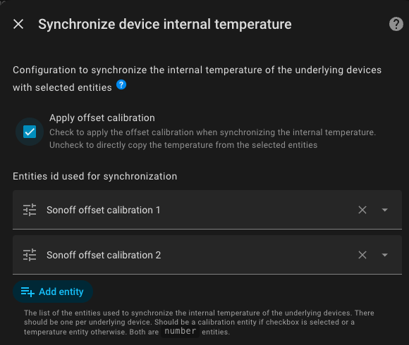

# Synchronisierung der internen Gerätetemperatur

- [Synchronisierung der internen Gerätetemperatur](#synchronisierung-der-interne-gerätetemperatur)
  - [Grundsatz](#grundsatz)
  - [Voraussetzungen](#voraussetzungen)
  - [Konfiguration](#Konfiguration)
  - [Synchronisationsmodus](#synchronisationsmodus)
    - [Modus 1: Verwendung einer Kalibrierungsentity](#modus-1-verwendung-einer-kalibrierungsentity)
      - [Modus 2: Direkte Übernahme einer externen Temperatur](#modus-2-direkte-übernahme-einer-externen-temperatur)

## Grundsatz

Diese Funktion ermöglicht es, die Innentemperatur von Geräten des Typs `over_climate` auf zwei verschiedene Arten zu synchronisieren. Im Grunde genommen ermöglicht sie die Verwendung eines Fernthermometers, sofern Ihr Gerät dies unterstützt. Dies ist besonders nützlich für thermostatische Heizkörperventile (TRV), die über einen eigenen integrierten Temperatursensor verfügen. Dadurch wird die interne Regelung von Geräten des Typs `over_climate`, die diese Funktion unterstützen, erheblich verbessert.

Die beiden verfügbaren Synchronisationsmodi sind:
1. Modus 1 – **Kalibrierungs-Offset verwenden**: VTherm nutzt den internen Kalibrierungs-Offset des Geräts, um die Abweichung zur Raumtemperatur auszugleichen.
2. Modus 2 – **Temperatur direkt mit dem Gerät synchronisieren**: VTherm übermittelt die Raumtemperatur direkt an das Gerät, damit dieses sie für seine eigene Regelung nutzen kann.

Die Wahl hängt davon ab, welche Funktionen das verbundene Gerät bietet.
Beispiele:
1. Der Sonoff TRVZB kann beides. Sie verwenden entweder den Kalibrierungs-Offset über die freigegebene Entität mit einem Kompass oder die benannte externe Temperatur (`external_temperature_input`). Achten Sie darauf, die Option `sensor_select` in diesem Fall auf `external` zu setzen.
2. Der Aqara W600 verfügt nur über die Kalibrierungs-Entität (das Icon ist standardmäßig ein Kompass).

## Voraussetzungen

Diese Funktion erfordert:
1. einen VTherm vom Typ `over_climate`,
2. für Modus 1: ein Gerät, das die Entity `local_temperature_calibration` oder eine gleichwertige Funktion unterstützt, mit der die interne Temperatur kalibriert werden kann,
3. für Modus 2: ein Gerät, das die Entity `external_temperature_input` oder eine gleichwertige Funktion unterstützt.

>  _*Hinweis*_
> - Diese Funktion ist nicht verfügbar für VTherms vom Typ `over_switch` oder `over_valve`, denen kein Klimagerät zugeordnet ist.
> - Überprüfen Sie die Kompatibilität Ihrer Geräte, um den richtigen Modus auszuwählen.

## Konfiguration

Die Konfiguration dieser Funktion erfolgt in zwei Schritten.

In der zugeordneten Konfiguration wid angegeben, dass das Gerät mit einer der beiden internen Temperatursynchronisationsfunktionen ausgestattet ist, indem entsprechende Option aktiviert wird:

Dadurch wird ein Menü namens `Synchronisation der Gerätetemperatur` hinzugefügt, das konfiguriert werden muss:

Um Option 1 auszuwählen, muss `Offset-Kalibrierung anwenden` aktivieren werden. Andernfalls wird Option 2 benutzt.
Anschließend geben Sie die Liste der zu steuernden Elemente an:
1. entweder die Liste der Elemente vom Typ `local_temperature_calibration`, wenn Sie sich in Fall 1 befinden,
2. oder die Liste der Elemente vom Typ `external_temperature_input`, wenn Sie sich in Fall 2 befinden.

Die Entitäten müssen in der Reihenfolge der Deklaration der zugeordneten Geräte aufgeführt sein, und ihre Anzahl muss übereinstimmen.

>  _*Hinweis*_
> - Die beiden Modi schließen sich gegenseitig aus. Es kann jeweils nur einer aktiviert werden.
> - Es ist nicht möglich, zwei Synchronisationsmethoden innerhalb desselben _VTherm_ zu kombinieren. Bei Bedarf bitte zwei _VTherms_ benutzen.
> - Bei Methode 2 muss das Gerät möglicherweise zusätzlich konfiguriert werden. Da diese Konfiguration geräteabhängig ist, wird sie nicht von _VTherm_ übernommen. Beim Sonoff TRVZB muss beispielsweise die Option `select.xxx_sensor_select` auf `external` gesetzt werden.

## Synchronisationsmodus

### Modus 1: Verwendung einer Kalibrierungsentity

Bei dieser Methode wird eine `number`-Entity benötigt, mit der der Temperatur-Offset des Geräts kalibriert werden kann. Diese Entität trägt in der Regel den Namen `local_temperature_calibration` oder `temperature_calibration_offset`.

VTherm:
1. ruft die Innentemperatur des Geräts ab,
2. berechnet den erforderlichen Offset: `offset = Raumtemperatur - Innentemperatur`,
3. sendet diesen Offset über den Dienst `number.set_value` an die angegebene Kalibrierungsinstanz.

**Beispiel**:
- Raumtemperatur (externer Sensor): 19 °C
- Innentemperatur des Thermostatventils: 21 °C
- Berechnete Abweichung: 19 °C – 21 °C = –2 °C
- Die Abweichung von –2 °C wird zur aktuellen Abweichung addiert und an die `number.salon_trv_local_temperature_calibration`-Entity gesendet

**Vorteile**:
- Das Gerät passt sich an die tatsächliche Raumtemperatur an,
- Vermeidet Schwankungen durch Ausgleich,
- Funktioniert mit allen Geräten, die eine Kalibrierungs-`number`-Entity bereitstellen,
- Die Kalibrierung wird jedes Mal gesendet, wenn eine neue Temperatur vom Raumsensor empfangen wird, unabhängig vom Berechnungszyklus von _VTherm_.

#### Modus 2: Direkte Übernahme einer externen Temperatur

Bei dieser Methode übermittelt VTherm die Raumtemperatur direkt an das Gerät mittels der `external_temperature_input`-Entity oder einer gleichwertigen Funktion.

VTherm:
1. ruft die Raumtemperatur von seinem externen Sensor ab,
2. ruft `number.set_value` mit der Raumtemperatur als Wert auf

**Beispiel**:
- VTherm-Solltemperatur: 20 °C
- Raumtemperatur: 19 °C
- VTherm sendet: `number.set_value(19)` an die Entität `external_temperature_input`
- Das Gerät empfängt die Raumtemperatur direkt

**Vorteile**:
- Einfachste Methode,
- Funktioniert mit bestimmten Geräten, die den Parameter `external_temperature_input` unterstützen,
- Das Gerät kann diese Temperatur direkt für seine Regelung verwenden,
- Die Temperatur wird jedes Mal gesendet, wenn eine neue Temperatur vom Raumsensor empfangen wird, unabhängig vom Berechnungszyklus von _VTherm_.

**Nachteile**:
- **Nur wenige Geräte unterstützen diese Methode**: denn nur wenige Geräte verfügen über diese Option,
- Funktioniert hauptsächlich mit bestimmten Zigbee-Geräten (z.B. Sonoff TRVZB),
- Die Verwendung dieser Temperatur ist oft mit einer anderen Konfiguration verbunden.
