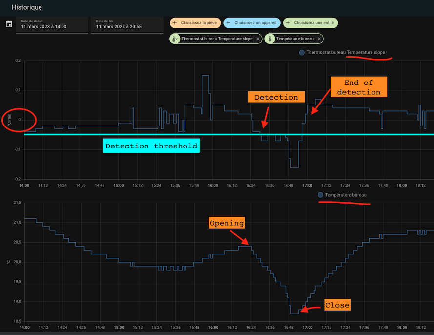

# Erkennung offener Türen/Fenster

- [Erkennung offener Türen/Fenster](#erkennung-offener-tütrenfenster)
  - [Sensor-Modus](#sensor-modus)
  - [Auto-Modus](#auto-modus)

Um auf diese Seite zu gelangen, müssen Sie auf der ersten Seite die Funktion "Mit Offenerkennung" ausgewählt haben.
Die Erkennung von offenen Stellen kann auf zwei Arten erfolgen:
1. Mit Hilfe eines Sensors, der auf der Öffnung platziert wird (Sensor-Modus),
2. Durch Erkennung eines plötzlichen Temperaturabfalls (Auto-Modus)

## Sensor-Modus
Um in den Sensormodus zu wechseln, müssen Sie eine Entity vom Typ `binary_sensor` oder `input_boolean` angeben.
In diesem Modus müssen Sie die folgenden Informationen eingeben:

1. Eine **Verzögerung in Sekunden** vor jeder Änderung. So können Sie ein Fenster kurz öffnen, ohne die Heizung zu stoppen.
2. Die Aktion, die ausgeführt werden soll, wenn die Öffnung als offen erkannt wird. Die möglichen Aktionen sind:
   1. _Ausschalten_: _VTherm_ wird ausgeschaltet.
   2. Nur Gebläse: Die Heizung oder Kühlung wird ausgeschaltet, aber das Gerät lüftet weiter (bei kompatiblen Geräten).
   3. _Frostschutz_: Die voreingestellte Temperatur „Frostschutz“ wird auf dem _VTherm_ gewählt, ohne die aktuelle Voreinstellung zu ändern (siehe Hinweise unten).
   4. _Eco_: Die voreingestellte „Eco“-Temperatur wird auf das _VTherm_ angewendet, ohne die aktuelle Voreinstellung zu ändern (siehe Hinweise unten).

Wenn der Melder auf offen schaltet:
1. _VTherm_ wartet die angegebene Wartezeit ab.
2. Ist das Fenster nach der Verzögerung noch geöffnet, wird der _VTherm_-Zustand (Heizen / Kühlen / ..., aktuelle Voreinstellung, aktuelle Zieltemperatur) gespeichert und die Aktion wird ausgeführt.

Ähnlich verhält es sich, wenn der Melder auf geschlossen schaltet:
1. _VTherm_ wartet die angegebene Wartezeit ab.
2. Wenn das Fenster nach der Verzögerung immer noch geschlossen ist, wird der Zustand vor dem Öffnen des Fensters wiederhergestellt.

## Auto-Modus
Im Automatikmodus sieht die Konfiguration wie folgt aus:

1. Eine **Verzögerung in Sekunden** vor jeder Änderung. So können Sie ein Fenster kurz öffnen, ohne die Heizung zu stoppen.
2. Eine Erkennungsschwelle in Grad pro Stunde. Wenn die Temperatur unter diesen Schwellenwert fällt, schaltet sich der Thermostat aus. Je niedriger dieser Wert, desto schneller die Erkennung (mit einem höheren Risiko von Fehlalarmen).
3. Ein Schwellenwert für die Beendigungserkennung in Grad pro Stunde. Wenn der Temperaturabfall diesen Wert überschreitet, kehrt der Thermostat in den vorherigen Modus zurück (Modus und Voreinstellung).
4. Eine maximale Erfassungsdauer. Nach Ablauf dieser Zeit kehrt der Thermostat in den vorherigen Modus und die Voreinstellung zurück, auch wenn die Temperatur weiter sinkt.
5. Die Aktion, die ausgeführt werden soll, wenn die Öffnung als offen erkannt wird. Die Aktionen sind dieselben wie im oben beschriebenen Sensor-Modus.

Zur Anpassung der Schwellenwerte wird empfohlen, mit den Referenzwerten zu beginnen und die Erkennungsschwellen anzupassen. Einige Tests ergaben die folgenden Werte (für ein Büro):
- Erkennungsschwelle: 3°C/Stunde
- Keine Erkennungsschwelle: 0°C/Stunde
- Maximale Dauer: 30 min.

Ein neuer Sensor namens "slope" (Steigung) wurde für alle Thermostate hinzugefügt. Er liefert die Steigung der Temperaturkurve in °C/Stunde (oder K/Stunde). Diese Steigung wird geglättet und gefiltert, um abweichende Thermometerwerte zu vermeiden, die die Messung beeinträchtigen könnten.

Um sie richtig einzustellen, empfiehlt es sich, sowohl die Temperaturkurve als auch die Steigung der Kurve ("slope") in derselben historischen Grafik anzuzeigen:

>  _*Hinweise*_
>
> 1. Wenn Sie **mehrere Tür-/Fenstersensoren** zur Automatisierung Ihres Thermostats verwenden möchten, erstellen Sie einfach eine Gruppe mit dem üblichen Verhalten (https://www.home-assistant.io/integrations/binary_sensor.group/)
> 2. Wenn Sie keinen Tür-/Fenstersensor in Ihrem Zimmer haben, lassen Sie die Sensor-Entity-ID einfach leer.
> 3. **Es ist nur ein Modus erlaubt**. Sie können ein Thermostat nicht mit einem Sensor und einer automatischen Erkennung konfigurieren. Die beiden Modi können sich gegenseitig widersprechen, daher können nicht beide Modi gleichzeitig aktiv sein.
> 4. Es wird nicht empfohlen, den Automatikmodus für Geräte zu verwenden, die häufigen und normalen Temperaturschwankungen ausgesetzt sind (Flure, offene Bereiche usw.).
> 5. Um Ihre aktuellen Voreinstellungen nicht zu beeinträchtigen, ändern die Aktionen _Frostschutz_ und _Eco_ die Zieltemperatur, ohne die Voreinstellung zu ändern. Daher können Sie eine Diskrepanz zwischen der gewählten Voreinstellung und dem Sollwert feststellen. Siehe weitere Beschreibung [hier](troubleshooting.md#open-window-detection-does-not-prevent-preset-changes)
> 6. Wenn Sie die Versatile Thermostat UI-Karte verwenden (siehe [hier](additions.md#even-better-with-the-versatile-thermostat-ui-card)), wird die Erkennung offener Fenster wie folgt dargestellt: .