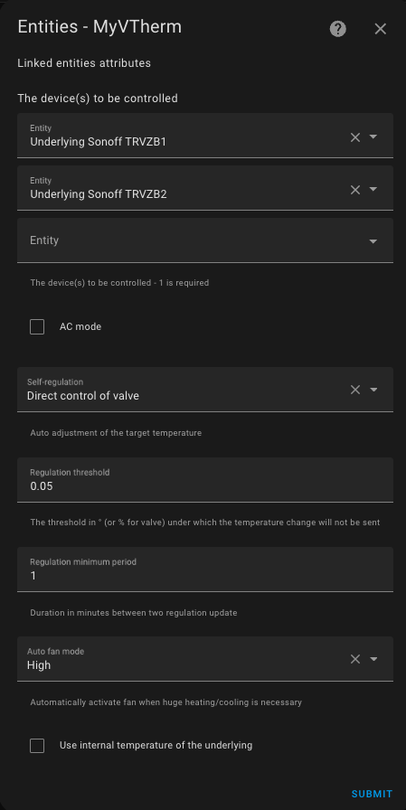

# `over_climate` Thermostattyp

- [`over_climate` Thermostattyp](#over_climate-thermostattyp)
  - [Voraussetzungen](#voraussetzungen)
  - [Konfiguration](#konfiguration)
    - [Die zugeordneten Geräte](#die-zugeordneten-geräte)
    - [Klimaanlagenmodus/AC Modus](#klimaanlagenmodusac-modus)
    - [Synchronization of the internal temperature of underlying entities](#synchronization-of-the-internal-temperature-of-underlying-entities)
    - [Selbstregulierung](#selbstregulierung)
    - [Auto-Fan (Automatische Belüftung)](#auto-fan-automatische-belüftung)
    - [Kompensation der Innentemperatur des zugehörigen Geräts](#kompensation-der-innentemperatur-des-zugehörigen-geräts)
  - [Besondere Funktionen](#besondere-funktionen)
  - [Verfolgung grundlegender Temperaturänderungen](#verfolgung-grundlegender-temperaturänderungen)

## Voraussetzungen

Die Installation sollte etwa so aussehen::

1. Der Benutzer, die Automatisierung oder der Scheduler stellen einen Sollwert über eine Voreinstellung oder direkt über eine Temperatur ein.
2. Das interne Thermometer (2), das externe Thermometer (2b) oder das interne Thermometer des Geräts (2c) sendet in regelmäßigen Abständen die gemessene Temperatur. Das Innenthermometer sollte an einer für den Benutzer günstigen Stelle angebracht werden: idealerweise in der Mitte des Wohnraums. Vermeiden Sie es, es zu nahe an einem Fenster oder einem Gerät zu platzieren.
3. Auf der Grundlage der Sollwerte, der Differenzen und der Selbstregulierungsparameter (siehe [Selbstregulierung](self-regulation.md)) berechnet VTherm einen Sollwert, der an die verbundene `climate`-Entity gesendet wird.
4. Die `climate`-Entity steuert die Geräte über ihr eigenes Protokoll.
5. Je nach den gewählten Regelungsoptionen kann VTherm die Öffnung eines Thermostatventils direkt steuern oder das Gerät so kalibrieren, dass seine Innentemperatur der Raumtemperatur entspricht.

## Konfiguration

Konfigurieren Sie zunächst die Haupteinstellungen, die für alle _VTherms_ gelten (siehe [Haupteinstellungen](base-attributes.md)).
Klicken Sie dann im Menü auf die Option "Zugeordnete Entities", um diese Konfigurationsseite anzuzeigen:

### Die zugeordneten Geräte
In der Liste „Zu steuernde Geräte“ sollten Sie die `climate`-Entities hinzufügen, die von VTherm gesteuert werden sollen. Es werden nur Entities des Typs `climate` akzeptiert.

### Klimaanlagenmodus/AC Modus

Sie können einen `over_climate`-Thermostat zur Steuerung einer Klimaanlage (reversibel oder nicht) wählen, indem Sie das Kästchen "AC Mode" markieren. Wenn das Gerät dies zulässt, sind die beiden Modi 'Heizen' und 'Kühlen' verfügbar.

### Synchronization of the internal temperature of underlying entities
This function allows for much better regulation as it synchronizes the internal thermometer of the underlying `climate` entities with the room temperature measured by _VTherm_. It is described [here](feature-sync_device_temp.md).

### Selbstregulierung

Im `over_climate`-Modus verwendet das Gerät seinen eigenen Regelalgorithmus: Es schaltet sich automatisch ein/aus und pausiert auf der Grundlage des von VTherm über seine `climate`-Entity übermittelten Sollwerts. Es verwendet sein internes Thermometer und den empfangenen Sollwert.

Je nach Gerät kann diese interne Regelung von unterschiedlicher Qualität sein. Sie hängt stark von der Qualität des Geräts, der Funktionalität des internen Thermometers und des internen Algorithmus ab. Zur Verbesserung von Geräten, die schlecht regeln, bietet VTherm eine Möglichkeit, den von ihm gesendeten Sollwert anzupassen, indem er auf der Grundlage der von VTherm gemessenen Raumtemperatur und nicht der internen Temperatur erhöht oder gesenkt wird.

Die Möglichkeiten der Selbstregulierung werden [hier](self-regulation.md) ausführlich beschrieben.

Um eine Überlastung der zugehörigen Geräte zu vermeiden (einige können unangenehm piepsen, andere laufen mit Batterien usw.), stehen zwei Schwellenwerte zur Verfügung, um die Anzahl der Anfragen zu begrenzen:
1. Regelschwelle: ein Schwellenwert in ° (oder %), unterhalb dessen kein neuer Sollwert gesendet wird. Wenn der letzte Sollwert 22° war, wird der nächste Sollwert 22° ± Regelschwelle sein. Wenn eine direkte Ventilregelung verwendet wird (`over_valve` oder `over_climate` mit direkter Ventilregelung), sollte dieser Wert in Prozent angegeben werden und sollte bei Sonoff TRVZB nicht unter 3% liegen (sonst kann der Sonoff TRVZB seine Kalibrierung verlieren).
2. Mindestregelungszeit (in Minuten): ein Mindestzeitintervall, unter dem kein neuer Sollwert gesendet wird. Wenn der letzte Sollwert um 11:00 Uhr gesendet wurde, kann der nächste nicht vor 11:00 Uhr + Mindestregelzeit gesendet werden.

Eine falsche Einstellung dieser Schwellenwerte kann eine korrekte Selbstregulierung verhindern, da keine neuen Sollwerte gesendet werden.

### Auto-Fan (Automatische Belüftung)

Dieser in Version 4.3 eingeführte Modus erzwingt den Einsatz der Lüftung, wenn der Temperaturunterschied erheblich ist. Durch die Aktivierung der Belüftung erfolgt die Wärmeverteilung schneller, so dass die Zieltemperatur schneller erreicht werden kann.
Sie können aus den folgenden Optionen wählen, welche Lüftungsstufe aktiviert werden soll: Niedrig, Mittel, Hoch, Turbo.

Natürlich muss Ihr Gerät über eine Belüftung verfügen, und diese muss regelbar sein, damit dies funktioniert. Wenn Ihr Gerät nicht über den Turbo-Modus verfügt, wird stattdessen der Hoch-Modus verwendet. Sobald der Temperaturunterschied wieder klein wird, schaltet die Lüftung auf einen "normalen" Modus um, in Abhängigkeit von Ihrem Gerät (in dieser Reihenfolge): `Stumm`, `Quiet`, `Auto`, `Niedrig`. Es wird der erste verfügbare Modus für Ihr Gerät gewählt.

### Kompensation der Innentemperatur des zugehörigen Geräts

Achtung! Diese Option darf nicht mit direkter Ventilsteuerung verwendet werden, wenn eine Kalibrierungseinheit vorhanden ist.

Manchmal ist das Innenthermometer der zugehörigen Anlage (TRV, Klimaanlage usw.) so ungenau, dass die Selbstregulierung unzureichend ist. Dies geschieht, wenn das interne Thermometer zu nahe an der Wärmequelle angebracht ist. Die Innentemperatur steigt viel schneller an als die Raumtemperatur, was zu Regelungsfehlern führt.
Beispiel:
1. Die Raumtemperatur beträgt 18°, der Sollwert ist 20°.
2. Die Innentemperatur des Geräts beträgt 22°.
3. Wenn VTherm einen Sollwert von 21° (= 20° + 1° Selbstregulierung) sendet, heizt das Gerät nicht, weil seine Innentemperatur (22°) höher ist als der Sollwert (21°).

Um dieses Problem zu lösen, wurde in Version 5.4 eine neue optionale Funktion hinzugefügt: 

Wenn diese Funktion aktiviert ist, wird die Differenz zwischen der Innentemperatur und der Raumtemperatur zum Sollwert addiert, um die heizen zu erzwingen.
Im obigen Beispiel beträgt die Differenz +4° (22° - 18°), also sendet VTherm 25° (21° + 4°) an das Gerät und zwingt es zum Heizen.

Diese Differenz wird für jedes zugehörige Gerät berechnet, da jedes seine eigene Innentemperatur hat. Zum Beispiel ein VTherm, das an drei TRVs angeschlossen ist, von denen jedes seine eigene Innentemperatur hat.

Dies führt zu einer viel effektiveren Selbstregulierung, die Probleme mit großen internen Temperaturunterschieden aufgrund fehlerhafter Sensoren vermeidet.

Beachten Sie jedoch, dass manche internen Temperaturen so schnell und ungenau schwanken, dass sie die Berechnung völlig verfälschen. In diesem Fall ist es besser, diese Option zu deaktivieren.

Auf der Seite [Selbstregulierung](self-regulation.md) finden Sie Hinweise, wie Sie diese Einstellungen richtig vornehmen können.

>  _*Hinweise*_
> Es ist sehr selten, dass dieses Kästchen angekreuzt werden muss. In den meisten Fällen löst die Selbstregulierung die Probleme. Die Ergebnisse hängen stark vom Gerät und dem Verhalten seiner Innentemperatur ab.
> Sie sollten diese Option nur verwenden, wenn alle anderen Methoden fehlgeschlagen sind.

## Besondere Funktionen

Besondere Funktionen können über eine spezielle Option im Menü konfiguriert werden.

Die besonderen Funktionen, die für diesen Typ von VTherm konfiguriert werden müssen, sind:
1. Auto-Start/Stop: Automatischer Start und Stopp von VTherm auf der Grundlage von Nutzungsprognosen. Dies wird hier beschrieben: [Auto-Start/Stop-Funktion](feature-auto-start-stop.md).
2. Wenn die Ventilregelung gewählt wird, ist die Konfiguration des TPI-Algorithmus über das Menü zugänglich. Siehe ([Algorithmen](algorithms.md)).

## Verfolgung grundlegender Temperaturänderungen

Einige Benutzer möchten ihre Geräte weiterhin wie bisher (ohne _VTherm_) benutzen. Sie möchten zum Beispiel die Fernbedienung Ihrer _WP_ benutzen oder den Drehknopf an Ihrem _TRV_ drehen.
In diesem Fall wurde dem Gerät _VTherm_ eine Entität mit der Bezeichnung `follow underlying temp change` (Folge Temperatureinstellung am Gerät) hinzugefügt:

Steht diese Entity auf 'Ein', werden alle Temperatur- oder Zustandsänderungen, die direkt am zugehörigen Gerät vorgenommen werden, in _VTherm_ wiedergegeben.

Seien Sie vorsichtig, beim verwenden dieser Funktion, wird Ihr Gerät jetzt auf zwei Arten gesteuert: _VTherm_ und direkt von Ihnen. Die Befehle können widersprüchlich sein, was zu Verwirrung über den Zustand des Geräts führen kann. _VTherm_ ist mit einem Verzögerungsmechanismus ausgestattet, der Schleifen verhindert: der Benutzer gibt einen Sollwert vor, der von _VTherm_ erfasst wird und den Sollwert ändert, ... Diese Verzögerung kann dazu führen, dass die direkt am Gerät vorgenommene Änderung ignoriert wird, wenn diese Änderungen zeitlich zu dicht beieinander liegen.

Einige Geräte (wie z. B. Daikin) ändern ihren Zustand von selbst. Wenn das Kontrollkästchen aktiviert ist, kann es sein, dass _VTherm_ ausgeschaltet wird, obwohl Sie das nicht beabsichtigt haben.
Deshalb ist es besser, sie nicht zu verwenden. Es führt zu viel Verwirrung und vielen Supportanfragen.
