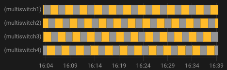

# `over_switch` Thermostattyp

- [`over_switch` Typ Thermostat](#over_switch-typ-thermostat)
  - [Voraussetzungen](#voraussetzungen)
  - [Konfiguration](#konfiguration)
    - [Die zugehörigen Geräte](#die-zugehörigen-geräte)
    - [Aufrechterhaltung/Keep-Alive](#aufrechterhaltung-keep-alive)
    - [Klimaanelagenmodus/AC Modus](#klimaanelagenmodus-AC-modus)
    - [Befehlsumkehr](#befehlsumkehr)
    - [Befehlsanpassung](#befehlsanpassung)

## Voraussetzungen

Die Installation sollte in etwa so aussehen:

1. Der Sollwert wird direkt über die Temperatur durch einen Benutzer, einer Automation oder einen Zeitplan eingestellt.
2. In regelmäßigen Abständen sendet das Innenthermometer (2) oder das Außenthermometer (2b) die gemessene Temperatur. Das interne Thermometer sollte an einer für den Komfort des Benutzers relevanten Stelle angebracht werden: idealerweise in der Mitte des Wohnraums. Vermeiden Sie es, es zu nah an einem Fenster oder in der Nähe eines Heizkörpers zu platzieren.
3. Auf der Grundlage der Sollwerte, der verschiedenen Temperaturen und der Parameter des TPI-Algorithmus (siehe [TPI](algorithms.md#lalgorithmus-tpi)) berechnet VTherm einen Prozentsatz der Einschaltdauer.
4. Es wird dann regelmäßig das Ein- und Ausschalten der zugehörigen `Schalter` (oder `select` oder `climate`) veranlassen.
5. Diese zugehörigen Entitäten steuern das physische Gerät.
6. Der physische Schalter schaltet den Heizkörper ein oder aus.

> Der prozentuale Anteil der Einschaltdauer wird bei jedem Zyklus neu berechnet, was die Regulierung der Raumtemperatur ermöglicht.

## Konfiguration

Konfigurieren Sie zunächst die Haupteinstellungen, die für alle _VTherms_ gelten (siehe [Haupteinstellung](base-attributes.md)).
Klicken Sie dann im Menü auf die Option "Zugehörige Entities", um diese Konfigurationsseite anzuzeigen:

### Die zugehörigen Geräte

In der "Liste der zu steuernden Geräte" fügen Sie die Schalter hinzu, die von VTherm gesteuert werden sollen. Es werden nur Geräte des Typs `switch`, `input_boolean`, `select`, `input_select` oder `climate` akzeptiert.

Handelt es sich bei einem der zugehörigen Geräte nicht um einen `switch`, so ist die Anpassung der Befehle obligatorisch. Standardmäßig sind die Befehle für `switch`-Entities die Standard-Ein-/Ausschaltbefehle (`turn_on`, `turn_off`).

Der derzeit verfügbare Algorithmus ist TPI. Siehe [Algorithmus](#algorithm).
Wenn mehrere Einheiten konfiguriert sind, staffelt der Thermostat die Aktivierungen, um die Anzahl der eingeschalteten Schalter zu einem bestimmten Zeitpunkt zu minimieren. Dies ermöglicht eine bessere Energieverteilung, da sich jeder Heizkörper nacheinander einschaltet.

VTherm glättet die verbrauchte Leistung so weit wie möglich durch abwechselnde Aktivierungen. Beispiel für gestaffelte Aktivierungen:

Wenn die geforderte Leistung (`on_percent`) zu hoch ist, kommt es natürlich zu einer Überschneidung von Aktivierungen.

### Aufrechterhaltung/Keep-Alive

Einige Geräte erfordern eine regelmäßige Aktivierung, um eine Sicherheitsabschaltung zu verhindern. Diese als "Keep-Alive" bekannte Funktion kann durch Eingabe einer von Null abweichenden Anzahl von Sekunden in das Feld "Keep-Alive-Intervall" des Thermostats aktiviert werden. Um die Funktion zu deaktivieren oder im Zweifelsfall, lassen Sie das Feld leer oder geben Sie Null ein (Standardwert).

### Klimaanelagenmodus/AC Modus

Es ist möglich, einen `thermostat_over_switch` zur Steuerung einer Klimaanlage zu wählen, indem man das Kästchen „AC Modus“ ankreuzt. In diesem Fall wird nur der Kühlmodus angezeigt.

### Befehlsumkehr

Wenn Ihr Gerät über einen Pilotdraht mit einer Diode gesteuert wird, müssen Sie möglicherweise das Kästchen "Befehlsumkehrung" aktivieren. Dadurch wird der Schalter auf `Ein` gestellt, wenn Sie das Gerät ausschalten müssen, und auf `Aus`, wenn Sie es einschalten müssen. Die Zykluszeiten werden mit dieser Option invertiert.

### Befehlsanpassung

In diesem Konfigurationsabschnitt können Sie die Ein- und Ausschaltbefehle, die an das zugehörige Gerät gesendet werden, anpassen.
Diese Befehle sind obligatorisch, wenn es sich bei einem der zugeordneten Geräte nicht um einen `switch` handelt (`switch`-Entities verwenden die Standard-Ein-/Aus-Befehle).

Um die Befehle anzupassen, klicken Sie unten auf der Seite auf `Hinzufügen`, sowohl für die Einschalt- als auch für die Ausschaltbefehle:

Geben Sie dann die Ein- und Ausschaltbefehle im Format `Befehl[/Attribut[:Wert]` an.
Die verfügbaren Befehle hängen von der Art des zugehörigen Geräts ab:

| zugehöriger Gerätetyp       | Mögliche Einschaltbefehle             | Mögliche Ausschaltbefehle                      | Betrifft                          |
| --------------------------- | ------------------------------------- | ---------------------------------------------- | --------------------------------- |
| `switch` odr `input_boolean`| `turn_on`                             | `turn_off`                                     | Alle Schalter                     |
| `select` oder `input_select`| `select_option/option:comfort`        | `select_option/option:frost_protection`        | Nodon SIN-4-FP-21 und ähnlich (*) |
| `climate` (HKL-Modus)       | `set_hvac_mode/hvac_mode:heat`        | `set_hvac_mode/hvac_mode:off`                  | eCosy (via Tuya Local)            |
| `climate` (Voreinstellung)  | `set_preset_mode/preset_mode:comfort` | `set_preset_mode/preset_mode:frost_protection` | Heatzy (*)                        |

(*) Überprüfen Sie die von Ihrem Gerät akzeptierten Werte unter **Entwicklertools / Status** und suchen Sie nach Ihrem Gerät. Sie sehen dann die Optionen, die es unterstützt. Sie müssen identisch sein, einschließlich der Groß- und Kleinschreibung.

Natürlich können diese Beispiele an Ihren speziellen Fall angepasst werden.

beispiel für ein Nodon SIN-4-FP-21:

Klicken Sie auf "Validieren", um die Änderungen zu bestätigen.

Falls der folgende Fehler auftritt:

> Die Konfiguration der Befehlsanpassung ist falsch. Sie ist für Geräte erforderlich, die keinem Schalter zugeordnet sind und das Format muss 'service_name[/attribute:value]' sein. Weitere Einzelheiten finden Sie in der README.

Dies bedeutet, dass einer der eingegebenen Befehle ungültig ist. Die folgenden Regeln müssen beachtet werden:
1. Jeder Befehl muss dem Format `Befehl[/Attribut[:Wert]]` folgen (z.B. `select_option/option:comfort` oder `turn_on`) ohne Leer- oder Sonderzeichen außer `_`.
2. Es müssen so viele Befehle vorhanden sein, wie zugeordnete Geräte vorhanden sind, es sei denn, alle zugeordneten Geräte sind „Switch“-Entities; in diesem Fall ist eine Anpassung der Befehle nicht erforderlich.
3. Wenn mehrere zugeordnete Geräte konfiguriert sind, müssen die Befehle in der gleichen Reihenfolge erfolgen. Die Anzahl der Einschaltbefehle muss der Anzahl der Ausschaltbefehle und der Anzahl der zugeordneten Geräte (in der richtigen Reihenfolge) entsprechen. Es ist möglich, verschiedene Typen von Basisgeräten zu mischen. Sobald ein zugeordnetes Gerät kein `switch` ist, müssen alle Befehle für alle zugeordneten Geräte, einschließlich `switch`-Entities, konfiguriert werden.
