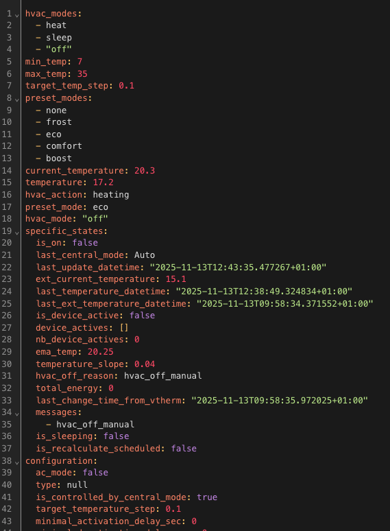

# Referenzdokumentation

- [Referenzdokumentation](#referenzdokumentation)
  - [Parameterübersicht](#parameterübersicht)
- [Sensoren](#sensoren)
- [Aktionen (Services)](#aktionen-services)
  - [Präsenz/Belegung erzwingen](#präsenzbelegung-erzwingen)
  - [Sicherheitseinstellungen ändern](#sicherheitseinstellungen-ändern)
  - [ByPass Fensterprüfung](#bypass-fensterprüfung)
  - [Sperr-/Entsperrdienste](#Sperr-Entsperrdienste)
  - [TPI-Einstellungen ändern](#TPI-Einstellungen-ändern)
- [Ereignisse](#ereignisse)
- [Benutzerdefinierte Attribute](#benutzerdefinierte-attribute)
  - [Für _VTherm_](#für-vtherm)
  - [Für die zentrale Konfiguration](#Für-die-zentrale-Konfiguration)
- [Statusmeldungen](#statusmeldungen)

## Parameterübersicht

| Parameter                                 | Bezeichnung                                                                       | "over switch" | "over climate"     | "over valve" | "configuration centrale" |
| ----------------------------------------- | --------------------------------------------------------------------------------- | ------------- | ------------------ | ------------ | ------------------------ |
| ``name``                                  | Name                                                                              | X             | X                  | X            | -                        |
| ``thermostat_type``                       | Thermostattyp                                                                     | X             | X                  | X            | -                        |
| ``temperature_sensor_entity_id``          | Temperatursensor Entity-ID                                                        | X             | X (Selbstregelung) | X            | -                        |
| ``external_temperature_sensor_entity_id`` | Außentemperatursensor Entity-ID                                                   | X             | X (Selbstregelung) | X            | X                        |
| ``cycle_min``                             | Zyklusdauer (Minuten)                                                             | X             | X                  | X            | -                        |
| ``temp_min``                              | Zulässige Mindesttemperatur                                                       | X             | X                  | X            | X                        |
| ``temp_max``                              | Zulässige Maximaltemperatur                                                       | X             | X                  | X            | X                        |
| ``device_power``                          | Leistung der Anlage                                                               | X             | X                  | X            | -                        |
| ``use_central_mode``                      | Berechtigung zur zentralen Steuerung                                              | X             | X                  | X            | -                        |
| ``use_window_feature``                    | Mit Öffnungserkennung                                                             | X             | X                  | X            | -                        |
| ``use_motion_feature``                    | Mit Bewegungserkennung                                                            | X             | X                  | X            | -                        |
| ``use_power_feature``                     | Mit Powermanagement                                                               | X             | X                  | X            | -                        |
| ``use_presence_feature``                  | Mit Anwesenheitserkennung                                                         | X             | X                  | X            | -                        |
| ``heater_entity1_id``                     | 1. Heizkörper                                                                     | X             | -                  | -            | -                        |
| ``heater_entity2_id``                     | 2. Heizkörper                                                                     | X             | -                  | -            | -                        |
| ``heater_entity3_id``                     | 3. Heizkörper                                                                     | X             | -                  | -            | -                        |
| ``heater_entity4_id``                     | 4. Heizkörper                                                                     | X             | -                  | -            | -                        |
| ``heater_keep_alive``                     | Aktualisierungsintervall des Schalters                                            | X             | -                  | -            | -                        |
| ``proportional_function``                 | Algorithmus                                                                       | X             | -                  | -            | -                        |
| ``climate_entity1_id``                    | 1. Zugeordnetes Thermostat                                                        | -             | X                  | -            | -                        |
| ``climate_entity2_id``                    | 2. Zugeordnetes Thermostat                                                        | -             | X                  | -            | -                        |
| ``climate_entity3_id``                    | 3. Zugeordnetes Thermostat                                                        | -             | X                  | -            | -                        |
| ``climate_entity4_id``                    | 4. Zugeordnetes Thermostat                                                        | -             | X                  | -            | -                        |
| ``valve_entity1_id``                      | 1. Zugeordnetes Ventil                                                            | -             | -                  | X            | -                        |
| ``valve_entity2_id``                      | 2. Zugeordnetes Ventil                                                            | -             | -                  | X            | -                        |
| ``valve_entity3_id``                      | 3. Zugeordnetes Ventil                                                            | -             | -                  | X            | -                        |
| ``valve_entity4_id``                      | 4. Zugeordnetes Ventil                                                            | -             | -                  | X            | -                        |
| ``ac_mode``                               | Nutzung der Klimaanlage (AC)?                                                     | X             | X                  | X            | -                        |
| ``tpi_coef_int``                          | Für das interne Temperaturdelta zu verwendender Faktor                            | X             | -                  | X            | X                        |
| ``tpi_coef_ext``                          | Für das externe Temperaturdelta zu verwendender Faktor                            | X             | -                  | X            | X                        |
| ``frost_temp``                            | Voreingestellte Temperatur Frostschutz                                            | X             | X                  | X            | X                        |
| ``window_sensor_entity_id``               | Öffnungssensor (Entität-ID)                                                       | X             | X                  | X            | -                        |
| ``window_delay``                          | Abschaltverzögerung (Sekunden)                                                    | X             | X                  | X            | X                        |
| ``window_auto_open_threshold``            | Obere Temperaturabfallschwelle für die automatische Erkennung ( °/min)            | X             | X                  | X            | X                        |
| ``window_auto_close_threshold``           | Untere Temperaturabfallschwelle für das Ende der automatischen Erkennung ( °/min) | X             | X                  | X            | X                        |
| ``window_auto_max_duration``              | Maximale Dauer einer automatischen Abschaltung ( Min.)                            | X             | X                  | X            | X                        |
| ``motion_sensor_entity_id``               | Bewegungsmelder Entity-ID                                                         | X             | X                  | X            | -                        |
| ``motion_delay``                          | Verzögerung vor Berücksichtigung der Bewegung (Sekunden)                          | X             | X                  | X            | -                        |
| ``motion_off_delay``                      | Verzögerung vor Berücksichtigung des Bewegungsendes (Sekunden)                    | X             | X                  | X            | X                        |
| ``motion_preset``                         | Voreinstellung bei Erkennung einer Bewegung                                       | X             | X                  | X            | X                        |
| ``no_motion_preset``                      | Voreinstellung, die verwendet werden soll, wenn keine Bewegung erkannt wird       | X             | X                  | X            | X                        |
| ``power_sensor_entity_id``                | Gesamtleistungssensor (Entity-ID)                                                 | X             | X                  | X            | X                        |
| ``max_power_sensor_entity_id``            | Leistungssensor Max (Entity-ID)                                                   | X             | X                  | X            | X                        |
| ``power_temp``                            | Temperatur bei Lastabwurf                                                         | X             | X                  | X            | X                        |
| ``presence_sensor_entity_id``             | Anwesenheitssensor Entity-ID (true, wenn jemand anwesend ist)                     | X             | X                  | X            | -                        |
| ``minimal_activation_delay``              | Mindestverzögerung bei Aktivierung                                                | X             | -                  | -            | X                        |
| ``safety_delay_min``                      | Maximale Zeitspanne zwischen zwei Temperaturmessungen                             | X             | -                  | X            | X                        |
| ``safety_min_on_percent``                 | Mindestprozentsatz der Leistung für den Übergang in den Sicherheitsmodus          | X             | -                  | X            | X                        |
| ``auto_regulation_mode``                  | Der Selbstregulierungsmodus                                                       | -             | X                  | -            | -                        |
| ``auto_regulation_dtemp``                 | Die Schwelle der Selbstregulierung                                                | -             | X                  | -            | -                        |
| ``auto_regulation_period_min``            | Die Mindestdauer der Selbstregulierung                                            | -             | X                  | -            | -                        |
| ``inverse_switch_command``                | Kehrt die Schalterfunktion um (bei Schaltern mit Pilotkabel)                      | X             | -                  | -            | -                        |
| ``auto_fan_mode``                         | Automatischer Lüftungsmodus                                                       | -             | X                  | -            | -                        |
| ``auto_regulation_use_device_temp``       | Verwendung der internen Temperatur des zu steuernden Geräts                       | -             | X                  | -            | -                        |
| ``use_central_boiler_feature``            | Hinzufügen der Steuerung eines Zentralheizungskessels                             | -             | -                  | -            | X                        |
| ``central_boiler_activation_service``     | Dienst zum Anschalten der Zentralheizung                                          | -             | -                  | -            | X                        |
| ``central_boiler_deactivation_service``   | Dienst zum Abschalten der Zentralheizung                                          | -             | -                  | -            | X                        |
| ``central_boiler_activation_delay_sec``   | Zpoždění aktivace (v sekundách)                                                   | -             | -                  | -            | X                        |
| ``used_by_controls_central_boiler``       | Zeigt an, ob VTherm den Zentralheizungskessel steuert                             | X             | X                  | X            | -                        |
| ``use_auto_start_stop_feature``           | Zeigt an, ob die automatische Start-/Stopp-Funktion aktiviert ist.                | -             | X                  | -            | -                        |
| ``auto_start_stop_level``                 | Die Erkennungsstufe der Start-Stopp-Automatik                                     | -             | X                  | -            | -                        |

# Sensoren

Mit dem Thermostat sind Sensoren verfügbar, die die Anzeige von Warnmeldungen und des internen Status des Thermostats ermöglichen. Sie sind in den Entitäten des mit dem Thermostat verbundenen Geräts verfügbar:


In der Reihenfolge sind dies:
1. die Hauptsteuerungs-Entity des Thermostats,
2. die Entity, die die Auto-Start/Stopp-Funktion aktiviert,
3. die Entity, mit der _VTherm_ angewiesen werden kann, den Veränderungen des zugeordneten Geräts zu folgen,
4. die vom Thermostat verbrauchte Energie (Wert, der ständig erhöht wird),
5. Zeitpunkt des Empfangs der letzten Außentemperatur,
6. Zeitpunkt des Empfangs der letzten Innentemperatur,
7. die durchschnittliche Leistung des Geräts während des Zyklus (nur für TPI),
8. die Zeit, die im ausgeschalteten Zustand im Zyklus verbracht wurde (nur TPI),
9. die Zeit, die im eingeschalteten Zustand im Zyklus verbracht wurde (nur TPI),
10. der Lastabwurf,
11. die Prozentuale Leistung im Zyklus (nur TPI)
12. der Anwesenheitsstatus (wenn die Anwesenheitsverwaltung konfiguriert ist),
13. der Sicherheitsstatus,
14. der Fensteröffnungsstatus (wenn die Öffnungsverwaltung konfiguriert ist),
15. der Bewegungsstatus (wenn die Bewegungsverwaltung konfiguriert ist),
16. der Öffnungsprozentsatz des Ventils (für den Typ `over_valve`).

Die Verfügbarkeit dieser Entities hängt davon ab, ob die zugehörige Funktion vorhanden ist.

Um die Sensoren einzufärben, fügen Sie diese Zeilen hinzu und passen Sie sie bei Bedarf in Ihrer configuration.yaml an:

```yaml
frontend:
  themes:
    versatile_thermostat_theme:
      state-binary_sensor-safety-on-color: "#FF0B0B"
      state-binary_sensor-power-on-color: "#FF0B0B"
      state-binary_sensor-window-on-color: "rgb(156, 39, 176)"
      state-binary_sensor-motion-on-color: "rgb(156, 39, 176)"
      state-binary_sensor-presence-on-color: "lightgreen"
      state-binary_sensor-running-on-color: "orange"
```
und wählen Sie das Thema ```versatile_thermostat_theme``` in den Einstellungen des Panels aus. Das Ergebnis sieht in etwa so aus:


# Aktionen (Services)

Diese benutzerdefinierte Implementierung bietet spezifische Aktionen (z. B. Dienste/Services), um die Integration mit anderen Home Assistant-Komponenten zu erleichtern.

## Präsenz/Belegung erzwingen
Dieser Service ermöglicht es Ihnen, den Anwesenheitsstatus unabhängig vom Anwesenheitssensor zu erzwingen. Dies kann nützlich sein, wenn Sie die Anwesenheit über einen Service und nicht über einen Sensor verwalten möchten. Sie können beispielsweise Ihren Wecker verwenden, um die Abwesenheit zu erzwingen, wenn er eingeschaltet ist.

Der Code zum Aufrufen dieses Service lautet wie folgt:
```yaml
service : versatile_thermostat.set_presence
data:
    preset : "off"
target:
    entity_id : climate.my_thermostat
```

## Sicherheitseinstellungen ändern
Mit diesem Service können die hier beschriebenen Sicherheitseinstellungen dynamisch geändert werden [Erweiterte Konfiguration](#erweiterte-konfiguration).
Befindet sich der Thermostat im Modus ``security``, werden die neuen Einstellungen sofort übernommen.

Um die Sicherheitseinstellungen zu ändern, verwenden Sie den folgenden Code:
```yaml
service : versatile_thermostat.set_safety
data:
    min_on_percent: "0.5"
    default_on_percent: "0.1"
    delay_min: 60
target:
    entity_id : climate.my_thermostat
```

## ByPass Fensterprüfung
Mit diesem Service kann eine Umgehung der Fensterüberprüfung aktiviert oder deaktiviert werden.
Es ermöglicht die Fortsetzung der Heizung, auch wenn das Fenster als geöffnet erkannt wird.
Auf ``true`` gesetzt, haben Statusänderungen des Fensters keine Auswirkungen mehr auf den Thermostat. Auf ``false`` gesetzt, wird der Thermostat deaktiviert, wenn das Fenster noch geöffnet ist.

Um die Bypass-Einstellung zu ändern, verwenden Sie den folgenden Code:
```yaml
service : versatile_thermostat.set_window_bypass
data:
    window_bypass: true
target:
    entity_id : climate.my_thermostat
```

## Sperr-/Entsperrdienste

Mit diesen Diensten kann ein Thermostat gesperrt werden, um Änderungen an seiner Konfiguration zu verhindern, oder entsperrt werden, um die zulässigen Änderungen wiederherzustellen:

- `versatile_thermostat.lock` - Sperrt einen Thermostat, um Änderungen an der Konfiguration zu verhindern.
- `versatile_thermostat.unlock` - Entsperrt einen Thermostat, um Konfigurationsänderungen wieder zuzulassen.

## TPI-Einstellungen ändern
Alle konfigurierbaren TPI-Parameter [hier](images/config_tpi.png) können über einen Dienst geändert werden. Diese Änderungen sind dauerhaft und bleiben auch nach einem Neustart erhalten. Sie werden sofort angewendet und der Thermostat wird sofort aktualisiert, wenn die Parameter geändert werden.

Jeder Parameter ist optional. Wenn er nicht angegeben wird, bleibt sein aktueller Wert erhalten.

Um die TPI-Einstellungen zu ändern, verwenden Sie den folgenden Code:
```yaml
action: versatile_thermostat.set_tpi_parameters
data:
  tpi_coef_int: 0.5
  tpi_coef_ext: 0.01
  minimal_activation_delay: 10
  minimal_deactivation_delay: 10
  tpi_threshold_low: -2
  tpi_threshold_high: 5
target:
  entity_id: climate.sonoff_trvzb
```

# Ereignisse
Wichtige Ereignisse des Thermostats werden über den Nachrichtenbus gemeldet.
Es werden folgende Ereignisse gemeldet:

- ``versatile_thermostat_safety_event``: Ein Thermostat wechselt in den voreingestellten Modus ``security`` oder verlässt diesen.
- ``versatile_thermostat_power_event``: Ein Thermostat erreicht oder unterschreitet den  ``power``-Sollwert
- ``versatile_thermostat_temperature_event``: Eine oder beide Temperaturmessungen eines Thermostats wurden seit mehr als ``safety_delay_min`` Minuten nicht aktualisiert.
- ``versatile_thermostat_hvac_mode_event``: Der Thermostat ist ein- oder ausgeschaltet. Dieses Ereignis wird auch beim Start des Thermostats übertragen.
- ``versatile_thermostat_preset_event``: Eine neue Voreinstellung wird am Thermostat ausgewählt. Dieses Ereignis wird auch beim Start des Thermostats übertragen.
- ``versatile_thermostat_central_boiler_event``: Ein Ereignis, das eine Änderung des Heizkesselzustands anzeigt.
- ``versatile_thermostat_auto_start_stop_event``: Ein Ereignis, das einen Stopp oder einen Neustart durch die Auto-Start/Stopp-Funktion anzeigt

Wenn Sie bis hierher mitgekommen sind, wissen Sie, dass beim Umschalten eines Thermostats in den Sicherheitsmodus drei Ereignisse ausgelöst werden:
1. ``versatile_thermostat_temperature_event`` um anzuzeigen, dass ein Thermometer nicht mehr reagiert,
2. ``versatile_thermostat_preset_event`` um den Übergang zur Voreinstellung ```security``` anzuzeigen,
3. ``versatile_thermostat_hvac_mode_event`` um das mögliche Ausfallen des Thermostats anzuzeigen.

Jedes Ereignis enthält die Schlüsselwerte des Ereignisses (Temperaturen, aktuelle Voreinstellung, aktuelle Leistung usw.) sowie die Zustände des Thermostats.

Diese Ereignisse kann man ganz einfach in einer Automatisierung erfassen, um beispielsweise die Benutzer zu benachrichtigen.

# Benutzerdefinierte Attribute

Um den Algorithmus anzupassen, gibt es über spezielle Attribute Zugriff auf den gesamten vom Thermostat erfassten und berechneten Kontext. Man kann diese Attribute in der HA-Benutzeroberfläche "Entwicklungstools/Status" einsehen (und verwenden). Gib den Namen des Thermostat ein und es erscheint etwa Folgendes:


Die benutzerdefinierten Attribute sind folgende:

> see updated list on English version - please translate

## Für _VTherm_

| Attribut                          | Bedeutung                                                                                                                                                               |
| --------------------------------- | ----------------------------------------------------------------------------------------------------------------------------------------------------------------------- |
| ``hvac_modes``                    | Liste der vom Thermostat unterstützten Modi                                                                                                                             |
| ``temp_min``                      | Die Mindesttemperatur                                                                                                                                                   |
| ``temp_max``                      | Die Höchsttemperatur                                                                                                                                                    |
| ``preset_modes``                  | Die sichtbaren Voreinstellungen für diesen Thermostat. Die versteckten Voreinstellungen werden hier nicht angezeigt                                                     |
| ``temperature_actuelle``          | Die vom Sensor gemessene aktuelle Temperatur                                                                                                                            |
| ``temperature``                   | Die Zieltemperatur                                                                                                                                                      |
| ``action_hvac``                   | Die vom Heizgerät gerade ausgeführte Aktion. Kann Leerlauf oder Heizen sein                                                                                             |
| ``preset_mode``                   | Die aktuell ausgewählte Voreinstellung. Kann einer der 'preset_modes' oder eine versteckte Voreinstellung wie zB. `power` sein                                          |
| ``[eco/confort/boost]_temp``      | Die für die Voreinstellung xxx konfigurierte Temperatur                                                                                                                 |
| ``[eco/confort/boost]_away_temp`` | Die für die Voreinstellung xxx konfigurierte Temperatur, wenn die Anwesenheit deaktiviert ist oder not_home                                                             |
| ``temp_power``                    | Die bei der Ausfallerkennung verwendete Temperatur                                                                                                                      |
| ``on_percent``                    | Der vom TPI-Algorithmus berechnete Prozentsatz                                                                                                                          |
| ``on_time_sec``                   | Die Einschaltdauer in Sekunden. Muss ```on_percent * cycle_min``` sein                                                                                                  |
| ``off_time_sec``                  | Die Stillstandszeit in Sekunden. Muss ```(1 - on_percent) * cycle_min``` sein                                                                                           |
| ``cycle_min``                     | Der Berechnungszyklus in Minuten                                                                                                                                        |
| ``function``                      | Der Algorithmus zur Berechnung des Zyklus                                                                                                                               |
| ``tpi_coef_int``                  | Der ``coef_int`` des TPI-Algorithmus                                                                                                                                    |
| ``tpi_coef_ext``                  | Der ``coef_ext`` des TPI-Algorithmus                                                                                                                                    |
| ``saved_preset_mode``             | Die letzte Voreinstellung, die vor der automatischen Umschaltung der Voreinstellung verwendet wurde                                                                     |
| ``saved_target_temp``             | Die letzte Temperatur, die vor der automatischen Umschaltung verwendet wurde                                                                                            |
| ``window_state``                  | Der letzte bekannte Status des Fenstersensors. Keiner, wenn das Fenster nicht konfiguriert ist                                                                          |
| ``is_window_bypass``              | True, wenn die Umgehung (ByPass) der Öffnungserkennung aktiviert ist                                                                                                    |
| ``motion_state``                  | Der letzte bekannte Status des Bewegungssensors. Keiner, wenn keine Bewegung konfiguriert ist                                                                           |
| ``overpowering_state``            | Der letzte bekannte Status des Überlastsensors. Keiner, wenn die Powermanagement/Energieverwaltung nicht konfiguriert ist                                               |
| ``presence_state``                | Der letzte bekannte Status des Anwesenheitssensors. Keiner, wenn die Anwesenheitsverwaltung nicht konfiguriert ist                                                      |
| ``safety_delay_min``              | Die Verzögerungszeit bis zur Aktivierung des Sicherheitsmodus, wenn einer der beiden Temperatursensoren keine Messwerte mehr sendet.                                    |
| ``safety_min_on_percent``         | Prozentsatz der Heizleistung, unterhalb dessen der Thermostat aus Sicherheitsgründen nicht schaltet                                                                     |
| ``safety_default_on_percent``     | Der Heizungsprozentsatz, der verwendet wird, wenn sich der Thermostat im Sicherheitsmodus befindet                                                                      |
| ``last_temperature_datetime``     | Datum und Uhrzeit im ISO8866-Format des letzten Empfangs der Innentemperatur                                                                                            |
| ``last_ext_temperature_datetime`` | Datum und Uhrzeit im ISO8866-Format des letzten Empfangs der Außentemperatur                                                                                            |
| ``safety_state``                  | Der Sicherheitsstatus. true oder false                                                                                                                                  |
| ``minimal_activation_delay_sec``  | Die minimale Aktivierungszeit in Sekunden                                                                                                                               |
| ``last_update_datetime``          | Datum und Uhrzeit des Zustands im ISO8866-Format                                                                                                                        |
| ``friendly_name``                 | Der Name des Thermostats                                                                                                                                                |
| ``supported_features``            | Eine Kombination aller Funktionen, die von diesem Thermostat unterstützt werden. Weitere Informationen finden Sie in der offiziellen Dokumentation zur Klimaintegration |
| ``valve_open_percent``            | Der Ventilöffnungsprozentsatz                                                                                                                                           |
| ``regulated_target_temperature``  | Die durch die Selbstregelung berechnete Solltemperatur                                                                                                                  |
| ``is_inversed``                   | True, wenn der Befehl invertiert ist (Pilotdraht mit Diode)                                                                                                             |
| ``is_controlled_by_central_mode`` | True, wenn VTherm zentral gesteuert werden kann                                                                                                                         |
| ``last_central_mode``             | Der zuletzt verwendete zentrale Modus (None, wenn VTherm nicht zentral gesteuert wird)                                                                                  |
| ``is_used_by_central_boiler``     | Gibt an, ob VTherm den Zentralheizungskessel steuern kann                                                                                                               |
| ``auto_start_stop_enable``        | Gibt an, ob VTherm sich selbst starten/stoppen darf                                                                                                                     |
| ``auto_start_stop_level``         | Zeigt den Stand der Auto-Start/Stopp-Funktion an                                                                                                                        |
| ``hvac_off_reason``               | Gibt den Grund für die Abschaltung (hvac_off) des VTherm an. Dies kann Window, Auto-start/stop oder manuell sein.                                                       |
| ``last_change_time_from_vtherm``  | Datum/Uhrzeit der letzten Änderung durch VTherm                                                                                                                         |
| ``nb_device_actives``             | Die Anzahl der zugeordneten Geräte, die derzeit als aktiv angesehen werden                                                                                              |
| ``device_actives``                | Die Liste der zugrunde liegenden Geräte, die derzeit als aktiv angesehen werden                                                                                         |

## Für die zentrale Konfiguration

Folgende benutzerdefinierten Attribute der zentralen Konfiguration sind unter "Entwicklungstools / Status" für die Entität `binary_sensor.central_boiler` verfügbar:

| Attribute                                   | Bedeutung                                                                                             |
| ------------------------------------------- | ----------------------------------------------------------------------------------------------------- |
| ``central_boiler_state``                    | Der Zustand des Zentralheizungskessels. Kann `on` or `off` sein                                       |
| ``is_central_boiler_configured``            | Gibt an, ob die Zentralheizungsfunktion konfiguriert ist                                              |
| ``is_central_boiler_ready``                 | Gibt an, ob der Heizungskessel betriebsbereit ist                                                     |
| **ABSCHNITT `central_boiler_manager`**      | ------                                                                                                |
| ``is_on``                                   | true, wenn der Heizungskessel eingeschaltet ist                                                       |
| ``activation_scheduled``                    | true, wenn eine Aktivierung des Heizkessels geplant ist (siehe `central_boiler_activation_delay_sec`) |
| ``delayed_activation_sec``                  | Aktivierungszeit des Heizkessels in Sekunden seconds                                                  |
| ``nb_active_device_for_boiler``             | Anzahl der aktiven Geräte, die den Heizkessel steuern                                                 |
| ``nb_active_device_for_boiler_threshold``   | Schwelle für die Anzahl aktiver Geräte vor der Aktivierung des Heizkessels                            |
| ``total_power_active_for_boiler``           | Gesamte Wirkleistung der Geräte, die den Heizkessel steuern                                           |
| ``total_power_active_for_boiler_threshold`` | Gesamtleistungsschwelle vor Aktivierung des Heizkessels                                               |
| **UNTERABSCHNITT `service_activate`**       | ------                                                                                                |
| ``service_domain``                          | Bereich des Aktivierungsdienstes (z.B. switch)                                                        |
| ``service_name``                            | Name des Aktivierungsdienstes (z.B. turn_on)                                                          |
| ``entity_domain``                           | Bereich der Entity, die den Heizkessel steuert (z.B. switch)                                          |
| ``entity_name``                             | Name der Entity, welche den Heizkessel steuert                                                        |
| ``entity_id``                               | Vollständige Kennung der Stelle, die den Heizkessel steuert                                           |
| ``data``                                    | Zusätzliche Daten, die an den Aktivierungsdienst übermittelt wurden                                   |
| **UNTERABSCHNITT `service_deactivate`**     | ------                                                                                                |
| ``service_domain``                          | Bereich des Aktivierungsdienstes (z.B. switch)                                                        |
| ``service_name``                            | Name des Deaktivierungsdienstes (z.B. turn_off)                                                       |
| ``entity_domain``                           | Bereich der Entity, die den Heizkessel steuert (z.B. switch)                                          |
| ``entity_name``                             | Name der Entity, welche den Heizkessel steuert                                                        |
| ``entity_id``                               | Vollständige Kennung der Stelle, die den Heizkessel steuert                                           |
| ``data``                                    | Zusätzliche Daten, die an den Deaktivierungsdienst übermittelt wurden                                 |

Beispielwerte:

```yaml
central_boiler_state: "off"
is_central_boiler_configured: true
is_central_boiler_ready: true
central_boiler_manager:
  is_on: false
  activation_scheduled: false
  delayed_activation_sec: 10
  nb_active_device_for_boiler: 1
  nb_active_device_for_boiler_threshold: 3
  total_power_active_for_boiler: 50
  total_power_active_for_boiler_threshold: 500
  service_activate:
    service_domain: switch
    service_name: turn_on
    entity_domain: switch
    entity_name: controle_chaudiere
    entity_id: switch.controle_chaudiere
    data: {}
  service_deactivate:
    service_domain: switch
    service_name: turn_off
    entity_domain: switch
    entity_name: controle_chaudiere
    entity_id: switch.controle_chaudiere
    data: {}
device_class: running
icon: mdi:water-boiler-off
friendly_name: Central boiler
```

Diese Angaben werden bei einer Hilfeanfrage benötigt.

# Statusmeldungen

Das benutzerdefinierte Attribut `specific_states.messages` enthält eine Liste von Mitteilungscodes, die den aktuellen Status erklären. Die Mitteilungen können sein:
| Code                                | Bedeutung                                                                                                            |
| ----------------------------------- | -------------------------------------------------------------------------------------------------------------------- |
| `overpowering_detected`             | Eine Überlastung wird erkannt.                                                                                       |
| `safety_detected`                   | Ein Fehler bei der Temperaturmessung wurde festgestellt, der zu einer Sicherheitsabschaltung des VTherm geführt hat. |
| `target_temp_window_eco`            | Die Fenstererkennung hat die Zieltemperatur auf die Voreinstellung "Eco" gesetzt.                                    |
| `target_temp_window_frost`          | Die Fenstererkennung hat die Zieltemperatur auf die Voreinstellung "Frostschutz" gesetzt.                            |
| `target_temp_power`                 | Die Lastabwurf-Funktion hat die Solltemperatur auf den für den Lastabwurf konfigurierten Wert gesenkt.               |
| `target_temp_central_mode`          | Die Zieltemperatur wurde durch den Zentralmodus erzwungen.                                                           |
| `target_temp_activity_detected`     | Die Zieltemperatur wurde durch die Bewegungserkennung erzwungen.                                                     |
| `target_temp_activity_not_detected` | Die Zieltemperatur wurde durch das Fehlen von Bewegung erzwungen.                                                    |
| `target_temp_absence_detected`      | Die Solltemperatur wurde durch die Abwesenheitserkennung erzwungen.                                                  |

Hinweis: Diese Meldungen sind in der [VTherm UI Card](documentation/de/additions.md#versatile-thermostat-ui-card) unter dem Informationssymbol verfügbar.