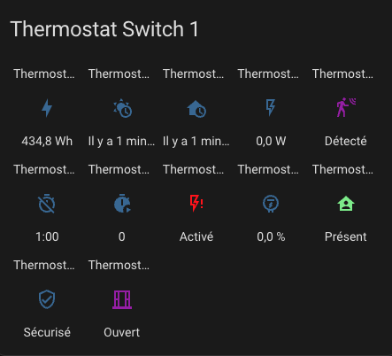
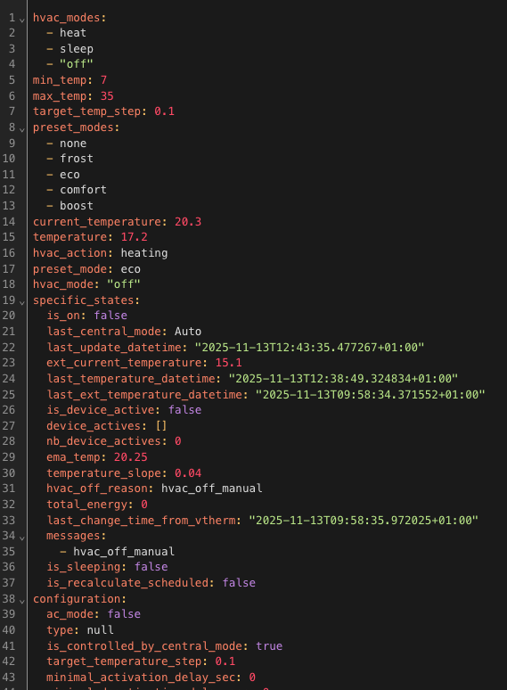

# Referenzdokumentation

- [Referenzdokumentation](#referenzdokumentation)
  - [Parameterübersicht](#parameterübersicht)
- [Expertenmodus-Konfiguration](#expertenmodus-konfiguration)
  - [Expertenmodus-Selbstregulierungsparameter](#expertenmodus-selbstregulierungsparameter)
  - [Außensensorprüfung im Sicherheitsmodus deaktivieren](#außensensorprüfung-im-sicherheitsmodus-deaktivieren)
  - [Maximale Heizleistungsgrenze](#maximale-heizleistungsgrenze)
  - [Parameter zur automatischen Detektion von Fensteröffnungen](#parameter-zur-automatischen-detektion-von-fensteröffnungen)
  - [Protokollspeicherung (Log Buffer)](#protokollspeicherung-log-buffer)
- [Sensoren](#sensoren)
- [Aktionen (Services)](#aktionen-services)
  - [Präsenz/Belegung erzwingen](#präsenzbelegung-erzwingen)
  - [Sicherheitseinstellungen ändern](#sicherheitseinstellungen-ändern)
  - [ByPass Fensterprüfung](#bypass-fensterprüfung)
  - [Sperr-/Entsperrdienste](#sperr-entsperrdienste)
  - [TPI-Einstellungen ändern](#tpi-einstellungen-ändern)
  - [Zeitgesteuertes Preset](#zeitgesteuertes-preset)
- [Ereignisse](#ereignisse)
- [Benutzerdefinierte Attribute](#benutzerdefinierte-attribute)
  - [Für ein _VTherm_](#für-ein-vtherm)
  - [Für die zentrale Konfiguration](#für-die-zentrale-konfiguration)
- [Statusmeldungen](#statusmeldungen)

## Parameterübersicht

| Parameter                                 | Bezeichnung                                                                       | "over switch" | "over climate"     | "over valve" | "configuration centrale" |
| ----------------------------------------- | --------------------------------------------------------------------------------- | ------------- | ------------------ | ------------ | ------------------------ |
| ``name``                                  | Name                                                                              | X             | X                  | X            | -                        |
| ``thermostat_type``                       | Thermostattyp                                                                     | X             | X                  | X            | -                        |
| ``temperature_sensor_entity_id``          | Temperatursensor Entity-ID                                                        | X             | X (Selbstregelung) | X            | -                        |
| ``external_temperature_sensor_entity_id`` | Außentemperatursensor Entity-ID                                                   | X             | X (Selbstregelung) | X            | X                        |
| ``cycle_min``                             | Zyklusdauer (Minuten)                                                             | X             | X                  | X            | -                        |
| ``temp_min``                              | Zulässige Mindesttemperatur                                                       | X             | X                  | X            | X                        |
| ``temp_max``                              | Zulässige Maximaltemperatur                                                       | X             | X                  | X            | X                        |
| ``device_power``                          | Leistung der Anlage                                                               | X             | X                  | X            | -                        |
| ``use_central_mode``                      | Berechtigung zur zentralen Steuerung                                              | X             | X                  | X            | -                        |
| ``use_window_feature``                    | Mit Öffnungserkennung                                                             | X             | X                  | X            | -                        |
| ``use_motion_feature``                    | Mit Bewegungserkennung                                                            | X             | X                  | X            | -                        |
| ``use_power_feature``                     | Mit Powermanagement                                                               | X             | X                  | X            | -                        |
| ``use_presence_feature``                  | Mit Anwesenheitserkennung                                                         | X             | X                  | X            | -                        |
| ``heater_entity1_id``                     | 1. Heizkörper                                                                     | X             | -                  | -            | -                        |
| ``heater_entity2_id``                     | 2. Heizkörper                                                                     | X             | -                  | -            | -                        |
| ``heater_entity3_id``                     | 3. Heizkörper                                                                     | X             | -                  | -            | -                        |
| ``heater_entity4_id``                     | 4. Heizkörper                                                                     | X             | -                  | -            | -                        |
| ``heater_keep_alive``                     | Aktualisierungsintervall des Schalters                                            | X             | -                  | -            | -                        |
| ``proportional_function``                 | Algorithmus                                                                       | X             | -                  | -            | -                        |
| ``climate_entity1_id``                    | 1. Zugeordnetes Thermostat                                                        | -             | X                  | -            | -                        |
| ``climate_entity2_id``                    | 2. Zugeordnetes Thermostat                                                        | -             | X                  | -            | -                        |
| ``climate_entity3_id``                    | 3. Zugeordnetes Thermostat                                                        | -             | X                  | -            | -                        |
| ``climate_entity4_id``                    | 4. Zugeordnetes Thermostat                                                        | -             | X                  | -            | -                        |
| ``valve_entity1_id``                      | 1. Zugeordnetes Ventil                                                            | -             | -                  | X            | -                        |
| ``valve_entity2_id``                      | 2. Zugeordnetes Ventil                                                            | -             | -                  | X            | -                        |
| ``valve_entity3_id``                      | 3. Zugeordnetes Ventil                                                            | -             | -                  | X            | -                        |
| ``valve_entity4_id``                      | 4. Zugeordnetes Ventil                                                            | -             | -                  | X            | -                        |
| ``ac_mode``                               | Nutzung der Klimaanlage (AC)?                                                     | X             | X                  | X            | -                        |
| ``tpi_coef_int``                          | Für das interne Temperaturdelta zu verwendender Faktor                            | X             | -                  | X            | X                        |
| ``tpi_coef_ext``                          | Für das externe Temperaturdelta zu verwendender Faktor                            | X             | -                  | X            | X                        |
| ``frost_temp``                            | Voreingestellte Temperatur Frostschutz                                            | X             | X                  | X            | X                        |
| ``window_sensor_entity_id``               | Öffnungssensor (Entität-ID)                                                       | X             | X                  | X            | -                        |
| ``window_delay``                          | Abschaltverzögerung (Sekunden)                                                    | X             | X                  | X            | X                        |
| ``window_auto_open_threshold``            | Obere Temperaturabfallschwelle für die automatische Erkennung ( °/min)            | X             | X                  | X            | X                        |
| ``window_auto_close_threshold``           | Untere Temperaturabfallschwelle für das Ende der automatischen Erkennung ( °/min) | X             | X                  | X            | X                        |
| ``window_auto_max_duration``              | Maximale Dauer einer automatischen Abschaltung ( Min.)                            | X             | X                  | X            | X                        |
| ``motion_sensor_entity_id``               | Bewegungsmelder Entity-ID                                                         | X             | X                  | X            | -                        |
| ``motion_delay``                          | Verzögerung vor Berücksichtigung der Bewegung (Sekunden)                          | X             | X                  | X            | -                        |
| ``motion_off_delay``                      | Verzögerung vor Berücksichtigung des Bewegungsendes (Sekunden)                    | X             | X                  | X            | X                        |
| ``motion_preset``                         | Voreinstellung bei Erkennung einer Bewegung                                       | X             | X                  | X            | X                        |
| ``no_motion_preset``                      | Voreinstellung, die verwendet werden soll, wenn keine Bewegung erkannt wird       | X             | X                  | X            | X                        |
| ``power_sensor_entity_id``                | Gesamtleistungssensor (Entity-ID)                                                 | X             | X                  | X            | X                        |
| ``max_power_sensor_entity_id``            | Leistungssensor Max (Entity-ID)                                                   | X             | X                  | X            | X                        |
| ``power_temp``                            | Temperatur bei Lastabwurf                                                         | X             | X                  | X            | X                        |
| ``presence_sensor_entity_id``             | Anwesenheitssensor Entity-ID (true, wenn jemand anwesend ist)                     | X             | X                  | X            | -                        |
| ``minimal_activation_delay``              | Mindestverzögerung bei der Aktivierung                                            | X             | -                  | -            | X                        |
| ``minimal_deactivation_delay``            | Mindestverzögerung bei der Deaktivierung                                          | X             | -                  | -            | X                        |
| ``safety_delay_min``                      | Maximale Zeitspanne zwischen zwei Temperaturmessungen                             | X             | -                  | X            | X                        |
| ``safety_min_on_percent``                 | Mindestprozentsatz der Leistung für den Übergang in den Sicherheitsmodus          | X             | -                  | X            | X                        |
| ``auto_regulation_mode``                  | Der Selbstregulierungsmodus                                                       | -             | X                  | -            | -                        |
| ``auto_regulation_dtemp``                 | Die Schwelle der Selbstregulierung                                                | -             | X                  | -            | -                        |
| ``auto_regulation_period_min``            | Die Mindestdauer der Selbstregulierung                                            | -             | X                  | -            | -                        |
| ``inverse_switch_command``                | Kehrt die Schalterfunktion um (bei Schaltern mit Pilotkabel)                      | X             | -                  | -            | -                        |
| ``auto_fan_mode``                         | Automatischer Lüftungsmodus                                                       | -             | X                  | -            | -                        |
| ``auto_regulation_use_device_temp``       | Verwendung der internen Temperatur des zu steuernden Geräts                       | -             | X                  | -            | -                        |
| ``use_central_boiler_feature``            | Hinzufügen der Steuerung eines Zentralheizungskessels                             | -             | -                  | -            | X                        |
| ``central_boiler_activation_service``     | Dienst zum Anschalten der Zentralheizung                                          | -             | -                  | -            | X                        |
| ``central_boiler_deactivation_service``   | Dienst zum Abschalten der Zentralheizung                                          | -             | -                  | -            | X                        |
| ``central_boiler_activation_delay_sec``   | Zpoždění aktivace (v sekundách)                                                   | -             | -                  | -            | X                        |
| ``used_by_controls_central_boiler``       | Zeigt an, ob VTherm den Zentralheizungskessel steuert                             | X             | X                  | X            | -                        |
| ``use_auto_start_stop_feature``           | Zeigt an, ob die automatische Start-/Stopp-Funktion aktiviert ist.                | -             | X                  | -            | -                        |
| ``auto_start_stop_level``                 | Die Erkennungsstufe der Start-Stopp-Automatik                                     | -             | X                  | -            | -                        |

# Expertenmodus-Konfiguration

Versatile Thermostat ermöglicht die Konfiguration erweiterter Parameter direkt in der `configuration.yaml`-Datei. Diese Parameter sind für fortgeschrittene Benutzer reserviert und ermöglichen eine präzise Kontrolle über das Thermostverhalten.

## Expertenmodus-Selbstregulierungsparameter

Wenn ein _VTherm_ vom Typ `over_climate` den **Expertenmodus** für die Selbstregulierung verwendet, können Sie die Regulierungsparameter direkt in Ihrer `configuration.yaml` deklarieren. Dies ermöglicht Ihnen, das Regulierungsverhalten präzise abzustimmen.

Um diese Funktion zu nutzen, fügen Sie die folgenden Zeilen in Ihre `configuration.yaml` ein:

```yaml
versatile_thermostat:
  auto_regulation_expert:
    kp: 0.6
    ki: 0.1
    k_ext: 0.0
    offset_max: 10
    accumulated_error_threshold: 80
    overheat_protection: true
```

Die Parameter sind wie folgt:

| Parameter                     | Beschreibung                                                                                                                            | Typ             | Beispiel |
| ----------------------------- | --------------------------------------------------------------------------------------------------------------------------------------- | --------------- | -------- |
| `kp`                          | Proportionalfaktor angewendet auf den rohen Temperaturfehler (Unterschied zwischen Solltemperatur und tatsächlicher Temperatur)         | Dezimalzahl     | 0.6      |
| `ki`                          | Integralfaktor angewendet auf die Akkumulation von Fehlern im Laufe der Zeit                                                            | Dezimalzahl     | 0.1      |
| `k_ext`                       | Faktor angewendet auf die Differenz zwischen Innentemperatur und Außentemperatur. Ermöglicht die Kompensation von externen Schwankungen | Dezimalzahl     | 0.0      |
| `offset_max`                  | Maximale Korrektur (Offset), die die Regelung auf den Sollwert anwenden kann                                                            | Dezimalzahl     | 10       |
| `accumulated_error_threshold` | Maximaler Schwellwert für die Fehlerakkumulation. Verhindert eine unendliche Fehlerakkumulation                                         | Dezimalzahl     | 80       |
| `overheat_protection`         | Aktiviert Überhitzungsschutz durch Begrenzung positiver Korrektionen (optional)                                                         | Boolescher Wert | true     |

>  _*Wichtiger Hinweis*_
>
> - Diese Parameter gelten für **alle _VTherms_ im Expertenmodus** auf dem System. Es ist nicht möglich, unterschiedliche Konfigurationen für verschiedene Thermostate zu haben.
> - **Home Assistant muss neu gestartet werden**, damit die Änderungen wirksam werden (oder Sie können die Versatile Thermostat-Integration über Entwicklertools neu laden).
> - Konsultieren Sie die [Selbstregulierungsdokumentation](self-regulation.md#selbstregulierung-im-expertenmodus) für Beispiele vordefinierter Konfigurationen.

## Außensensorprüfung im Sicherheitsmodus deaktivieren

Standardmäßig prüft der Sicherheitsmodus, dass der **Außentemperatursensor** regelmäßig Daten sendet. Wenn Ihr Außensensor jedoch nicht vorhanden oder nicht kritisch für Ihre Installation ist, können Sie diese Prüfung deaktivieren.

Fügen Sie dazu die folgenden Zeilen in Ihre `configuration.yaml` ein:

```yaml
versatile_thermostat:
  safety_mode:
    check_outdoor_sensor: false
```

| Parameter              | Beschreibung                                                                                                                  | Typ             | Standard |
| ---------------------- | ----------------------------------------------------------------------------------------------------------------------------- | --------------- | -------- |
| `check_outdoor_sensor` | Falls `true`, aktiviert das Fehlen von Außensensordaten den Sicherheitsmodus. Falls `false`, wird nur der Innensensor geprüft | Boolescher Wert | true     |

>  _*Wichtiger Hinweis*_
>
> - Diese Änderung gilt für **alle _VTherms_** auf dem System
> - Sie betrifft die Erkennung für alle Thermostate gleichzeitig
> - **Home Assistant muss neu gestartet werden**, damit die Änderungen wirksam werden

## Maximale Heizleistungsgrenze

Mit dem Parameter `max_on_percent` können Sie die maximale Heizleistung für Ihre gesamte Installation global begrenzen. Dies kann nützlich sein, um elektrische Einschränkungen zu beachten oder die Systemlast zu regulieren.

Um diese Grenze zu konfigurieren, fügen Sie die folgende Zeile in Ihre `configuration.yaml` ein:

```yaml
versatile_thermostat:
  max_on_percent: 0.9
```

| Parameter        | Beschreibung                                                                                | Typ         | Bereich     | Standard |
| ---------------- | ------------------------------------------------------------------------------------------- | ----------- | ----------- | -------- |
| `max_on_percent` | Maximaler Prozentsatz der zulässigen Heizleistung. `1.0` = 100% Leistung, `0.9` = 90%, etc. | Dezimalzahl | 0.0 bis 1.0 | 1.0      |

**Verwendungsbeispiele**:
- `0.8`: begrenzt die Heizung auf 80% der Kapazität
- `0.5`: begrenzt auf 50% (nützlich bei Stromüberlas)
- `1.0`: keine Begrenzung (Standard)

>  _*Wichtiger Hinweis*_
>
> - Diese Begrenzung gilt für **alle _VTherms_** auf dem System
> - Sie wird sofort ohne Neustart angewendet
> - Sie beeinflusst die maximale in jedem Zyklus berechnete Leistung

## Parameter zur automatischen Detektion von Fensteröffnungen

Bei Verwendung der automatischen Fensteröffnungserkennung (basierend auf Temperaturabfall) können Sie die Parameter der Temperaturglättung optimieren, um die Erkennung zu verbessern.

Um diese Parameter zu konfigurieren, fügen Sie die folgenden Zeilen in Ihre `configuration.yaml` ein:

```yaml
versatile_thermostat:
  short_ema_params:
    max_alpha: 0.5
    halflife_sec: 300
    precision: 2
```

| Parameter      | Beschreibung                                                                                                                                | Typ         | Bereich     | Standard |
| -------------- | ------------------------------------------------------------------------------------------------------------------------------------------- | ----------- | ----------- | -------- |
| `max_alpha`    | Maximaler Glättungsfaktor (Alpha) für den exponentiellen Durchschnitt. Steuert die Empfindlichkeit gegenüber schnellen Temperaturänderungen | Dezimalzahl | 0.0 bis 1.0 | 0.5      |
| `halflife_sec` | Halbwertsdauer in Sekunden für die Berechnung des gleitenden Durchschnitts. Bestimmt, wie schnell alte Werte an Gewicht verlieren           | Ganze Zahl  | > 0         | 300      |
| `precision`    | Anzahl der Dezimalstellen in der Berechnung des gleitenden Durchschnitts                                                                    | Ganze Zahl  | > 0         | 2        |

**Parameterbedeutungen**:
- **`max_alpha`**: Ein höherer Wert macht die Erkennung reaktiver auf plötzliche Änderungen (schnellere Erkennung, aber empfindlicher für Fehlalarme)
- **`halflife_sec`**: Eine kürzere Dauer lässt den Algorithmus alte Werte schneller vergessen (schnellere Erkennung)
- **`precision`**: Steuert die Berechnungsrundung (seltenes Anpassungsbedarf)

>  _*Diese Parameter sind empfindlich*_
>
> - Diese Parameter beeinflussen die automatische Fensteröffnungserkennung
> - Sie gelten für **alle _VTherms_** auf dem System
> - Passen Sie sie nur an, wenn Sie Erkennungsprobleme haben (Fehlalarme oder Nicht-Erkennung)
> - Konsultieren Sie den [Abschnitt Fehlerbehebung](troubleshooting.md#einstellen-der-parameter-für-die-fensteröffnungserkennung-im-automodus) für weitere Details

## Protokollspeicherung (Log Buffer)

Versatile Thermostat verwaltet interne Protokolle zur Fehlerbehebung. Sie können die Beibehaltungsdauer dieser Protokolle konfigurieren.

Um diese Dauer zu konfigurieren, fügen Sie die folgende Zeile in Ihre `configuration.yaml` ein:

```yaml
versatile_thermostat:
  log_buffer_max_age_hours: 24
```

| Parameter                  | Beschreibung                                                                                  | Typ        | Bereich | Standard |
| -------------------------- | --------------------------------------------------------------------------------------------- | ---------- | ------- | -------- |
| `log_buffer_max_age_hours` | Maximale Protokollspeicherungsdauer in Stunden. Ältere Protokolle werden automatisch gelöscht | Ganze Zahl | > 0     | 24       |

**Verwendungsbeispiele**:
- `12`: behält Protokolle der letzten 12 Stunden bei
- `24`: behält Protokolle für 24 Stunden (1 Tag)
- `72`: behält Protokolle für 72 Stunden (3 Tage) für erweiterte Fehlerbehebung

>  _*Speicherverwaltung*_
>
> - Eine längere Dauer verbraucht mehr Speicher
> - Diese Konfiguration betrifft **alle _VTherms_** auf dem System
> - Protokolle sind nützlich zur Fehlerbehebung über den Endpunkt zum Herunterladen von Protokollen

# Sensoren

Mit dem Thermostat sind Sensoren verfügbar, die die Anzeige von Warnmeldungen und des internen Status des Thermostats ermöglichen. Sie sind in den Entitäten des mit dem Thermostat verbundenen Geräts verfügbar:


In der Reihenfolge sind dies:
1. die Hauptsteuerungs-Entity des Thermostats,
2. die Entity, die die Auto-Start/Stopp-Funktion aktiviert,
3. die Entity, mit der _VTherm_ angewiesen werden kann, den Veränderungen des zugeordneten Geräts zu folgen,
4. die vom Thermostat verbrauchte Energie (Wert, der ständig erhöht wird),
5. Zeitpunkt des Empfangs der letzten Außentemperatur,
6. Zeitpunkt des Empfangs der letzten Innentemperatur,
7. die durchschnittliche Leistung des Geräts während des Zyklus (nur für TPI),
8. die Zeit, die im ausgeschalteten Zustand im Zyklus verbracht wurde (nur TPI),
9. die Zeit, die im eingeschalteten Zustand im Zyklus verbracht wurde (nur TPI),
10. der Lastabwurf,
11. die Prozentuale Leistung im Zyklus (nur TPI)
12. der Anwesenheitsstatus (wenn die Anwesenheitsverwaltung konfiguriert ist),
13. der Sicherheitsstatus,
14. der Fensteröffnungsstatus (wenn die Öffnungsverwaltung konfiguriert ist),
15. der Bewegungsstatus (wenn die Bewegungsverwaltung konfiguriert ist),
16. der Öffnungsprozentsatz des Ventils (für den Typ `over_valve`).

Die Verfügbarkeit dieser Entities hängt davon ab, ob die zugehörige Funktion vorhanden ist.

Um die Sensoren einzufärben, füge diese Zeilen hinzu und passe sie bei Bedarf in der configuration.yaml an:

```yaml
frontend:
  themes:
    versatile_thermostat_theme:
      state-binary_sensor-safety-on-color: "#FF0B0B"
      state-binary_sensor-power-on-color: "#FF0B0B"
      state-binary_sensor-window-on-color: "rgb(156, 39, 176)"
      state-binary_sensor-motion-on-color: "rgb(156, 39, 176)"
      state-binary_sensor-presence-on-color: "lightgreen"
      state-binary_sensor-running-on-color: "orange"
```

und wählen Sie das Thema ```versatile_thermostat_theme``` in den Einstellungen des Panels aus. Das Ergebnis sieht in etwa so aus:



# Aktionen (Services)

Diese benutzerdefinierte Implementierung bietet spezifische Aktionen (z. B. Dienste/Services), um die Integration mit anderen Home Assistant-Komponenten zu erleichtern.

## Präsenz/Belegung erzwingen
Dieser Service ermöglicht es Ihnen, den Anwesenheitsstatus unabhängig vom Anwesenheitssensor zu erzwingen. Dies kann nützlich sein, wenn Sie die Anwesenheit über einen Service und nicht über einen Sensor verwalten möchten. Sie können beispielsweise Ihren Wecker verwenden, um die Abwesenheit zu erzwingen, wenn er eingeschaltet ist.

Der Code zum Aufrufen dieses Service lautet wie folgt:

```yaml
service : versatile_thermostat.set_presence
data:
    preset : "off"
target:
    entity_id : climate.my_thermostat
```

## Sicherheitseinstellungen ändern
Mit diesem Service können die hier beschriebenen Sicherheitseinstellungen dynamisch geändert werden [Erweiterte Konfiguration](#erweiterte-konfiguration).
Befindet sich der Thermostat im Modus ``security``, werden die neuen Einstellungen sofort übernommen.

Um die Sicherheitseinstellungen zu ändern, verwenden Sie den folgenden Code:
```yaml
service : versatile_thermostat.set_safety
data:
    min_on_percent: "0.5"
    default_on_percent: "0.1"
    delay_min: 60
target:
    entity_id : climate.my_thermostat
```

## ByPass Fensterprüfung
Mit diesem Service kann eine Umgehung der Fensterüberprüfung aktiviert oder deaktiviert werden.
Es ermöglicht die Fortsetzung der Heizung, auch wenn das Fenster als geöffnet erkannt wird.
Auf ``true`` gesetzt, haben Statusänderungen des Fensters keine Auswirkungen mehr auf den Thermostat. Auf ``false`` gesetzt, wird der Thermostat deaktiviert, wenn das Fenster noch geöffnet ist.

Um die Bypass-Einstellung zu ändern, verwenden Sie den folgenden Code:
```yaml
service : versatile_thermostat.set_window_bypass
data:
    window_bypass: true
target:
    entity_id : climate.my_thermostat
```

## Sperr-/Entsperrdienste

Mit diesen Diensten kann ein Thermostat gesperrt werden, um Änderungen an seiner Konfiguration zu verhindern, oder entsperrt werden, um die zulässigen Änderungen wiederherzustellen:

- `versatile_thermostat.lock` - Sperrt einen Thermostat, um Änderungen an der Konfiguration zu verhindern.
- `versatile_thermostat.unlock` - Entsperrt einen Thermostat, um Konfigurationsänderungen wieder zuzulassen.

## TPI-Einstellungen ändern
Alle konfigurierbaren TPI-Parameter [hier](images/config_tpi.png) können über einen Dienst geändert werden. Diese Änderungen sind dauerhaft und bleiben auch nach einem Neustart erhalten. Sie werden sofort angewendet und der Thermostat wird sofort aktualisiert, wenn die Parameter geändert werden.

Jeder Parameter ist optional. Wenn er nicht angegeben wird, bleibt sein aktueller Wert erhalten.

Um die TPI-Einstellungen zu ändern, verwenden Sie den folgenden Code:
```yaml
action: versatile_thermostat.set_tpi_parameters
data:
  tpi_coef_int: 0.5
  tpi_coef_ext: 0.01
  minimal_activation_delay: 10
  minimal_deactivation_delay: 10
  tpi_threshold_low: -2
  tpi_threshold_high: 5
target:
  entity_id: climate.sonoff_trvzb
```

## Zeitgesteuertes Preset
Mit diesen Diensten können Sie ein Preset auf einem Thermostat vorübergehend für eine bestimmte Dauer erzwingen. Siehe [Zeitgesteuertes Preset](feature-timed-preset.md) für Details.

Um ein zeitgesteuertes Preset zu aktivieren:
```yaml
service: versatile_thermostat.set_timed_preset
data:
  preset: "boost"
  duration_minutes: 30
target:
  entity_id: climate.mein_thermostat
```

Um ein zeitgesteuertes Preset vor Ablauf abzubrechen:
```yaml
service: versatile_thermostat.cancel_timed_preset
target:
  entity_id: climate.mein_thermostat
```

# Ereignisse
Wichtige Ereignisse des Thermostats werden über den Nachrichtenbus gemeldet.
Es werden folgende Ereignisse gemeldet:

- ``versatile_thermostat_safety_event``: Ein Thermostat wechselt in den voreingestellten Modus ``security`` oder verlässt diesen.
- ``versatile_thermostat_power_event``: Ein Thermostat erreicht oder unterschreitet den  ``power``-Sollwert
- ``versatile_thermostat_temperature_event``: Eine oder beide Temperaturmessungen eines Thermostats wurden seit mehr als ``safety_delay_min`` Minuten nicht aktualisiert.
- ``versatile_thermostat_hvac_mode_event``: Der Thermostat ist ein- oder ausgeschaltet. Dieses Ereignis wird auch beim Start des Thermostats übertragen.
- ``versatile_thermostat_preset_event``: Eine neue Voreinstellung wird am Thermostat ausgewählt. Dieses Ereignis wird auch beim Start des Thermostats übertragen.
- ``versatile_thermostat_central_boiler_event``: Ein Ereignis, das eine Änderung des Heizkesselzustands anzeigt.
- ``versatile_thermostat_auto_start_stop_event``: Ein Ereignis, das einen Stopp oder einen Neustart durch die Auto-Start/Stopp-Funktion anzeigt
- ``versatile_thermostat_timed_preset_event``: Ein Ereignis, das die Aktivierung oder Deaktivierung eines zeitgesteuerten Presets anzeigt

Wenn Sie bis hierher mitgekommen sind, wissen Sie, dass beim Umschalten eines Thermostats in den Sicherheitsmodus drei Ereignisse ausgelöst werden:
1. ``versatile_thermostat_temperature_event`` um anzuzeigen, dass ein Thermometer nicht mehr reagiert,
2. ``versatile_thermostat_preset_event`` um den Übergang zur Voreinstellung ```security``` anzuzeigen,
3. ``versatile_thermostat_hvac_mode_event`` um das mögliche Ausfallen des Thermostats anzuzeigen.

Jedes Ereignis enthält die Schlüsselwerte des Ereignisses (Temperaturen, aktuelle Voreinstellung, aktuelle Leistung usw.) sowie die Zustände des Thermostats.

Diese Ereignisse kann man ganz einfach in einer Automatisierung erfassen, um beispielsweise die Benutzer zu benachrichtigen.

# Benutzerdefinierte Attribute

Um den Algorithmus anzupassen, gibt es über spezielle Attribute Zugriff auf den gesamten vom Thermostat erfassten und berechneten Kontext. Man kann diese Attribute in der HA-Benutzeroberfläche "Entwicklungstools/Status" einsehen (und verwenden). Gib den Namen des Thermostat ein und es erscheint etwa Folgendes:



## Für ein _VTherm_
Die benutzerdefinierten Attribute sind folgende:

| Attribut                                        | Bedeutung                                                                                                                                                                                                                         |
| ----------------------------------------------- | --------------------------------------------------------------------------------------------------------------------------------------------------------------------------------------------------------------------------------- |
| ``hvac_modes``                                  | Liste der vom Thermostat unterstützten Modi                                                                                                                                                                                       |
| ``temp_min``                                    | Die Mindesttemperatur                                                                                                                                                                                                             |
| ``temp_max``                                    | Die Höchsttemperatur                                                                                                                                                                                                              |
| ``target_temp_step``.                           | Der Schritt zur Zieltemperatur                                                                                                                                                                                                    |
| ``preset_modes``                                | Die sichtbaren Voreinstellungen für diesen Thermostat. Die versteckten Voreinstellungen werden hier nicht angezeigt                                                                                                               |
| ``current_temperature``                         | Die vom Sensor gemessene aktuelle Temperatur                                                                                                                                                                                      |
| ``temperature``                                 | Die Zieltemperatur                                                                                                                                                                                                                |
| ``hvac_action``                                 | Die vom Heizgerät gerade ausgeführte Aktion. Kann Leerlauf oder Heizen sein                                                                                                                                                       |
| ``preset_mode``                                 | Die aktuell ausgewählte Voreinstellung. Kann einer der 'preset_modes' oder eine versteckte Voreinstellung wie zB. `power` sein                                                                                                    |
| ``hvac_mode``                                   | Der aktuell ausgewählte Modus. Mögliche Optionen: Heizen, Kühlen, Nur-Lüfter, Aus                                                                                                                                                 |
| ``friendly_name``                               | Der Name des Thermostats                                                                                                                                                                                                          |
| ``supported_features``                          | Eine Kombination aller von diesem Thermostat unterstützten Funktionen. Weitere Informationen befinden sich in der offiziellen Dokumentation zur Klimaintegration.                                                                 |
| ``is_presence_configured``                      | Zeigt an, ob die Anwesenheitserkennung konfiguriert ist                                                                                                                                                                           |
| ``is_power_configured``                         | Zeigt an, ob die Lastabwurf-Funktion konfiguriert ist                                                                                                                                                                             |
| ``is_motion_configured``                        | Zeigt an, ob die Bewegungserkennungsfunktion konfiguriert ist                                                                                                                                                                     |
| ``is_window_configured``                        | Zeigt an, ob die Funktion zur Fensteröffnungserkennung mittels Sensor konfiguriert ist                                                                                                                                            |
| ``is_window_auto_configured``                   | Zeigt an, ob die Funktion zur Fensteröffnungserkennung anhand des Temperaturabfalls konfiguriert ist                                                                                                                              |
| ``is_safety_configured``                        | Zeigt an, ob die Funktion zur Ausfallerkennung des Temperatursensors konfiguriert ist                                                                                                                                             |
| ``is_auto_start_stop_configured``               | Zeigt an, ob die Auto-Start-/Stopp-Funktion konfiguriert ist (nur `over_climate`)                                                                                                                                                 |
| ``is_over_switch``                              | Zeigt an, ob es sich bei dem VTherm um den Typ `over_switch` handelt                                                                                                                                                              |
| ``is_over_valve``                               | Zeigt an, ob es sich bei dem VTherm um den Typ `over_valve` handelt                                                                                                                                                               |
| ``is_over_climate``                             | Zeigt an, ob es sich bei VTherm um den Typ `over_climate` handelt                                                                                                                                                                 |
| ``is_over_climate_valve``                       | Zeigt an, ob es sich bei dem VTherm um den Typ `over_climate_valve` handelt (`over_climate` mit direkter Ventilsteuerung)                                                                                                         |
| **ABSCHNITT `specific_states`**                 | ------                                                                                                                                                                                                                            |
| ``is_on``                                       | true, wenn VTherm eingeschaltet ist (`hvac_mode` ungleich "Off")                                                                                                                                                                  |
| ``last_central_mode``                           | TDer zuletzt verwendete zentrale Betriebsmodus (None, wenn VTherm nicht zentral gesteuert wird)                                                                                                                                   |
| ``last_update_datetime``                        | Datum und Uhrzeit dieses Zustands im ISO-8866-Format                                                                                                                                                                              |
| ``ext_current_temperature``                     | Die aktuelle Außentemperatur                                                                                                                                                                                                      |
| ``last_temperature_datetime``                   | Datum und Uhrzeit im ISO 8866-Format des letzten Empfangs der Raumtemperatur                                                                                                                                                      |
| ``last_ext_temperature_datetime``               | Datum und Uhrzeit im ISO 8866-Format des letzten Empfangs der Außentemperatur                                                                                                                                                     |
| ``should_device_be_active``                     | true, wenn der Bezugswert aktiv ist                                                                                                                                                                                               |
| ``device_actives``                              | Die Liste der zugeordneten Geräte, die derzeit als aktiv angezeigt werden                                                                                                                                                         |
| ``nb_device_actives``                           | Die Anzahl der zugeordneten Geräte, die derzeit als aktiv gelten                                                                                                                                                                  |
| ``ema_temp``                                    | Die aktuelle Durchschnittstemperatur. Berechnet als exponentieller gleitender Durchschnitt der vorherigen Werte. Wird zur Berechnung von `temperature_slope` verwendet.                                                           |
| ``temperature_slope``                           | Die aktuelle Temperatursteigung in °/Stunde                                                                                                                                                                                       |
| ``hvac_off_reason``                             | Gibt den Grund für die Abschaltung von VTherm (hvac_off) an. Mögliche Werte sind "Fenster", "Automatischer Start/Stopp" oder "Manuell".                                                                                           |
| ``hvac_mode_reason``                            | Gibt den Grund für den aktuellen VTherm-Modus (hvac_mode) an. Mögliche Werte sind "Fenster", "Automatischer Start/Stopp" (je nach Stopp-Modus: off, fan-only oder dry), "Zentralmodus", "Sicherheit", "Manuell" oder "Ruhemodus". |
| ``total_energy``                                | Eine Schätzung des Gesamtenergieverbrauchs dieses VTherm                                                                                                                                                                          |
| ``last_change_time_from_vtherm``                | Datum und Uhrzeit der letzten von VTherm vorgenommenen Änderung                                                                                                                                                                   |
| ``messages``                                    | Eine Liste von Meldungen, die die Berechnung des aktuellen Zustands erläutern. Siehe [Zustandsmeldungen](#zustandsmeldungen)                                                                                                      |
| ``is_sleeping``                                 | Zeigt an, dass sich der VTherm im Ruhemodus befindet (gilt für VTherm vom Typ `over_climate` mit direkter Ventilsteuerung)                                                                                                        |
| ``is_recalculate_scheduled``                    | Zeigt an, dass die Neuberechnung des zugeordneten Zustands mittels Zeitfilterung verzögert wurde, um die Interaktionsanzahl mit den gesteuerten Geräten zu begrenzen                                                              |
| **ABSCHNITT `configuration`**                   | ------                                                                                                                                                                                                                            |
| ``ac_mode``                                     | true, wenn das Gerät neben dem Heizbetrieb auch den Kühlbetrieb unterstützt                                                                                                                                                       |
| ``type``                                        | Der VTherm-Typ (`over_switch`, `over_valve`, `over_climate`, `over_climate_valve`)                                                                                                                                                |
| ``is_controlled_by_central_mode``               | true, wenn der VTherm zentral gesteuert werden kann                                                                                                                                                                               |
| ``target_temperature_step``                     | Der Zieltemperaturschritt (entspricht `target_temp_step`)                                                                                                                                                                         |
| ``minimal_activation_delay_sec``                | Die minimale Aktivierungsverzögerung in Sekunden (gilt nur für TPI)                                                                                                                                                               |
| ``minimal_deactivation_delay_sec``              | Die minimale Deaktivierungsverzögerung in Sekunden (gilt nur für TPI)                                                                                                                                                             |
| ``timezone``                                    | Die für Datums- und Zeitangaben verwendete Zeitzone                                                                                                                                                                               |
| ``temperature_unit``                            | Die verwendete Temperatureinheit                                                                                                                                                                                                  |
| ``is_used_by_central_boiler``                   | Gibt an, ob der VTherm den zentralen Heizkessel steuern kann                                                                                                                                                                      |
| ``max_on_percent``                              | Der maximale Leistungswert in Prozent (gilt nur für TPI)                                                                                                                                                                          |
| ``have_valve_regulation``                       | Gibt an, ob der VTherm die Regelung über eine direkte Ventilsteuerung nutzt (`over_climate` mit Ventilsteuerung)                                                                                                                  |
| ``cycle_min``                                   | Die Zyklusdauer in Minuten                                                                                                                                                                                                        |
| **ABSCHNITT `preset_temperatures`**             | ------                                                                                                                                                                                                                            |
| ``[eco/confort/boost]_temp``                    | Die für die Voreinstellung xxx konfigurierte Temperatur                                                                                                                                                                           |
| ``[eco/confort/boost]_away_temp``               | Die für die Voreinstellung xxx konfigurierte Temperatur, wenn die Anwesenheit deaktiviert ist oder not_home                                                                                                                       |
| **ABSCHNITT `current_state`**                   | ------                                                                                                                                                                                                                            |
| ``hvac_mode``                                   | Der berechnete Strommodus                                                                                                                                                                                                         |
| ``target_temperature``                          | Die berechnete aktuelle Temperatur                                                                                                                                                                                                |
| ``preset``                                      | Die berechnete Stromvoreinstellung                                                                                                                                                                                                |
| **ABSCHNITT `requested_state`**                 | ------                                                                                                                                                                                                                            |
| ``hvac_mode``                                   | Der vom Benutzer angeforderte Modus                                                                                                                                                                                               |
| ``target_temperature``                          | Die vom Benutzer gewünschte Temperatur                                                                                                                                                                                            |
| ``preset``                                      | Die vom Benutzer angeforderte Voreinstellung                                                                                                                                                                                      |
| **ABSCHNITT `presence_manager`**                | ------ nur wenn `is_presence_configured` den Wert `true` hat                                                                                                                                                                      |
| ``presence_sensor_entity_id``                   | Die für die Anwesenheitserkennung verwendete Entität                                                                                                                                                                              |
| ``presence_state``                              | `on`, wenn eine Anwesenheit festgestellt wird. `off`, wenn keine Anwesenheit festgestellt wird                                                                                                                                    |
| **ABSCHNITT `motion_manager`**                  | ------ nur wenn `is_motion_configured` den Wert `true` hat                                                                                                                                                                        |
| ``motion_sensor_entity_id``                     | Die zur Bewegungserkennung verwendete Entität                                                                                                                                                                                     |
| ``motion_state``                                | `on`, wenn eine Bewegung erkannt wird. `off`, wenn keine Bewegung erkannt wird                                                                                                                                                    |
| ``motion_delay_sec``                            | Die Verzögerung in Sekunden bei der Bewegungserkennung, wenn der Sensor von `aus` auf `ein` umschaltet                                                                                                                            |
| ``motion_off_delay_sec``                        | Die Verzögerung in Sekunden bei fehlender Bewegungserkennung, wenn der Sensor von `ein` auf `aus` wechselt                                                                                                                        |
| ``motion_preset``                               | Die zu verwendende Voreinstellung, wenn eine Bewegung erkannt wird                                                                                                                                                                |
| ``no_motion_preset``                            | Die zu verwendende Voreinstellung, wenn keine Bewegung erkannt wird                                                                                                                                                               |
| **ABSCHNITT `power_manager`**                   | ------ nur wenn `is_power_configured` den Wert `true` hat                                                                                                                                                                         |
| ``power_sensor_entity_id``                      | Die Entity, die die Daten zum Stromverbrauch des Haushalts bereitstellt                                                                                                                                                           |
| ``max_power_sensor_entity_id``                  | Die Entity, die vor dem Abschalten die maximal zulässige Leistung liefert                                                                                                                                                         |
| ``overpowering_state``                          | `on`, wenn eine Überlast erkannt wird. Andernfalls `off`.                                                                                                                                                                         |
| ``device_power``                                | Die Leistungsaufnahme des zugeordneten Geräts im aktiven Zustand                                                                                                                                                                  |
| ``power_temp``                                  | Die Temperatur, die bei Aktivierung des Lastabwurf verwendet werden soll                                                                                                                                                          |
| ``current_power``                               | Der aktuelle Stromverbrauch im Haushalt, wie er vom Sensor `power_sensor_entity_id` gemeldet wird                                                                                                                                 |
| ``current_max_power``                           | Die vom Sensor `max_power_sensor_entity_id` gemeldete maximal zulässige Leistung                                                                                                                                                  |
| ``mean_cycle_power``                            | Eine Schätzung der durchschnittlichen Leistungsaufnahme der Anlage über einen Zyklus hinweg                                                                                                                                       |
| **ABSCHNITT `window_manager`**                  | ------ nur wenn `is_window_configured` oder `is_window_auto_configured` den Wert `true` hat                                                                                                                                       |
| ``window_state``                                | `on`, wenn die Fensteröffnungserkennung per Sensor aktiv ist. Andernfalls `off`.                                                                                                                                                  |
| ``window_auto_state``                           | `on`, wenn die Erkennung geöffneter Fenster durch den automatischen Erkennungsalgorithmus aktiv ist. Andernfalls `off`.                                                                                                           |
| ``window_action``                               | Die Aktion, die ausgeführt wird, wenn die Erkennung eines offenen Fensters aktiv ist. Mögliche Werte sind `window_frost_temp`, `window_eco_temp`, `window_turn_off`, `window_fan_only`.                                           |
| ``is_window_bypass``                            | `true`, wenn die Umgehung der Fenstererkennung aktiviert ist                                                                                                                                                                      |
| ``window_sensor_entity_id``                     | Der Sensor zur Erkennung geöffneter Fenster (sofern `is_window_configured`)                                                                                                                                                       |
| ``window_delay_sec``                            | Die Verzögerung bis zur Erkennung, wenn sich der Sensorstatus von `off` auf `on` ändert                                                                                                                                           |
| ``window_off_delay_sec``                        | Die Verzögerung vor der Erkennung endet, wenn sich der Sensorstatus von `on` auf `off` ändert.                                                                                                                                    |
| ``window_auto_open_threshold``                  | Der Schwellenwert für die automatische Erkennung in °/Stunde                                                                                                                                                                      |
| ``window_auto_close_threshold``                 | Der Schwellenwert für das Ende der Erkennung in °/Stunde                                                                                                                                                                          |
| ``window_auto_max_duration``                    | Die maximale Dauer der automatischen Erkennung in Minuten                                                                                                                                                                         |
| **ABSCHNITT `safety_manager`**                  | ------                                                                                                                                                                                                                            |
| ``safety_state``                                | Der Sicherheitsstatus. `on` oder `off`                                                                                                                                                                                            |
| ``safety_delay_min``                            | Die Verzögerung bis zur Aktivierung des Sicherheitsmodus, wenn einer der beiden Temperatursensoren keine Messwerte mehr übermittelt                                                                                               |
| ``safety_min_on_percent``                       | Heizungsanteil, unterhalb dessen der Thermostat nicht in den Sicherheitsmodus wechselt (nur für TPI)                                                                                                                              |
| ``safety_default_on_percent``                   | Heizleistung in Prozent, die verwendet wird, wenn sich der Thermostat im Sicherheitsmodus befindet (nur für TPI)                                                                                                                  |
| **ABSCHNITT `auto_start_stop_manager`**         | ------ nur wenn `is_auto_start_stop_configured`                                                                                                                                                                                   |
| ``is_auto_stop_detected``                       | `true`, wenn der automatische Stopp ausgelöst wird                                                                                                                                                                                |
| ``auto_start_stop_enable``                      | `true`, wenn die Funktion zum automatischen Starten/Stoppen autorisiert ist                                                                                                                                                       |
| ``auto_start_stop_level``                       | Die Stufe für Auot-Start/Stopp. Mögliche Werte sind `auto_start_stop_none`, `auto_start_stop_very_slow`, `auto_start_stop_slow`, `auto_start_stop_medium`, `auto_start_stop_fast`                                                 |
| ``auto_start_stop_dtmin``                       | Der Parameter `dt` in Minuten für den Algorithmus zum automatischen Starten/Stoppen                                                                                                                                               |
| ``auto_start_stop_accumulated_error``           | Der Wert `accumulated_error` des Auto-Start/Stopp-Algorithmus                                                                                                                                                                     |
| ``auto_start_stop_accumulated_error_threshold`` | Der Schwellwert `accumulated_error` des Auto-Start/Stopp-Algorithmus                                                                                                                                                              |
| ``auto_start_stop_last_switch_date``            | Datum und Uhrzeit der letzten Umschaltung durch den Auto-Start/Stopp-Algorithmus                                                                                                                                                  |
| ``auto_start_stop_stop_mode``                   | Der bei einem automatischen Stopp angewendete Modus. Mögliche Werte sind `off`, `fan_only` oder `dry`                                                                                                                             |
| **ABSCHNITT `timed_preset_manager`**            | ------                                                                                                                                                                                                                            |
| ``timed_preset_active``                         | `true`, wenn eine zeitgesteuerte Voreinstellung aktiv ist                                                                                                                                                                         |
| ``timed_preset_preset``                         | Der Name der aktiven zeitgesteuerten Voreinstellung (oder `null`, falls keine vorhanden ist)                                                                                                                                      |
| ``timed_preset_end_time``                       | Das Enddatum/-zeitpunkt der zeitgesteuerten Voreinstellung                                                                                                                                                                        |
| ``remaining_time_min``                          | Die verbleibende Zeit in Minuten bis zum Ablauf der voreingestellten Zeit (integer)                                                                                                                                               |
| **ABSCHNITT `vtherm_over_switch`**              | ------ nur mit  `is_over_switch`                                                                                                                                                                                                  |
| ``is_inversed``                                 | `true`, wenn der Befehl invertiert ist (Pilotleitung mit Diode)                                                                                                                                                                   |
| ``keep_alive_sec``                              | Die Keep-Alive-Verzögerung oder 0, falls nicht konfiguriert                                                                                                                                                                       |
| ``underlying_entities``                         | Die Liste zu steuernder Entities der zugeordneten Geräte                                                                                                                                                                          |
| ``on_percent``                                  | Der vom TPI-Algorithmus berechnete "On"-Prozentsatz                                                                                                                                                                               |
| ``on_time_sec``                                 | Die Einschaltdauer in Sekunden muss ```on_percent * cycle_min``` betragen.                                                                                                                                                        |
| ``off_time_sec``                                | Die Ausschaltdauer in Sekunden muss ```(1 - on_percent) * cycle_min``` betragen.                                                                                                                                                  |
| ``function``                                    | Der für die Zyklusberechnung verwendete Algorithmus                                                                                                                                                                               |
| ``tpi_coef_int``                                | Der „coef_int“ des TPI-Algorithmus                                                                                                                                                                                                |
| ``tpi_coef_ext``                                | Der ``coef_ext`` des TPI-Algorithmus                                                                                                                                                                                              |
| ``calculated_on_percent``                       | Der vom TPI-Algorithmus berechnete Rohwert „on_percent“                                                                                                                                                                           |
| ``vswitch_on_commands``                         | Die Liste der benutzerdefinierten Befehle zum Aktivieren der Zugeordneten                                                                                                                                                         |
| ``vswitch_off_commands``                        | Die Liste der benutzerdefinierten Befehle zum Deaktivieren der Zugeordneten                                                                                                                                                       |
| **ABSCHNITT `vtherm_over_climate`**             | ------ nur mit `is_over_climate` oder `is_over_climate_valve`                                                                                                                                                                     |
| ``start_hvac_action_date``                      | Datum und Uhrzeit der letzten Einschaltung (`hvac_action`)                                                                                                                                                                        |
| ``underlying_entities``                         | Die Liste zu steuernder Entities der zugeordneten Geräte                                                                                                                                                                          |
| ``is_regulated``                                | `true`, wenn die Selbstregulierung konfiguriert ist                                                                                                                                                                               |
| ``auto_fan_mode``                               | Der Auto-Lüfter-Modus. Kann `auto_fan_none`, `auto_fan_low`, `auto_fan_medium`, `auto_fan_high`, `auto_fan_turbo` sein.                                                                                                           |
| ``current_auto_fan_mode``                       | Der aktuelle Auto-Lüfter-Modus. Kann `auto_fan_none`, `auto_fan_low`, `auto_fan_medium`, `auto_fan_high`, `auto_fan_turbo` sein.                                                                                                  |
| ``auto_activated_fan_mode``                     | Der aktivierte Auto-Lüfter-Modus Kann `auto_fan_none`, `auto_fan_low`, `auto_fan_medium`, `auto_fan_high`, `auto_fan_turbo` sein.                                                                                                 |
| ``auto_deactivated_fan_mode``                   | Der deaktivierte Auto-Lüfter-Modus. Kann `auto_fan_none`, `auto_fan_low`, `auto_fan_medium`, `auto_fan_high`, `auto_fan_turbo` sein.                                                                                              |
| ``follow_underlying_temp_change``               | `true`, wenn VTherm Änderungen berücksichtigen soll, die direkt am zugeordneten Gerät vorgenommen werden.                                                                                                                         |
| ``auto_regulation_use_device_temp``             | `true`, wenn VTherm die zugeordnete Temperatur verwenden soll (sollte normalerweise nicht verwendet werden)                                                                                                                       |
| **UNTERABSCHNITT `regulation`**                 | ------ nur mit  `is_regulated`                                                                                                                                                                                                    |
| ``regulated_target_temperature``                | Durch Selbstregelung berechnete Zieltemperatur                                                                                                                                                                                    |
| ``auto_regulation_mode``                        | Der Selbstregel-Modus. Kann `auto_regulation_none`, `auto_regulation_valve`, `auto_regulation_slow`, `auto_regulation_light`, `auto_regulation_medium`, `auto_regulation_strong`, `auto_regulation_expert` sein.                  |
| ``regulation_accumulated_error``                | Der `regulation_accumulated_error`-Wert des Selbstregelungs-Algorithmus                                                                                                                                                           |
| **ABSCHNITT `vtherm_over_valve`**               | ------ nur mit  `is_over_valve`                                                                                                                                                                                                   |
| ``valve_open_percent``                          | Der prozentuale Ventilöffnungsgrad                                                                                                                                                                                                |
| ``underlying_entities``                         | Die Liste zu steuernder Entities der zugeordneten Geräte                                                                                                                                                                          |
| ``on_percent``                                  | Der vom TPI-Algorithmus berechnete `on`-Prozentsatz                                                                                                                                                                               |
| ``on_time_sec``                                 | Die Einschaltdauer in Sekunden muss ```on_percent * cycle_min``` betragen.                                                                                                                                                        |
| ``off_time_sec``                                | Die Ausschaltdauer in Sekunden muss ```(1 - on_percent) * cycle_min``` betragen.                                                                                                                                                  |
| ``function``                                    | Der für die Zyklusberechnung verwendete Algorithmus                                                                                                                                                                               |
| ``tpi_coef_int``                                | Der ``coef_int`` des TPI-Algorithmus                                                                                                                                                                                              |
| ``tpi_coef_ext``                                | Der ``coef_ext`` des TPI-Algorithmus                                                                                                                                                                                              |
| ``auto_regulation_dpercent``                    | Das Ventil wird nicht angesteuert, wenn die Öffnungsdifferenz kleiner als dieser Wert ist.                                                                                                                                        |
| ``auto_regulation_period_min``                  | Der Wert des Zeitfilterparameters in Minuten. Entspricht dem Mindestintervall zwischen zwei Ventilbefehlen (ohne vom Benutzer vorgenommene Änderungen).                                                                           |
| ``last_calculation_timestamp``                  | Datum und Uhrzeit des letzten Befehls zum Öffnen des Ventils                                                                                                                                                                      |
| ``calculated_on_percent``                       | Der vom TPI-Algorithmus berechnete ``on_percent``-Rohwert                                                                                                                                                                         |
| **ABSCHNITT `vtherm_over_climate_valve`**       | ------ nur mit  `is_over_climate_valve`                                                                                                                                                                                           |
| ``have_valve_regulation``                       | Gibt an, ob VTherm die Regelung über eine direkte Ventilsteuerung nutzt (`over_climate` mit Ventilsteuerung). Ist in diesem Fall immer `true`.                                                                                    |
| **UNTERABSCHNITT `valve_regulation`**           | ------ nur mit `have_valve_regulation`                                                                                                                                                                                            |
| ``underlyings_valve_regulation``                | Die Liste der Entities, welche das öffnen (`opening degrees`), schliessen (`closing_degrees`) vom Ventil und die Kalibrierung (`offset_calibration`) steuern.                                                                     |
| ``valve_open_percent``                          | Der prozentuale Ventilöffnungsgrad nach Anwendung des zulässigen Mindestwerts (siehe `min_opening_degrees`)                                                                                                                       |
| ``on_percent``                                  | Der vom TPI-Algorithmus berechnete `On`-Prozentsatz                                                                                                                                                                               |
| ``power_percent``                               | Der prozentuale Leistungsanteil                                                                                                                                                                                                   |
| ``function``                                    | Der für die Zyklusberechnung verwendete Algorithmus                                                                                                                                                                               |
| ``tpi_coef_int``                                | Der ``coef_int`` des TPI-Algorithmus                                                                                                                                                                                              |
| ``tpi_coef_ext``                                | Der ``coef_ext`` des TPI-Algorithmus                                                                                                                                                                                              |
| ``min_opening_degrees``                         | Die Liste der zulässigen Mindestöffnungen (ein Wert pro zugeordnetem Gerät)                                                                                                                                                       |
| ``auto_regulation_dpercent``                    | Das Ventil wird nicht angesteuert, wenn die Öffnungsdifferenz kleiner als dieser Wert ist.                                                                                                                                        |
| ``auto_regulation_period_min``                  | Der Wert des Zeitfilterparameters in Minuten. Entspricht dem Mindestintervall zwischen zwei Ventilbefehlen (ohne vom Benutzer vorgenommene Änderungen).                                                                           |
| ``last_calculation_timestamp``                  | Datum und Uhrzeit des letzten Befehls zum Öffnen des Ventils                                                                                                                                                                      |

## Für die zentrale Konfiguration

Folgende benutzerdefinierten Attribute der zentralen Konfiguration sind unter "Entwicklungstools / Status" für die Entität `binary_sensor.central_configuration_central_boiler` verfügbar:

| Attribute                                   | Bedeutung                                                                                             |
| ------------------------------------------- | ----------------------------------------------------------------------------------------------------- |
| ``central_boiler_state``                    | Der Zustand des Zentralheizungskessels. Kann `on` or `off` sein                                       |
| ``is_central_boiler_configured``            | Gibt an, ob die Zentralheizungsfunktion konfiguriert ist                                              |
| ``is_central_boiler_ready``                 | Gibt an, ob der Heizungskessel betriebsbereit ist                                                     |
| **ABSCHNITT `central_boiler_manager`**      | ------                                                                                                |
| ``is_on``                                   | true, wenn der Heizungskessel eingeschaltet ist                                                       |
| ``activation_scheduled``                    | true, wenn eine Aktivierung des Heizkessels geplant ist (siehe `central_boiler_activation_delay_sec`) |
| ``delayed_activation_sec``                  | Aktivierungszeit des Heizkessels in Sekunden seconds                                                  |
| ``nb_active_device_for_boiler``             | Anzahl der aktiven Geräte, die den Heizkessel steuern                                                 |
| ``nb_active_device_for_boiler_threshold``   | Schwelle für die Anzahl aktiver Geräte vor der Aktivierung des Heizkessels                            |
| ``total_power_active_for_boiler``           | Gesamte Wirkleistung der Geräte, die den Heizkessel steuern                                           |
| ``total_power_active_for_boiler_threshold`` | Gesamtleistungsschwelle vor Aktivierung des Heizkessels                                               |
| **UNTERABSCHNITT `service_activate`**       | ------                                                                                                |
| ``service_domain``                          | Bereich des Aktivierungsdienstes (z.B. switch)                                                        |
| ``service_name``                            | Name des Aktivierungsdienstes (z.B. turn_on)                                                          |
| ``entity_domain``                           | Bereich der Entity, die den Heizkessel steuert (z.B. switch)                                          |
| ``entity_name``                             | Name der Entity, welche den Heizkessel steuert                                                        |
| ``entity_id``                               | Vollständige Kennung der Stelle, die den Heizkessel steuert                                           |
| ``data``                                    | Zusätzliche Daten, die an den Aktivierungsdienst übermittelt wurden                                   |
| **UNTERABSCHNITT `service_deactivate`**     | ------                                                                                                |
| ``service_domain``                          | Bereich des Aktivierungsdienstes (z.B. switch)                                                        |
| ``service_name``                            | Name des Deaktivierungsdienstes (z.B. turn_off)                                                       |
| ``entity_domain``                           | Bereich der Entity, die den Heizkessel steuert (z.B. switch)                                          |
| ``entity_name``                             | Name der Entity, welche den Heizkessel steuert                                                        |
| ``entity_id``                               | Vollständige Kennung der Stelle, die den Heizkessel steuert                                           |
| ``data``                                    | Zusätzliche Daten, die an den Deaktivierungsdienst übermittelt wurden                                 |

Beispielwerte:

```yaml
central_boiler_state: "off"
is_central_boiler_configured: true
is_central_boiler_ready: true
central_boiler_manager:
  is_on: false
  activation_scheduled: false
  delayed_activation_sec: 10
  nb_active_device_for_boiler: 1
  nb_active_device_for_boiler_threshold: 3
  total_power_active_for_boiler: 50
  total_power_active_for_boiler_threshold: 500
  service_activate:
    service_domain: switch
    service_name: turn_on
    entity_domain: switch
    entity_name: controle_chaudiere
    entity_id: switch.controle_chaudiere
    data: {}
  service_deactivate:
    service_domain: switch
    service_name: turn_off
    entity_domain: switch
    entity_name: controle_chaudiere
    entity_id: switch.controle_chaudiere
    data: {}
device_class: running
icon: mdi:water-boiler-off
friendly_name: Central boiler
```

Diese Angaben werden bei einer Hilfeanfrage benötigt.

# Statusmeldungen

Das benutzerdefinierte Attribut `specific_states.messages` enthält eine Liste von Mitteilungscodes, die den aktuellen Status erklären. Die Mitteilungen können sein:
| Code                                | Bedeutung                                                                                                            |
| ----------------------------------- | -------------------------------------------------------------------------------------------------------------------- |
| `overpowering_detected`             | Eine Überlastung wird erkannt.                                                                                       |
| `safety_detected`                   | Ein Fehler bei der Temperaturmessung wurde festgestellt, der zu einer Sicherheitsabschaltung des VTherm geführt hat. |
| `target_temp_window_eco`            | Die Fenstererkennung hat die Zieltemperatur auf die Voreinstellung "Eco" gesetzt.                                    |
| `target_temp_window_frost`          | Die Fenstererkennung hat die Zieltemperatur auf die Voreinstellung "Frostschutz" gesetzt.                            |
| `target_temp_power`                 | Die Lastabwurf-Funktion hat die Solltemperatur auf den für den Lastabwurf konfigurierten Wert gesenkt.               |
| `target_temp_central_mode`          | Die Zieltemperatur wurde durch den Zentralmodus erzwungen.                                                           |
| `target_temp_activity_detected`     | Die Zieltemperatur wurde durch die Bewegungserkennung erzwungen.                                                     |
| `target_temp_activity_not_detected` | Die Zieltemperatur wurde durch das Fehlen von Bewegung erzwungen.                                                    |
| `target_temp_absence_detected`      | Die Solltemperatur wurde durch die Abwesenheitserkennung erzwungen.                                                  |

Hinweis: Diese Meldungen sind in der [VTherm UI Card](documentation/de/additions.md#versatile-thermostat-ui-card) unter dem Informationssymbol verfügbar.