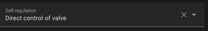

# Selbstregulierung

- [Selbstregulierung](#selbstregulierung)
    - [Konfiguration](#konfiguration)
      - [Selbstregulierung bei direkter Ventilkontrolle](#selbstregulierung-bei-direkter-ventilkontrolle)
      - [Andere Selbsregulierung](#andere-selbsregulierung)
      - [Selbstregulierung im Expertenmodus](#selbstregulierung-im-expertenmodus)
      - [Zusammenfassung des Selbstregulierungsalgorithmus](#zusammenfassung-des-selbstregulierungsalgorithmus)

Sie haben die Möglichkeit, die Selbstregulierungsfunktion nur für _VTherms_ des Typs `over_climate` zu aktivieren.

In der Regel gibt es zwei Fälle: Erstens
1. Wenn Ihr verwendetes Gerät ein _TRV_ ist und das Ventil direkt im Home Assistant gesteuert werden kann (z.B. Sonoff TRVZB), ermöglicht diese Funktion _VTherm_ die direkte Steuerung der Ventilöffnung zur Regelung der Temperatur. Die Öffnung wird dann durch einen Algorithmus vom Typ _TPI_ berechnet (siehe [hier](algorithms.md)).
2. Andernfalls passt Versatile Thermostat den dem jeweiligen Klima vorgegebenen Temperatursollwert an, um sicherzustellen, dass die Raumtemperatur tatsächlich den Sollwert erreicht.

## Konfiguration

### Selbstregulierung bei direkter Ventilkontrolle]

-- this § is not updated since v 8.0. Please see the English version --

Diese Art der Selbstregulierung, `Direct Valve Control` genannt, benötigt:
1. Eine Einheit des Typs `climate`, die in den zugehörigen Geräten des _VTherm_ enthalten ist.
2. Eine Entität des Typs `number` zur Steuerung der Ventilöffnungsrate des _TRV_.
3. Eine optionale Entität des Typs `number` zur Kalibrierung der internen Temperatur des zugehörigen Geräts.
4. Eine optionale Einheit des Typs `number` zur Steuerung des Ventilschließens.

Wenn die gewählte Selbstregulierung `Direct Valve Control` auf einem _VTherm_ `over_climate` ist, erscheint eine neue Konfigurationsseite mit dem Namen `Valve Regulation Configuration`:



Dies ermöglicht Ihnen die Konfiguration der Ventilsteuerungseinheiten:


Sie müssen folgendes angeben:
1. So viele Einheiten zur Steuerung der Ventilöffnung, wie es zugehörige Geräte gibt, in der gleichen Reihenfolge. Diese Parameter sind obligatorisch.
2. So viele Temperatur-Offset-Kalibrierungseinheiten, wie es zugehörige Geräte gibt, in der gleichen Reihenfolge. Diese Parameter sind optional; entweder müssen alle angegeben werden oder keiner. Ihre Verwendung, sofern vorhanden, wird dringend empfohlen.
3. So viele Einheiten zur Steuerung der Schließgeschwindigkeit des Ventils, wie es zugehörige Geräte gibt, in der gleichen Reihenfolge. Diese Parameter sind optional; entweder müssen alle angegeben werden oder keiner.
4. Eine Liste der minimalen Ventilöffnungswerte, wenn das Ventil geöffnet sein muss. Dieses Feld ist eine Liste von Ganzzahlen. Wenn das Ventil geöffnet sein muss, wird es mindestens bis zu diesem Wert geöffnet; andernfalls wird es vollständig geschlossen (0). Auf diese Weise wird sichergestellt, dass genügend Wasser fließt, wenn geheizt werden muss, während es vollständig geschlossen bleibt, wenn keine Heizung benötigt wird.

Der Algorithmus zur Berechnung der Öffnungsrate basiert auf _TPI_, der beschrieben ist [hier](algorithms.md). Es ist derselbe Algorithmus, der für _VTherm_ `over_switch` und `over_valve` verwendet wird.

Wenn eine Ventilschließrate konfiguriert ist, wird sie auf `100 - Öffnungsrate` gesetzt, um das Ventil in einen bestimmten Zustand zu zwingen, andernfalls wird sie auf 100 gesetzt.

>  _*Hinweise*_
> 1. Seit Version 7.2.2 ist es möglich, die Entity "Schließungsgrad" auf Sonoff TRVZB zu verwenden.
> 2. Das Attribut `hvac_action` von Sonoff TRVZB TRVs ist unzuverlässig. Wenn die Innentemperatur des TRV zu sehr von der Raumtemperatur abweicht, kann die `climate`-Entity anzeigen, dass das _TRV_ nicht heizt, auch wenn das Ventil durch _VTherm_ zwangsweise geöffnet wird. Dieses Problem hat keine Auswirkungen, da die `climate`-Entity von _VTherm_ korrigiert wird und die Ventilöffnung bei der Festlegung des Attributs `hvac_action` berücksichtigt. Dieses Problem wird durch die Konfiguration der Temperatur-Offset-Kalibrierung abgeschwächt, aber nicht vollständig beseitigt.
> 3. Das Attribut `valve_open_percent` von _VTherm_ stimmt möglicherweise nicht mit dem an das Ventil gesendeten `Öffnungsgrad`-Wert überein. Wenn Sie einen Mindestöffnungswert konfiguriert haben oder die Schließsteuerung verwenden, wird eine Anpassung vorgenommen. Das Attribut `valve_open_percent` stellt den von _VTherm_ berechneten Rohwert dar. Der an das Ventil gesendete `Öffnungsgrad`-Wert kann entsprechend angepasst werden.

### Andere Selbsregulierung

Im zweiten Fall berechnet Versatile Thermostat einen Offset auf der Grundlage der folgenden Informationen:
1. Die aktuelle Differenz zwischen der Ist-Temperatur und der Soll-Temperatur, genannt Bruttofehler.
2. Die Anhäufung früherer Fehler.
3. Die Differenz zwischen der Außentemperatur und dem Sollwert.

Diese drei Informationen werden kombiniert, um den Offset zu berechnen, der zum aktuellen Sollwert addiert und an das zugehörige Klima gesendet wird.

Die Selbstregulierung wird konfiguriert mit:
1. Einer Regulierungsstufe::
   1. Leicht - für geringe Anforderungen an die Selbstregulierung. In diesem Modus beträgt die maximale Abweichung 1,5°C.
   2. Mittel - für mittlere Anforderungen an die Selbstregulierung. In diesem Modus ist eine maximale Abweichung von 2°C möglich.
   3. Stark - für hohe Anforderungen an die Selbstregulierung. Der maximale Offset beträgt in diesem Modus 3°C, und die Selbstregulierung reagiert stark auf Temperaturänderungen.
2. Ein Schwellenwert für die Selbstregulierung: der Wert, unterhalb dessen keine neue Regulierung vorgenommen wird. Wenn zum Beispiel zum Zeitpunkt t die Abweichung 2°C beträgt und bei der nächsten Berechnung die Abweichung 2,4°C beträgt, wird die Regelung nicht angewendet. Sie wird nur angewendet, wenn die Differenz zwischen den beiden Abweichungen mindestens diesem Schwellenwert entspricht.
3. Mindestzeitraum zwischen zwei Selbstregulierungen: Diese Zahl, angegeben in Minuten, gibt die Dauer zwischen zwei Regulierungsänderungen an.

Mit diesen drei Parametern können Sie die Regelung anpassen und vermeiden, dass zu viele Regelungsänderungen vorgenommen werden. Einige Geräte, wie TRVs oder Heizkessel, mögen keine häufigen Sollwertänderungen.

>  _*Ratschläge zur Einrichtung*_
> 1. Starten Sie die Selbstregulierung nicht sofort. Beobachten Sie, wie die natürliche Regelung Ihres Geräts funktioniert. Wenn Sie feststellen, dass der Sollwert nicht erreicht wird oder zu lange braucht, um ihn zu erreichen, starten Sie die Regelung.
> 2. Beginnen Sie mit einer leichten Selbstregulierung und belassen Sie beide Parameter auf ihren Standardwerten. Warten Sie ein paar Tage und prüfen Sie, ob sich die Situation verbessert.
> 3. Wenn dies nicht ausreicht, schalten Sie auf mittlere Selbstregulierung um und warten Sie auf eine Stabilisierung.
> 4. Wenn das immer noch nicht ausreicht, gehen Sie zu einer starken Selbstregulierung über.
> 5. Wenn es immer noch nicht stimmt, müssen Sie in den Expertenmodus wechseln, um die Regulierungsparameter feiner einzustellen.

Die Selbstregulierung zwingt das Gerät, durch regelmäßige Anpassung des Sollwerts weiter zu arbeiten. Dies kann sowohl den Verbrauch als auch den Verschleiß erhöhen.

#### Selbstregulierung im Expertenmodus

Im Modus **Experte** können Sie die Parameter der Selbstregulierung fein einstellen, um Ihre Ziele zu erreichen und die Leistung zu optimieren. Der Algorithmus berechnet die Differenz zwischen dem Sollwert und der tatsächlichen Raumtemperatur. Diese Abweichung wird als Fehler bezeichnet.

Die einstellbaren Parameter lauten wie folgt::
1. `kp`: der auf den Grössenfehler angewandte Faktor,
2. `ki`: der auf die kumulierten Fehler angewandte Faktor,
3. `k_ext`: der Faktor, der auf die Differenz zwischen der Innentemperatur und der Außentemperatur angewendet wird,
4. `offset_max`: die maximale Korrektur (Offset), die die Regelung anwenden kann,
5. `stabilization_threshold`: eine Stabilisierungsschwelle, bei deren Erreichen der Fehler die kumulierten Fehler auf 0 zurücksetzt,
6. `accumulated_error_threshold`: das Maximum für die Fehlerakkumulation.

Bei der Abstimmung sollten die folgenden Punkte beachtet werden:
1. `kp * error` gibt den auf den Grobfehler bezogenen Offset an. Dieser Offset ist direkt proportional zum Fehler und ist 0, wenn das Ziel erreicht ist.
2. Die Akkumulation des Fehlers trägt dazu bei, die Stabilisierungskurve zu korrigieren, auch wenn noch ein Fehler vorhanden ist. Der Fehler akkumuliert sich und der Offset erhöht sich allmählich, wodurch sich die Temperatur um den Zielwert stabilisieren sollte. Um eine spürbare Wirkung zu erzielen, sollte dieser Parameter nicht zu klein sein. Ein mittlerer Wert ist 30.
3. `ki * accumulated_error_threshold` ergibt den maximalen Offset bezogen auf den kumulierten Fehler.
4. `k_ext` ermöglicht eine sofortige Korrektur (ohne Warten auf akkumulierte Fehler), wenn die Außentemperatur stark von der Solltemperatur abweicht. Wenn die Stabilisierung bei großen Temperaturunterschieden zu stark erfolgt, ist dieser Parameter möglicherweise zu hoch. Er sollte auf Null eingestellt werden, damit die ersten beiden Offsets die Arbeit erledigen können.

Die vorprogrammierten Werte sind folgende:

**Langsame Regulierung**:

    kp: 0.2  # 20% der aktuellen internen Regelabweichung werden durch die aktuelle Differenz von Soll- und Raumtemperatur verursacht
    ki: 0.8 / 288.0  # 80% der aktuellen internen Regelabweichungen werden durch die durchschnittliche Abweichung der letzten 24 Stunden verursacht
    k_ext: 1.0 / 25.0  # Dies erhöht den Offset um 1°C, wenn es draußen 25°C kälter ist als drinnen.
    offset_max: 2.0  # Limit auf einen endgültigen Offset von -2°C bis +2°C
    stabilization_threshold: 0.0  # Diese Funktion muss deaktiviert werden, da sonst der langfristig akkumulierte Fehler immer zurückgesetzt wird, wenn die Temperatur kurzzeitig unter/über den Zielwert sinkt/steigt.
    accumulated_error_threshold: 2.0 * 288  # Dies ermöglicht eine langfristige Verschiebung von bis zu 2°C in beide Richtungen

**Leichte Regulierung**:

    kp: 0.2
    ki: 0.05
    k_ext: 0.05
    offset_max: 1.5
    stabilization_threshold: 0.1
    accumulated_error_threshold: 10

**Mittlere Regulierung**:

    kp: 0.3
    ki: 0.05
    k_ext: 0.1
    offset_max: 2
    stabilization_threshold: 0.1
    accumulated_error_threshold: 20

**Strenge Regulierung**:

    """Strenge Parameter für die Regulierung
    Eine Reihe von Parametern, die die Außentemperatur nicht berücksichtigen
    und sich auf den internen Temperaturfehler + kumulierten Fehler konzentrieren.
    Dies sollte bei kalten Außentemperaturen funktionieren, die andernfalls einen
    hohen external_offset erzeugen."""

    kp: 0.4
    ki: 0.08
    k_ext: 0.0
    offset_max: 5
    stabilization_threshold: 0.1
    accumulated_error_threshold: 50

Um den Expertenmodus zu verwenden, müssen Sie die Werte, die Sie für jeden dieser Parameter verwenden möchten, wie folgt in Ihrer `configuration.yaml` deklarieren. Beispiel für 'Extreme Regulierung':

```yaml
versatile_thermostat:
    auto_regulation_expert:
        kp: 0.6
        ki: 0.1
        k_ext: 0.0
        offset_max: 10
        stabilization_threshold: 0.1
        accumulated_error_threshold: 80
```
und natürlich konfigurieren Sie den Autoregulationsmodus des VTherms auf den Expertenmodus. Alle _VTherms_ im **Experten**-Modus verwenden dieselben Parameter, es ist nicht möglich, unterschiedliche Experteneinstellungen zu haben.

Um die Änderungen zu übernehmen, müssen Sie entweder **den Home Assistant komplett neu starten** oder nur die Integration von Versatile Thermostat (Entwicklertools / YAML / Konfiguration neu laden / Versatile Thermostat).

>  _*Hinweise*_
>
> 1. Im Expertenmodus ist es selten notwendig, die Option [Kompensiere die Innentemperatur des Zugehörigen](over-climate.md#Kompensiere-die-Innentemperatur-des-Zugehörigen) zu verwenden. Dies könnte zu sehr hohen Sollwerten führen.

## Zusammenfassung des Selbstregulierungsalgorithmus

Eine Zusammenfassung des Algorithmus zur Autoregulierung wird [hier](algorithms.md#the-auto-regulation-algorithm-without-valve-control) beschrieben.
