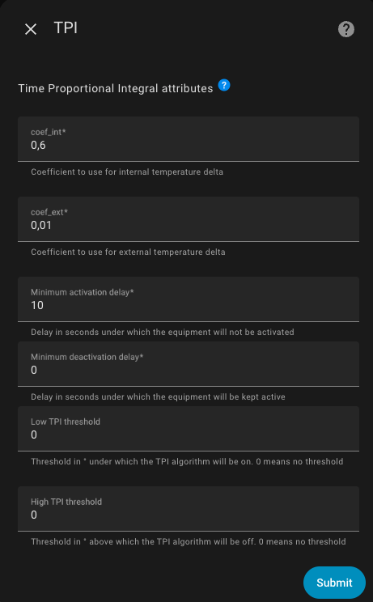

# The Different Algorithms Used

- [The Different Algorithms Used](#the-different-algorithms-used)
  - [The TPI Algorithm](#the-tpi-algorithm)
    - [Configuring the TPI Algorithm Coefficients](#configuring-the-tpi-algorithm-coefficients)
    - [Principle](#principle)
    - [Minimum Activation or Deactivation Delay](#minimum-activation-or-deactivation-delay)
    - [Upper and Lower Activation Thresholds of the Algorithm](#upper-and-lower-activation-thresholds-of-the-algorithm)
  - [The Self-Regulation Algorithm (Without Valve Control)](#the-self-regulation-algorithm-without-valve-control)
  - [The Auto-Start/Stop Function Algorithm](#the-auto-startstop-function-algorithm)

## The TPI Algorithm

TPI is applicable only for _VTherm_ which does the regulation itself. This kind of _VTherm_ is concerned:
1. `over_switch`,
2. `over_valve`,
3. `over_climate` with direct valve control.

`over_climate` with self-regulation that doesn't control the valve directly don't have any TPI algorithm embedded and thus this chapter is not applicable for them.

### Configuring the TPI Algorithm Coefficients

If you have selected a thermostat with a TPI algorithm and choose the "TPI" option in the menu, you will land on this page:

You must provide:
1. the `coef_int` coefficient of the TPI algorithm,
2. the `coef_ext` coefficient of the TPI algorithm,
3. a minimum activation time in seconds,
4. a minimum deactivation time in seconds,
5. a high cut-off threshold in °C (or °K) for the temperature deviation above which the algorithm will be disabled,
6. a low re-activation threshold in °C (or °K) for the temperature deviation below which the algorithm will be enabled again.

### Principle

The TPI algorithm calculates the On vs Off percentage for the radiator at each cycle, using the target temperature, the current room temperature, and the current outdoor temperature.

The percentage is calculated using this formula:

    on_percent = coef_int * (target_temperature - current_temperature) + coef_ext * (target_temperature - outdoor_temperature)
    Then, the algorithm ensures that 0 <= on_percent <= 1.

The default values for `coef_int` and `coef_ext` are `0.6` and `0.01`, respectively. These default values are suitable for a standard well-insulated room.

When adjusting these coefficients, keep the following in mind:
1. **If the target temperature is not reached** after stabilization, increase `coef_ext` (the `on_percent` is too low),
2. **If the target temperature is exceeded** after stabilization, decrease `coef_ext` (the `on_percent` is too high),
3. **If reaching the target temperature is too slow**, increase `coef_int` to provide more power to the heater,
4. **If reaching the target temperature is too fast and oscillations occur** around the target, decrease `coef_int` to provide less power to the radiator.

The `on_percent` value is converted to a percentage (0 to 100%) and directly controls the valve's opening level.

### Minimum Activation or Deactivation Delay

The first delay (`minimal_activation_delay_sec`), in seconds, is the minimum acceptable delay to turn on the heater.
When the calculation results in a power-on delay shorter than this value, the heater remains off.
If the activation time is too short, rapid switching will not allow the equipment to reach operating temperature.

Similarly, the second delay (`minimal_deactivation_delay_sec`), also in seconds, defines the minimum acceptable off-time.
If the off-time is shorter than this value, the heater will not be turned off.
This prevents rapid flickering that provides little benefit for temperature regulation.

### Upper and Lower Activation Thresholds of the Algorithm

Since version 7.4, two additional thresholds are available.
They allow you to disable (or re-enable) the TPI algorithm itself, based on the difference between the target setpoint and the current temperature.

- If the temperature rises and the difference is greater than the upper threshold, the heater is switched off (i.e., `on_percent` is forced to 0).
- If the temperature drops and the difference is smaller than the lower threshold, the heater is turned back on (i.e., `on_percent` is calculated by the algorithm as described above).

These two thresholds stop the on/off cycling when the temperature overshoots the target.
A hysteresis prevents rapid toggling.

Examples:
1. Suppose the target setpoint is 20°C, the upper threshold is 2°C, and the lower threshold is 1°C.
2. When the temperature rises above 22°C (setpoint + upper threshold), `on_percent` is forced to 0.
3. When the temperature drops below 21°C (setpoint + lower threshold), `on_percent` is recalculated.

>  _*Notes*_
> 1. Leave both values at 0 if you do not want to use thresholds. This restores the behavior from before version 7.4.
> 2. Both values are required. If you leave one at 0, no threshold will be applied. Indeed, both are necessary for correct operation.
> 3. In cooling mode, the tests are reversed, but the principle remains the same.
> 4. The upper threshold should always be greater than the lower threshold, even in cooling mode.

## The Self-Regulation Algorithm (Without Valve Control)

The self-regulation algorithm can be summarized as follows:

1. Initialize the target temperature as the VTherm setpoint,
2. If self-regulation is enabled:
   1. Calculate the regulated temperature (valid for a VTherm),
   2. Use this temperature as the target,
3. For each underlying device of the VTherm:
     1. If "Use Internal Temperature" is checked:
          1. Calculate the compensation (`trv_internal_temp - room_temp`),
     2. Add the offset to the target temperature,
     3. Send the target temperature (= regulated_temp + (internal_temp - room_temp)) to the underlying device.

## The Auto-Start/Stop Function Algorithm

The algorithm used in the auto-start/stop function operates as follows:
1. If "Enable Auto-Start/Stop" is off, stop here.
2. If VTherm is on and in Heating mode, when `error_accumulated` < `-error_threshold` -> turn off and save HVAC mode.
3. If VTherm is on and in Cooling mode, when `error_accumulated` > `error_threshold` -> turn off and save HVAC mode.
4. If VTherm is off and the saved HVAC mode is Heating, and `current_temperature + slope * dt <= target_temperature`, turn on and set the HVAC mode to the saved mode.
5. If VTherm is off and the saved HVAC mode is Cooling, and `current_temperature + slope * dt >= target_temperature`, turn on and set the HVAC mode to the saved mode.
6. `error_threshold` is set to `10 (° * min)` for slow detection, `5` for medium, and `2` for fast.

`dt` is set to `30 min` for slow, `15 min` for medium, and `7 min` for fast detection levels.

The function is detailed [here](https://github.com/jmcollin78/versatile_thermostat/issues/585).