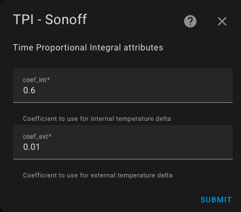

# The Different Algorithms Used

- [The Different Algorithms Used](#the-different-algorithms-used)
  - [The TPI Algorithm](#the-tpi-algorithm)
    - [Configuring the TPI Algorithm Coefficients](#configuring-the-tpi-algorithm-coefficients)
    - [Principle](#principle)
  - [The Self-Regulation Algorithm (Without Valve Control)](#the-self-regulation-algorithm-without-valve-control)
  - [The Auto-Start/Stop Function Algorithm](#the-auto-startstop-function-algorithm)

## The TPI Algorithm

### Configuring the TPI Algorithm Coefficients

If you have selected a thermostat of type `over_switch`, `over_valve`, or `over_climate` with self-regulation in `Direct Valve Control` mode and choose the "TPI" option in the menu, you will land on this page:

You need to provide:
1. the coefficient `coef_int` for the TPI algorithm,
2. the coefficient `coef_ext` for the TPI algorithm.

### Principle

The TPI algorithm calculates the On vs Off percentage for the radiator at each cycle, using the target temperature, the current room temperature, and the current outdoor temperature. This algorithm is only applicable for Versatile Thermostats operating in `over_switch` and `over_valve` modes.

The percentage is calculated using this formula:

    on_percent = coef_int * (target_temperature - current_temperature) + coef_ext * (target_temperature - outdoor_temperature)
    Then, the algorithm ensures that 0 <= on_percent <= 1.

The default values for `coef_int` and `coef_ext` are `0.6` and `0.01`, respectively. These default values are suitable for a standard well-insulated room.

When adjusting these coefficients, keep the following in mind:
1. **If the target temperature is not reached** after stabilization, increase `coef_ext` (the `on_percent` is too low),
2. **If the target temperature is exceeded** after stabilization, decrease `coef_ext` (the `on_percent` is too high),
3. **If reaching the target temperature is too slow**, increase `coef_int` to provide more power to the heater,
4. **If reaching the target temperature is too fast and oscillations occur** around the target, decrease `coef_int` to provide less power to the radiator.

In `over_valve` mode, the `on_percent` value is converted to a percentage (0 to 100%) and directly controls the valve's opening level.

## The Self-Regulation Algorithm (Without Valve Control)

The self-regulation algorithm can be summarized as follows:

1. Initialize the target temperature as the VTherm setpoint,
2. If self-regulation is enabled:
   1. Calculate the regulated temperature (valid for a VTherm),
   2. Use this temperature as the target,
3. For each underlying device of the VTherm:
     1. If "Use Internal Temperature" is checked:
          1. Calculate the compensation (`trv_internal_temp - room_temp`),
     2. Add the offset to the target temperature,
     3. Send the target temperature (= regulated_temp + (internal_temp - room_temp)) to the underlying device.

## The Auto-Start/Stop Function Algorithm

The algorithm used in the auto-start/stop function operates as follows:
1. If "Enable Auto-Start/Stop" is off, stop here.
2. If VTherm is on and in Heating mode, when `error_accumulated` < `-error_threshold` -> turn off and save HVAC mode.
3. If VTherm is on and in Cooling mode, when `error_accumulated` > `error_threshold` -> turn off and save HVAC mode.
4. If VTherm is off and the saved HVAC mode is Heating, and `current_temperature + slope * dt <= target_temperature`, turn on and set the HVAC mode to the saved mode.
5. If VTherm is off and the saved HVAC mode is Cooling, and `current_temperature + slope * dt >= target_temperature`, turn on and set the HVAC mode to the saved mode.
6. `error_threshold` is set to `10 (° * min)` for slow detection, `5` for medium, and `2` for fast.

`dt` is set to `30 min` for slow, `15 min` for medium, and `7 min` for fast detection levels.

The function is detailed [here](https://github.com/jmcollin78/versatile_thermostat/issues/585).