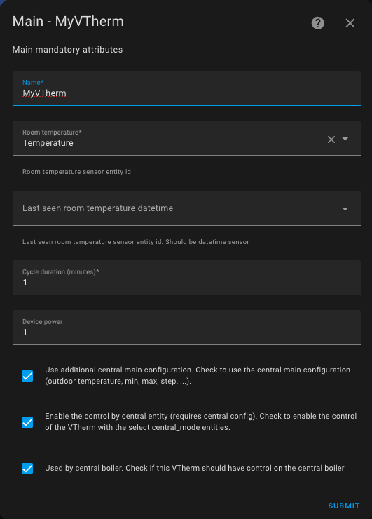
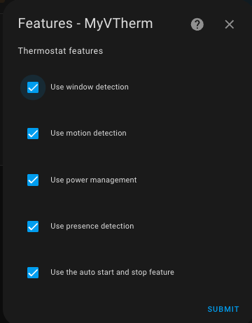

- [Choosing Basic Attributes](#choosing-basic-attributes)
- [Choosing the features to Use](#choosing-the-features-to-use)

# Choosing Basic Attributes

Select the "Main Attributes" menu.

Provide the mandatory main attributes. These attributes are common to all VTherms:
1. A name (this will be both the integration's name and the `climate` entity name),
2. An entity ID of a temperature sensor that provides the room temperature where the radiator is installed,
3. An optional sensor entity providing the last seen date and time of the sensor (`last_seen`). If available, specify it here. It helps prevent safety shutdowns when the temperature is stable, and the sensor stops reporting for a long time (see [here](troubleshooting.md#why-does-my-versatile-thermostat-go-into-safety-mode)),
4. A cycle duration in minutes. At each cycle:
   1. For `over_switch`: VTherm will turn the radiator on/off, modulating the proportion of time it is on,
   2. For `over_valve`: VTherm will calculate a new valve opening level and send it if it has changed,
   3. For `over_climate`: The cycle performs basic controls and recalculates the self-regulation coefficients. The cycle may result in a new setpoint sent to underlying devices or a valve opening adjustment in the case of a controllable TRV.
5. The equipment's power, which will activate power and energy consumption sensors for the device. If multiple devices are linked to the same VTherm, specify the total maximum power of all devices here. The power unit is not important here. What is important is that all _VTherm_ and all power sensors have the same unit (see: Power shedding feature),
6. The option to use additional parameters from centralized configuration:
   1. Outdoor temperature sensor,
   2. Minimum/maximum temperature and temperature step size,
7. The option to control the thermostat centrally. See [centralized control](#centralized-control),
8. A checkbox if this VTherm is used to trigger a central boiler.

>  _*Notes*_
>  1. With the `over_switch` and `over_valve` types, calculations are performed at each cycle. In case of changing conditions, you will need to wait for the next cycle to see a change. For this reason, the cycle should not be too long. **5 minutes is a good value**, but it should be adjusted to your heating type. The greater the inertia, the longer the cycle should be. See [Tuning examples](tuning-examples.md).
>  2. If the cycle is too short, the radiator may never reach the target temperature. For example, with a storage heater, it will be unnecessarily activated.

# Choosing the features to Use

Select the "Features" menu.

Choose the features you want to use for this VTherm:
1. **Opening detection** (doors, windows) stops heating when an opening is detected. (see [managing openings](feature-window.md)),
2. **Motion detection**: VTherm can adjust the target temperature when motion is detected in the room. (see [motion detection](feature-motion.md)),
3. **Power management**: VTherm can stop a device if the power consumption in your home exceeds a threshold. (see [load-shedding management](feature-power.md)),
4. **Presence detection**: If you have a sensor indicating presence or absence in your home, you can use it to change the target temperature. See [presence management](feature-presence.md). Note the difference between this function and motion detection: presence is typically used at the home level, while motion detection is more room-specific.
5. **Humidity control**: For AC mode VTherms only. Automatically switches AC to DRY mode when humidity is too high and cooling is not needed. Cooling mode takes priority when temperature control is required. See [humidity control](feature-humidity.md).
6. **Automatic start/stop**: For `over_climate` VTherms only. This function stops a device when VTherm detects it will not be needed for a while. It uses the temperature curve to predict when the device will be needed again and turns it back on at that time. See [automatic start/stop management](feature-auto-start-stop.md).

>  _*Notes*_
> 1. The list of available functions adapts to your VTherm type.
> 2. When you enable a function, a new menu entry is added to configure it.
> 3. You cannot validate the creation of a VTherm if all parameters for all enabled functions have not been configured.
