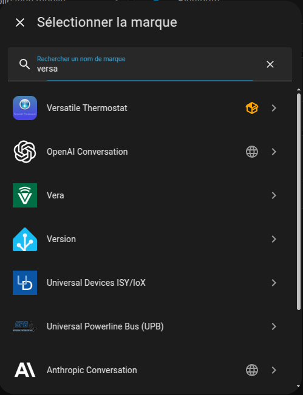
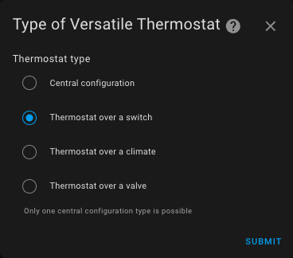

# Choosing a VTherm

- [Choosing a VTherm](#choosing-a-vtherm)
  - [Creating a New Versatile Thermostat](#creating-a-new-versatile-thermostat)
- [Choosing a VTherm Type](#choosing-a-vtherm-type)
  - [Centralized configuration](#centralized-configuration)
  - [VTherm over a switch](#vtherm-over-a-switch)
  - [VTherm over another thermostat](#vtherm-over-another-thermostat)
  - [VTherm over a valve](#vtherm-over-a-valve)
- [Making the right choice](#making-the-right-choice)
- [Reference Article](#reference-article)

>  _*Notes*_
>
> There are three ways to work with VTherms:
> 1. Each Versatile Thermostat is fully configured independently. Choose this option if you do not want any centralized configuration or management.
> 2. Some aspects are configured centrally. For example, you can define the minimum/maximum temperatures, open window detection parameters, etc., at a single central instance. For each VTherm you configure, you can then choose to use the central configuration or override it with custom parameters.
> 3. In addition to centralized configuration, all VTherms can be controlled by a single `select` entity called `central_mode`. This feature allows you to stop/start/set frost protection/etc. for all VTherms at once. For each VTherm, you can specify if it is affected by this `central_mode`.

## Creating a New Versatile Thermostat

Click on "Add Integration" on the integration page (or click 'Add device' in the integration page)

then search for "versatile thermostat" integration:

and choose your thermostat type:

The configuration can be modified via the same interface. Simply select the thermostat to modify, press "Configure," and you will be able to change some parameters or settings.

Follow the configuration steps by selecting the menu option to configure.

# Choosing a VTherm Type

## Centralized configuration
This option allows you to configure certain repetitive aspects for all VTherms at once, such as:
1. Parameters for different algorithms (TPI, open window detection, motion detection, power sensors for your home, presence detection). These parameters apply across all VTherms. You only need to enter them once in `Centralized Configuration`. This configuration does not create a VTherm itself but centralizes parameters that would be tedious to re-enter for each VTherm. Note that you can override these parameters on individual VTherms to specialize them if needed.
2. Configuration for controlling a central heating system,
3. Certain advanced parameters, such as safety settings.

## VTherm over a switch
This VTherm type controls a switch that turns a radiator on or off. The switch can be a physical switch directly controlling a radiator (often electric) or a virtual switch that can perform any action when turned on or off. The latter type can, for example, control pilot wire switches or DIY pilot wire solutions with diodes. VTherm modulates the proportion of time the radiator is on (`on_percent`) to achieve the desired temperature. If it is cold, it turns on more frequently (up to 100%); if it is warm, it reduces the on time.

The underlying entities for this type are `switches` or `input_booleans`.

## VTherm over another thermostat
When your device is controlled by a `climate` entity in Home Assistant and you only have access to this, you should use this VTherm type. In this case, VTherm simply adjusts the target temperature of the underlying `climate` entity.

This type also includes advanced self-regulation features to adjust the setpoint sent to the underlying device, helping to achieve the target temperature faster and mitigating poor internal regulation. For example, if the device's internal thermometer is too close to the heating element, it may incorrectly assume the room is warm while the setpoint is far from being achieved in other areas.

Since version 6.8, this VTherm type can also regulate directly by controlling the valve. Ideal for controllable TRVs, as Sonoff TRVZB, this type is recommended if you have such devices.

The underlying entities for this VTherm type are exclusively `climate`.

## VTherm over a valve
If the only entity available to regulate your radiator's temperature is a `number` entity, you should use the `over_valve` type. VTherm adjusts the valve opening based on the difference between the target temperature and the actual room temperature (and the outdoor temperature, if available).

This type can be used for TRVs without an associated `climate` entity or other DIY solutions exposing a `number` entity.

# Making the right choice
>  _*How to Choose the Type*_
> Choosing the correct type is crucial. It cannot be changed later via the configuration interface. To make the right choice, consider the following questions:
> 1. **What type of equipment will I control?** Follow this order of preference:
>    1. If you have a controllable thermostatic valve (TRV) in Home Assistant through a `number` entity (e.g., a Shelly TRV), choose the `over_valve` type. This is the most direct type and ensures the best regulation.
>    2. If you have an electric radiator (with or without a pilot wire) controlled by a `switch` entity to turn it on/off, then the `over_switch` type is preferable. Regulation will be managed by the Versatile Thermostat based on the temperature measured by your thermometer at its placement location.
>    3. In all other cases, use the `over_climate` mode. You retain your original `climate` entity, and the Versatile Thermostat "only" controls the on/off state and target temperature of your original thermostat. Regulation is handled by your original thermostat in this case. This mode is particularly suited for all-in-one reversible air conditioning systems exposed as a `climate` entity in Home Assistant. Advanced self-regulation can achieve the setpoint faster by forcing the setpoint or directly controlling the valve when possible.
> 2. **What type of regulation do I want?** If the controlled equipment has its own built-in regulation mechanism (e.g., HVAC systems, certain TRVs) and it works well, choose `over_climate`. For TRVs with a controllable valve in Home Assistant, the `over_climate` type with `Direct Valve Control` self-regulation is the best choice.

# Reference Article
For more information on these concepts, refer to this article (in French): https://www.hacf.fr/optimisation-versatile-thermostat/#optimiser-vos-vtherm