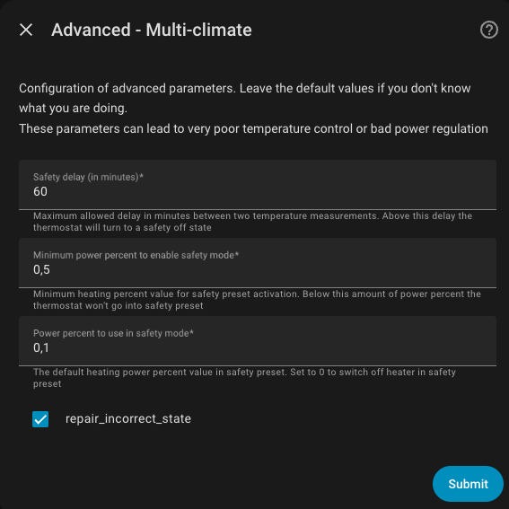

# Advanced Configuration

- [Advanced Configuration](#advanced-configuration)
  - [Why this feature?](#why-this-feature)
  - [Safety Context](#safety-context)
  - [Safety Mode Operating Principle](#safety-mode-operating-principle)
    - [What is Safety Mode?](#what-is-safety-mode)
    - [When does it activate?](#when-does-it-activate)
    - [Limitations](#limitations)
  - [Configuration](#configuration)
  - [Safety Parameters](#safety-parameters)
  - [Exposed Attributes](#exposed-attributes)
  - [Available Actions](#available-actions)
  - [Global Advanced Configuration](#global-advanced-configuration)
  - [Practical Tips](#practical-tips)
  - [Fixing Incorrect Equipment State](#fixing-incorrect-equipment-state)
    - [Why this feature?](#why-this-feature-1)
    - [Use cases](#use-cases)
    - [Operating Principle](#operating-principle)
    - [Configuration](#configuration-1)
    - [Parameters](#parameters)
    - [Exposed Attributes](#exposed-attributes-1)
    - [Limitations and Safety](#limitations-and-safety)

## Why this feature?

_VTherm_'s advanced configuration offers essential tools to ensure the safety and reliability of your heating system. These parameters allow you to manage situations where temperature sensors no longer communicate correctly, which could lead to dangerous or ineffective commands.

## Safety Context

The absence or malfunction of a temperature sensor can be **very dangerous** for your home. Consider this concrete example:

- Your temperature sensor becomes stuck at a value of 10°
- Your _VTherm_ of type `over_climate` or `over_valve` detects a very low temperature
- It commands maximum heating of the underlying equipment
- **Result**: the room overheats considerably

The consequences can range from simple material damage to more serious risks such as a fire or explosion (in the case of a faulty electric radiator).

## Safety Mode Operating Principle

### What is Safety Mode?

Safety mode is a protective mechanism that detects when temperature sensors no longer respond regularly. When data absence is detected, _VTherm_ activates a special mode that:

1. **Reduces immediate risk**: the system no longer commands maximum power
2. **Maintains minimum heating**: ensures the home doesn't cool down excessively
3. **Alerts you**: by changing the thermostat's state, visible in Home Assistant

### When does it activate?

Safety mode triggers when:

- **Missing internal temperature**: no measurement received since the configured maximum delay
- **Missing external temperature**: no measurement received since the configured maximum delay (optional)
- **Stuck sensor**: the sensor no longer sends value changes (typical behavior of battery-powered sensors)

A particular challenge comes from battery-powered sensors that only send data when a value **changes**. It's therefore possible to receive no updates for several hours without the sensor being truly faulty. This is why the parameters are configurable to adapt detection to your setup.

### Limitations

- **_VTherm_ of type `over_climate` self-regulated**: safety mode is automatically disabled. Indeed, there is no danger risk if the equipment regulates itself (it maintains its own temperature). The only risk is an uncomfortable temperature, not a physical danger.

## Configuration

To configure advanced safety parameters:

1. Open your _VTherm_ configuration
2. Access general configuration parameters
3. Scroll down to the "Advanced Configuration" section

The advanced configuration form is as follows:



>  _*Advice*_
>
> If your thermometer has an attribute `last_seen` or similar that gives the time of its last contact, **configure this attribute** in the main selections of your _VTherm_. This significantly improves detection and reduces false alerts. See [basic attribute configuration](base-attributes.md#choice-of-basic-attributes) and [troubleshooting](troubleshooting.md#why-does-my-versatile-thermostat-go-into-safety-mode-) for more details.

## Safety Parameters

| Parameter | Description | Default Value | Attribute Name |
| --- | --- | --- | --- |
| **Maximum delay before safety mode** | Maximum allowed delay between two temperature measurements before the _VTherm_ enters safety mode. If no new measurement is received after this delay, safety mode activates. | 60 minutes | `safety_delay_min` |
| **Minimum `on_percent` threshold for safety** | Minimum percentage of `on_percent` below which safety mode does not activate. This avoids activating safety mode when the radiator is running very little (`on_percent` low), as there is no immediate risk of overheating. `0.00` always activates the mode, `1.00` completely disables it. | 0.5 (50%) | `safety_min_on_percent` |
| **Default `on_percent` value in safety mode** | The heating power used when the thermostat is in safety mode. `0` completely stops heating (risk of freezing), `0.1` maintains minimum heating to prevent freezing in case of prolonged thermometer failure. | 0.1 (10%) | `safety_default_on_percent` |

## Exposed Attributes

When safety mode is active, _VTherm_ expose the following attributes:

```yaml
safety_mode: "on"                # "on" or "off"
safety_delay_min: 60             # Configured delay in minutes
safety_min_on_percent: 0.5       # on_percent threshold (0.0 to 1.0)
safety_default_on_percent: 0.1   # Power in safety mode (0.0 to 1.0)
last_safety_event: "2024-03-20 14:30:00"  # Time of last event
```

## Available Actions

A _VTherm_ action allows to dynamically reconfigure the 3 safety parameters without restarting Home Assistant:

- **Service**: `versatile_thermostat.set_safety_parameters`
- **Parameters**:
  - `entity_id`: the _VTherm_ to reconfigure
  - `safety_delay_min`: new delay (minutes)
  - `safety_min_on_percent`: new threshold (0.0 to 1.0)
  - `safety_default_on_percent`: new power (0.0 to 1.0)

This allows dynamically adapting the safety mode sensitivity according to your usage (for example, reduce the delay when people are home, increase it when the home is unoccupied).

## Global Advanced Configuration

It is possible to disable checking of the **outdoor temperature sensor** for safety mode. Indeed, the outdoor sensor generally has little impact on regulation (depending on your settings) and can be absent without endangering the home.

To do this, add the following lines to your `configuration.yaml`:

```yaml
versatile_thermostat:
  safety_mode:
    check_outdoor_sensor: false
```

>  _*Important*_
>
> - This change is **common to all _VTherm_** in the system
> - It affects outdoor thermometer detection for all thermostats
> - **Home Assistant must be restarted** for changes to take effect
> - By default, the outdoor thermometer can trigger safety mode if it stops sending data

## Practical Tips

>  _*Notes and Best Practices*_

1. **Restoration after correction**: When the temperature sensor comes back to life and sends data again, the preset mode will be restored to its previous value.

2. **Two temperatures required**: The system needs both internal AND external temperature to function correctly. If either is missing, the thermostat will enter safety mode.

3. **Relationship between parameters**: For natural operation, the value `safety_default_on_percent` should be **less than** `safety_min_on_percent`. For example: `safety_min_on_percent = 0.5` and `safety_default_on_percent = 0.1`.

4. **Adaptation to your sensor**:
   - If you have **false alerts**, increase the delay (`safety_delay_min`) or decrease `safety_min_on_percent`
   - If you have battery-powered sensors, increase the delay further (e.g.: 2-4 hours)
   - If you use the `last_seen` attribute, the delay can be reduced (the system is more accurate)

5. **UI Visualization**: If you use the [_Versatile Thermostat UI_ card](additions.md#better-with-the-versatile-thermostat-ui-card), a _VTherm_ in safety mode is visually indicated by:
   - A grayish veil over the thermostat
   - Display of the failing sensor
   - Time elapsed since last update

   .

## Fixing Incorrect Equipment State

### Why this feature?

When using a _VTherm_ with heating equipment (`over_switch`, `over_valve`, `over_climate`, `over_climate_valve`), it can happen that the equipment does not properly follow the command sent by the thermostat. For example:

- A stuck relay that doesn't switch to the commanded state
- A thermostatic valve that doesn't obey commands
- A temporary loss of communication with the equipment
- Equipment that takes too long to respond

The **"Fix Incorrect State"** feature detects these situations and automatically resends the command to synchronize the actual state with the desired state.

### Use cases

This feature is particularly useful for:

- **Unstable relays**: relays that stick or don't always switch correctly
- **Intermittent Zigbee/WiFi communication**: equipment that occasionally loses connection
- **Slow valves**: thermostatic valves that take time to react to commands
- **Faulty equipment**: electric radiators or valves that no longer respond to commands
- **Heat pumps**: to ensure the heat pump properly executes heating/cooling commands

### Operating Principle

On each thermostat control cycle, the feature:

1. **Compares states**: verifies that the actual state of each equipment matches what was commanded
2. **Detects discrepancies**: if the equipment didn't follow the command, that's a discrepancy
3. **Resends the command**: if a discrepancy is detected, resends the command to synchronize the state
4. **Counts attempts**: the number of consecutive repairs is limited to avoid infinite loops
5. **Controls activation delay**: the feature only activates after a minimum delay to let equipment finish initializing

### Configuration

This feature is configured in the _VTherm_ configuration interface:

1. Open your _VTherm_ configuration
2. Access general configuration parameters
3. Scroll down to the "Advanced Configuration" section
4. Enable the **"Fix incorrect equipment state"** option

### Parameters

| Parameter | Description | Default Value |
| --- | --- | --- |
| **Fix incorrect state** | Enables or disables automatic detection and repair of state discrepancies. When enabled, each detected discrepancy triggers a command resend. | Disabled |

>  _*Internal System Parameters*_
>
> Some parameters are configured at system level and cannot be modified:
> - **Minimum delay before activation**: 30 seconds after thermostat startup (allows all equipment to initialize)
> - **Maximum consecutive attempts**: 5 consecutive repairs before temporarily stopping
> - **Reset delay**: the repair counter resets once equipment returns to correct state

### Exposed Attributes

When the repair feature is enabled, _VTherm_ expose the following attribute:

```yaml
repair_incorrect_state_manager:
  consecutive_repair_count: 2       # Number of consecutive repairs performed
  max_attempts: 5                   # Cap before temporary stop
  min_delay_after_init_sec: 30      # Minimum delay before activation
is_repair_incorrect_state_configured: true  # Feature status
```

The `consecutive_repair_count` counter allows you to:
- Diagnose frequent hardware issues
- Identify faulty equipment
- Monitor your installation's stability

### Limitations and Safety

>  _*Important*_

1. **No behavior change**: This feature does not change the heating logic. It simply ensures your commands are properly executed.

2. **Safety cap**: The maximum consecutive attempts (5) prevents infinite loops. If this cap is reached, an error is logged and repairs temporarily stop.

3. **Startup delay**: The feature only activates after 30 seconds to allow all equipment time to fully initialize.

4. **Applicable to all _VTherm_ types**: This feature works for all types `over_switch`, `over_valve`, `over_climate` and `over_climate_valve` (the `over_climate` with direct valve control regulation). For the latter, the state of the underlying `climate` is verified as well as the valve opening state.

5. **Overactivity symptoms**: If you regularly see warning messages indicating a repair, it means there is a hardware issue:
   - Check equipment connection
   - Check network stability (Zigbee/WiFi)
   - Test equipment manually via Home Assistant
   - Consider replacement if the issue persists

6. **Counter reset**: The counter automatically resets as soon as equipment returns to the correct state, allowing new attempts in case of intermittent issues.

7. **Regular retry**: after 5 failed repair attempts, repair pauses to avoid infinite loops. It resumes after 10 cycles without repair, allowing new attempts in case of intermittent problems.
