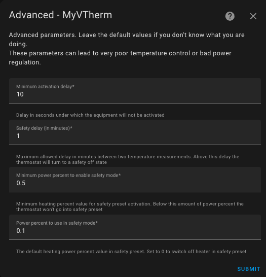
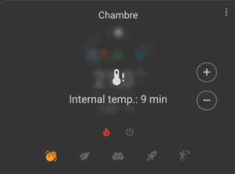

# Advanced Configuration

- [Advanced Configuration](#advanced-configuration)
  - [Advanced Settings](#advanced-settings)
    - [Safety Mode](#safety-mode)

These settings refine the thermostat's operation, particularly the safety mechanism for a _VTherm_. Missing temperature sensors (room or outdoor) can pose a risk to your home. For instance, if the temperature sensor gets stuck at 10°C, the `over_climate` or `over_valve` _VTherm_ types will command maximum heating of the underlying devices, which could lead to room overheating or even property damage, at worst resulting in a fire hazard.

To prevent this, _VTherm_ ensures that thermometers report values regularly. If they don't, the _VTherm_ switches to a special mode called Safety Mode. This mode ensures minimal heating to prevent the opposite risk: a completely unheated home in the middle of winter, for example.

The challenge lies in that some thermometers—especially battery-operated ones—only send temperature updates when the value changes. It is entirely possible to receive no temperature updates for hours without the thermometer failing. The parameters below allow fine-tuning of the thresholds for activating Safety Mode.

If your thermometer has a `last seen` attribute indicating the last contact time, you can specify it in the _VTherm_'s main attributes to greatly reduce false Safety Mode activations. See [configuration](base-attributes.md#choosing-base-attributes) and [troubleshooting](troubleshooting.md#why-does-my-versatile-thermostat-switch-to-safety-mode).

For `over_climate` _VTherms_, which self-regulate, Safety Mode is disabled. In this case, there is no danger, only the risk of an incorrect temperature.

## Advanced Settings

The advanced configuration form looks like this:



### Safety Mode

| Parameter | Description | Default Value | Attribute Name |
| ---------- | ----------- | ------------- | -------------- |
| **Maximum Delay** | Maximum time between two temperature measurements before the _VTherm_ switches to Safety Mode. | 60 minutes | `safety_delay_min` |
| **Minimum `on_percent` Value** | Minimum `on_percent` below which Safety Mode does not activate. Prevents activation if radiator doesn't heat enough (overheat/underheat risk without physical danger). `0.00` always activates, `1.00` disables. | 0.5 (50%) | `safety_min_on_percent` |
| **Default `on_percent` in Safety Mode** | `on_percent` used in Safety Mode. `0` turns off thermostat, `0.1` maintains minimal heating to prevent freezing on thermometer failure. | 0.1 (10%) | `safety_default_on_percent` |

It is possible to disable Safety Mode triggered by missing data from the outdoor thermometer. Since the outdoor thermometer usually has a minor impact on regulation (depending on your configuration), it might not be critical if it's unavailable. To do this, add the following lines to your `configuration.yaml`:

```yaml
versatile_thermostat:
...
    safety_mode:
        check_outdoor_sensor: false
```

By default, the outdoor thermometer can trigger Safety Mode if it stops sending data. Remember that Home Assistant must be restarted for these changes to take effect. This setting applies to all _VTherms_ sharing the outdoor thermometer.

>  _*Notes*_
> 1. When the temperature sensor resumes reporting, the preset will be restored to its previous value.
> 2. Two temperature sources are required: the indoor and outdoor temperatures. Both must report values, or the thermostat will switch to "security" preset.
> 3. An action is available to adjust the three safety parameters. This can help adapt Safety Mode to your needs.
> 4. For normal use, `safety_default_on_percent` should be lower than `safety_min_on_percent`.
> 5. If you use the Versatile Thermostat UI card (see [here](additions.md#better-with-the-versatile-thermostat-ui-card)), a _VTherm_ in Safety Mode is indicated by a gray overlay showing the faulty thermometer and the time since its last value update: .
