# 🧠 Auto TPI: In-Depth Technical Guide

> [!NOTE]
> This document is intended for advanced users who want to understand the Auto TPI algorithm in detail. For a more accessible introduction, see the [Auto TPI User Guide](feature-autotpi.md).

---

## Table of Contents

1. [The TPI Algorithm](#the-tpi-algorithm)
2. [Detailed Learning Cycle](#detailed-learning-cycle)
3. [Thermal Capacity Calibration](#thermal-capacity-calibration)
4. [Coefficient Calculation Algorithms](#coefficient-calculation-algorithms)
5. [Automatic Correction Mechanisms](#automatic-correction-mechanisms)
6. [Advanced Parameters and Constants](#advanced-parameters-and-constants)
7. [Services and API](#services-and-api)
8. [Advanced Diagnostics and Troubleshooting](#advanced-diagnostics-and-troubleshooting)

---

## The TPI Algorithm

### Fundamental Principle

The **TPI** (Time Proportional & Integral) algorithm calculates a **power percentage** at each cycle. This percentage determines how long the heater will be active during the cycle (e.g., 60% on a 10-minute cycle = 6 minutes of heating).

### Basic Formula

```
Power = (Kint × ΔT_indoor) + (Kext × ΔT_outdoor)
```

Where:
- **Kint** (`tpi_coef_int`): Indoor coefficient, reacts to the setpoint gap
- **Kext** (`tpi_coef_ext`): Outdoor coefficient, compensates for thermal losses
- **ΔT_indoor** = Setpoint − Indoor Temperature
- **ΔT_outdoor** = Setpoint − Outdoor Temperature

```mermaid
graph LR
    subgraph Inputs
        A[Indoor Temperature]
        B[Outdoor Temperature]
        C[Setpoint]
    end
    
    subgraph TPI Calculation
        D["ΔT_int = Setpoint - T_int"]
        E["ΔT_ext = Setpoint - T_ext"]
        F["Power = Kint×ΔT_int + Kext×ΔT_ext"]
    end
    
    subgraph Output
        G["Power % (0-100%)"]
        H["ON/OFF Time"]
    end
    
    A --> D
    C --> D
    B --> E
    C --> E
    D --> F
    E --> F
    F --> G
    G --> H
```



### Role of Coefficients

| Coefficient | Role | Learning Situation |
|-------------|------|-------------------|
| **Kint** | Controls **reactivity**: the higher it is, the faster heating reacts to gaps | During **temperature rise** (gap > 0.05°C, power < 99%) |
| **Kext** | Compensates for **thermal losses**: the higher it is, the more heating anticipates cooling | During **stabilization** around the setpoint (gap < 0.5°C) |

---

## Detailed Learning Cycle

### Flow Overview

```mermaid
flowchart TD
    subgraph Initialization
        A[Start Session] --> B{Heating Rate = 0?}
        B -->|Yes| C[Historical Pre-calibration]
        B -->|No| G[Active Learning]
        
        C --> D{Reliability >= 20%?}
        D -->|Yes| G
        D -->|No| E[Bootstrap Mode]
        E -->|3 aggressive cycles| F[Estimated Capacity]
        F --> G
    end
    
    subgraph "Learning Loop"
        G --> H[Start TPI Cycle]
        H --> I[Snapshot Initial State]
        I --> J[Execute ON/OFF Heating]
        J --> K[End Cycle: Measure ΔT]
        K --> L{Valid Conditions?}
        
        L -->|No| M[Skip Learning]
        L -->|Yes| N{Analyze Situation}
        
        N -.->|Overshoot| O[🔸 Kext Correction<br/>optional]
        N -.->|Stagnation| P[🔸 Kint Boost<br/>optional]
        N -->|T° Rising| Q[Kint Learning]
        N -->|Stabilization| R[Kext Learning]
        
        O -.-> S[Update Coefficients]
        P -.-> S
        Q --> S
        R --> S
        M --> H
        S --> H
    end
    
    subgraph Finalization
        S --> T{50 cycles Kint AND Kext?}
        T -->|No| H
        T -->|Yes| U[Save to Config]
        U --> V[End Notification]
    end
    
    style O fill:#fff3cd,stroke:#ffc107,stroke-width:2px
    style P fill:#fff3cd,stroke:#ffc107,stroke-width:2px
```



> [!NOTE]
> **Yellow boxes with dashed lines** (🔸) represent **optional** correction mechanisms. They must be explicitly enabled via `set_auto_tpi_mode` service parameters.

### Cycle Snapshot Details

At each cycle start, the algorithm captures the current state:

| Captured Data | Usage |
|---------------|-------|
| `last_temp_in` | Indoor temperature at cycle start |
| `last_temp_out` | Outdoor temperature at cycle start |
| `last_order` | Setpoint at cycle start |
| `last_power` | Calculated power for this cycle (0.0 to 1.0) |
| `last_state` | HVAC mode (heat/cool) |

At cycle end, these values are compared with current measurements to calculate progression.

### Cycle Validation Conditions

A cycle is **ignored** for learning if:

| Condition | Reason |
|-----------|--------|
| Power = 0% or 100% | Saturation: no exploitable efficiency information |
| Setpoint modified | Target changed mid-cycle |
| Power shedding active | Heating was forced OFF by Power Manager |
| Failure detected | Anomaly detected (ineffective heating) |
| Central boiler OFF | Thermostat requests but boiler doesn't respond |
| First cycle after restart | No valid reference data |

---

## Thermal Capacity Calibration

### Definition

**Thermal capacity** (or **heating rate**) represents the maximum temperature rise speed of your system, expressed in **°C per hour** (°C/h).

Example: A capacity of 2.0 °C/h means your radiator can raise the temperature by 2°C in one hour at full power (under ideal adiabatic conditions).

### Determination Methods


### Pre-calibration via History Analysis

The `auto_tpi_calibrate_capacity` service analyzes sensor history:

1. **Retrieval** of `temperature_slope` and `power_percent` data over 30 days
2. **Filtering**: only keeps points where `power >= 95%`
3. **Outlier elimination** using IQR (Interquartile Range) method
4. **75th percentile calculation** of slopes (more representative than median)
5. **Adiabatic correction**: `Capacity = P75 + Kext × ΔT`
6. **Safety margin application**: 20% by default

### Bootstrap Mode

If history is insufficient (reliability < 20%), the system enters **bootstrap mode**:

- **Aggressive coefficients**: Kint = 1.0, Kext = 0.1
- **Duration**: minimum 3 cycles
- **Goal**: Trigger significant temperature rise to measure actual capacity
- **Timeout safety**: If failure after 5 cycles, default capacity = 0.3 °C/h (slow systems)

---

## Coefficient Calculation Algorithms

### Kint Learning (Indoor Coefficient)

The algorithm adjusts Kint when temperature **rises** toward the setpoint.

#### Detailed Formula

```mermaid
flowchart LR
    subgraph "1. Effective Capacity"
        A["C_eff = C_ref × (1 - Kext × ΔT_ext)"]
    end
    
    subgraph "2. Max Possible Rise"
        B["max_rise = C_eff × cycle_duration × efficiency"]
    end
    
    subgraph "3. Adjusted Target"
        C["target = min(setpoint_gap, max_rise)"]
    end
    
    subgraph "4. Ratio"
        D["ratio = (target / actual_rise) × aggressiveness"]
    end
    
    subgraph "5. New Kint"
        E["Kint_new = Kint_old × ratio"]
    end
    
    A --> B --> C --> D --> E
```



#### Variables Used

| Variable | Description | Typical Value |
|----------|-------------|---------------|
| `C_ref` | Calibrated reference capacity | 1.5 °C/h |
| `Kext` | Current outdoor coefficient | 0.02 |
| `ΔT_ext` | Indoor/outdoor temp difference | 15°C |
| `cycle_duration` | In hours | 0.167 (10 min) |
| `efficiency` | Power percentage used | 0.70 |
| `aggressiveness` | Moderation factor | 0.9 |

### Kext Learning (Outdoor Coefficient)

The algorithm adjusts Kext when temperature is **close to setpoint** (|gap| < 0.5°C).

#### Formula

```
Correction = Kint × (indoor_gap / outdoor_gap)
Kext_new = Kext_old + Correction
```

- If indoor_gap **negative** (overshoot) → Negative correction → **Kext decreases**
- If indoor_gap **positive** (undershoot) → Positive correction → **Kext increases**

### Smoothing Methods

Two methods are available to smooth new values:

#### Weighted Average ("Discovery" mode)

```
Kint_final = (Kint_old × count + Kint_new) / (count + 1)
```

| Cycle | Old Weight | New Weight | New Value Impact |
|-------|------------|------------|------------------|
| 1 | 1 | 1 | 50% |
| 10 | 10 | 1 | 9% |
| 50 | 50 | 1 | 2% |

> The counter is capped at 50 to maintain minimum reactivity.

#### EWMA ("Fine Tuning" mode)

```
Kint_final = (1 - α) × Kint_old + α × Kint_new
α(n) = α₀ / (1 + decay_rate × n)
```

| Parameter | Default | Description |
|-----------|---------|-------------|
| `α₀` (initial alpha) | 0.08 | Initial weight of new values |
| `decay_rate` | 0.12 | Alpha decrease speed |

### Continuous Kext Learning

This mechanism allows for long-term adaptation of $K_{ext}$ without an active learning session.

#### Eligibility Conditions
A cycle is used for continuous learning only if:
1. **Feature enabled**: `auto_tpi_continuous_kext` is set to `true`.
2. **Bootstrapped**: At least one outdoor learning cycle has been completed previously for the current mode.
3. **Non-saturated power**: $0 < P_{real} < P_{saturation}$.
4. **Stable system**: No cycle interruptions, no boiler off, no heating failure, and no excessive consecutive failures.
5. **Significant outdoor delta**: $|Setpoint - T_{outdoor}| \ge 1.0°C$.
6. **No setpoint change**: The target temperature did not change during the cycle.

#### Continuous Learning Formula
The correction is calculated similarly to the standard $K_{ext}$ learning:
$$K_{ext}^{target} = K_{ext}^{old} + K_{int} \times \frac{\Delta T_{indoor}}{\Delta T_{outdoor}}$$

Then, it is applied using an EWMA with a specific alpha:
$$K_{ext}^{new} = (1 - \alpha_{cont}) \times K_{ext}^{old} + \alpha_{cont} \times K_{ext}^{target}$$

By default, $\alpha_{cont} = 0.04$.

---

## Automatic Correction Mechanisms

### Overshoot Correction (Kext Deboost)

> **Activation**: `allow_kext_compensation_on_overshoot` parameter in `set_auto_tpi_mode` service

Detects and corrects when temperature **exceeds the setpoint** without coming back down.

```mermaid
flowchart TD
    A{T° > Setpoint + 0.2°C?} -->|Yes| B{Power > 5%?}
    B -->|Yes| C{T° not falling?}
    C -->|Yes| D[Kext Correction]
    
    A -->|No| E[No Correction]
    B -->|No| E
    C -->|No| E
    
    D --> F["reduction = overshoot × Kint / ΔT_ext"]
    F --> G["Kext_target = max(0.001, Kext - reduction)"]
    G --> H[Apply with alpha boost ×2]
```



### Stagnation Correction (Kint Boost)

> **Activation**: `allow_kint_boost_on_stagnation` parameter in `set_auto_tpi_mode` service

Detects and corrects when temperature **stagnates** despite significant gap.

```mermaid
flowchart TD
    A{Gap > 0.5°C?} -->|Yes| B{Progress < 0.02°C?}
    B -->|Yes| C{Power < 99%?}
    C -->|Yes| D{Consecutive boosts < 5?}
    D -->|Yes| E[Kint Boost]
    
    A -->|No| F[No Correction]
    B -->|No| F
    C -->|No| F
    D -->|No| G[Undersized Heating Alert]
    
    E --> H["boost = 8% × min(gap/0.3, 2.0)"]
    H --> I["Kint_target = Kint × (1 + boost)"]
```



---

## Advanced Parameters and Constants

### Internal Constants (Non-configurable)

| Constant | Value | Description |
|----------|-------|-------------|
| `MIN_KINT` | 0.01 | Kint floor to maintain reactivity |
| `OVERSHOOT_THRESHOLD` | 0.2°C | Overshoot threshold to trigger correction |
| `OVERSHOOT_POWER_THRESHOLD` | 5% | Min power to consider overshoot as Kext error |
| `OVERSHOOT_CORRECTION_BOOST` | 2.0 | Alpha multiplier during correction |
| `NATURAL_RECOVERY_POWER_THRESHOLD` | 20% | Max power to skip learning in natural recovery |
| `INSUFFICIENT_RISE_GAP_THRESHOLD` | 0.5°C | Min gap to trigger Kint boost |
| `MAX_CONSECUTIVE_KINT_BOOSTS` | 5 | Limit before undersizing alert |
| `MIN_PRE_BOOTSTRAP_CALIBRATION_RELIABILITY` | 20% | Min reliability to skip bootstrap |

### Configurable Parameters

| Parameter | Type | Default | Range |
|-----------|------|---------|-------|
| **Aggressiveness** | Slider | 1.0 | 0.5 - 1.0 |
| **Heating Time** | Minutes | 5 | 1 - 30 |
| **Cooling Time** | Minutes | 7 | 1 - 60 |
| **Heating Rate** | °C/h | 0 (auto) | 0 - 5.0 |
| **Initial Weight** (Discovery) | Integer | 1 | 1 - 50 |
| **Alpha** (Fine Tuning) | Float | 0.08 | 0.01 - 0.3 |
| **Decay Rate** | Float | 0.12 | 0.0 - 0.5 |

---

## Services and API

### `versatile_thermostat.set_auto_tpi_mode`

Controls learning start/stop.

```yaml
service: versatile_thermostat.set_auto_tpi_mode
target:
  entity_id: climate.my_thermostat
data:
  auto_tpi_mode: true                    # true = start, false = stop
  reinitialise: true                     # true = full reset, false = resume
  allow_kint_boost_on_stagnation: false  # Boost Kint on stagnation
  allow_kext_compensation_on_overshoot: false  # Kext correction on overshoot
```

### `versatile_thermostat.auto_tpi_calibrate_capacity`

Calibrates thermal capacity from history.

```yaml
service: versatile_thermostat.auto_tpi_calibrate_capacity
target:
  entity_id: climate.my_thermostat
data:
  start_date: "2024-01-01T00:00:00+00:00"  # Optional
  end_date: "2024-02-01T00:00:00+00:00"    # Optional
  min_power_threshold: 95                   # Min power %
  capacity_safety_margin: 20                # Safety margin %
  save_to_config: true                      # Save to config
```

**Service Returns**:

| Key | Description |
|-----|-------------|
| `max_capacity` | Calculated raw capacity (°C/h) |
| `recommended_capacity` | Capacity after margin (°C/h) |
| `reliability` | Reliability index (%) |
| `samples_used` | Number of samples |
| `outliers_removed` | Number of outliers removed |

---

## Advanced Diagnostics and Troubleshooting

### Diagnostic Sensor

Entity: `sensor.<name>_auto_tpi_learning_state`

| Attribute | Description |
|-----------|-------------|
| `active` | Learning in progress |
| `heating_cycles_count` | Total observed cycles |
| `coeff_int_cycles` | Validated Kint cycles |
| `coeff_ext_cycles` | Validated Kext cycles |
| `model_confidence` | Confidence 0.0 - 1.0 |
| `calculated_coef_int` | Current Kint |
| `calculated_coef_ext` | Current Kext |
| `last_learning_status` | Last cycle reason |
| `capacity_heat_status` | `learning` or `learned` |
| `capacity_heat_value` | Current capacity (°C/h) |

### Common Learning Statuses

| Status | Meaning | Suggested Action |
|--------|---------|------------------|
| `learned_indoor_heat` | Kint updated successfully | Normal |
| `learned_outdoor_heat` | Kext updated successfully | Normal |
| `power_out_of_range` | Power at 0% or 100% | Wait for non-saturated cycle |
| `real_rise_too_small` | Rise < 0.01°C | Check sensor or cycle duration |
| `setpoint_changed_during_cycle` | Setpoint modified | Avoid touching setpoint |
| `no_capacity_defined` | No calibrated capacity | Wait for calibration/bootstrap |
| `corrected_kext_overshoot` | Overshoot correction applied | Normal if Kext too high |
| `corrected_kint_insufficient_rise` | Kint boost applied | Normal if Kint too low |
| `max_kint_boosts_reached` | 5 consecutive boosts | **Undersized heating** |

### Diagnostic Decision Tree


### Persistence File

**Location**: `.storage/versatile_thermostat_{unique_id}_auto_tpi_v2.json`

This file contains the complete learning state and is restored on Home Assistant restart. It can be deleted to force a complete reset (not recommended).

#### Startup Synchronization
At each startup, if **Continuous Kext Learning** is enabled, the system performs an **Alignment** between the stored data (JSON) and the Home Assistant configuration (`ConfigEntry`):
1. **Clamping**: Loaded coefficients are immediately capped to the `max_coef_int` limit (standard safety).
2. **Kext and Capacity Configuration Sync**: If the $K_{ext}$ or the **heating/cooling capacity** in the configuration differs from the learned value in storage (captured through background adaptation without integration reload), the system performs an atomic update of the configuration. This ensures that the user interface and the YAML/UI configuration remain synchronized with the most accurate building model.

---

## Appendices

### Recommended Value References

| Heating Type | Heating Time | Cooling Time | Typical Capacity |
|--------------|--------------|--------------|------------------|
| Electric convector | 2-5 min | 3-7 min | 2.0-3.0 °C/h |
| Inertia radiator | 5-10 min | 10-20 min | 1.0-2.0 °C/h |
| Underfloor heating | 15-30 min | 30-60 min | 0.3-0.8 °C/h |
| Central boiler | 5-15 min | 10-30 min | 1.0-2.5 °C/h |

### Complete Mathematical Formulas

**Effective Capacity**:
$$C_{eff} = C_{ref} \times (1 - K_{ext} \times \Delta T_{ext})$$

**Adaptive Alpha (EWMA)**:
$$\alpha(n) = \frac{\alpha_0}{1 + k \times n}$$

**Calibration Reliability**:
$$reliability = 100 \times \min\left(\frac{samples}{20}, 1\right) \times \max\left(0, 1 - \frac{CV}{2}\right)$$

Where CV = Coefficient of Variation (standard deviation / mean)
