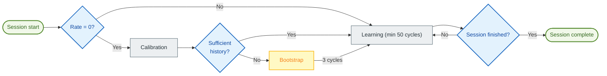

# 🧠 Auto TPI: Automatic Learning

> [!NOTE]
> This feature is primarily designed for **Switch** (On/Off) heating systems, such as electric radiators, boilers, underfloor heating, or pellet stoves. Adaptation for thermostatic radiator valves (TRV) remains problematic due to their non-linearity.

**Auto TPI** enables your thermostat to learn the thermal characteristics of your room by itself. It automatically adjusts the $K_{int}$ (Internal Inertia) and $K_{ext}$ (External Insulation) coefficients to reach and maintain your setpoint with optimal precision.

> [!TIP]
> **For advanced users**: A detailed technical documentation explaining the algorithms, mathematical formulas and internal mechanisms is available here: [Auto TPI Technical Documentation](feature-autotpi-technical.md).

---

## 🔄 Session Cycle

Auto TPI operates through **punctual learning sessions**. During a session, the system dynamically analyzes your room's reaction: it first evaluates the actual power of your heating, then adjusts Kint and Kext over at least 50 TPI cycles per coefficient.

1.  **Initialization**: If the **Heat Rate** is 0, the system first attempts a **Calibration** by analyzing your historical temperature, slope, and power data (via the `calibrate_capacity` service).
2.  **Bootstrap Mode**: If the history is not reliable enough to estimate the heat rate, the system enters **Bootstrap** mode. It performs 3 intense heating cycles to determine your radiator's heating capacity.
3.  **Active Learning**: Once the heat rate is known, the system refines the TPI coefficients at each cycle. This phase lasts a **minimum of 50 cycles** per coefficient to ensure their stability.
4.  **Saving**: At the end of the session (approximately 48 hours), the learned coefficients **and** the final heat rate are automatically saved to your permanent configuration.

### When are Kint and Kext adjusted?

The system learns both coefficients in different situations:

| Coefficient | Learning Situation | Explanation |
| :--- | :--- | :--- |
| **Kint** (Internal Inertia) | During **temperature rise**, when the deviation from the setpoint is significant (> 0.05°C) and the heating is not saturated (100%). | Kint controls heating responsiveness. It adjusts when the system needs to "catch up" to the setpoint. |
| **Kext** (External Insulation) | During **stabilization around the setpoint**, when the deviation is small (< 1°C). | Kext compensates for heat losses to the outside. It adjusts when the system maintains the temperature. |

> [!TIP]
> This is why it's important to create varied heating cycles during learning: temperature rise allows Kint adjustment, and stabilization allows Kext adjustment.

> [!NOTE]
> **Saturated cycles**: Cycles at **0%** or **100%** power are **ignored** for Kint and Kext coefficient calculation (as they provide no usable information about thermal response). However, cycles at 100% are used to adjust the **heat rate**.

---

## 🚀 Starting the Learning

Once the **Auto TPI** feature is enabled and configured for your thermostat, learning does not start automatically. You must launch it manually:

1.  **Via the dedicated card (Recommended)**: Use the "Play" button on the [Auto TPI Learning Card](https://github.com/KipK/auto-tpi-learning-card).
2.  **Via the "Set Auto TPI Mode" service**: Call this service (`set_auto_tpi_mode`) from the developer tools. This service starts or stops an Auto TPI session.

---

## ⚙️ Standard Configuration

When enabling Auto TPI, the following parameters are available:

| Parameter | Description |
| :--- | :--- |
| **Learning Type** | **Discovery** (for initial learning) or **Fine Tuning** (to refine existing settings). |
| **Aggressiveness** | Coefficient reduction factor (1.0 = 100%). Reduce this value (e.g., 0.8) if you observe frequent setpoint overshoots. |
| **Heating Time** | Time required for your equipment to reach full power (e.g., 5 min for an electric radiator). |
| **Cooling Time** | Time required to cool down after shutdown (e.g., 7 min for an electric radiator). |
| **Heat Rate** | Temperature rise capacity (°C/hour). Leave at **0** to let the system calculate it automatically via calibration or bootstrap. |

---

## 🛠️ Advanced Configuration

If you check "Enable advanced parameters", you access fine-tuning settings for the algorithms.

### "Discovery" Method (Weighted Average)
Used to quickly stabilize a new system.
-   **Initial Weight** (1 to 50): Defines the importance of current coefficients relative to new discoveries.
    -   At **1**: Newly calculated coefficients almost entirely replace the old ones. Learning is fast but sensitive to disturbances.
    -   At **50**: Old coefficients have much more weight. Learning is very slow but very stable.
    -   **Advice**: Leave at 1 for initial learning. If you want to resume interrupted learning while preserving some progress, use an intermediate value (e.g., 25).

### "Fine Tuning" Method (EWMA)
Used for smooth and very precise adaptation.
-   **Alpha**: Smoothing factor. The higher it is, the faster the system reacts to recent changes.
-   **Decay Rate**: Allows gradually reducing the learning speed to stabilize on the best values found.

---

## 💡 Best Practices

### Avoid External Disturbances
During a learning session (especially the first few hours), try to avoid:
-   Direct full sunlight on the temperature sensor.
-   Using a secondary heat source (fireplace, stove).
-   Massive drafts (open doors).
These factors distort the system's perception of your room's insulation.

### Avoid Extreme Conditions

> [!CAUTION]
> **Do not start learning if your heaters are saturated** (100% power constantly). This typically occurs during exceptional cold snaps when heating can no longer reach the setpoint. In these conditions, the system cannot learn properly because it has no margin to adjust power. Wait for milder weather conditions to start a learning session.

### Ideal "Discovery" Session Flow

> [!TIP]
> **Concrete example**: If your usual setpoint is **18°C**, temporarily lower it to **15°C** and wait for the room to stabilize. Then restart learning and set the setpoint back to **18°C**. This creates a 3°C gap that the system will observe to learn.

1.  **Preparation**: Lower the setpoint by at least 3°C from your usual temperature. Let the room cool down and stabilize at this new temperature.
2.  **Launch**: Activate learning and **set the setpoint back to its usual value**. The system will observe the temperature rise.
3.  **Stabilization**: Let the system stabilize the temperature around the setpoint for several hours.
4.  **Stimulation**: Once the coefficients have stopped changing significantly, trigger a new heating cycle by lowering the setpoint by 2°C then raising it back.
5.  **Stabilization**: Let the system stabilize the temperature around the setpoint for several hours.
6.  **Finalization**: If learning is not yet complete, let the system run until completion while resuming your normal habits. Auto TPI will stop on its own once coefficients are stabilized after at least 50 cycles each.

> [!NOTE]
> **About overshoot (setpoint exceeding)**: An overshoot during the first temperature rise is **normal** and even beneficial! It provides valuable data for learning. The system will use it to refine the coefficients. However, if overshoots **persist or worsen** after several cycles, this may indicate an Auto TPI configuration problem (incorrect heating/cooling times, too high aggressiveness) or a VTherm configuration problem itself.

### Ideal "Fine Tuning" Session Flow
1.  **Stability**: Keep your usual heating habits while simply avoiding exceptional disturbances (windows open for long periods, auxiliary heating).
2.  **Observation**: Let the system observe micro-variations and adjust coefficients over 50 cycles.
3.  **Re-evaluation**: If you notice coefficients drifting significantly or comfort degrading, it's better to restart a complete session in **Discovery** mode.

---

## 🔄 Continuous Kext Learning

While standard Auto TPI sessions are designed for punctual learning (initial discovery or fine-tuning), the **Continuous Kext Learning** feature allows the thermostat to adapt to long-term climate changes and variations in building insulation without requiring manual sessions.

### How it works
Once enabled, the system continuously monitors the precision of the $K_{ext}$ (External Insulation) coefficient during normal operation. If it detects a systematic deviation (e.g., the temperature is always 0.2°C below the setpoint during cold snaps), it applies micro-corrections using an **Exponential Moving Average (EWMA)**.

### Features
- **Passive Adaptation**: Operates in the background as long as the thermostat is running.
- **Safety**: Only active when the power is not saturated and the system is stable.
- **Configurable Alpha**: You can adjust the "Alpha" factor (default 0.04) to control how fast the system adapts. A higher value means faster adaptation but more sensitivity to noise.
- **Requires Bootstrap**: Continuous learning only starts after at least one successful outdoor learning cycle has been performed in a standard session.

---

## 📊 Visual Monitoring

To follow the learning evolution in real-time, it is highly recommended to install the **Auto TPI Learning Card** custom card.

### Installation via HACS

Or manually add the custom repository: [https://github.com/KipK/auto-tpi-learning-card](https://github.com/KipK/auto-tpi-learning-card)

### Card Features

-   📈 Real-time calibration and learning progress
-   🔢 `Kint`, `Kext` coefficients and heat rate being calculated
-   ▶️ Control button to start/stop the session
-   🔧 Options to reset the session, enable Kint Boost or Kext Deboost
