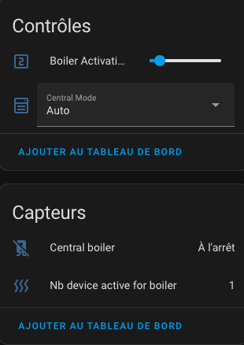
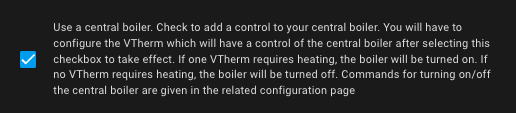
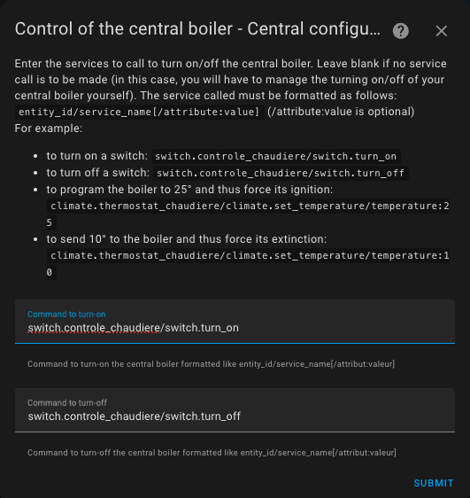
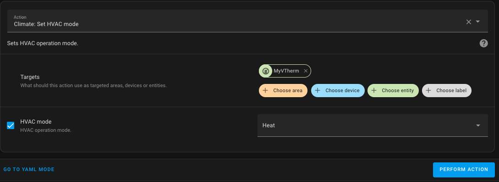
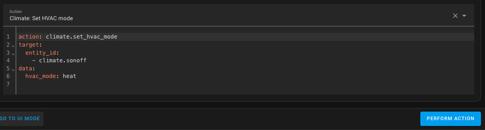

# Le contrôle d'une chaudière centrale# Controlling a Central Boiler

- [Le contrôle d'une chaudière centrale# Controlling a Central Boiler](#le-contrôle-dune-chaudière-centrale-controlling-a-central-boiler)
  - [Principle](#principle)
    - [Active power calculation](#active-power-calculation)
  - [Configuration](#configuration)
    - [How to Find the Right Action?](#how-to-find-the-right-action)
  - [Events](#events)
  - [Warning](#warning)

You can control a centralized boiler. As long as it's possible to trigger or stop the boiler from Home Assistant, Versatile Thermostat will be able to control it directly.

## Principle
The principle implemented is globally the following:
1. a new entity of type `binary_sensor` named by default `binary_sensor.central_configuration_central_boiler` is added,
2. in the _VTherm_ configuration you indicate whether the VTherm should control the boiler. Indeed, in a heterogeneous installation, some VTherm must control the boiler and others not. You must therefore indicate in each VTherm configuration whether it controls the boiler or not. For each _VTherm_ controlling the boiler you can associate a power,
3. the `binary_sensor.central_configuration_central_boiler` listens to state changes of equipment from VTherm marked as controlling the boiler,
4. as soon as the number of equipment controlled by the VTherm requesting heating (i.e. its `hvac_action` changes to `Heating`) or the total power exceeds a configurable threshold, then the `binary_sensor.central_configuration_central_boiler` switches to `on` and **if an activation service has been configured, then this service is called**,
5. if the number of equipment requiring heating falls below the threshold, then the `binary_sensor.central_configuration_central_boiler` switches to `off` and if **a deactivation service has been configured, then this service is called**,
6. you have access to 4 entities:
   - one of type `number` named by default `number.boiler_activation_threshold`, gives the activation threshold. This threshold is in number of equipment (radiators) requesting heating and not the number of _VTherm_ requesting heating.
   - one of type `sensor` named by default `sensor.nb_device_active_for_boiler`, gives the number of equipment requesting heating. For example, a VTherm with 4 valves of which 3 are requesting heating will set this sensor to 3. Only equipment from _VTherm_ that are marked to control the central boiler are counted.
   - one of type `number` named `number.boiler_power_activation_threshold` which gives the power activation threshold. If the total power activated by _Vtherm_ controlling the boiler is exceeded then the boiler will be activated,
   - one of type `sensor` named `sensor.total_power_active_for_boiler` which gives the last calculated total power.

You therefore have permanent access to the information that allows you to control and adjust the boiler activation.

All these entities are attached to the central configuration service:



In this example:
1. the boiler is off,
2. it activates if 3 equipment are active or if the total active power is 500,
3. the number of active equipment is 1,
4. the total activated power is 230.

### Active power calculation
The active power calculation depends on the _VTherm_ type:
1. for all _VTherm_ based on [TPI](./algorithms.md#lalgorithme-tpi) the active power is [the power configured for the equipment](base-attributes.md#choix-des-attributs-de-base) x `on_percent` from the TPI algorithm. For all these _VTherm_ the power is therefore variable and evolves according to the heating power requested. Powers have no units, you can put whatever you want, the important thing is that all powers expressed in all _VTherm_ have the same unit.
2. for `over_climate` _VTherm_ the calculated power is all or nothing. If the equipment is active (`is_device_ative`) then the power is that of the _VTherm_ otherwise it is zero. There is no way in this configuration to modulate the requested power.
3.
## Configuration
To configure this feature, you need a centralized configuration (see [Configuration](#configuration)) and check the 'Add Central Boiler' box:



On the next page, you can provide the configuration for the actions (e.g., services) to be called when the boiler is turned on/off:



The first parameter specifies a delay in seconds before activating the boiler. The default value is 0, meaning the boiler is activated immediately as soon as a threshold is crossed. If you need to allow time for the valves to open (for example), set a positive value in seconds. Some valves for underfloor heating systems may take several minutes to open, and it could be harmful to activate the boiler pump before the valves are fully open.

The actions (e.g., services) are configured as described on the page:
1. The general format is `entity_id/service_id[/attribute:value]` (where `/attribute:value` is optional).
2. `entity_id` is the name of the entity controlling the boiler in the form `domain.entity_name`. For example: `switch.chaudiere` for a boiler controlled by a switch, or `climate.chaudière` for a boiler controlled by a thermostat, or any other entity that allows boiler control (there is no limitation). You can also toggle inputs (`helpers`) such as `input_boolean` or `input_number`.
3. `service_id` is the name of the service to be called in the form `domain.service_name`. For example: `switch.turn_on`, `switch.turn_off`, `climate.set_temperature`, `climate.set_hvac_mode` are valid examples.
4. Some services require a parameter. This could be the 'HVAC Mode' for `climate.set_hvac_mode` or the target temperature for `climate.set_temperature`. This parameter should be configured in the format `attribute:value` at the end of the string.

Examples (to adjust to your case):
- `climate.chaudiere/climate.set_hvac_mode/hvac_mode:heat`: to turn the boiler thermostat on in heating mode.
- `climate.chaudiere/climate.set_hvac_mode/hvac_mode:off`: to turn off the boiler thermostat.
- `switch.pompe_chaudiere/switch.turn_on`: to turn on the switch powering the boiler pump.
- `switch.pompe_chaudiere/switch.turn_off`: to turn off the switch powering the boiler pump.
- ...

### How to Find the Right Action?
To find the correct action to use, it's best to go to "Developer Tools / Services", search for the action to call, the entity to control, and any required parameters.
Click 'Call Service'. If your boiler turns on, you have the correct configuration. Then switch to YAML mode and copy the parameters.

Example:

In "Developer Tools / Actions":



In YAML mode:



The service to configure will then be: `climate.sonoff/climate.set_hvac_mode/hvac_mode:heat` (note the removal of spaces in `hvac_mode:heat`).

Do the same for the off service, and you’re ready to go.

## Events

Each successful boiler activation or deactivation sends an event from Versatile Thermostat. This can be captured by an automation, for example, to notify you of the change.
The events look like this:

An activation event:
```yaml
event_type: versatile_thermostat_central_boiler_event
data:
  central_boiler: true
  entity_id: binary_sensor.central_configuration_central_boiler
  name: Central boiler
  state_attributes: null
origin: LOCAL
time_fired: "2024-01-14T11:33:52.342026+00:00"
context:
  id: 01HM3VZRJP3WYYWPNSDAFARW1T
  parent_id: null
  user_id: null
```yaml
event_type: versatile_thermostat_central_boiler_event
data:
  central_boiler: true
  entity_id: binary_sensor.central_configuration_central_boiler
  name: Central boiler
  state_attributes: null
origin: LOCAL
time_fired: "2024-01-14T11:33:52.342026+00:00"
context:
  id: 01HM3VZRJP3WYYWPNSDAFARW1T
  parent_id: null
  user_id: null
```

Un évènement d'extinction :
```yaml
event_type: versatile_thermostat_central_boiler_event
data:
  central_boiler: false
  entity_id: binary_sensor.central_configuration_central_boiler
  name: Central boiler
  state_attributes: null
origin: LOCAL
time_fired: "2024-01-14T11:43:52.342026+00:00"
context:
  id: 01HM3VZRJP3WYYWPNSDAFBRW1T
  parent_id: null
  user_id: null
```

## Warning

>  _*Notes*_
>
> Software or home automation control of a central boiler may pose risks to its proper operation. Before using these functions, ensure that your boiler has proper safety features and that they are functioning correctly. For example, turning on a boiler with all valves closed can create excessive pressure.
