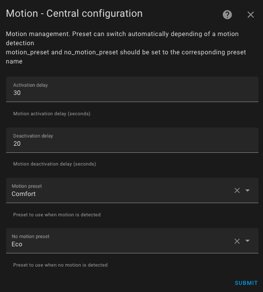

# Motion or Activity Detection

- [Motion or Activity Detection](#motion-or-activity-detection)
  - [Configure Activity Mode or Motion Detection](#configure-activity-mode-or-motion-detection)
  - [Usage](#usage)

This feature allows you to change presets when motion is detected in a room. If you don't want to heat your office when the room is occupied and only when the room is occupied, you need a motion (or presence) sensor in the room and configure this feature.

This function is often confused with the presence feature. They are complementary but not interchangeable. The 'motion' function is local to a room equipped with a motion sensor, while the 'presence' function is designed to be global to the entire home.

## Configure Activity Mode or Motion Detection

If you have chosen the `With motion detection` feature:

| Parameter | Description | Attribute Name |
| ---------- | ----------- | -------------- |
| **Motion Sensor** | Entity ID of a motion sensor. The states of the motion sensor must be "on" (motion detected) or "off" (no motion detected). | `motion_sensor_entity_id` |
| **Detection Delay** | Duration (in seconds) defining how long we wait for confirmation of the motion before considering the motion. This parameter can be **greater than your motion sensor's delay**, otherwise, the detection will happen with every motion detected by the sensor. | `motion_delay` |
| **Inactivity Delay** | Duration (in seconds) defining how long we wait for confirmation of no motion before no longer considering the motion. | `motion_off_delay` |
| **"Motion" Preset** | We will use the temperature of this preset when activity is detected. | `motion_preset` |
| **"No Motion" Preset** | We will use the temperature of this second preset when no activity is detected. | `no_motion_preset` |

## Usage

To tell a _VTherm_ that it should listen to the motion sensor, you must set it to the special 'Activity' preset. If you have installed the Versatile Thermostat UI card (see [here](additions.md#much-better-with-the-versatile-thermostat-ui-card)), this preset is displayed as follows: .

You can then, upon request, set a _VTherm_ to motion detection mode.

The behavior will be as follows:
- we have a room with a thermostat set to activity mode, the "motion" mode chosen is comfort (21.5°C), the "no motion" mode chosen is Eco (18.5°C), and the motion delay is 30 seconds on detection and 5 minutes on the end of detection.
- the room has been empty for a while (no activity detected), the setpoint temperature in this room is 18.5°.
- someone enters the room, and activity is detected if the motion is present for at least 30 seconds. The temperature then goes up to 21.5°.
- if the motion is present for less than 30 seconds (quick passage), the temperature stays at 18.5°.
- imagine the temperature has gone up to 21.5°, when the person leaves the room, after 5 minutes the temperature is returned to 18.5°.
- if the person returns before the 5 minutes, the temperature stays at 21.5°.

>  _*Notes*_
> 1. As with other presets, `Activity` will only be offered if it is correctly configured. In other words, all 4 configuration keys must be set.
> 2. If you are using the Versatile Thermostat UI card (see [here](additions.md#much-better-with-the-versatile-thermostat-ui-card)), motion detection is represented as follows: .