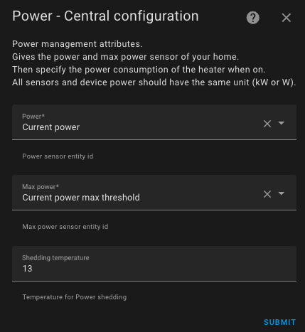

# Power Management - Load Shedding

- [Power Management - Load Shedding](#power-management---load-shedding)
    - [Example Use Case:](#example-use-case)
  - [Configuring Power Management](#configuring-power-management)

This feature allows you to regulate the electrical consumption of your heaters. Known as load shedding, it lets you limit the electrical consumption of your heating equipment if overconsumption conditions are detected.
You will need a **sensor for the total instantaneous power consumption** of your home and a **sensor for the maximum allowed power**.

The behavior of this feature is as follows:
1. When a new measurement of the home's power consumption or the maximum allowed power is received,
2. If the maximum power is exceeded, the central command will shed the load of all active devices starting with those closest to the setpoint. This continues until enough _VTherms_ are shed,
3. If there is available power reserve and some _VTherms_ are shed, the central command will re-enable as many devices as possible, starting with those furthest from the setpoint (at the time they were shed).
4. When a _VTherm_ starts, a check is performed to determine if the declared power is available. If not, the _VTherm_ is put into shed mode.

**WARNING:** This is **not a safety feature** but an optimization function to manage consumption at the expense of some heating degradation. Overconsumption is still possible depending on the frequency of your consumption sensor updates and the actual power used by your equipment. Always maintain a safety margin.

### Example Use Case:
1. You have an electric meter limited to 11 kW,
2. You occasionally charge an electric vehicle at 5 kW,
3. This leaves 6 kW for everything else, including heating,
4. You have 1 kW of other active devices,
5. You declare a sensor (`input_number`) for the maximum allowed power at 9 kW (= 11 kW - reserved power for other devices - safety margin).

If the vehicle is charging, the total consumed power is 6 kW (5 + 1), and a _VTherm_ will only turn on if its declared power is a maximum of 3 kW (9 kW - 6 kW).
If the vehicle is charging and another _VTherm_ of 2 kW is on, the total consumed power is 8 kW (5 + 1 + 2), and a _VTherm_ will only turn on if its declared power is a maximum of 1 kW (9 kW - 8 kW). Otherwise, it will skip its turn (cycle).
If the vehicle is not charging, the total consumed power is 1 kW, and a _VTherm_ will only turn on if its declared power is a maximum of 8 kW (9 kW - 1 kW).

## Configuring Power Management

In the centralized configuration, if you have selected the `With power detection` feature, configure it as follows:

1. The entity ID of the **sensor for total instantaneous power consumption** of your home,
2. The entity ID of the **sensor for maximum allowed power**,
3. The temperature to apply if load shedding is activated.

Ensure that all power values use the same units (e.g., kW or W).
Having a **sensor for maximum allowed power** allows you to modify the maximum power dynamically using a scheduler or automation.

Note that due to centralized load-shedding, it is not possible to override the consumption and maximum consumption sensors on individual _VTherms_. This configuration must be done in the centralized settings. See [Centralized Configuration](./creation.md#centralized-configuration).

>  _*Notes*_
>
> 1. During load shedding, the heater is set to the preset named `power`. This is a hidden preset that cannot be manually selected.
> 2. Always maintain a margin, as the maximum power can briefly be exceeded while waiting for the next cycle's calculation or due to uncontrolled devices.
> 3. If you do not wish to use this feature, uncheck it in the 'Features' menu.
> 4. If a single _VTherm_ controls multiple devices, the **declared heating power consumption** should correspond to the total power of all devices.
> 5. If you use the Versatile Thermostat UI card (see [here](additions.md#better-with-the-versatile-thermostat-ui-card)), load shedding is represented as follows: .
> 6. There may be a delay of up to 20 seconds between receiving a new value from the power consumption sensor and triggering load shedding for _VTherms_. This delay prevents overloading Home Assistant if your consumption updates are very frequent.